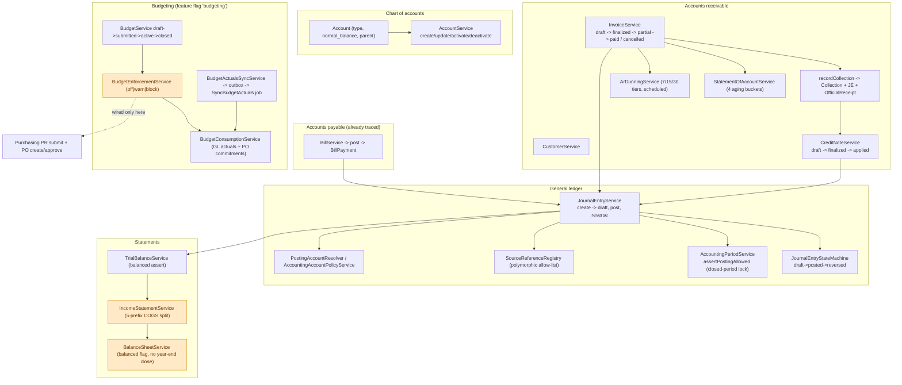

# Accounting Core + Budgeting Audit

Date: 2026-09-18
Status: PARTIAL
Scope: `api/app/Modules/Accounting/` — chart of accounts, journal entries, accounting
periods/fiscal years, posting rules, financial statements, AR (customers, invoices,
collections, official receipts, credit notes, statements, dunning), AP (bills/payments
already traced in `PURCHASE-REQUEST-CHAIN-TRACE-2026-09-18.md`), and the budgeting feature. This is the
hub all three business chains post into.
Claims are marked **[confirmed]** (file:line, or a grep/seed check) or
**[assumption/unverified]**.

---

## 1. Executive summary

The GL is a conventional double-entry ledger with strong locks, immutability triggers and
transactional posting, but it is **not self-consistent as a reporting system**: there is no
year-end close, payroll expense is misreported as COGS, the discount account aliases sales
revenue, and several automated posters bypass the account-policy layer. Budget enforcement
is genuinely wired — but only into purchasing, never payroll or other spend.

The module is `App\Modules\Accounting\*`; **budgeting has no separate module** despite its
own feature flag and `/api/v1/budgets` prefix.

---

## 2. Flow diagram (what the trace surfaced)

---

## 3. Walkthrough

### 3.1 Chart of accounts — `AccountService`, `Account`, `AccountType`

- Five account types (`asset|liability|equity|revenue|expense`) with default normal balance
  (`AccountType.php:36-42`); `NormalBalance` is debit/credit only.
- `Account` has **no soft deletes**; archiving = `is_active=false`. There is no delete
  endpoint: `DELETE /accounts/{account}` maps to `deactivate()` (`routes.php:30`).
- `create()`/`update()` validate code (`/^[0-9]{3,6}$/`), type, normal balance, parent
  (active, same type, no cycles) (`AccountService.php:266-312`). `update()` refuses direct
  `is_active` changes (use activate/deactivate) and freezes `type`/`normal_balance` once
  `hasPostedLines()` is true (`:174-181`).
- `tree()` computes balances joining `journal_entry_lines` on posted/reversed and signs by
  normal balance; it has a DFS cycle detector (`:58-77`).
- **Deactivate does not check for posted lines** — an account with historical postings can
  be deactivated; only new postings are blocked by `PostingAccountResolver::active()`.
- `hasPostedLines()` counts only `status='posted'`, not `reversed` (`Account.php:71-76`), so
  a fully reversed account's type can later be changed.

### 3.2 Journal entries — `JournalEntryService`, `JournalEntryStateMachine`

Lifecycle: `draft → posted → reversed` (no void/cancel). **[confirmed]**

- `create()`/`createManual()` (`:105`/`:166`): manual API entries cannot carry a source
  reference; balance and ≥2 lines enforced; period guard; JE number from the sequence
  `JE-YYYYMM-NNNN`. A source-linked entry gets `created_by = null` so it cannot masquerade
  as a maker/checker draft (`:139`).
- `post()` (`:309`): locks the aggregate, revalidates balance/XOR, re-checks the period,
  enforces maker-checker `assertNotSelfPosting()` (`:407`) — creator cannot post unless they
  hold `accounting.journal.self_post_override` or the total is below
  `accounting.je_self_post_limit` (default 0 = always require a checker). Refusal is
  `abort(403)`.
- `postSystem()` (`:365`): same validation/period path without maker-checker, for automated
  posters.
- `reverse()` (`:431`): mirrors the source with debit/credit swapped, posts it as
  `reference_type='journal_entry_reversal'`, transitions the source to `reversed`. It
  **bypasses `assertNotSelfPosting`** — only `accounting.journal.reverse` gates it.
- `delete()` retains the lines deliberately (`:268-282`) because `JournalEntryLine` has no
  soft deletes and `restore()` restores only the header; every aggregate joins on
  `status='posted'`, so a draft's lines count nowhere.
- Validation enforces XOR (exactly one side > 0) and debit==credit, but **no normal-balance
  check and no leaf-only rule** — any active account, including a header account, can receive
  a line.
- Immutability: DB triggers reject line/header mutation once posted/reversed, plus a
  `JournalEntryObserver` and a migration closing the "archived draft promoted to posted" hole.
- JE numbering uses `now()` for the serial month, **not the JE date** — a back-dated entry
  gets the current month's number (`DocumentSequenceService.php:64-66`).

### 3.3 Periods and fiscal years

- `AccountingPeriod` is keyed `(year, month)`, statuses `open|closed|reopened`; absence = open.
- `assertPostingAllowed()` (`AccountingPeriodService.php:189-211`) is called by every GL
  writer and throws `ClosedPeriodException` only when the row is `closed`. Close/reopen are
  permission `accounting.periods.manage`; `relockStaleReopenedPeriods` re-locks reopened
  periods after 48 h.
- `FiscalYear` is unrelated: **no create/close service or route exists** (seeded/read-only),
  and `AccountingPeriodService` never references it. `FiscalYear` is used only by budgeting.

### 3.4 Posting rules

- `PostingAccountResolver` enforces active (and type where given); `AccountingAccountPolicyService`
  asserts types for only 5 configured codes (AR, AP, VAT output/input, discount).
- **Several automated posters bypass the resolver** and query `accounts` by code directly,
  enforcing neither active nor type: `PayrollGlPostingService:185`, `GrnGlPostingService:121`,
  `MovementGlPostingService:151`, `AssetService:407-411`, `DepreciationService:359-360,541-542`,
  `FinalPayService:286-289`, `DeliveryService:1273`, `ReturnRequestService:1884-1885`. Only
  Invoice/Bill/CreditNote use the policy service.
- Full account-code setting list is in §6.

### 3.5 Financial statements

- `TrialBalanceService`: period activity, signed by normal balance, throws
  `LedgerImbalanceException` if debits ≠ credits.
- `IncomeStatementService`: revenue − expense over a range; **COGS vs OpEx split by
  code/parent prefix `5`**. No balance assertion; `net_income = operating_income` (no
  tax/other).
- `BalanceSheetService`: assets/liabilities/equity as-of, adds a synthetic current-FY net
  income line; reports a `balanced` boolean but does not throw. **No year-end closing entry
  exists anywhere**, so prior-year revenue/expense is never moved to retained earnings.
- All three cache for 60 s and filter `status IN (posted, reversed)`.

### 3.6 AR — customers, invoices, collections, receipts, credit notes, statements, dunning

- **Customer**: CRUD, encrypted TIN, credit limit, payment terms, soft delete. `credit_limit`
  is enforced **only** in CRM `SalesOrderService::checkCreditLimit()`; `InvoiceService`
  never checks it or `Customer.is_active`. `delete()` blocks if any invoice exists. Customer
  has no `created_by` (unlike Vendor) and an unguarded `restore()`.
- **Invoice**: `draft → finalized → partial → paid` or `→ cancelled`. `create()` supports a
  `standard` vs `prebill` lifecycle (prebill needs a reason plus
  `accounting.invoices.prebill_approve`). Standard finalization requires a **confirmed
  delivery** whose lines exactly match the invoice lines (qty/price to 2dp; all delivery
  lines invoiced once). Senior/PWD discount reduces the VATable base (contra-revenue debit
  on finalize). `finalize()` (already traced) posts the JE and promotes the SO to `invoiced`.
  `cancel()` reverses the JE but **does not revert the SO from `invoiced`** nor clear
  `Delivery.invoice_id`.
- **Collections**: `recordCollection()` posts `DR cash / CR AR`, issues an official receipt,
  and advances the invoice to `partial|paid`; idempotent via `idempotency_key`. No void route.
- **Official receipts**: `issueForCollection` is the live path (dedupe on `collection_id`,
  DB unique). `issueForInvoice` exists but **is dead** (only a test calls it; no
  controller/route/resource/PDF).
- **Credit notes**: `draft → finalized → applied`, posting the VAT-reversing JE; `apply()`
  offsets a specific invoice/bill with no GL. **`CreditNoteStatus::Void` is never assigned**
  and there is no void route. `is_vatable` defaults from the company VAT flag rather than the
  source invoice's classification, so a credit note can reverse VAT never booked.
- **Statement of account**: per-customer ledger + 4 aging buckets (`current`, ≤30, ≤60, 61+);
  `opening_balance` duplicates `closing_balance` for historical as-of dates.
- **Dunning**: `ar:run-dunning` daily 07:00; tiers `7,15,30`; selects finalized/partial
  overdue invoices, sends at the highest crossed-but-unsent tier, escalates at the top; a
  customer with no email yields `blocked` and the command exits non-zero.

### 3.7 Budgeting (feature flag `budgeting`, namespace `Accounting`)

- `BudgetService`: bespoke lifecycle `draft → submitted → active → closed` (legacy `approved`
  reads as live), maker-checker via `submitted_by !== approver`. Lines must be active **leaf**
  accounts; `capital` budgets use Asset accounts, everything else (including `project` and
  `department`) uses Expense. Line amounts are monthly; `annual_total` is a generated column.
- Revisions and transfers were **dropped** (migrations `0456`/`0459`), leaving stale SPA/docs
  references.
- `BudgetEnforcementService`: `off|warn|block` (`budgeting.enforcement_mode`, default `warn`).
  `assess` at PR submit / PO create+update, `assertAcknowledged` at PR/PO approve, `enforce`
  at PO approve only. Skipped when no department resolves. **Wired only into purchasing** —
  payroll, bills, GRN, inventory, sales and assets can never be budget-blocked. Company-wide
  (department-null) budgets are structurally exempt.
- `BudgetConsumptionService`: actuals from posted/reversed GL allocated to lines **in
  proportion to annual allocation** (journal lines carry no department); commitments from
  open POs less bills. Read-time derivation plus a monthly persisted refresh.
- `BudgetActualsSyncService` → outbox → `SyncBudgetActuals` job (chunked, idempotent),
  scheduled monthly on the 1st. No GL listener triggers it, so `budget_line_items.actual_total`
  (and the budget KPI) drift from the live report until the cron runs.

---

## 4. Branch points

| # | Where | Condition | Paths |
|---|---|---|---|
| B1 | `AccountService.update` | account has posted lines / children | freeze type / allow change |
| B2 | `JournalEntryService.post` | creator == poster | 403 unless override or below self-post limit |
| B3 | `JournalEntryService.create/update/post/reverse` | period closed | `ClosedPeriodException` / proceed |
| B4 | `JournalEntryService.delete` | draft vs posted/reversed | archive (lines kept) / refuse |
| B5 | Invoice `create` | `prebill` | requires reason + `prebill_approve` / standard |
| B6 | Invoice `finalize` | standard lifecycle | requires confirmed matching delivery / prebill bypass |
| B7 | Invoice `cancel` | `amount_paid` non-zero | refuse / cancel + reverse JE |
| B8 | `recordCollection` | amount == balance | invoice `paid` / `partial` |
| B9 | Credit note `apply` | target invoice has posted JE | apply / refuse |
| B10 | Statement aging | cancelled invoice after cutoff | include / exclude |
| B11 | Dunning | no customer email | `blocked` + command failure / send |
| B12 | Statement vs AR aging | legacy `amount_paid` without Collections | report reduces balance; statement does not |
| B13 | Budget `assess` | mode block and over budget | throw / warn |
| B14 | Budget `assertAcknowledged` | exhausted/overdrawn unacknowledged | block PR/PO approve / proceed |
| B15 | Budget `checkAvailability` | no active FY or no department budget | allow (`ok`) / evaluate |
| B16 | Budget `approve` | submitter == approver | refuse / activate |
| B17 | GL posting (all chains) | configured account inactive/missing | policy path throws; bypass paths do not |

---

## 5. Permission gates

| Action | Permission |
|---|---|
| COA view / manage / deactivate | `accounting.coa.view` / `.manage` / `.deactivate` |
| JE view / create / post / reverse | `accounting.journal.view` / `.create` / `.post` / `.reverse` |
| JE self-post override | `accounting.journal.self_post_override` |
| Periods view / manage (close, reopen) | `accounting.periods.view` / `.manage` |
| Statements view / export | `accounting.statements.view` / `.export` |
| Customers view / manage | `accounting.customers.view` / `.manage` |
| Invoices view/create/update/collect/finalize | `accounting.invoices.view` / `.create` / `.update` / `.collect`; finalize gated on `.create`; prebill on `.prebill_approve` |
| Credit notes view / manage | `accounting.credit_notes.view` / `.manage` |
| Bills | `accounting.bills.view/create/update/pay/payment_approve/void_payment/three_way_override/exception_approve` |
| Budgets | `budgeting.view` / `.manage` / `.approve`; acknowledge via `budgeting.approve` |
| AR dunning | scheduled command only |

---

## 6. Account-code settings (all `accounting.accounts.*`)

ar 1100 · ap 2010 · vat_output 2060 · vat_input 1310 · discount 4010 · grni 2110 ·
inventory_raw_material 1200 · inventory_finished_goods 1210 · inventory_packaging 1220 ·
inventory_spare_parts 1230 · material_consumption · inventory_adjustment · purchase_return_expense 5010 ·
final_pay_salary_expense 6010 · cash 1020 · loans_payable 2100 · accrued_expense 2070 ·
asset_cash 1010 · asset_accumulated_depreciation 1410 · asset_cost 1400 ·
asset_disposal_loss 6120 · asset_disposal_gain 4030 · depreciation_expense 6080 ·
sss_payable 2020 · philhealth_payable 2030 · pagibig_payable 2040 · withholding_tax_payable 2050 ·
thirteenth_month_payable 2080 · salary_expense 5050 · overtime_expense 5060 ·
thirteenth_month_expense 5070 · sss_employer_expense 6030 · philhealth_employer_expense 6040 ·
pagibig_employer_expense 6050 · payroll_cash 1010 · default_sales_revenue 4010 ·
statements.current_period_net_income 3099 · statements.translation_adjustment 3900.
Plus `accounting.je_self_post_limit`, `accounting.functional_currency_code`,
`fiscal.year_start_month`.

---

## 7. Glossary

- **Double-entry JE** — `draft/posted/reversed`, XOR lines, balanced, immutable when posted.
- **Source reference registry** — polymorphic allow-list tying a JE to its originating record.
- **Period guard** — monthly `assertPostingAllowed()`; absence of a row = open.
- **Maker-checker** — self-post guard on manually created JEs.
- **Contra-revenue discount** — senior/PWD discount debited on finalize.
- **Credit note** — VAT-reversing instrument, separate from the RMA negative-invoice hack.
- **Statement aging vs AR aging** — two different bucket schemes/fallbacks.
- **Budget consumption** — GL actuals + PO commitments allocated by annual share.
- **Enforcement mode** — `off|warn|block`, purchasing-only.

---

## 8. Incomplete, inconsistent, dead-ends

All **[confirmed]** unless marked.

1. **Income statement misclassifies payroll as COGS.** `5050/5060/5070` are children of
   `5000 Cost of Goods Sold` (verified in `ChartOfAccountsSeeder.php:40,83-85`), and
   `IncomeStatementService` splits on the `5` prefix (`:48-77`), so salary/overtime/13th-month
   expense is reported as COGS, not OpEx.
2. **Discount account aliases revenue.** `accounting.accounts.discount_code` and
   `accounting.default_sales_revenue_account_code` both default to `4010` (verified in
   migrations `0298:14` / `0294:14`), so a senior/PWD discount contra-debits the same account
   it credits.
3. **No year-end close / retained earnings.** No closing-entry mechanism exists anywhere, so
   the balance sheet cannot balance across fiscal years on its own (prior-year net income is
   never moved to equity).
4. **Automated posters bypass the account policy.** Payroll, GRN, stock-movement, asset,
   depreciation, final-pay, delivery and return services query `accounts` directly and enforce
   neither active nor type (list in §3.4).
5. **No normal-balance or leaf-only validation on posting** — header accounts can receive lines.
6. **`reverse()` bypasses maker-checker** (`JournalEntryService:431-533`) — only the reverse
   permission gates it.
7. **`AccountService::deactivate()` does not check posted activity**; and `hasPostedLines()`
   ignores reversed entries, so a fully-reversed account's type can be changed.
8. **JE serial month follows `now()`, not the JE date** — back-dated entries get the wrong
   month's number.
9. **Statement vs AR-aging divergence**: 4 vs 5 buckets, and the AR aging report has a legacy
   `amount_paid` fallback the statement lacks (`InvoiceService:516-524`), so they can report
   different balances for legacy invoices with no `Collection` rows.
10. **Credit-note VAT not inherited from source** — defaults from the company VAT flag, so it
    can reverse VAT on a zero-rated/exempt sale; `CreditNoteStatus::Void` is never assigned
    and there is no void route.
11. **`OfficialReceiptService::issueForInvoice()` is dead** — no route/controller/resource/PDF;
    no receipt PDF exists at all.
12. **Invoice `cancel()` leaves the SO at `invoiced`** and the delivery pointing at a
    cancelled invoice.
13. **Invoice create/finalize never check `Customer.is_active` or `credit_limit`** — direct and
    prebill invoicing bypass the credit gate.
14. **Permission inconsistencies**: invoice `finalize` is gated on `.create`; `update` needs
    both `.create` (FormRequest) and `.update` (route); prebill approval is a service-side 422,
    not a route gate.
15. **Budget enforcement is purchasing-only** and company-wide (department-null) budgets are
    exempt; budget approval is bespoke (not the workflow/approval-board engine); no
    `ApprovalTypeRegistry`/`WorkflowSeeder` entry.
16. **Budget KPI drift** — `KpiSnapshotService::computeBudgetUtilization` reads the monthly
    persisted `actual_total` while the screen recomputes live from the GL.
17. **Dropped budget revisions/transfers leave stale references** in `SettingsSeeder`,
    the SPA (`CreateTransferData`), and docs.
18. **`AccountingPeriod::forDate()`, `PostingAccountResolver::idByCode()`,
    `BudgetService::checkConsumption()`, `BudgetConsumptionService::snapshot()`,
    `BudgetActualsSyncService::runForRequest()` have no production callers.**
19. **`FiscalYear` has no create/close service or route** — its `status` lifecycle is seeded only.
20. **`accounting.statements.translation_adjustment_code` is never read** by any statement/GL
    service (multi-currency unimplemented).
21. **`Budget::$fillable` includes `status`**, contrary to the mass-assignment hardening rule
    (not HTTP-exploitable today).
22. **`SyncBudgetActuals` has `tries=1`** but is invoked synchronously from a listener with
    `tries=3`, so the job's own retry policy is bypassed.
23. **`InvoiceService::lockSourceChain()` returns `sales_order` that `finalize()` never reads**;
    `credit_note`/`CreditNoteApplication`/`CreditNoteLine` lack `HasAuditLog`; the dunning tier
    claim is written with `saveQuietly()` (no audit row).

---

## 9. Assumptions vs confirmed facts

**Confirmed from code/seed/test:** the JE state machine and posting validations; the period
guard; the AR lifecycle and collection/credit-note/statement/dunning mechanics; the AR-vs-
statement aging divergence; the statement services; the COGS misclassification and duplicate
4010 mapping; the absence of year-end close; the budget lifecycle, enforcement wiring and
consumption basis; the account-code settings inventory; and all of §8.

**Assumptions / not verified:**

- A1. No live database or full test suite was run for this audit (unlike the payroll
  `FinalPayDoublePayGuardTest` run); findings are from source and seed inspection. A full
  accounting test run could reveal red tests not named here.
- A2. The SPA rendering of statements/AR aging was not inspected; only the API shape.
- A3. Whether every listed account-code setting is actually seeded in every environment was
  not verified beyond the migrations/seeders read.
- A4. The exact set of accounts currently active/posted in production data is unknown.
- A5. `BudgetConsumptionService`'s proportional allocation has no department on journal lines;
  whether that matches business intent is a design question, not verified.
