# Sales Order → Downstream Chain Trace

Date: 2026-09-18
Scope: what an OGAMI ERP Sales Order actually sets in motion, discovered by reading
`api/`. Every claim below is marked **[confirmed]** (read in source, file:line given) or
**[assumption/unverified]** (inferred, or could not be traced to code).

The starting point is `App\Modules\CRM\Services\SalesOrderService`.

---

## 1. Executive summary

Confirming a Sales Order does **not** call purchasing or production directly. It writes a
durable outbox event (`SalesOrderConfirmed`) inside its transaction. A queued dispatcher
later publishes that event, which starts an **automatic MRP run**. That MRP run is where
the chain actually branches into every other module:

- **CRM** writes the SO.
- **MRP** plans demand and creates two kinds of child records: a **draft auto Purchase
  Request** (only if materials are short) and **draft Work Orders** (always, for every
  line with a BOM).
- **Production** confirms/starts the WOs, which **reserves then issues inventory**, and
  emits QC events.
- **Quality** creates in-process and outgoing inspections. A *passed outgoing* inspection
  auto-drafts a **Delivery**.
- **SupplyChain** runs the delivery and, on `confirm()`, auto-creates a **draft customer
  Invoice**.
- **Accounting** finalizes the invoice (posts a JE, AR) and later records collections.
- The auto-PR, if created, runs the whole **Purchasing → Inventory → Quality → Accounting
  procure-to-pay** chain: PR approval → PO → supplier → draft GRN → incoming QC →
  inventory + GL → draft supplier bill → payment.

The two auto-PR mechanisms are **different and must not be conflated** (see §5 and the
glossary): the MRP one is scoped to a specific Sales Order via `mrp_plan_id`; the
reorder-point one (`AutoReplenishmentService`) is a general, order-agnostic check.

---

## 2. Flow diagram (what the trace actually surfaced)

```mermaid
flowchart TD
    A["SalesOrder::create()<br/>draft<br/>CRM/Services/SalesOrderService.php:361"] --> B["SalesOrder::confirm()<br/>credit gate<br/>:518"]
    B -->|"OutboxService::recordForChain<br/>SalesOrderConfirmed<br/>:561"| C{{"event_outbox + chain_step_runs<br/>Common/Services/OutboxService.php"}}
    C --> D["DispatchOutboxMessage job<br/>Common/Jobs/DispatchOutboxMessage.php"]
    D --> E["OutboxDispatcher::dispatch<br/>-> event($event)"]
    E --> F1["QueueMrpOnSalesOrderConfirmed<br/>MRP/Listeners/:11 -> RunAutomaticMrpJob"]
    E --> F2["NotifyOnSalesOrderConfirmed"]
    E --> F3["EmailCustomerOnSalesOrderConfirmed"]
    F1 --> G["MrpAutomationService::run<br/>MRP/Services/MrpAutomationService.php:28"]
    G --> H["MrpEngineService::runForActiveSalesOrders<br/>:655"]
    H --> I["runForSalesOrder per SO<br/>:111"]

    I --> J{"Active BOM for line?"}
    J -- no --> J1["diagnostic missing_bom,<br/>skip explosion + WO<br/>:187-201"]
    J -- yes --> K["BOM explode -> gross per material<br/>BomService::productionPlan"]
    K --> L{"net = gross - open_pr - available > 0 ?<br/>:299-301"}
    L -- yes --> M["SHORTAGE<br/>one consolidated draft auto-PR<br/>is_auto_generated=true, mrp_plan_id=plan<br/>:399-435"]
    L -- no --> N["retire leftover draft auto-PRs<br/>:436-449"]
    K --> O["draft WorkOrder status=planned<br/>one root/line + child subassemblies<br/>:459-569"]
    O --> O2["CapacityPlanningService::run<br/>pending schedule rows"]
    I --> P["SO.mrp_plan_id = plan<br/>MrpPlanGenerated event<br/>:581-590"]
    M --> Q["PurchaseRequest approval chain<br/>purchasing.pr.approve<br/>finance_officer -> vice_president >=50000"]
    Q --> R["PurchaseRequestApproved event"]
    R --> S["ConsolidatePurchaseOrders listener<br/>one PO per vendor / manual_required"]
    S --> T["PurchaseOrder submit + approval<br/>finance_officer -> vice_president >=50000<br/>Budget ack + vendor SoD + PPAP gate"]
    T --> U["PurchaseOrderApproved -> PrepareSupplierDispatch"]
    U --> V["PO sent"]
    V --> W["CreateDraftGrnOnPoSent<br/>draft GRN"]
    W --> X["GRN finalize -> pending_qc"]
    X --> Y["TriggerIncomingQC -> incoming Inspection"]
    Y --> Z1{"QC pass?"}
    Z1 -- yes --> Z2["AcceptGrnOnIncomingQcPass -> GrnService::accept<br/>stock movement + Dr Inventory/Cr GRNI"]
    Z1 -- no --> Z3["RejectGRNOnQcFail -> GRN reject + supplier RMA"]
    Z2 --> Z4["GoodsReceiptNoteAccepted<br/>AutoCreateBillOnGrnAccepted -> draft Bill"]
    Z4 --> Z5["Bill post (3-way match) -> BillPayment approval<br/>finance_officer -> vice_president -> GL"]

    O --> OO["CapacityPlanningService::confirm<br/>-> WorkOrderService::confirm()<br/>requires machine+mold, reserves materials"]
    OO --> OO1{"all BOM stock reservable?"}
    OO1 -- no --> OO2["throws BusinessRuleException<br/>transaction rolls back, WO stays planned"]
    OO1 -- yes --> OO3["MaterialReservation + stock_levels.reserved_quantity"]
    OO3 --> OO4["WorkOrderService::start()<br/>machine running, mold in_use,<br/>MaterialIssue movements, marks SO in_production"]
    OO4 --> OO5["TriggerInProcessQC listener"]
    OO4 --> OO6["WorkOrderOutputService::record()<br/>FG ProductionReceipt stock movement<br/>mold shots, WorkOrderOutputRecorded"]
    OO6 --> OO7["WorkOrderService::complete()<br/>WorkOrderCompleted event"]
    OO7 --> OO8["TriggerOutgoingQC -> outgoing Inspection (AQL)"]
    OO8 --> OO9{"outgoing QC pass?"}
    OO9 -- no --> OO10["NcrService::openFromInspectionFailure<br/>+ NCR/8D path"]
    OO9 -- yes --> PP["InspectionPassed -> CreateDeliveryDraftOnQcPass<br/>draft Delivery (scheduled) + DeliveryItem"]
    PP --> QQ["Delivery updateStatus scheduled->loading->in_transit->delivered"]
    QQ --> RR["DeliveryService::confirm()<br/>requires DeliveryProof; syncs SO qty_delivered;<br/>SO -> partially_delivered/delivered;<br/>auto-creates draft Invoice; attaches CoC"]
    RR --> SS["InvoiceService::finalize()<br/>JE Dr AR / Cr Revenue / Cr VAT; SO -> invoiced"]
    SS --> TT["InvoiceService::recordCollection()<br/>JE Dr Cash / Cr AR; OfficialReceipt"]
    TT --> UU["SO stays 'invoiced' (no paid/closed transition exists)"]

    classDef dead fill:#fdd,stroke:#c33,color:#600
    class UU,OO2,J1 dead
```

---

## 3. Step-by-step walkthrough

### Step 0 — Sales Order creation (CRM)

`App\Modules\CRM\Services\SalesOrderService::create()` (`SalesOrderService.php:361`), inside
a `DB::transaction`:

- Locks customer + product rows (`lockOrderReferences`, `:211`), re-validates that they are
  active (`assertActiveOrderReferences`, `:196`) — FormRequest validation is not trusted
  across the transaction boundary.
- Resolves unit price per line through `PriceAgreementService::resolve()` and
  `resolveUnitPrice()` (volume tiers), keeps all money in decimal strings via
  `App\Common\Support\Money` — **never floats**.
- VAT via `TaxPolicyService::isVatRegistered()` / `requiredVatRate()`.
- Writes `sales_orders` (`so_number` from `DocumentSequenceService`) and `sales_order_items`.
- Status `draft`. **No downstream effect at all at creation.** **[confirmed]**

Branch points: no active price agreement → `NoPriceAgreementException` (422); delivery date
before order date → 422; inactive customer/product → 422.

### Step 1 — Confirmation (CRM) and the outbox

`SalesOrderService::confirm()` (`:518`):

- Re-reads the SO under `lockForUpdate`, requires `draft`, requires ≥1 line.
- `checkCreditLimit()` (`:111`): exposure = AR balance on invoices with status
  `finalized|partial` + `total_amount` of this customer's SOs in
  `confirmed|in_production` + this SO total, compared with `customers.credit_limit`
  (`bccomp`, decimal-safe). Limit `null`/`0` = no limit. Over limit → 422.
- Sets `status=confirmed`, stamps `confirmed_at`.
- `OutboxService::recordForChain(new SalesOrderConfirmed(...))` (`:561`) — this writes
  `event_outbox` + `chain_step_runs` **in the same transaction**, and only schedules the
  queue job via `DB::afterCommit`.
- `ChainBroadcaster::broadcastFor(...)` also writes a chain-step outbox row.
- `confirmWithChainResult()` (`:630`) is the controller-facing wrapper that also reports
  what MRP produced (work orders, shortages, PR count, scheduling conflicts).

Branch: `markInProduction` / `markPartiallyDelivered` / `markDelivered` / `markInvoiced`
are driven by sibling services via `ALLOWED_TRANSITIONS` (`:79`). Forward-only, **not**
strictly linear; illegal transitions throw and roll back the calling operation.

### Step 2 — Durable outbox → MRP

`OutboxService::recordForChain` (`Common/Services/OutboxService.php:79`) writes the event
row and (after commit) dispatches `DispatchOutboxMessage`
(`Common/Jobs/DispatchOutboxMessage.php`). `OutboxDispatcher::dispatch`
(`Common/Services/OutboxDispatcher.php:20`) claims the row with a lease, decodes it, and
calls `event($event)`.

Registered listeners for `SalesOrderConfirmed` (`AppServiceProvider.php:301,331,332`):

| Listener | File | Effect |
|---|---|---|
| `QueueMrpOnSalesOrderConfirmed` | `MRP/Listeners/QueueMrpOnSalesOrderConfirmed.php:13` | `RunAutomaticMrpJob::dispatch([soId], 'sales_order_confirmed')` |
| `NotifyOnSalesOrderConfirmed` | `CRM/Listeners/…` | notification |
| `EmailCustomerOnSalesOrderConfirmed` | `CRM/Listeners/…` | customer email |

`RunAutomaticMrpJob` (`MRP/Jobs/RunAutomaticMrpJob.php`) is `ShouldBeUnique` per SO set
and has a plant-wide `WithoutOverlapping('mrp-automatic-plant')` fence. **If Redis is down,
the confirmation still commits; the scheduler recovers the outbox row later** — planning is
asynchronous and eventual. **[confirmed]**

### Step 3 — MRP planning, auto-PR, and work-order creation

`MrpEngineService::runForSalesOrder()` (`MRP/Services/MrpEngineService.php:111`), one
`DB::transaction` per SO:

1. Supersedes the prior `Active` `MrpPlan` for the SO and bumps `version` (`:138-145`).
2. Per SO line with remaining qty: load the active BOM via `BomService::activeForProduct`,
   `ensureFreshForPlanning`, `assertComponentIntegrity`, then
   `BomService::productionPlan(...)` explodes gross requirements recursively
   (`:187-256`).
3. Creates the `MrpPlan` row, then computes net requirement per material (`:281-346`):
   - `supplyForItem()` (`:929`): `on_hand − reserved + in_transit − safety_stock`, floored
     at 0; quarantine/scrap zones excluded; per-run shared cache prevents one SO stealing
     another SO's stock in a multi-SO run.
   - `openPurchaseRequestQuantity()` (`:1006`): pending/approved PR quantity already linked
     to **this SO's mrp_plan**. Draft PRs are deliberately excluded (MRP owns them).
   - `net = max(0, gross − open_pr − available)`.
   - `order_by = earliest line delivery_date − max(supplier lead_time, item lead_time) −
     safety_buffer_days`; `priority = urgent` if `order_by <= today` else `normal`.
4. **Auto-PR**: if any `$shortages`, creates exactly **one consolidated draft
   `PurchaseRequest`** for the SO, `is_auto_generated=true`, `mrp_plan_id=$plan->id`,
   `department_id` resolved from the SO creator → run triggerer → PPC department
   (`resolveAutoPurchaseRequestDepartment`, `:80`). One `purchase_request_items` row per
   short item, quantity ceiled then rounded up to the item's MOQ multiple
   (`purchaseQuantity`, `:984`). Re-runs reuse and refresh the prior draft instead of
   duplicating, and cancel stale older drafts (`:367-449`). **[confirmed]**
5. **Work Orders**: for every line, regardless of shortage, creates/updates a root
   `WorkOrder` with `status=planned` via `WorkOrderService::createDraft()`
   (`:459-569`). Manufactured subassemblies become child WOs
   (`createSubassemblyWorkOrders`, `:824`). **A shortage does not block WO creation.**
6. Links `sales_orders.mrp_plan_id` and emits `MrpPlanGenerated`.

Then `MrpAutomationService::run` (`:28`) runs `CapacityPlanningService::run()` over the
planned WOs and raises alerts: `MrpShortage`, `MrpDataError`, `MrpScheduleConflict`,
`MrpRunFailed`.

**Error containment (branch):** `runForActiveSalesOrders` (`:655`) wraps each SO in a
try/catch; one bad SO becomes a `Partial`/`Failed` MRP run with a per-SO error row rather
than failing the whole run. Because this is asynchronous, **the SO confirmation itself can
succeed while its planning failed** (`mrp_plan_id` stays null). **[confirmed]**

### Step 4 — Procurement of the shortfall (Purchasing)

Triggered only if Step 3 created a PR.

- **Submit** `PurchaseRequestService::submit()` (`Purchasing/Services/PurchaseRequestService.php:331`)
  requires `sourcing_method` to be set; **auto-PRs from MRP are created with
  `sourcing_method = null`** (`MrpEngineService.php:400`), so a buyer must set it first or
  submit throws (`:344`). **[confirmed]**
- **Approval chain** `purchase_request`: `finance_officer → vice_president`, VP step
  threshold `50000.00` (`WorkflowSeeder.php:64-71`, `is_active` via `$wiredTypes` `:190`).
  `ApprovalService` enforces no self-approval and exact role match per step.
- On full approval emits `PurchaseRequestApproved` → `ConsolidatePurchaseOrders`
  (`Purchasing/Listeners/ConsolidatePurchaseOrders.php`): only `DirectPo` sourcing converts;
  one PO per vendor via `PurchaseOrderService::convertFromPr()`; unresolvable lines →
  `manual_required` and a purchasing notification.
- **PO approval chain** `purchase_order`: `finance_officer → vice_president`, same ₱50k
  threshold (`WorkflowSeeder.php:80-87`). Also gated by budget acknowledgement, vendor
  segregation-of-duties (unless `purchasing.po.sod_override`), and an optional PPAP gate.
- `PurchaseOrderApproved` → `PrepareSupplierDispatch` → `SupplierDispatchService` (portal
  or manual) → `markAsSent()` → `PurchaseOrderSent` → `CreateDraftGrnOnPoSent` creates a
  draft GRN.
- **GRN**: `GrnService` `pending_qc → accepted|partial_accepted|rejected`; incoming
  inspections are mandatory for QC-eligible lines (fail-closed). Accept writes stock
  movements + GL (`Dr Inventory / Cr GRNI`). `GoodsReceiptNoteAccepted` →
  `AutoCreateBillOnGrnAccepted` → draft supplier `Bill` (needs PO + accepted GRN; a PO
  alone can never become a bill). Bill posting requires a passing 3-way match, then
  `BillPayment` goes through the `bill_payment` approval chain (`finance_officer → vice_president`).
  **[confirmed]**

### Step 5 — Production (Production + Inventory)

- **Scheduling/data** `CapacityPlanningService::run` creates `production_schedules`.
  `CapacityPlanningService::confirm()` (`MRP/Services/CapacityPlanningService.php:188`)
  writes machine/mold back to the WO and calls `WorkOrderService::confirm()`
  (`:250`). Route `POST /api/v1/mrp/scheduler/confirm`, permission
  `production.schedule.confirm` (`MRP/routes.php:78`).
- **WO confirm** `WorkOrderService::confirm()` (`Production/Services/WorkOrderService.php:226`):
  requires machine + mold, validates assignment (`assertAssignmentValid`), subassembly
  readiness (`assertProductionDependenciesReady`), machine availability, then
  `reserveMaterialsFor()` (`:959`). Reservation picks the best location or splits across
  locations (`reserveMaterialsSplit`), writing `MaterialReservation` rows and incrementing
  `stock_levels.reserved_quantity` via `StockMovementService::reserve()`. **If pooled stock
  cannot cover the full BOM, it throws and the whole confirm rolls back — the WO stays
  `planned`.** Permission `production.wo.confirm` (`Production/routes.php:54`).
- **WO start** `start()` (`:324`): machine → running, mold → in_use, generates
  `batch_number`, converts reservations to `MaterialIssue` stock movements, captures GRN
  material-lot traceability, and calls `SalesOrderService::markInProduction()` (`:381`).
  Emits `WorkOrderStatusChanged` → `TriggerInProcessQC` creates in-process inspections.
- **Body production**: `WorkOrderOutputService::record()`
  (`Production/Services/WorkOrderOutputService.php:67`) writes `work_order_outputs`,
  updates WO totals/scrap, increments mold shots (may auto-flip mold to maintenance), and
  creates a `ProductionReceipt` stock movement into a Finished-Goods zone location
  (`:399-507`). If the FG item/location is missing, the handoff is marked
  `manual_required` and a `ProductionReceiptRequested` recovery event is emitted — the
  output still commits. **[confirmed]**
- **Complete**: `complete()` (`:506`) emits `WorkOrderCompleted` → `TriggerOutgoingQC`.

### Step 6 — Quality → Delivery → Invoice → Collection

- `TriggerOutgoingQC` (`Quality/Listeners/TriggerOutgoingQC.php:50`) opens an outgoing
  `Inspection` per output batch using the AQL plan (`AqlSampleSizeService::forBatch`).
- `InspectionService::complete()` (`Quality/Services/InspectionService.php:548`) computes
  pass/fail from critical failures + defect count vs accept number, sets
  `accepted_quantity = batch_quantity` for outgoing passes, and emits
  `InspectionPassed` / `InspectionFailed`. On fail it opens an NCR in-transaction.
- `InspectionPassed` → `CreateDeliveryDraftOnQcPass`
  (`Quality/Listeners/CreateDeliveryDraftOnQcPass.php:47`) drafts a `Delivery`
  (`scheduled`) with a `DeliveryItem` linked to the passed inspection, inheriting
  `unit_price` from the SO line.
- Delivery lifecycle: `DeliveryService::updateStatus()` (`SupplyChain/Services/DeliveryService.php:535`)
  moves `scheduled → loading → in_transit → delivered`. `confirm()` (`:899`) requires at
  least one `DeliveryProof`, locks the SO, re-syncs `sales_order_items.quantity_delivered`,
  promotes the SO to `partially_delivered`/`delivered`, and best-effort auto-creates a
  **draft Invoice** via `InvoiceService::create` (failure is recorded as
  `invoice_handoff_status = manual_required` with a replay path).
- `InvoiceService::finalize()` (`Accounting/Services/InvoiceService.php:208`) requires a
  confirmed delivery, posts a JE (`Dr AR / Cr Revenue / Cr VAT Output`), and calls
  `SalesOrderService::markInvoiced()`.
- `InvoiceService::recordCollection()` (`:360`) posts `Dr Cash / Cr AR`, updates invoice
  `amount_paid/balance/status`, and issues an `OfficialReceipt`.

---

## 4. Branch points / conditionals found

| # | Where | Condition | Paths |
|---|---|---|---|
| B1 | `SalesOrderService::confirm` | credit limit `> 0` and exposure over | reject 422 / proceed |
| B2 | `MrpEngineService:187` | active BOM present? | explode + create WO / `missing_bom` diagnostic, **no WO and no PR** |
| B3 | `MrpEngineService:299` | `net > 0` | create/reuse draft auto-PR / cancel stale auto-PRs |
| B4 | `MrpEngineService:465` | per line BOM available | create WO / cancel stale planned WOs |
| B5 | `MrpEngineService:516` | open progressed production ≥ remaining | cancel surplus planned WOs / create/reuse WO |
| B6 | `runForActiveSalesOrders:721` | any SO planning throws | run `partial`/`failed`, other SOs continue |
| B7 | `WorkOrderService::confirm:959` | pooled stock covers full BOM | reserve / throw, WO stays planned |
| B8 | `WorkOrderService::confirm` | machine already committed | block unless schedule windows don't overlap (`assertMachineAvailable`) |
| B9 | `WorkOrderService::start` | machine/mold available, subassemblies ready | start / throw |
| B10 | `WorkOrderOutputService::createProductionReceipt` | FG item + location found | stock receipt / `manual_required` + recovery event |
| B11 | `InspectionService::complete` | critical fail or defects > accept | passed → delivery draft / failed → NCR |
| B12 | `DeliveryService::confirm` | `DeliveryProof` count | confirm + invoice / throw |
| B13 | `DeliveryService::createDraftInvoice` | customer + revenue account configured | invoice draft / `manual_required` + notify |
| B14 | `GrnService` accept | all incoming inspections passed | accepted + stock + GL / block |
| B15 | `BuyerSourcingService`/`ConsolidatePurchaseOrders` | all PR lines have vendor + price | auto PO / `manual_required` |
| B16 | `AutoReplenishmentService:51` | item `is_critical` + exactly one preferred supplier | bypass PR → auto-PO / normal PR |
| B17 | `PurchaseOrderService::approve` | total ≥ step threshold | step pending / step skipped |
| B18 | `PurchaseRequestService::submit:344` | `sourcing_method !== null` | submit / throw |

---

## 5. Answers to the specifically-flagged questions

### 5.1 Is there an "auto-PR on raw material shortage"? What triggers it? Is it SO-scoped or a general reorder check?

**Both mechanisms exist, and they are separate.**

1. **MRP auto-PR — SO-scoped. [confirmed]**
   `MrpEngineService::runForSalesOrder()` (`:357-449`) creates one consolidated draft
   `PurchaseRequest` per Sales Order, with `is_auto_generated=true` and
   `mrp_plan_id=$plan->id`. It is therefore scoped to that specific plan/SO, and re-runs
   reconcile against the prior draft rather than duplicating. Trigger condition: at least
   one material where `net = max(0, gross − open_pr − available) > 0`, with
   `available = max(0, on_hand − reserved + in_transit − safety_stock)`.
   It is triggered by `SalesOrderConfirmed` (and by `StockMovementCompleted` /
   `MrpReplanRequested` re-planning, which also routes through the same job).

2. **Reorder-point PR — NOT SO-scoped. [confirmed]**
   `AutoReplenishmentService::checkAndReplenish()` (`Inventory/Services/AutoReplenishmentService.php:34`)
   runs on every `StockMovementCompleted` (listener `CheckReorderPoint`,
   `AppServiceProvider.php:293`). It checks `available <= reorder_point` for the moved item
   and creates a draft auto-PR with **no `mrp_plan_id`** and `department_id=null`. This is a
   general inventory reorder check, independent of any Sales Order.

3. **Critical-item bypass. [confirmed]** For items with `is_critical` and exactly one
   preferred qualified supplier, `AutoPurchaseOrderService::createForCriticalShortage()`
   skips the PR workflow entirely and creates a PO at `PendingApproval`.

### 5.2 Does a Production Order on a short-stock item proceed, or block until the PR/receipt lands?

**It proceeds to `planned`, and has no link to the PR at all. The block is at Work Order
`confirm()`, not creation. [confirmed]**

- MRP always creates the draft WO (`status=planned`) if a BOM exists, whether or not a
  shortage was found (`MrpEngineService.php:459-569`). The auto-PR and the WO are siblings
  under the same `MrpPlan`; nothing connects the WO's executability to the PR.
- `WorkOrderService::confirm()` reserves the **full** BOM quantity from pooled on-hand
  (`reserveMaterialsFor` → `reserveMaterialsSplit`, `:959`/`:1017`). If pooled stock cannot
  cover it, it throws `BusinessRuleException` and the WO stays `planned`. So it can consume
  *other* stock/locations (partial split), but it cannot "partially reserve" — the confirm
  is all-or-nothing.
- There is **no automatic hold/release driven by GRN receipt**. When the PO is received and
  the GRN accepted, stock levels rise; a human (or `CapacityPlanningService::confirm`) must
  retry the WO confirm. `QueueMrpOnStockMovementCompleted` re-runs MRP for affected SOs, but
  that does not confirm or start work orders.

### 5.3 Automatic reservation of raw materials — is it gated behind approval? Which stage?

**Reservation happens at Work Order `confirm()`, not at MRP, and not at SO confirmation.
[confirmed]**

- The reservation writes are in `WorkOrderService::confirm()` → `reserveMaterialsFor()`
  (`:272`, `:959`), creating `MaterialReservation` rows and incrementing
  `stock_levels.reserved_quantity`.
- The gate is **not an approval workflow**: it is the operational confirm action
  (permission `production.wo.confirm`, or `production.schedule.confirm` when driven from the
  capacity scheduler). There is **no active Work Order approval chain** — the
  `work_order` workflow is seeded (`WorkflowSeeder.php:121-126`, single
  `production_manager` step) but is **not** in `$wiredTypes` (`:190-200`), so
  `WorkOrderService` never calls `ApprovalService::submit()`. **[confirmed]**
- Approval does gate the *procurement* path, not reservation: PR chain and PO chain are
  `finance_officer → vice_president` (VP step ≥ ₱50,000). So if you are asking "what
  approval blocks the raw materials getting reserved?", the answer is: none directly; the
  actual blockers are stock availability and machine/mold assignment. Procurement approval
  only delays the replenishment that eventually makes stock available.

### 5.4 Approval gates encountered anywhere in the chain

| Gate | Where | Roles / permission | If missing/denied/bypassed |
|---|---|---|---|
| Customer credit limit | `SalesOrderService::confirm` | none (data on `customers.credit_limit`) | 422, SO stays draft |
| PR approval | `WorkflowSeeder.php:64-71`, `ApprovalService` | step 1 `finance_officer`; step 2 `vice_president` (≥ ₱50k); route `purchasing.pr.approve`; budget acknowledged | PR stays `pending`; no PO |
| PO approval | `WorkflowSeeder.php:80-87` | step 1 `finance_officer`; step 2 `vice_president` (≥ ₱50k); route `purchasing.po.approve`; vendor SoD; PPAP gate; budget | PO stays `pending_approval`; not sent |
| Bill payment approval | `WorkflowSeeder.php:97-103` | `finance_officer → vice_president` | payment stays `PendingApproval`; no JE |
| 3-way match override | `Accounting/Services/BillService::postDraft` | permission `accounting.bills.three_way_override`, different checker + reason | bill cannot post |
| Incoming QC gate | `GrnService::assertQcGate` | `quality.inspections.manage` for terminal QC | GRN cannot be accepted; no stock/GL |
| Outgoing QC gate | `DeliveryService::resolveAndValidateInspection` | `quality.inspections.manage` | no delivery can be created |
| Proof of delivery | `DeliveryService::confirm` | any officer with delivery confirm permission | delivery cannot be confirmed; no invoice |
| Work Order approval | **seeded but inactive** | would be `production_manager` | does not run — no effect |
| PPAP gate | `PurchaseOrderService::approve` | setting `quality.ppap_gate_enabled` | if enabled, approve blocked |

---

## 6. Glossary of discovered mechanisms / features

- **Durable outbox (`event_outbox` + `chain_step_runs`)** — domain events are written to a
  table inside the business transaction; a queued and scheduled dispatcher publishes them.
  Queue publication is an optimization; the DB row is the recovery path. See
  `App\Common\Services\OutboxService`, `OutboxDispatcher`, `Common/Jobs/DispatchOutboxMessage`.
- **Chain steps (`ChainDefinitions`)** — per-entity ordered step lists mapping status → active
  step, used by `ChainBroadcaster`/`ChainStepAdvanced` to stage chain progress. Mirrored on
  the SPA.
- **`MrpPlan` / `MrpRun` / `MrpRunTrigger`** — versioned material plan per SO; runs are
  `Automatic`, `Manual`, etc. Reruns supersede the prior active plan.
- **Auto-PR (`is_auto_generated`)** — draft Purchase Request created by MRP (SO-scoped) or by
  reorder-point check (not SO-scoped).
- **Capacity planning / finite scheduling** — `CapacityPlanningService` creates
  `production_schedules` and, on `confirm()`, drives `WorkOrderService::confirm()`.
- **`MaterialReservation`** — per `(item, location, work_order)` reservation with statuses
  `reserved → issued` (on start) or `released` (on cancel).
- **`ProductionReceipt`** — stock movement from production into a Finished-Goods zone; links
  the WO product `part_number` to an Inventory `Item` of type `FinishedGood`.
- **In/Out/Incoming QC + AQL** — `AqlSampleSizeService::forBatch`; outgoing samples carry
  actual measurements against inspection specs.
- **NCR / 8D** — failed inspections open an NCR (`NcrService::openFromInspectionFailure`);
  recurrence can auto-spawn an 8D report.
- **CoC (Certificate of Conformance)** — auto-generated on delivery confirm from passed
  outgoing inspections (`CoCService`), attached as a `DeliveryProof`.
- **Delivery proof / handoff states** — `DeliveryProof` (photo/signed DR/CoC);
  `invoice_handoff_status` = `generated | manual_required` for recoverable invoice creation.
- **`AutoPurchaseOrderService`** — critical-item shortcut that bypasses the PR workflow.
- **MRP error policy / partial runs** — per-SO failures recorded, run marked `partial`.

---

## 7. Incomplete, inconsistent, or dead-end areas

All **[confirmed]** from source.

1. **SO chain has unreachable `paid` and `closed` steps.** `ChainDefinitions` lists SO
   steps `paid` and `closed` (`Common/Support/ChainDefinitions.php:33,34`) but
   `SalesOrderStatus` has no such cases and no code promotes an SO on collection or
   payment; after `markInvoiced` the SO stays `invoiced` permanently
   (`InvoiceService::recordCollection` updates only the invoice). The SO chain visual can
   never advance past `invoiced`.
2. **No active Work Order approval chain.** `work_order` is defined (`WorkflowSeeder.php:121`)
   but excluded from `$wiredTypes` (`:190`), and `WorkOrderService` never calls
   `ApprovalService::submit()`. It is acceptable design-wise, but it means "approval blocks
   reservation" is false.
3. **MRP auto-PRs are unsubmittable as created.** They have `sourcing_method = null`, and
   `PurchaseRequestService::submit()` throws if it is null (`:344`). A human must pick
   sourcing first. `AutoReplenishmentService` PRs share this.
4. **`PurchaseRequestService::create()` ignores `mrp_plan_id`.** The model supports the
   relation but the service does not persist it; only `MrpEngineService` writes the link
   directly.
5. **Stale `PurchaseRequestAccessPolicy` contract.** Its docblock describes a
   `department_head → production_manager → purchasing_officer → system_admin` chain; the
   seeded chain is Finance → VP. The `department_head` branch and `respectsDepartmentScope`
   logic are effectively dead against the current chain.
6. **`PurchaseRequest::markPoConversionConverted()` is never called.**
7. **`coa_verified` on GRN items is never set true** anywhere (only defaulted/prohibited).
8. **`requires_vp_approval` on PO is display-only**; the real gate is the workflow step
   threshold.
9. **Single-screen receiving refuses concession/partial acceptance and fractional QC
   quantities** (`GrnService::receiveWithQc`), so some QC paths must use the multi-step
   GRN flow.
10. **PO lines have no purchase-UOM column** — ordered-UOM validation is a documented
    follow-up.
11. **Outgoing inspection chain derivation is join-based.** `SalesOrderService::deriveOutgoingQcStage`
    joins `inspections` to `work_orders` on `entity_type='work_order'`; any inspection whose
    entity type differs is invisible to the SO chain panel.
12. **Async planning can leave a confirmed SO unplanned.** Because MRP runs after commit,
    a `SalesOrderConfirmed` with a failed/partial MRP run leaves `mrp_plan_id` null with no
    automatic retry tied to the SO beyond the outbox recovery path.
13. **`CreateDeliveryDraftOnQcPass` throws if the WO has no `sales_order_item_id`**
    (`:119-123`); an SO-linked WO without a line reference produces a business-rule error
    rather than a skip.

---

## 8. Assumptions vs confirmed facts

**Confirmed from code (file:line cited inline above):** the outbox mechanism; the MRP
auto-PR being SO-scoped via `mrp_plan_id`; the reorder-point PR being order-agnostic; WO
creation proceeding regardless of shortage; reservations occurring only at WO `confirm()`;
the PR/PO/bill-payment approval chains and roles; the routing through Quality → Delivery →
Invoice → Collection; and every item in §7.

**Assumptions / not fully verified — treat as hypotheses, not facts:**

- A1. The production SPA / floor workflow that actually calls scheduler `confirm` and WO
  `start` was not traced end-to-end (UI layer). The backend gates are confirmed; who
  triggers them in practice is not.
- A2. Whether `Account` codes referenced by Delivery auto-invoicing
  (`accounting.default_sales_revenue_account_code`, AR/VAT output accounts) are seeded in
  every environment was not checked; if unset, delivery confirm falls to
  `manual_required`.
- A3. The exact `RoleSeeder` permission grants behind each chain role were not enumerated
  here; only the role slugs in the workflows and the route permission names were read.
- A4. Automatic MRP is reported as running after commit; in the test/`sync` queue driver it
  completes inline. Real production timing depends on the worker and is not verified here.
- A5. No live database was queried; all conclusions are from source. Actual seeded data
  (e.g., whether any item has `is_critical`, whether PPC department exists) could change
  which branches fire.
