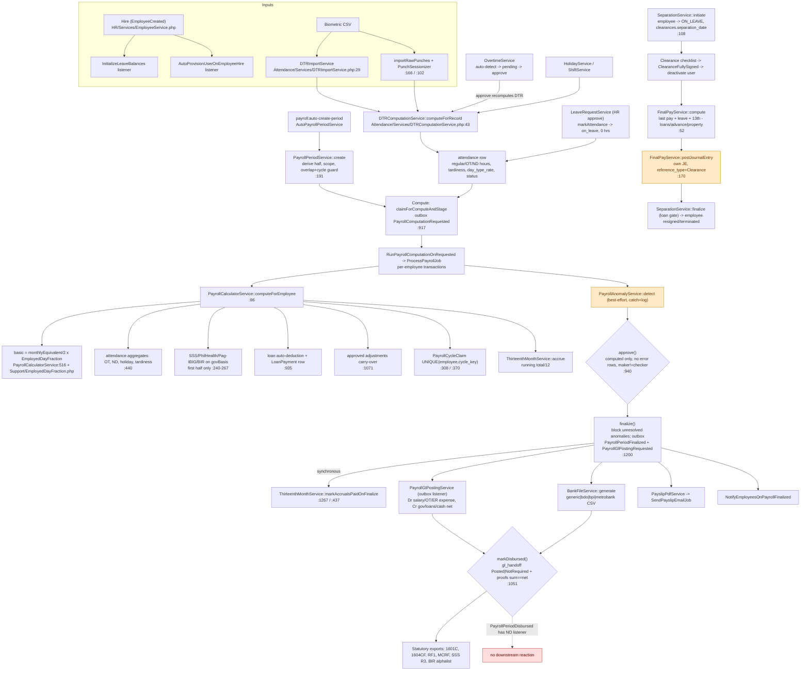

# Hire-to-Retire (Payroll) Chain Trace

Date: 2026-09-18
 
## Current re-audit 2026-09-23

Current verdict: **remediated for current engineering scope**.

- SSS R-3 now throws a business-rule error for draft/processing/approved periods instead of
  producing an empty workbook; `StatutoryExportsTest::test_sss_r3_export_refuses_non_filed_periods`
  covers the contract.
- Payroll input freezing, eligibility completeness, anomaly failure persistence, effective
  government-table lookup, 13th-month date bounds, negative tax correction posting, and statutory
  export behavior are current-tested.
- Attendance, Leave, and Loans fixes are recorded in the shared domain audit; remaining boundaries
  are manual-OT duplicate prevention, break/rest policy, maternity policy, and live
  provider/runtime proof. Loan write-off/disbursement accounting policy is now
  implemented with Finance-controlled mappings and maker-checker approval.

## Re-audit 2026-09-19

Current verdict: **historical FINISHED label is not release closure**.

- Historical fixes for final pay, 13th-month GL, leaver eligibility, reservation flags, anomaly failure markers, and permission separation are present.
- Current Payroll gaps: mutable inputs after compute/approval, incomplete eligible employee reconciliation, anomaly detection/recompute race, inactive statutory-table selection, malformed ordinary 13th periods, negative tax correction handling, SSS-R3 completeness, reporting-month policy, and BIR taxable-basis certification.
- Full current classification: `RE-AUDIT-REGISTER-2026-09-19.md`.
Scope: the third business chain — employee setup → attendance/DTR → payroll period →
compute → approve → finalize → bank file / GL → disbursement → statutory exports, plus
the separation → final-pay path. Discovered by reading `api/`.
Claims are marked **[confirmed]** (file:line given, or a test run) or
**[assumption/unverified]**.

Entry points that start the chain: `EmployeeCreated` (HR hire), `DTRImportService`
(biometric CSV), `POST /api/v1/payroll-periods` (manual or `payroll:auto-create-period`),
`POST /payroll-periods/thirteenth-month`, and `SeparationService::initiate()`.

---

## 1. Flow diagram (what the trace actually surfaced)



---

## 2. Step-by-step walkthrough

### Step 1 — Employee setup (HR)

`EmployeeService` creates the employee; `EmployeeCreated` fires and starts two listeners
(`AppServiceProvider.php:362-363`): `InitializeLeaveBalances` seeds balances
(`LeaveBalanceService::seedFor` / `seedProratedFor`), and `AutoProvisionUserOnEmployeeHire`
creates the login. Employee pay basis is `pay_type` + `basic_monthly_salary` /
`semi_monthly_rate`; the single monthly-equivalent reconciliation is
`Employee::monthlyEquivalentSalary()` (`Employee.php:93-102`), used by payroll, loan limits
and final pay. **[confirmed]**

### Step 2 — Attendance / DTR (the time input)

`DTRImportService` imports either paired rows (`import()`, `:29`) or raw punches
(`importRawPunches()`, `:166` → `PunchSessionizer`). Each row goes through
`DTRComputationService::computeForRecord()` (`:43`), which resolves the shift, holiday,
rest day and **approved OT** and writes back `regular_hours`, `overtime_hours`,
`night_diff_hours`, `tardiness_minutes`, `undertime_minutes`, `day_type_rate`, `status`
(`:91-99`). **[confirmed]**

Branch facts:
- OT hours are populated only when an **approved** `overtime_request` exists for the day
  (`:64-70`, `:214-220`), or automatically for an `is_extended` shift. `OvertimeService::approve()`
  is the only decision that recomputes the day (`OvertimeService.php:240-241`); reject/cancel
  do not.
- `day_type_rate` encodes holiday/rest-day premium (e.g. regular holiday worked = 2.0);
  a regular holiday **not** worked still yields `1.00` (paid), while special-non-working
  and rest-day-not-worked yield `0.00`.
- **Leave writes attendance**: on HR approval, `LeaveRequestService::markAttendance()`
  overwrites the day to `on_leave` with zero hours (`:497-564`). Half-day leave does not
  touch the row; Sundays are skipped.
- Payroll then reads those rows wholesale (`PayrollCalculatorService:193-196`) with **no
  status filter beyond the period window**.

### Step 3 — Payroll period creation

`PayrollPeriodService::create()` (`:191`), in a transaction:
- Derives the half from the dates (`deriveIsFirstHalf`, day 1–15 = first half; `:213-215`),
  and refuses a cutoff that straddles months or the 15th/16th boundary
  (`assertCutoffDoesNotStraddleHalves`, `:345`).
- Bounds `payroll_date` to `period_start … period_end + N` (default 45 days,
  `payroll.payroll_date.max_days_after_period_end`; `:296-319`) — this date selects the
  effective government tables, the de-minimis month and the GL posting date.
- Normalizes scope (`scope_employment_types`, `scope_department_ids`, `scope_pay_types`);
  empty → null = company-wide (`:381-449`).
- Overlap rules (`:235-252`): a company-wide period may not coexist with any overlapping
  period; two scoped periods may share dates only if their real employee sets are disjoint
  (`assertScopeDoesNotCollide`, `:458`).
- `payroll:auto-create-period` (`AutoPayrollPeriodService`) runs on the 14th and last day
  of the month and auto-stages compute (`routes/console.php:83-89`; `AutoPayrollPeriodService.php:67-147`).

### Step 4 — Compute (the core)

`claimForComputeAndStage()` (`:917`) atomically claims the period (`draft|computed →
processing`, stale claim takeable after `staleAfterMinutes`), and records a durable
`PayrollComputationRequested` outbox event in the same transaction. A company-wide period
may compute with zero employees; a scoped period matching nobody is refused (`:859-865`).
13th-month periods cannot be computed here (`:846`).

`RunPayrollComputationOnRequested` → `ProcessPayrollJob` iterates
`availableEmployeeQuery()` (`status = active` AND `date_hired <= period_end`, scope filters;
`PayrollPeriodService:540-557`) with `lazyById(100)`, one transaction per employee
(`PayrollCalculatorService::computeForEmployee`, `:86`). Per-employee failures write a ₱0
row with `error_message` (no cycle claim) so the batch continues (`ProcessPayrollJob:133-167`).

Inside `computeForEmployee`:

1. **Guards**: locked periods (`Finalized/Disbursed/Voided`) always refused; externally
   triggered recomputes also refused for `Approved/Processing` (`:96-123`).
2. **Government tables must be effective** on `payroll_date` for first-half regular periods
   (`assertGovernmentTablesEffective`, `:843-871`).
3. **Wipe-and-rebuild** the employee's prior row: reverses loan deductions (restoring
   balances before deleting `loan_payments`), releases applied adjustments back to
   `Approved/Unapplied`, reverse 13th-month accrual, re-parent adjustment FKs, delete row
   (`:135-171`).
4. **Basic pay** `computeBasicPay` (`:516`): flat half-month `monthly/2` ×
   `EmployedDayFraction::of(...)` (calendar-day employment fraction, shared with final pay).
   Effective-dated `EmployeeSalaryHistory` segments engage when a change lands inside the
   period or a raise is future-dated relative to `period_end` (`salarySegments`, `:608`).
5. **Attendance aggregates** `aggregateAttendance` (`:440`): holiday premium
   `(rate−1)×regHrs×hourly`, OT `otHrs×hourly×premium×rate`, ND `ndHrs×hourly×0.10×rate`,
   tardiness/undertime from minutes. `gross = earnings − tardiness − undertime`, floored at 0.
6. **Government deductions only on the first half** (`:246-267`): SSS, PhilHealth, Pag-IBIG
   on `govBasis = monthlySalary × employedDayFraction`, then BIR on
   `gross − EE gov contributions + de-minimis taxable excess`.
7. **Cycle claim** `claimCycle` (`:370`): read for a good error message, then the
   `payroll_cycle_claims` UNIQUE `(employee_id, cycle_key)` insert is the real double-pay
   gate; a unique violation becomes a business error (`:396-419`).
8. **Loan deductions** (`:935`): active loans with `pay_periods_remaining > 0` and
   `is_final_pay_deduction = false`; cash advance takes the full amortization, company loan
   half per semi-monthly period; writes `loan_payments` and reconciles aggregates.
9. **Adjustments** (`:1071`): approved, unapplied adjustments applied signed; marked Applied.
10. **Net** = gross − (SSS+PhilHealth+Pag-IBIG+WHT+loans) + adjustments, clamped at 0 (with
    a warning log).
11. **13th-month accrual** `accrue` (`:352`): running `total_basic_earned/12`, skipped once
    `is_paid`.

### Step 5 — Anomaly detection (best-effort)

`ProcessPayrollJob`'s `finally` runs `PayrollAnomalyService::detect()` inside
`catch(Throwable) → Log::warning` (`:213-221`). Flags block `finalize()` (`:1237-1243`),
but see §7 for the known silent-disable hazard.

### Step 6 — Approve (maker-checker)

`PayrollPeriodService::approve()` (`:940`): requires `computed`, ≥1 row, and **zero**
`error_message` rows; then REC-04 maker-checker — the user who computed cannot approve
unless they hold `payroll.periods.self_approve_override` (`:975-979`). Route permission
`payroll.periods.approve`.

### Step 7 — Finalize (H2R handoff)

`finalize()` (`:1200`), in a transaction: only `approved`; blocks on unresolved anomaly
flags; stamps `bank_file_status=pending` and `gl_handoff_status=pending`; calls
`ThirteenthMonthService::markAccrualsPaidOnFinalize()` **synchronously** (payment is
recognised here, not at compute — `:1259-1267`); then stages two durable outbox events:
`PayrollPeriodFinalized` and `PayrollGlPostingRequested` (dedupe key carries a UUID so a
void→re-finalize is not swallowed; `:1282-1302`).

### Step 8 — GL posting

`PostPayrollToGlOnRequested` → `PayrollGlPostingService::post()`. Regular JE (`:257-306`):
debits salaries (basic+leave), overtime expense (OT+ND+holiday), ER expenses and back-pay
adjustments; credits gov payables (EE+ER), WHT payable, loans payable, cash net, plus a
contra-credit for tardiness/undertime withheld and a derived net-pay-floor line. It asserts
`debits == credits` or throws (`:308-313`). 13th-month periods get a separate two-leg JE
(`:251-256`). Idempotent via `journal_entry_id` under lock. Outcomes drive
`gl_handoff_status` (`pending → posted | manual_required | not_required`); missing
tables/settings/accounts or a closed accounting period degrade to `manual_required` with a
retry path (`retryGlPosting`, `PayrollPeriodService:1311`).

### Step 9 — Bank file, payslip, notification

`PayrollPeriodFinalized` listeners (`AppServiceProvider.php:366-368`):
- `GenerateBankFileOnPayrollFinalized` → `BankFileService` for `generic|bdo|bpi|metrobank`
  (default from setting), including only `error_message IS NULL AND net_pay > 0`. It refuses
  to write if any positive-net employee lacks a bank account, and reconciles the file total
  to the eligible net sum. Writes CSV to the private `local` disk
  (`bank-files/bank_{periodId}_{format}.csv`).
- `EmailPayslipPdfOnPayrollFinalized` → `PayslipPdfService` + `SendPayslipEmailJob`
  (gated by `payroll.payslip_email.enabled`; skips error rows and employees without email).
- `NotifyEmployeesOnPayrollFinalized` → `chain.payslip_ready` notifications. **Note:** this
  listener does not filter `error_message`, so a failed computation can still produce a
  "payslip ready" inbox notice (see §7).

### Step 10 — Disbursement

`markDisbursed()` (`:1051`): only `Finalized`; requires `gl_handoff_status ∈
{posted, not_required}`; requires `DisbursementEvidenceService::assertComplete()` — at
least one proof whose amounts sum **exactly** to the payable net. Route permission
`payroll.periods.finalize` (same as finalize/bank file). It writes the status and stages
`PayrollPeriodDisbursed`.

### Step 11 — 13th month

`POST /payroll-periods/thirteenth-month` (permission `payroll.thirteenth_month.run`) →
`ThirteenthMonthService::computeAndPay()` (`:145`): advisory lock + partial unique index
per year; creates (or reuses) a special Dec period (`is_thirteenth_month=true`); for each
active employee with an unpaid accrual, amount = `total_basic_earned/12`, applies the
`thirteenth_month_tax_rules` exemption and annualizes YTD regular + de-minimis excesses to
compute a WHT correction; writes a `Payroll` row (`gross_pay = amount`,
`withholding_tax = correctionDelta`, `net = amount − correctionDelta`), links the accrual
but does **not** mark it paid; stakes a `YYYY-13TH` cycle claim; lands on `Computed`.
Finalization (ordinary `/{period}/finalize`) is what marks accruals paid. Voiding resets
`is_paid=false` and releases claims (`PayrollPeriodService:1457-1468`).

### Step 12 — Statutory exports

Routes under `payroll.statutory.export`: BIR 1601-C, BIR 1604-CF, PhilHealth RF-1,
Pag-IBIG MCRF, SSS R-3 (per period), BIR alphalist. All wired and permission-gated
(`Payroll/routes.php:142-156`). Government tables are effective-dated via
`GovernmentContributionTableService::bracketsEffectiveOn()` and imported whole-file.

### Step 13 — Separation → final pay (the chain's end)

`SeparationService::initiate()` (`:108`) creates the clearance and **immediately sets the
employee to `OnLeave`** (`:180-183`). Clearance signatures complete → `ClearanceFullySigned`
→ user deactivated. `FinalPayService::compute()` (`:52`) builds:
`last_salary_pro_rated + unused_convertible_leave_value + pro_rated_13th_month −
less_loan_balance − less_unreturned_property − less_advance`, settles deducted loans at
compute time, and persists the breakdown. `postJournalEntry()` (`:170`) posts its **own**
JE (`reference_type = Clearance`) — it does **not** create a payroll period. Then
`SeparationService::finalize()` (`:420`) enforces a zero-outstanding-loan gate and moves
the employee to resigned/terminated/retired. **[confirmed]**

---

## 3. Branch points

| # | Where | Condition | Paths |
|---|---|---|---|
| B1 | `DTRComputationService:64` | approved OT request exists for the day | OT hours counted / zero (extended shift auto-OT excepted) |
| B2 | `OvertimeService:102` | any OT row exists for the day | no auto-redetect / create pending |
| B3 | `LeaveRequestService:348` | HR approval | attendance overwritten `on_leave`; half-day untouched |
| B4 | `PayrollPeriodService:210` | 13th-month | skip straddle/half rules / derive half |
| B5 | `:235-252` | overlapping period exists | company-wide refused / scoped disjoint allowed |
| B6 | `computeForEmployee:96` | locked vs approved/processing vs draft | refuse / compute |
| B7 | `:246` | first half and not 13th | gov deductions / none |
| B8 | `:196` | BOM? no — attendance; `isWorked` | count days_worked / not |
| B9 | `claimCycle:380` | claim already held | BusinessRuleException / insert |
| B10 | `:403` | concurrent insert unique violation | concurrent-run error / non-unique rethrow |
| B11 | `:967` | loan balance < per-period amount | take balance / take amortization |
| B12 | `:335` | net < 0 | clamp to 0 + log |
| B13 | `approve:975` | computer == approver | refuse / allow with override permission |
| B14 | `finalize:1237` | unresolved anomaly flags | refuse / finalize |
| B15 | GL posting | accounting module off / tables absent / account missing / period closed | not_required / manual_required / throw→manual |
| B16 | Bank file | positive net lacks bank account | hard refuse / generate |
| B17 | Bank file | any positive-net row | `>0` included; zero-net excluded |
| B18 | Disbursement | proofs sum != net | refuse / disburse |
| B19 | 13th-month `computeAndPay:162` | existing non-voided period | reuse / create; finalize only if unpaid accrual |
| B20 | Final pay `:397` | covering period Disbursed | last salary = 0 / fallback computes |
| B21 | Final pay posting `:473` | covering period not Disbursed, or last salary > 0 | refuse / post |

---

## 4. Approval and permission gates

| Gate | Where | Role / permission |
|---|---|---|
| OT approval | `OvertimeService::approve` | `attendance.ot.approve`, same-department, no self-decision |
| Leave approval | `LeaveRequestService` | Dept head → HR |
| Loan approval | `LoanService::approve` | approvals chain; loan becomes Active |
| Salary adjustment | `SalaryAdjustmentService` | chain; mutates employee + writes history |
| Payroll compute | `claimForComputeAndStage` | `payroll.periods.compute` |
| Payroll approve | `approve()` | `payroll.periods.approve` + maker-checker |
| Self-approve override | `approve()` | `payroll.periods.self_approve_override` |
| Finalize / bank file / disburse | `finalize()`, `markDisbursed()` | `payroll.periods.finalize` (one permission holds all three) |
| GL retry | `retryGlPosting` | `accounting.journal.post` |
| Void / force-unlock | `void()`, `forceUnlock()` | `payroll.periods.void` / `.force_unlock` |
| 13th-month run | `computeAndPay` | `payroll.thirteenth_month.run` |
| Anomaly resolve | `PayrollAnomalyService::resolve` | `payroll.anomalies.review` |
| Statutory exports | `StatutoryExportController` | `payroll.statutory.export` |
| Gov tables import | `GovernmentContributionTableImportService` | `payroll.gov_tables.manage` |

---

## 5. Glossary of discovered mechanisms

- **`payroll_cycle_claims`** — UNIQUE `(employee_id, cycle_key)`; the authoritative
  double-pay guard across all periods. `cycle_key` = `YYYY-MM-H1|H2` or `YYYY-13TH`,
  derived, never chosen. Voiding deletes the period's claims.
- **`EmployedDayFraction`** — the one calendar-day employment fraction shared by payroll
  and `FinalPayService`; both ends (hire + separation).
- **Derived half** — `PayrollPeriod::deriveIsFirstHalf()` (day 1–15); `is_first_half` is a
  filter, never a create input.
- **Period scope** — `scope_employment_types|scope_department_ids|scope_pay_types`, all
  ANDed; null = company-wide.
- **Processing claim** — `processing_token` + `processing_started_at`, with a stale-claim
  reaper; `releaseClaim()` lands on `Computed` if rows exist else `Draft`.
- **Effective-dated salary segments** — `EmployeeSalaryHistory` + `salarySegments()` blends
  a mid-period raise, and pays pre-effective rate for a future-dated raise.
- **Gov table effective-dating** — `bracketsEffectiveOn()` takes the newest table
  effective ≤ `payroll_date`; the calculator hard-blocks if any agency is missing.
- **Anomaly flags** — `PayrollAnomalyFlag`, block finalize when unresolved.
- **Maker-checker (REC-04)** — `computed_by` vs `approved_by`.
- **Bank file artifact** — deterministic path + `artifact_key`, private `local` disk.
- **Disbursement evidence** — proof files whose amounts must equal payable net.
- **`h2r` chain** — outbox chain key for payroll period steps.

---

## 6. Confirmed test-verified defect

`FinalPayDoublePayGuardTest` (5 tests) **fails** against the current tree — verified by
running it:

```
Tests:  5 failed, 5 passed (15 assertions)
FAILED … compute() must refuse while the covering period is approved.
FAILED … compute() must refuse while the covering period is finalized.
```

`FinalPayService::compute()` no longer calls `assertCoveringPeriodAllowsFinalPay()`; that
guard now runs only in `postJournalEntry()` (`:224`, `:282`). So final pay is computed and
shown to HR against an undisbursed covering payroll period, and only fails later at the
money-posting step. The guard code and its three-message contract still exist and are
tested; the compute-time call was dropped in the HR-02 proration refactor. See §7 item 1.

---

## 7. Incomplete, inconsistent, dead-ends

All **[confirmed]** unless marked.

1. **Final-pay covering-period guard regression (test-verified).** `FinalPayDoublePayGuardTest`
   fails 5 tests; `compute()` no longer enforces "covering period must be disbursed" — only
   `postJournalEntry()` does. HR sees a valid final-pay figure that cannot be posted.
2. **Mid-period leavers can fall between payroll and final pay.** `SeparationService::initiate()`
   sets the employee to `OnLeave` immediately (`:183`), but the payroll batch only pays
   `status = active` (`PayrollPeriodService:543`). A leaver with a future separation date is
   excluded from the covering run; once that run is disbursed, `lastSalaryProRated()` returns
   0 (`FinalPayService:397`) and the post-time guard rejects a non-zero last salary
   (`:481-487`) — the last cutoff's basic pay is not paid by either path.
3. **13th-month GL drops the withholding correction.** `computeAndPay` books
   `withholding_tax = correctionDelta` and `net = amount − correctionDelta`
   (`ThirteenthMonthService:301-307`), but the GL branch debits `thirteenth_expense` and
   credits `thirteenth_payable` for `$net` only (`PayrollGlPostingService:255-256`). The WHT
   correction is neither expensed nor credited to `withholding_payable`; both expense and
   liability are understated by `correctionDelta` (the entry still balances because both
   legs use `$net`).
4. **`PayrollPeriodDisbursed` and `PayrollPeriodVoided` have no listeners.** Their events
   are written to `event_outbox`/`chain_step_runs`, but only
   `PayrollPeriodFinalized`, `PayrollComputationRequested` and `PayrollGlPostingRequested`
   are listened to (`AppServiceProvider.php:366-370`). Any expected reaction to disbursement
   or voiding never runs.
5. **The anomaly gate can be silently disabled.** `detect()` runs in `ProcessPayrollJob`'s
   `finally` inside `catch(Throwable)→Log::warning` (`:213-221`); an invalid `payroll.anomaly.*`
   setting yields zero flags, so a broken gate is indistinguishable from a clean period.
   `finalize()` documents this (M021-F11) and deliberately does not re-run detection because
   13th-month and single-employee recompute never run it.
6. **`is_final_pay_deduction` is never set true.** Read by payroll to skip the loan
   (`PayrollCalculatorService:948`) and exposed in API/SPA, but no writer exists; final pay
   deducts every active/pending loan regardless. The two sides disagree on the flag.
7. **`LeaveType.is_paid` has no payroll effect.** Payroll hardcodes `$leavePay = Money::zero()`
   (`:211`) and never branches on `is_paid`; unpaid and paid leave are paid identically
   (basic is flat).
8. **A biometric re-import can silently overwrite an approved-leave attendance marker.**
   `markAttendance()` sets `is_manual_entry = false`; the import guard only protects
   `is_manual_entry = true` rows (`DTRImportService:374-388`). The leave is then
   un-remarked (`unmarkAttendance` fails closed), but the day reverts to worked/absent.
9. **`proRatedThirteenthMonth()` ignores `is_paid`.** `FinalPayService:538-548` returns the
   accrual's `accrued_amount` for the year without checking the authoritative `is_paid`
   flag, so an employee who already received the December payout and later separates can be
   paid it again in final pay.
10. **Leave encashment in final pay is uncapped and non-debiting.**
    `unusedConvertibleLeaveValue()` multiplies `remaining × conversion_rate × dailyRate`
    without the `[0,1]` clamp the year-end path uses, and never debits the balance, so the
    same days can be encashed again.
11. **`NotifyEmployeesOnPayrollFinalized` does not filter `error_message`** (unlike the
    payslip email path and `PayrollPublicationPolicy`), so a failed computation can still
    send a "payslip ready" notification.
12. **Disbursement shares one permission with finalize and bank-file generation**
    (`payroll.periods.finalize`), so one role can compute-adjacent finalize, generate the
    bank file and mark disbursed; the only separation is the GL `posted` prerequisite.
13. **`PostPayrollToGlJob` is dead but retained** — only a test references it; production
    goes through the outbox listener.
14. **Government-table cache is not busted on delete/restore** — only
    `update/activate/deactivate` bust it (`GovernmentContributionTableService:102,113,125`),
    so deleted/restored brackets can be served for up to the 5-minute TTL.
15. **`BirTaxComputationService` ignores its `$periodType` argument** (`:29`) — all BIR rows
    are treated as semi-monthly; the docblock admits only SM rows exist. A future monthly
    table would be silently mixed in.
16. **`SssR3Export` returns an empty workbook for a non-finalized period** rather than
    refusing (`:29-31`), unlike the other statutory exports.
17. **13th-month `payroll_date` bypasses the plausibility window** — the explicit request
    input is only `['nullable','date']` (`RunThirteenthMonthRequest:20`), so it can select a
    different year's statutory table.
18. **Stale comments** in `ThirteenthMonthService::accrue` (claims "no unique index" while
    one exists) and `PayrollGlPostingService:252` ("gross is in basic_pay slot" while
    `computeAndPay` sets `basic_pay = 0`, `gross_pay = amount`).
19. **`payroll-periods/pipeline` route is commented out** (scope cut) though controller and
    service remain (`Payroll/routes.php:53-61`).

---

## 8. Assumptions vs confirmed facts

**Confirmed from code / test run:** the attendance→calculator input contract; flat basic +
`EmployedDayFraction`; first-half-only gov deductions and the effective-table hard block;
the cycle-claim double-pay guard; loan/adjustment application and recompute reversal;
approve/finalize/disburse state machine and outbox wiring; GL posting lines and the
13th-month two-leg entry; bank-file/payslip/notification wiring; final-pay composition and
its own JE; the `FinalPayDoublePayGuardTest` failure; and all of §7.

**Assumptions / not verified:**

- A1. The SPA screens that drive each action were not inspected; only backend services,
  routes and tests were read.
- A2. Seeded settings (`payroll.work_days_per_month`, `hours_per_day`, OT/ND multipliers,
  gov account codes, `payroll.anomaly.*`, `payroll.payslip_email.enabled`) are environment
  data. Whether they are present determines which paths degrade to `manual_required`; no
  live DB was queried beyond the test schema.
- A3. The focused H2R gate and the HR/Payroll domain suite were run. The domain suite
  finished with 531 passes and 11 unrelated pre-existing fixture/approval failures;
  the changed H2R tests all passed.
- A4. The BIR/SSS/PhilHealth/Pag-IBIG bracket tables' correctness against current Philippine
  schedules was not checked — only the lookup mechanism and fallbacks.
- A5. The biometric file formats accepted by `DTRImportService` were read but not exercised
  with a real file.
- A6. `AmortizationService`'s interest math was read at the signature level, not verified
 against a worked example.

---

## 9. Remediation disposition

Remediation pass completed 2026-09-18. This report is finished as a
repository-level source and regression audit. Production deployment data,
current Philippine statutory schedule certification, and real biometric-provider
files remain environment-validation concerns outside this repository audit.

| Finding | Disposition | Evidence / decision |
|---|---|---|
| 1 | Fixed | Final-pay compute now applies the covering-period guard before persisting a breakdown; `FinalPayDoublePayGuardTest`. |
| 2 | Fixed | Payroll eligibility includes `OnLeave` employees with an active clearance whose separation date covers the cutoff; `PayrollPeriodScopeTest`. |
| 3 | Fixed | 13th-month GL posts gross expense, withholding payable, and net 13th-month payable; `PayrollGlPostingTest`. |
| 4 | Accepted | Disbursement and void events are durable lifecycle/audit events. No downstream notification or artifact-invalidation contract exists; no listeners were invented. |
| 5 | Fixed | Anomaly detection failures persist on the period and block finalization; `PayrollAnomalyPolicyTest`, migration `0493`. |
| 6 | Fixed | Separation initiation reserves active/pending loan balances for final pay and cancellation releases them; `SeparationCancelTest`. |
| 7 | Accepted | Flat cutoff basic intentionally covers paid and unpaid leave; unpaid absence is handled through HR payroll adjustments, as pinned by `PayrollCalculatorServiceTest`. |
| 8 | Fixed | DTR imports now fail closed on approved `OnLeave` attendance rows; `ImportManualCorrectionGuardTest`. |
| 9 | Fixed | Paid 13th-month accruals contribute zero to final pay; `FinalPayTest`. |
| 10 | Fixed | Final-pay leave conversion clamps rates to 0–1, consumes balances under lock, and reuses the computed snapshot on retry; `FinalPayTest`. |
| 11 | Fixed | Finalized-payroll notifications exclude rows with `error_message`; `NotifyEmployeesOnPayrollFinalizedTest`. |
| 12 | Fixed | Finalize, bank-file, and disbursement/proof operations use separate permissions; migration `0495`, `PayrollAuthorizationTest`, SPA typecheck. |
| 13 | Accepted | `PostPayrollToGlJob` remains a compatibility adapter for legacy queued payloads; canonical production posting is the durable outbox listener. |
| 14 | Fixed | Government-table deletion/restoration now runs through the service and invalidates schedule caches; government-table service regression coverage. |
| 15 | Fixed | BIR rejects unsupported period types instead of silently using semi-monthly tables; `GovComputationServicesTest`. |
| 16 | Fixed | SSS R-3 already refuses non-finalized periods and excludes error rows; `StatutoryExportsTest`. |
| 17 | Fixed | 13th-month payroll dates use the configured cutoff grace window; `ThirteenthMonthTest`. |
| 18 | Fixed | Stale 13th-month uniqueness and GL comments were corrected. |
| 19 | Accepted | The pipeline is an intentional scope cut. Its stale SPA page, client method, duplicate types, and E2E route entry were removed; period list and Finance dashboard remain the supported surfaces. |

The `FINISHED` filename marks repository-controlled audit remediation complete;
it is not a claim that a live production payroll run or statutory filing has
been independently certified.
