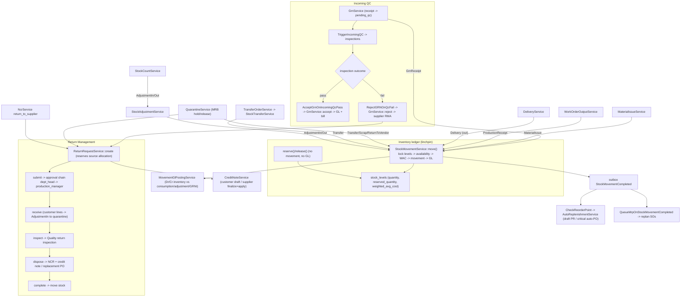

# Inventory + Return Management Audit

Date: 2026-09-18
 
## Re-audit 2026-09-19

Current verdict: **open**.

- Search imports and stock-card transfer direction are fixed, but stock-card WAC arithmetic remains wrong/float-based.
- Current Inventory risks: zone reclassification with stock, incomplete/self-approved counts, fractional incoming QC, non-idempotent GRN/material issue creation, non-authoritative lots, inactive-location use, and item restore binding.
- Return Management risks: internal product/item mismatch, duplicate NCRs, Finance-only approval role, source-status enforcement, supplier bill provenance, replacement VAT, and per-line supplier movement traceability.
- Full current classification: `RE-AUDIT-REGISTER-2026-09-19.md`.
Scope: `api/app/Modules/Inventory/` (stock ledger, locations/zones, transfers, adjustments,
counts, material issues, picking, barcode, quarantine/MRB, GL, item master, receiving) and
`api/app/Modules/ReturnManagement/` (RMA).
Claims are marked **[confirmed]** (file:line, seed, or code read) or **[assumption/unverified]**.

---

## 1. Executive summary

Inventory is a real double-entry-style stock ledger: every stock mutation funnels through
`StockMovementService::move()`, which locks `(item, location)` rows, enforces availability,
recomputes weighted-average cost, writes `stock_movements`, and posts GL in the same
transaction. Zones quarantine/scrap are excluded from consumption. The main defects are a
**fatal missing import on two list-search endpoints**, a **stock-card transfer direction
bug**, and a stock-count maker-checker that is self-approvable.

Return Management is a full RMA subsystem (customer + supplier) with a state machine, a
two-step approval chain, a Quality handoff, credit notes, and supplier replacement POs. Its
notable issues are the deferred cross-party credit-note link, a VAT-inheritance asymmetry,
and finance having no permission to open the RMA it must act on.

---

## 2. Flow diagram

---

## 3. Walkthrough

### 3.1 The ledger — `StockMovementService::move()`

Every stock change funnels through `move()` (`StockMovementService.php:53`):
1. `validateInput` (positive qty; receipts need a destination, issues a source; Transfer needs
   two distinct locations) and `SourceReferenceRegistry::assertValid`.
2. Transaction with **3 deadlock retries**; count-freeze guard unless `bypassCountFreeze`.
3. `lockAffectedLevels()` locks both `(item,location)` rows sorted by location id;
   `insertOrIgnore` creates a missing level (`stock_levels_item_loc_unique`).
4. Optimistic-lock check on `lock_version` when the caller supplies an expected version.
5. Unit cost: explicit → source WAC → destination WAC (`0.00` if fresh).
6. Issue side: availability = `quantity − reserved_quantity`; shortfall throws
   `InsufficientStockException`; source WAC unchanged.
7. Receipt side: recompute WAC (`round4((oldQty*oldWac + qty*unitCost)/newQty)`).
8. Insert `stock_movements`, record `StockMovementCompleted` via the outbox, then
   `MovementGlPostingService::postFor()` in the same transaction; a `manual_required` GL
   handoff stages a replay event.

`reserve()`/`release()` only mutate `reserved_quantity` (no movement, no GL), reject
non-positive magnitudes, exclude quarantine/scrap, and assert the location is not frozen.
**Confirmed:** `StockLevel::getAvailableAttribute` and `Item` availability use floats while
the ledger uses bcmath — reporting can drift.

Movement types (`StockMovementType.php:9-20`): `grn_receipt`, `material_issue`,
`production_receipt`, `delivery`, `transfer`, `adjustment_in`, `adjustment_out`, `scrap`,
`return_to_vendor`, `cycle_count`, `opening`. `isIssue()` is dead; `CycleCount` and `Opening`
have no service producer (Opening only seeded).

### 3.2 Locations and zones

`WarehouseZoneType`: `raw_materials|staging|finished_goods|spare_parts|quarantine|scrap`.
Quarantine/scrap cannot satisfy `MaterialIssue`/`Delivery` (`assertConsumableSource`), cannot
be reserved, cannot be a picking source, and cannot be a receiving target. Adjustment/scrap/
return-to-vendor/transfer may touch them (MRB mechanics). **`is_blocked` is never written by
any code and is not fillable**, so the receiving blocked-location guard is dead; the legacy
`warehouse_locations.current_*` projection has no writer.

### 3.3 Transfers, adjustments, counts

- `TransferOrderService`: create (`Pending`) → execute (`Transferred`, one `Transfer`
  movement) → cancel; no approval, route permission `inventory.adjust`. `StockTransferService`
  is a thin wrapper; the old `/stock-transfers` route and controller are commented out.
- `StockAdjustmentService`: `create()` posts immediately when below
  `inventory.adjustment_approval_threshold` (default 0 = gate disabled), else saves `Pending`
  for `approve()`; `approve()` requires `inventory.adjust.approve`; count reconciliation uses
  current WAC with `bypassCountFreeze`.
- `StockCountService`: `Draft → InProgress → Completed`/`Cancelled`; start freezes locations
  and blocks overlapping sessions; `completeSession` gates on
  `inventory.stock_count.variance_tolerance_pct` (over-tolerance requires the item be
  `Verified` via `approveVariance`), then auto-reconciles variances through adjustments.
  **`approveVariance` and `completeSession` share `inventory.stock_count.manage`** — the
  maker can verify their own count.

### 3.4 Operational services

- `MaterialIssueService`: issue slips, multi-UOM, quarantine/scrap block, releases the
  reservation before issuing; `cancel()` reverses issued lines.
- `PickingListService`: FEFO/FIFO suggestions excluding quarantine/scrap; `generateForMis`
  wired, `generateForWorkOrder` is test-only ("future use").
- `QuarantineService` (MRB): hold requires a failed inspection + related NCR, moves stock to
  a quarantine location; release by disposition (`rework|use_as_is` → Transfer, `scrap` →
  Scrap, `return_to_supplier` → ReturnToVendor + opens a supplier RMA). The scrap branch
  discards the resolved scrap location (validation by side-effect; no destination recorded).
- `BarcodeScanResolverService`: `WO-`/`PO-`/`GRN-` prefixes → typed entity + actions.
- `SafetyStockRecomputeService`: `SS = Z·σ·√lead_time`, nightly.
- `AbcClassificationService`: no route reaches it (`ItemController::recomputeAbc` unrouted) — dead.
- `InventoryDashboardService`: 30 s cache but N+1 across active items.

### 3.5 GL

`MovementGlPostingService` maps AdjustmentIn/CycleCount (Dr inventory / Cr adjustment),
AdjustmentOut (reverse), MaterialIssue/Scrap (Cr inventory / Dr consumption), ReturnToVendor
(Cr inventory / Dr GRNI), ProductionReceipt (reverse consumption); GrnReceipt/Transfer/
Opening/Delivery are non-GL here. Idempotent via `stock_movements.journal_entry_id`; failures
leave a replayable `manual_required` handoff. `GrnGlPostingService` posts cumulative
Dr inventory-item-type / Cr GRNI. **Gate inconsistency confirmed:** GRN uses
`requiredBool('modules.accounting')` (throws, rolling back the receipt) while the movement
and payroll services use `get('modules.accounting', false)` (silently skip).

### 3.6 Events

`StockMovementCompleted` (outbox) → `CheckReorderPoint` (may raise a reorder PR or, for
critical items, a bypass auto-PO) and `QueueMrpOnStockMovementCompleted` (replan affected
SOs). GRN → `TriggerIncomingQC`; `InspectionPassed` → `AcceptGrnOnIncomingQcPass` and
`VerifyCoaOnIncomingQcPass`; `InspectionFailed` → `RejectGRNOnQcFail`;
`StockMovementGlPostingRequested` → queued retry. All wired explicitly in
`AppServiceProvider.php:294-359`.

### 3.7 Item master

`Item` carries type, UOM, standard cost, reorder method/point, safety stock, MOQ, lead time,
`is_critical`, `abc_class`. **No per-item valuation method** — weighted average is global and
implicit. `item_type` and `unit_of_measure` are frozen once movements exist. Finished-goods
items link to CRM `Product` only by convention (`items.code == products.part_number`,
`item_type=finished_good`); no FK.

### 3.8 Return Management

State machine: `draft → pending_approval → approved → received → inspected → completed`,
with `rejected`/`cancelled` side exits and one recovery edge `inspected → received`.
Approval chain `return_request`: `department_head → production_manager` (`WorkflowSeeder.php:180-187`,
active). Lines reserve a source allocation (invoice/SO/delivery/GRN) capped by that source's
quantity. `receive()` records physical return; **customer item-backed lines** are moved into a
quarantine location (`AdjustmentIn`); supplier lines move nothing. `inspect()` stages Quality
inspections per product; `dispose()` auto-creates NCRs for scrap/rework and creates credit
notes (customer = **draft**; supplier = finalized + applied to the open bill) plus an optional
replacement **PO** (no replacement work order). `complete()` moves any remaining lines.
System entry `openSupplierReturnForReversedGoods()` is shared by GRN rejection, NCR
`return_to_supplier`, and MRB release, using `reversal_already_applied` and per-line
`stock_movement_quantity` to prevent double quantity-reversal/movement.

---

## 4. Branch points

| # | Where | Condition | Paths |
|---|---|---|---|
| B1 | `move()` | issue vs receipt (from/to location) | decrement+WAC unchanged / increment+WAC recompute |
| B2 | `move()` | destination WAC null | cost 0.00 / inherit destination WAC |
| B3 | `move()` | `lock_version` mismatch | refuse / proceed |
| B4 | `move()` | source in quarantine/scrap for issue/delivery | block / allow |
| B5 | `reserve()` | zone quarantine/scrap | block / reserve |
| B6 | `assertLocationsNotFrozen` | count session in progress | freeze / move |
| B7 | Adjustment `create` | value > threshold | `Pending` (no movement) / post immediately |
| B8 | `completeSession` | over-tolerance & not Verified | abort session / reconcile |
| B9 | GRN accept | QC gate all passed/cancelled | accept+GL+bill / refuse |
| B10 | GRN reject | — | reverse PO + supplier RMA / (throw rolls back) |
| B11 | `TriggerIncomingQC` | quality plan / raw-material item | plan inspection / fallback / skip (no QC) |
| B12 | Quarantine release | disposition | Transfer / Scrap / ReturnToVendor+RMA |
| B13 | RMA `receive` | customer item-backed vs supplier | quarantine AdjustmentIn / no movement |
| B14 | RMA `inspect` | Quality handoff fails | `manual_required` + retry event / inspected |
| B15 | RMA `dispose` | disposition matrix | NCR / credit note / replacement PO |
| B16 | supplier bill already paid | `openBillForReturn` only Unpaid/Partial | apply CN / CN floats unapplied |

---

## 5. Permission gates

| Action | Permission |
|---|---|
| Items/categories/UOM mutate | `inventory.items.manage`; view `inventory.view` |
| Warehouse/zones/locations | `inventory.warehouse.manage` |
| Adjustments create / approve | `inventory.adjust` / `inventory.adjust.approve` |
| Transfer orders | `inventory.adjust` |
| Stock counts view / manage | `inventory.stock_count.view` / `.manage` (approve shares manage) |
| Picking list | `inventory.picking.view` |
| GRN create/finalize/accept/reject | `inventory.grn.create` |
| Material issues | `inventory.issue.create` |
| MRB view / manage | `inventory.mrb.view` / `.manage` |
| GL retry | `accounting.journal.post` |
| RMA view/manage/approve/receive/inspect/dispose/complete | `return_management.*`; approval chain `department_head → production_manager` |

---

## 6. Glossary

- **WAC** — weighted average cost per `(item, location)`, recomputed only on receipts.
- **reserved_quantity** — earmarked stock, no movement/GL; availability gates on it.
- **Count freeze** — an in-progress stock count blocks movements at its locations.
- **MRB / quarantine** — held stock excluded from consumption; released by disposition.
- **`reversal_already_applied`** — supplier-RMA flag preventing double quantity reversal.
- **`stock_movement_quantity`** — per-line idempotency stamp for RMA stock movements.
- **Source allocation** — RMA line reservation against exactly one invoice/SO/delivery/GRN line.

---

## 7. Incomplete, inconsistent, dead-ends

All **[confirmed]** unless marked.

1. **Fatal missing import (search endpoints).** `GrnService.php:81` and
   `MaterialIssueService.php:39` call `SearchOperator::like()/contains()` without importing
   `App\Common\Support\SearchOperator`, so the name resolves to a nonexistent
   `App\Modules\Inventory\Services\SearchOperator`. `GET /inventory/grn?search=…` and
   `GET /inventory/material-issues?search=…` throw a fatal `Error`. **(verified by reading
   the import blocks and usage sites)**
2. **`StockCardService::direction()` transfer bug.** `direction()` returns `'in'` as its
   fallback (`:178`); an unfiltered transfer has both `from` and `to` set, matches neither
   positive branch, and is treated as a receipt, inflating the running balance, while
   `balanceBefore()` (`:151-160`) treats transfers as net-zero. `StockCardService` has no
   tests. Also computes WAC in floats, duplicating the bcmath ledger. **(verified)**
3. **Stock-count maker-checker is self-approvable** — `approveVariance` and
   `completeSession` share `inventory.stock_count.manage`; no distinct-approver check.
4. **GL gate inconsistency for the same setting** — `GrnGlPostingService:68` `requiredBool`
   (throws and rolls back the receipt) vs `MovementGlPostingService:117` / payroll
   `get(..., false)` (silently skips).
5. **`is_blocked` is unsettable** (not fillable, no writer), so the receiving blocked-location
   guard is dead; the legacy `warehouse_locations.current_*` projection has no writer.
6. **Dead code:** `StockMovementType::isIssue()`; `PickingListService::generateForWorkOrder()`;
   `StockTransferController` (route commented out); `ItemController::recomputeAbc()` unrouted
   (so `AbcClassificationService` is unreachable); `SalesOrderService::pickingListService()`.
7. **`Opening`/`CycleCount` movement types have no service producer** (Opening seeded only;
   CycleCount never constructed — counts post `AdjustmentIn/Out`).
8. **Fractional QC quantity guard is inconsistent.** `GrnService::inspectionBatchQuantity()`
   rejects fractional receipts, but the async `TriggerIncomingQC.php:80` truncates with
   `(int)(float)` and skips `< 1`, so fractional lines are silently truncated/dropped into a
   whole-unit inspection.
9. **Legacy whole-GRN inspection escape hatch** (`GrnService.php:926-933`) satisfies per-line
   QC coverage for every eligible line if any inspection has `grn_item_id = null`.
10. **`coa_verified` has two writers.** `GrnService::verifyCoaOnIncomingPass()` claims to be
    the sole writer, but `VerifyCoaOnIncomingQcPass` (a registered listener) also writes it.
11. **`acceptInternal()` is not delta-aware** (unlike `accept`/`partialAccept`) — it moves the
    full received quantity; safe only because `receiveWithQc` always creates first.
12. **Duplicated acceptance/over-receipt/UOM blocks** across `create`/`finalizeDraft` and
    `accept`/`acceptInternal`/`partialAccept` — three near-identical paths, no shared helper.
13. **`StockAdjustmentService::create()` writes two audit rows** for a sub-threshold adjustment
    (`Pending` then `Approved`).
14. **RMA cross-party credit-note link is a live deferred defect.** `CreditNoteService::assertParty()`
    decodes `customer_id`/`invoice_id` independently, so a customer credit note can reference
    another customer's invoice (documented M028-F19, deliberately deferred; the doc points at
    `ReturnRequestService::creditNoteFor()` which does not exist — the real method is
    `createCreditNote()` at `:1983`).
15. **Customer credit-note VAT uses the company-wide VAT flag**, not the source invoice's
    `is_vatable` (the supplier path correctly prefers the bill's flag), so a non-VAT invoice
    can receive a VAT-bearing customer credit.
16. **`finance_officer` has no `return_management.*` permission**, yet finalizes/applies the
    credit notes and cannot open the RMA card/link.
17. **Supplier return to a fully-paid bill floats unapplied** — `openBillForReturn()` only
    links `Unpaid|Partial`; the credit note is created/finalized but `apply()` is skipped.
18. **`NcrService::openSupplierReturnRmaForNcr()` swallows `Throwable` → `Log::error`** and
    does not fail the NCR close (the repo's documented "dead subsystem" trap shape).
19. **RMA has no row scope** — every `return_management.view` holder sees every RMA
    (`ApprovalTypeRegistry`/`ApprovalSourceScope`), a deliberate but broad choice.
20. **`opening_balance`/`closing_balance` and float/bcmath read-path drift** (see §3.1);
    `ReturnRequest`'s legacy `creditMemo` relation/resource field survives alongside
    `creditNote`; the MRB scrap release records no destination location.

---

## 8. Assumptions vs confirmed facts

**Confirmed from code/seed:** the `move()` contract and movement types; zone restrictions;
transfer/adjustment/count lifecycles; the quarantine/MRB disposition mechanics; GL mappings
and the gate inconsistency; event wiring; the return state machine, approval chain,
allocation/reservation and disposition behavior; the two hard bugs in §7.1/§7.2; and the
rest of §7.

**Assumptions / not verified:**

- A1. No test suite or live database was run for this audit; findings are from source and
  seed inspection. The missing-import bug is inferred from PHP name resolution, not executed.
- A2. The SPA inventory screens were not inspected.
- A3. Whether `inventory.adjustment_approval_threshold`, `over_receipt_tolerance_pct`,
  variance tolerance and `modules.accounting` are set in every environment determines which
  branches fire; no live settings were read.
- A4. The exact `Quality` NCR/CoC behavior is only summarized here (its own audit is queued).
- A5. WAC correctness against a worked example was not numerically verified; the formula was
  read, not recalculated against fixtures.
