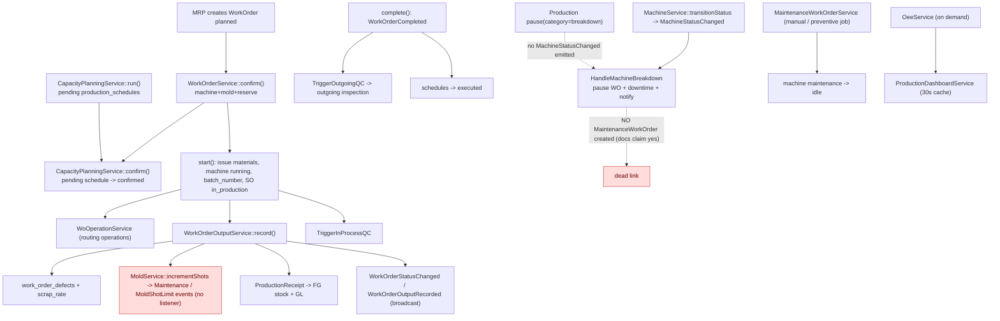

# Production (Work Orders, OEE, Scheduling, Maintenance) Audit

Date: 2026-09-18
Scope: `api/app/Modules/Production/` plus the machine/mold/scheduling/maintenance machinery it
depends on (`api/app/Modules/MRP/` machine+mold+capacity services, `api/app/Modules/Maintenance/`).
`WorkOrderService` and `WorkOrderOutputService` were audited in
`SALES-ORDER-CHAIN-TRACE-2026-09-18.md`; summarized here, not re-traced.
Claims are marked **[confirmed]** (file:line, grep, or code read) or **[assumption/unverified]**.

---

## 1. Executive summary

Production is a complete work-order shop: a guarded WO state machine, material reservation and
issue, routing-derived operations, output/defect recording, mold shot tracking, finite-capacity
scheduling, OEE, and downtime. Two systemic problems surfaced: **a documented feature is not
implemented** — a machine breakdown notification flow runs but **no corrective maintenance work
order is ever created** (three docs claim otherwise); and **the daily production summary
misreports** (an SQL `OR` precedence bug turns every downtime category into a "breakdown", and
daily output is over-counted for multi-day WOs). Operations scheduling is also dead (its
`planned_start` is never written).

---

## 2. Flow diagram

---

## 3. Walkthrough

### 3.1 Work order lifecycle (summary — full trace in the O2C doc)

`WorkOrderStateMachine`: `planned → confirmed → in_progress → (paused ↔ in_progress) → completed
→ closed`, with `cancelled`. `confirm()` requires machine + mold and reserves the full BOM
(all-or-nothing); `start()` issues reservations as `MaterialIssue` movements, flips
machine/mold, generates `batch_number`, promotes the SO to `in_production`; `complete()` computes
`scrap_rate`, retires schedules to `executed`, and stages `WorkOrderCompleted`; `cancel()`
releases reservations and supersedes schedules. `resume()` has an explicit
`assertResumable()` because the state machine alone would allow a Confirmed WO to jump to
in_progress.

### 3.2 Operations and routings

- `ProductionRoutingService`: immutable versioned routings; every write locks the product and
  supersedes the active version before insert; validates machine/mold existence, status, and
  compatibility; propagates a change by recalculating the BOM and staging an `MrpReplanRequested`
  outbox event. No delete/archive by design.
- `WoOperationService`: `generateFromRouting()` is a `firstOrCreate` no-op without an active
  routing; operation state machine `pending → setup → in_progress → (paused ↔ in_progress) →
  completed` / `skipped`; `startOperation` requires all lower-sequence operations completed;
  `recordOutput` tracks per-operation `qty_completed`/`qty_scrapped`; `completeOperation`'s
  `qc_required` branch is a `Log::info` stub. Every transition writes a `ProductionLog` row.

### 3.3 Output and defects

`WorkOrderOutputService::record()` is idempotent (durable key + payload fingerprint), requires
defect sum == reject count, updates WO totals/scrap_rate, increments mold shots, and posts the
FG `ProductionReceipt` stock movement (degrading to `manual_required` + `ProductionReceiptRequested`
if setup is missing). `DefectType` (11 injection-molding codes) lives in Production; pareto is
computed in three places.

### 3.4 OEE and dashboards

`OeeService`: `scheduledMinutes` = weekdays × machine `available_hours_per_day` (no holidays/
shifts); planned downtime (planned_maintenance|changeover) and unplanned (breakdown|
material_shortage|no_order) reduce available/run time; output from `work_order_outputs`;
ideal cycle from the WO's mold `cycle_time_seconds`; `oee = availability × performance × quality`.
Exposed via `/production/oee/*` and the SPA OEE page. Downtime is attributed by `start_time`
only. `ProductionDashboardService` (30 s cache, TTL-only, no invalidation) and
`ProductionSummaryService` (uncached) aggregate today/week figures. Daily/weekly email summaries
are scheduled at 18:00.

### 3.5 Machine, mold, scheduling

- `MachineService::transitionStatus` is the only status writer; `MachineStatusChanged` is staged
  durably. A machine entering `breakdown` has its non-started pending/confirmed schedules
  superseded by the model hook.
- `MoldService::incrementShots` flips the mold to `Maintenance` at the shot limit, writes a
  `MoldHistory` row once, and emits `MoldShotLimitNearing`/`MoldShotLimitReached` (no listeners).
  `commission()` auto-creates a shot-based PM schedule; `create()` does not.
- `CapacityPlanningService`: `run()` topologically orders planned WOs, locks idle/running
  machines and available molds, and writes `pending` `production_schedules`; `confirm()` delegates
  to `WorkOrderService::confirm()` so reservation and WO status commit together; `reorder`/
  `reassign` reflow the machine timeline. Machine overlap has a GiST exclusion constraint; **mold
  overlap is application-only**.

### 3.6 Maintenance

`MaintenanceWorkOrderService`: create/start/complete/cancel; starting a **machine** MWO
transitions the machine to `maintenance` and opens a `planned_maintenance` downtime; completing
it closes the downtime, returns the machine to `idle`, and recomputes the schedule. Preventive
work is generated by the daily `maintenance:request-preventive-generation` job (days, hours,
shots, and predictive condition readings) behind an automation actor. `machine_downtimes.
maintenance_order_id` has **no FK**.

### 3.7 Breakdown flow (the gap)

`MachineStatusChanged` → `HandleMachineBreakdown`: pauses the running WO (category Breakdown),
forces the machine back to `breakdown`, finds idle compatible machines, and stages
`MachineBreakdownDetected` for notification. Restoration closes open downtimes. **No
`MaintenanceWorkOrder` is created anywhere in this listener** (`grep` confirms zero references),
contradicting `docs/PROCESS-FLOWS.md:1330,1408,1526` and the `maintenance_work_orders` migration
docblock.

---

## 4. Branch points

| # | Where | Condition | Paths |
|---|---|---|---|
| B1 | WO `confirm` | pooled stock covers BOM | reserve / rollback, stays planned |
| B2 | `startOperation` | lower-sequence ops completed/skipped | start / refuse |
| B3 | `completeOperation` | `qc_required` | `Log::info` stub / nothing |
| B4 | output `record` | FG item/location found | receipt + GL / `manual_required` + retry event |
| B5 | `incrementShots` | `current >= max_shots` | mold Maintenance + event / normal |
| B6 | `CapacityPlanningService::run` | machine/mold window free | schedule / conflict recorded |
| B7 | `confirm` | WO still planned, window valid, stock reserved | confirm / rollback |
| B8 | machine status → `breakdown` | — | supersede schedules + pause WO + notify / no MWO |
| B9 | machine restoration | to idle/running | close downtime rows / skip |
| B10 | `MachineHoursService`/preventive job | hours baseline null | skipped forever / due computation |
| B11 | PAUSE via production endpoint `category=breakdown` | — | **no MachineStatusChanged** / no listener flow |
| B12 | mold MWO `complete` | mold not Retired | set Available (even if in_use) / leave |

---

## 5. Permission gates

| Action | Permission |
|---|---|
| WO view / create / confirm / lifecycle / record output | `production.work_orders.view` / `production.wo.create` / `production.wo.confirm` / `production.work_orders.lifecycle` / `production.wo.record` |
| OEE / production dashboard | `production.dashboard.view` |
| Routings view / manage | `production.routings.view` / `.manage` |
| Machine manage / transition | `production.machines.manage` / `production.machines.transition` |
| Mold manage | `production.molds.manage` |
| Scheduler run/reorder/reassign vs confirm | `mrp.schedule` vs `production.schedule.confirm` |
| Maintenance view/create/assign/complete/schedules | `maintenance.view` / `maintenance.wo.create` / `.assign` / `.complete` / `maintenance.schedules.manage` |

---

## 6. Glossary

- **WorkOrder state machine** — the single source of allowed WO transitions.
- **WoOperation** — routing-derived operation row with its own state machine.
- **ProductionSchedule** — finite-capacity machine/mold booking (`pending|confirmed|superseded|executed`).
- **ProductionReceipt** — FG stock movement from recorded output.
- **Mold shot limit** — shots before maintenance; auto-flips to `Maintenance`.
- **OEE** — availability × performance × quality from downtime/output/mold cycle time.
- **MWO** — MaintenanceWorkOrder (polymorphic by `maintainable_type`).

---

## 7. Incomplete, inconsistent, dead-ends

All **[confirmed]** unless marked.

1. **A machine breakdown does not create a corrective MWO.** `HandleMachineBreakdown` pauses the
   WO, opens a `breakdown` downtime, and notifies — it never creates a `MaintenanceWorkOrder`
   (`grep` finds no reference). `docs/PROCESS-FLOWS.md:1330,1408,1526` and the MWO migration
   docblock claim it does. Breakdowns never enter the maintenance queue automatically and the
   breakdown downtime is never linked (`machine_downtimes.maintenance_order_id` stays null). **(verified)**
2. **`ProductionSummaryService` SQL precedence bug.** Lines 52-56 read
   `whereBetween(start_time) OR end_time IS NULL AND category='breakdown'`, so **any** downtime
   category starting in the day is reported as a breakdown. **(verified)**
3. **Daily output over-count.** `forDate` lines 26-43 match WOs by planned dates and then
   `SUM(wo.good_count)` over **all** their outputs, so a multi-day WO contributes its whole total
   to each day it overlaps. **(verified)**
4. **Operations schedule endpoint is dead.** `WoOperation.planned_start` is never written, so
   `GET /production/operations/schedule` always returns empty; the route also has no SPA caller.
5. **OEE trend is O(days × machines) queries** (3 per `calculate()`), silently returns `[]` past
   92 days, and includes non-active machines. The production dashboard computes OEE twice per
   cache miss.
6. **No production-summary / dashboard cache invalidation** (`dashboard:production` is TTL-only).
7. **No case is dead / broadcast-only:** `MoldShotLimitNearing`/`MoldShotLimitReached` have no
   listeners; `ProductionLogEvent::DowntimeStart`/`DowntimeEnd` are never emitted;
   `WoOperation.downtime_minutes` has no writer; `WoOperationService::completeOperation` QC trigger
   is a stub; `ProductionDashboardService`'s `QC Pending`/`Delivered Unpaid`/`At Risk` labels are
   unreachable.
8. **Two independent output paths** (`WoOperationService::recordOutput` per-operation vs
   `WorkOrderOutputService::record` WO-level) with no reconciliation.
9. **Three separate defect-Pareto implementations.**
10. **Two inconsistent breakdown entry points:** the machine transition path runs the full
    listener flow; pausing a WO with `category=breakdown` writes a breakdown downtime but emits
    no `MachineStatusChanged`.
11. **`MaintenanceWorkOrderService::start()` can pull a running machine into maintenance** without
    checking `current_work_order_id` or pausing the WO.
12. **A mold MWO `complete()` unconditionally restores `Available`** (unless Retired), so a mold
    `in_use` on a live WO could be freed; mold double-booking has no DB constraint.
13. **Preventive schedules with `running_hours_baseline = null` are skipped forever**, and a
    mold `hours` schedule behaves like days.
14. **A mold only gets an auto-PM schedule via `commission()`**, not `create()`.
15. **Dead code:** unconditionally reachable `MoldController::costTrend`/`MoldService::costTrend`
    (route commented); the maintenance condition-reading feature is disabled end-to-end (routes
    commented, controller not imported) yet the preventive job still evaluates readings;
    `MoldEventType::MaintenanceScheduled`/`Repaired` unused; `StoreMachineRequest`/`StoreMoldRequest`
    `status` rules dead; `production.view` permission granted but never checked; a scratch test
    `ZzM050CapacityProbeTest.php` marked "delete before release" remains.
16. **Schema gaps:** `machine_downtimes.maintenance_order_id` has no FK despite the comment;
    `maintenance_work_orders` has no unique `schedule_id`; only machines have a schedule-overlap
    exclusion constraint.
17. **No `HasAuditLog`** on `WoOperation`, `ProductionLog`, `WorkOrderDefect`, `DefectType`,
    `MachineDowntime`, `ProductionSchedule`.

---

## 8. Assumptions vs confirmed facts

**Confirmed from code/seed:** the WO/operation state machines; routing versioning; output/defect
handling; OEE inputs and exposure; machine/mold/schedule mechanics and constraints; the
maintenance MWO lifecycle and preventive job; the breakdown flow; and the two high-impact
findings in §7.1/§7.2 plus the rest of §7.

**Assumptions / not verified:**

- A1. No test suite or live database was run for this audit; findings are from source/grep
  inspection (the SQL-precedence and no-MWO claims are read and grepped, not executed).
- A2. The SPA production/maintenance screens were only spot-checked for route callers.
- A3. Whether every setting (`alerts.mold.warning_ratio`, maintenance notification roles,
  `system.automation.actor_roles`, `maintenance.mold_schedule.trigger_threshold_pct`) is seeded in
  every environment was not verified.
- A4. OEE correctness against a worked example was not numerically verified.
- A5. Mold/machine count and soft-delete state in real data is unknown, so the impact of the
  inactive-machine OEE inclusion is unquantified.
