# Internal Purchase Request → Procure-to-Pay Trace (non-Sales-Order)

Date: 2026-09-18
 
## Re-audit 2026-09-23 — remediated (FINISHED)

Current verdict: **FINISHED**.

- The resolution log fixes remain visible: PR chain entity, `mrp_plan_id`, CoA verification, incoming-QC retry, and vendor-SoD exception handling.
- Gaps closed in current worktree:
  - **G1 (Cancelled PO / draft GRN resurrection):** Purged staged draft GRNs on PO cancellation and fail-closed against cancelled PO receiving in `GrnService`.
  - **G2 (Partial quantity conversion):** Sourcing conversion in `PurchaseOrderService` and `RfqAwardService` now tracks quantity coverage rather than line existence, preventing premature full PR conversion and preserving unfulfilled line quantities for subsequent conversion.
  - **G4 (Posted partial-bill continuation):** `BillService` calculates unbilled accepted quantities and permits staging subsequent draft bills for newly accepted goods on a GRN (migration `2026_09_20_140000_drop_bills_goods_receipt_note_unique.php`).
  - **G5 (Fractional & archived incoming QC):** Decimal-safe ceiling batch calculation and `withTrashed()` item resolution in `TriggerIncomingQC` and `InspectionService`.
- Additional P2P findings closed: manual PO create/update locks and enforces aggregate remaining quantity per PR line; submit rechecks draft ownership under the PO lock; accepted GRNs skipped while Accounting is disabled can be retried at `POST /api/v1/inventory/grn/{grn}/retry-gl` by a journal-post permission holder.
- Purchase quantities now retain 3-decimal precision through PR and PO lines, including received quantities; the migration refuses a destructive rollback when 3-decimal values exist.
- Focused P2P/GRN coverage passed, including two-connection PO lifecycle races, manual coverage, submission ownership, and idempotent GL retry.
- Residuals: `docs/SCHEMA.md` still documents two-decimal PR/PO quantities and needs a separate
  repository-level documentation update; the read-only migration preflight and GRN GL retry UI
  are now present. Production migration execution remains an operational release gate.
- The cross-module register was left unchanged per task scope; this P2P summary supersedes its stale residual list.
Scope: a Purchase Request raised for internal need (not derived from a Sales Order),
followed all the way to the last process (payment / GL / closure). Discovered by reading
`api/`. Claims are marked **[confirmed]** (file:line given) or **[assumption/unverified]**.

Primary path for an internal (manual) PR is **Direct PO**; RFQ is only allowed for
*auto-generated* PRs. Entry points and the whole downstream chain are below.

---

## 1. Entry points — how a non-SO PR comes to exist

Three distinct origins, and they behave differently:

| # | Origin | Service | `is_auto_generated` | `sourcing_method` | `department_id` |
|---|---|---|---|---|---|
| A | **Manual internal need** | `PurchaseRequestService::create()` `Purchasing/Services/PurchaseRequestService.php:104` | `false` | forced `direct_po` (`:160-162`); RFQ refused `:107-109` | creator's own dept / validated input |
| B | **Reorder-point auto-PR** | `AutoReplenishmentService::checkAndReplenish()` `Inventory/Services/AutoReplenishmentService.php:34` | `true` | `null` | `null` |
| C | **Critical-item auto-PO** | `AutoPurchaseOrderService::createForCriticalShortage()` `Purchasing/Services/AutoPurchaseOrderService.php:46` | (no PR at all) | — | — |

All three are reachable without any Sales Order:

- **A** is the pure internal need: permission `purchasing.pr.create` on
  `POST /api/v1/purchasing/purchase-requests` (`Purchasing/routes.php:30`). Department
  attribution rules (`PurchaseRequestService.php:122-142`): a department head may only
  request for their own department; a central desk user (`purchasing.po.create`) or an
  executive (`purchasing.pr.create` + no employee record) may attribute any department;
  everyone else is refused.
- **B** fires on `StockMovementCompleted` → `CheckReorderPoint`
  (`AppServiceProvider.php:293`) whenever `item.available <= item.reorder_point`. It is a
  general reorder check, entirely order-agnostic. It requires a system automation actor to
  resolve, else it silently returns null (`:83-84`).
- **C** is a deliberate bypass of the PR workflow: `item.is_critical = true`, exactly one
  qualified **preferred** `ApprovedSupplier`, no open auto-PO for the item, and a positive
  price. It creates a PO directly in `PendingApproval` and submits it to the PO approval
  chain (`AutoPurchaseOrderService.php:112-146`). If any criterion fails, the caller falls
  back to the normal PR path (`AutoReplenishmentService.php:51-65`).

---

## 2. Flow diagram (internal PR → last process)

```mermaid
flowchart TD
    A0["Internal need"] --> A["PurchaseRequestService::create()<br/>draft, direct_po<br/>Purchasing/Services/PurchaseRequestService.php:104"]
    A0 --> B["AutoReplenishmentService::checkAndReplenish()<br/>StockMovementCompleted hook<br/>draft, is_auto_generated=true, sourcing_method=null<br/>Inventory/Services/AutoReplenishmentService.php:34"]
    A0 -. critical item .-> C["AutoPurchaseOrderService::createForCriticalShortage()<br/>PO direct at PendingApproval<br/>Purchasing/Services/AutoPurchaseOrderService.php:46"]

    A --> S["submit()<br/>requires sourcing_method + owning dept<br/>:331"]
    B --> S2["setSourcingMethod() then submit()<br/>buyer must pick direct_po or rfq"]
    S2 --> S
    S --> AP["ApprovalService::submit('purchase_request')<br/>finance_officer -> vice_president (VP >= 50000)<br/>WorkflowSeeder.php:64-71"]
    AP --> D{"fully approved?"}
    D -- no --> HOLD["stays pending (or rejected)"]
    D -- yes --> E["status=approved<br/>po_conversion_status=Pending|SourcingPending<br/>:461-473"]
    E --> EV["Outbox: PurchaseRequestApproved"]
    EV --> F{"sourcing_method"}
    F -- direct_po --> G["ConsolidatePurchaseOrders listener<br/>Purchasing/Listeners/ConsolidatePurchaseOrders.php:52"]
    F -- rfq --> RFQ["RequestForQuoteService::createFromPurchaseRequest()<br/>only if is_auto_generated<br/>publish -> quotes -> award"]
    F -- null --> MAN["stays approved, manual conversion"]

    G --> RS["VendorSourcingService::resolveLines()<br/>vendor + price per line"]
    RS --> GC{"any line resolvable?"}
    GC -- no --> MAN
    GC -- yes --> PO["PurchaseOrderService::convertFromPr()<br/>one PO per vendor, status=DRAFT<br/>:272"]
    RFQ --> PO
    PO --> PS["PO submit() -> PendingApproval<br/>finance_officer -> vice_president >= 50000"]
    PS --> PB["PO approve()<br/>budget ack + vendor SoD + PPAP gate + budget enforce<br/>:628"]
    PB --> PA["status=approved, emits PurchaseOrderApproved"]
    PA --> PAD["PrepareSupplierDispatch<br/>portal_available | manual_required"]
    PA --> SENT["markAsSent() -> status=sent<br/>requires purchasing.po.send<br/>:823"]
    SENT --> DGRN["PurchaseOrderSent -> CreateDraftGrnOnPoSent<br/>draft GRN, zero-qty lines per PO line<br/>Inventory/Listeners/CreateDraftGrnOnPoSent.php:32"]
    DGRN --> FIN["warehouse finalizeDraft()<br/>assign bins + received qty -> pending_qc<br/>GrnService.php:352"]
    FIN --> QC["GoodsReceiptNoteCreated -> TriggerIncomingQC<br/>one incoming Inspection per line<br/>Quality/Listeners/TriggerIncomingQC.php:49"]
    QC --> QD{"inspection outcome"}
    QD -- pass --> ACC["InspectionPassed -> AcceptGrnOnIncomingQcPass<br/>waits all siblings -> GrnService::accept()"]
    QD -- fail --> REJ["InspectionFailed -> NCR (in InspectionService)<br/>+ RejectGRNOnQcFail -> GrnService::reject()<br/>+ supplier RMA"]

    ACC --> GL1["StockMovement GrnReceipt (weighted avg cost)<br/>+ Dr Inventory / Cr GRNI<br/>Inventory/Services/GrnGlPostingService.php:50"]
    GL1 --> BILL["GoodsReceiptNoteAccepted -> AutoCreateBillOnGrnAccepted<br/>draft Bill (needs PO + accepted GRN)<br/>Accounting/Services/BillService.php:293"]
    BILL --> POST["postDraft()<br/>3-way match; override needs 3-way override perm<br/>Dr GRNI / Dr VAT input / Cr AP<br/>:428"]
    POST --> PAY["recordPayment() -> BillPayment PendingApproval<br/>bill_payment chain finance -> VP<br/>:568"]
    PAY --> APPROVE["approvePayment() -> postApprovedPayment()<br/>Dr AP / Cr Cash; bill Paid/Partial<br/>:645"]
    APPROVE --> LAST["PO close() (Received -> Closed)<br/>or reopen PR on PO cancel"]
    REJ --> RMA["ReturnManagement supplier return"]

    classDef endnode fill:#dfd,stroke:#393
    classDef dead fill:#fdd,stroke:#c33,color:#600
    class LAST,APPROVE endnode
    class MAN dead
```

---

## 3. Step-by-step walkthrough

### Step 1 — PR creation

Manual (A): `PurchaseRequestService::create()` (`PurchaseRequestService.php:104`), in a
transaction. Validates department attribution (`:122-142`), writes `purchase_requests` +
`purchase_request_items`, forces status `draft` (status is non-fillable; `:165`). For
non-auto rows it forces `sourcing_method = direct_po` (`:162`). It does **not** persist
`mrp_plan_id` (only MRP writes that directly). Line fields are pre-filled from the catalog
`Item` when not supplied, and for auto rows a suggested vendor is resolved via
`VendorSourcingService::suggestVendorId()` (`:183-185`).

Reorder-point (B): creates the same rows with `requested_by` = system actor,
`department_id = null`, `sourcing_method` absent (null), `is_auto_generated = true`, and one
line at the computed reorder quantity (`AutoReplenishmentService.php:95-114`).

### Step 2 — Submit and budget assessment

`PurchaseRequestService::submit()` (`:331`), inside a transaction, lock-then-guard on the
PR row:

- Refuses unless status is `draft` (`:341`).
- **Refuses when `sourcing_method === null`** (`:344-346`). This is why an auto-PR (B) is
  not submittable as created — a buyer must first call
  `setSourcingMethod()` (`:490`, route `PATCH .../sourcing-method`, permission
  `purchasing.po.create` or `purchasing.rfq.create`, `Purchasing/routes.php:32`).
- For `is_auto_generated` PRs, **requires an owning department** (`:357-361`) — B arrives
  with none, so it must be assigned.
- `prefillSupplierOnItems()` (`:405`) resolves suggested vendor + price before totals.
- `BudgetEnforcementService::assess()` when a department is present (`:373-375`).
- `ApprovalService::submit($locked, 'purchase_request', $total)` (`:385`) creates one
  `approval_records` row per step, then status → `pending` (`:387-390`).

### Step 3 — PR approval chain

Seeded workflow `purchase_request` (`WorkflowSeeder.php:64-71`, active in `$wiredTypes`
`:190-200`):

1. `finance_officer`
2. `vice_president` — step threshold `50000.00` (below it the step is recorded `skipped`)

`ApprovalService` enforces: no self-approval on a step ("You cannot act on a record you
submitted."), and exact role match for the current step. `PurchaseRequestService.approve()`
(`:445`) additionally requires permission `purchasing.pr.approve`
(`assertMayDecide`, `:541`) and, for the one departmental step, department scope
(`PurchaseRequestAccessPolicy::respectsDepartmentScope`, `:273`). Reject (`:583`) → status
`rejected`. Cancel (`:600`) is draft/pending only.

On full approval (`:461-473`): status `approved`; `po_conversion_status = pending` when
DirectPo, `sourcing_pending` otherwise; emits **`PurchaseRequestApproved`** through the
durable outbox (`:477-483`).

### Step 4 — Auto-conversion to PO (Direct PO)

`PurchaseRequestApproved` → `ConsolidatePurchaseOrders` listener
(`Purchasing/Listeners/ConsolidatePurchaseOrders.php:52`, queued). Gate order (`:52-129`):

- Re-reads the PR; requires `status = approved` (`:67`).
- Requires `sourcing_method = direct_po`; RFQ/null → `buyer_sourcing_decision_required`
  (`:75-79`).
- Refuses if a live (non-cancelled, non-deleted) PO already exists (`:85-94`).
- Claims conversion atomically (`markPoConversionPending`, `:99`).
- `VendorSourcingService::resolveLines()` (`VendorSourcingService.php:203`) resolves a
  vendor and price per line in tiers: suggested vendor → preferred ASL → other qualified
  ASL → supplier listing → PO history; price via ASL / listing / last purchase price, else
  the PR estimate.
- Unresolvable lines **do not block the rest**: sourceable lines are converted, PR becomes
  `partial` with a note and a purchasing notification (`:156-167, :222-239`). If **no**
  line resolves → `manual_required`, PR stays `approved` (`:121-129`).
- `PurchaseOrderService::convertFromPr()` (`PurchaseOrderService.php:272`) creates **one
  PO per vendor**, status **`draft`**, `is_auto_generated = true`.

**Key behavioural fact:** the automatic conversion stops at a *draft* PO. It does not
submit it. The resulting PO still needs a human to run the PO submit → approve chain
(docblock `ConsolidatePurchaseOrders.php:34-35`). Only the critical-item bypass
(`AutoPurchaseOrderService.php:146`) auto-submits.

### Step 5 — Alternate: RFQ sourcing

Only auto-generated PRs may select RFQ (`PurchaseRequestService.php:107-109`,
`PurchaseRequestAccessPolicy.php:156-173`; `RequestForQuoteService::createFromPurchaseRequest`
requires `$locked->is_auto_generated && sourcing_method === Rfq`, `RequestForQuoteService.php:91`).
Lifecycle: `draft → open → closed` (or `no_award`) `→ under_evaluation →
awarded|partially_awarded` (`RequestForQuoteService`, `RfqAwardService`). Letting
suppliers quote, comparison, quality review, and award are separate permissions
(`purchasing.rfq.view|manage|publish|evaluate|quality_review|award`, `Purchasing/routes.php:49-62`).
`RfqAwardService::award()` requires `purchasing.rfq.award`, blocks a single-response award
without justification, and creates POs through the same `PurchaseOrderService` (still
draft, still needing submit). A manual internal PR can never take this path.

### Step 6 — PO lifecycle

`PurchaseOrderService` (`Purchasing/Services/PurchaseOrderService.php`):

- **submit()** (`:542`): draft → `pending_approval`; if the PO is RFQ-sourced and the winning
  quote has expired, it blocks and raises a `quote_reconfirmation_required` event
  (`:579-617`). Emits `PurchaseOrderSubmitted`.
- **approve()** (`:628`): gated by budget acknowledgement (`:635`), vendor
  segregation-of-duties (`assertVendorSod`, `:762`, override permission
  `purchasing.po.sod_override`), budget enforcement when a source-PR department exists
  (`:642-646`), and the optional PPAP gate (`quality.ppap_gate_enabled`, `:651-665`).
  Workflow `purchase_order`: `finance_officer → vice_president`, VP threshold 50000
  (`WorkflowSeeder.php:80-87`). On full approval, status `approved`, provisional
  `ApprovedSupplier` links recorded (`recordSupplierItemLinks`, `:719`), emits
  **`PurchaseOrderApproved`**.
- **reject()** (`:786`): → `cancelled`, closes supplier dispatch, reopens the source PR if
  it was the last link, emits `PurchaseOrderCancelled`.
- **markAsSent()** (`:823`): approved → `sent`, requires `purchasing.po.send`; records the
  dispatch proof boundary (`SupplierDispatchService::confirmSent`) and emits
  **`PurchaseOrderSent`**.
- Supplier response states: `acknowledged|supplier_proposed|supplier_declined`
  (`PurchaseOrderStatus` enum). Receiving/close: `partially_received → received → closed`.
- **cancel()** (`:903`): allowed while no non-draft GRN exists; emits
  `PurchaseOrderCancelled`; reopens the PR via `reopenSourcePrIfLastLink()` →
  `syncConversionStatus()` (`:1033-1058, :410`).

### Step 7 — Supplier dispatch

`PurchaseOrderApproved` → `PrepareSupplierDispatch` (`AppServiceProvider.php:350`) →
`SupplierDispatchService::prepareForApproved`. Gateway binding
`SupplierDispatchGateway → SupplierPortalDispatchGateway` (`AppServiceProvider.php:183`)
queues a supplier email if the vendor has portal users and a valid address, else records
`manual_required`. It explicitly does **not** claim the PO was sent; that is the human
`markAsSent` boundary. Dispatch statuses: `pending|portal_available|manual_required|confirmed|failed|cancelled`.

### Step 8 — Expected GRN staging

`PurchaseOrderSent` → `CreateDraftGrnOnPoSent` (`Inventory/Listeners/CreateDraftGrnOnPoSent.php:32`)
→ `GrnService::createDraftForPo()` (`GrnService.php:287`). Idempotent: returns the existing
draft, or null if a non-draft GRN already exists. Creates one zero-quantity `grn_items`
line per PO line.

### Step 9 — Receiving and incoming QC

- The warehouse completes the draft: `finalizeDraft()` (`GrnService.php:352`) assigns a bin
  and actual received quantity per line, bumps `purchase_order_items.quantity_received`,
  sets status `pending_qc`, and emits **`GoodsReceiptNoteCreated`** (also fired directly by
  `create()`, `:265`).
- `TriggerIncomingQC` (`Quality/Listeners/TriggerIncomingQC.php:49`) creates **one incoming
  `Inspection` per received line** — from the active item/vendor quality plan if one exists
  (`createIncomingFromPlan`), else a fallback single-verdict inspection
  (`createIncomingForItem`). Idempotent per GRN/line. Missing Quality setup → handoff
  marked `manual_required`, not a crash (`:118-128`).
- The inspector records measurements and completes the inspection
  (`InspectionService::complete`, route `POST /quality/inspections/{inspection}/complete`,
  permission `quality.inspections.manage`, `Quality/routes.php:82`).
  - **Pass** → `InspectionPassed` → `AcceptGrnOnIncomingQcPass`
    (`Quality/Listeners/AcceptGrnOnIncomingQcPass.php:42`): waits until **all** sibling
    incoming inspections are `passed`/`cancelled`, then calls `GrnService::accept()`.
  - **Fail** → `InspectionService::complete` opens an NCR in the same transaction; then
    `RejectGRNOnQcFail` (`Quality/Listeners/RejectGRNOnQcFail.php:42`) calls
    `GrnService::reject()`.

### Step 10 — Accept, inventory and GL

`GrnService::accept()` (`GrnService.php:537`):

- `assertQcGate()` (`:794`): **fail-closed** — every QC-eligible line must have an incoming
  inspection, and every inspection must be `passed`/`cancelled`; a missing inspection
  refuses (`assertIncomingInspectionCoverage`, `:840`). No eligible lines → gate bypassed.
- For each line, updates `quantity_accepted` and `purchase_order_items.quantity_accepted`,
  then `moveAcceptedQuantity()` → `StockMovementService::move(StockMovementType::GrnReceipt)`
  — weighted-average cost recalculated on receipt.
- `refreshPoStatus()` → `partially_received` / `received`.
- `GrnGlPostingService::post()` (`:578`): computes cumulative per-account deltas and posts
  **Dr Inventory / Cr GRNI** via `JournalEntryService::postSystem()`; gated by
  `modules.accounting`; missing GRNI account rolls back the stock receipt too
  (`GrnGlPostingService.php:118-130`).
- Emits **`GoodsReceiptNoteAccepted`** (`:581`).

`partialAccept()` (`:599`) does the same for a subset and emits the same event. `reject()`
(`:684`) cancels a non-terminal inspection, reverses PO receipt totals, sets `rejected`, and
opens a supplier return (`openSupplierReturnForRejectedGrn`, `:737`).

### Step 11 — Bill (AP)

`GoodsReceiptNoteAccepted` → `AutoCreateBillOnGrnAccepted` (`AppServiceProvider.php:344`) →
`BillService::createDraftForGrn()` (`BillService.php:293`):

- Only billable GRNs (accepted/partial-accepted) stage a bill (`:306`).
- **Provenance is mandatory** (`assertBillProvenance`, `:952`): a stock bill requires a PO
  **and** an accepted GRN; the bill vendor must match both; one bill per GRN.
- Lines are built from `quantity_accepted × grn_items.unit_cost`; VAT follows the **PO**,
  not the company flag (`:336`); due date = bill date + vendor payment terms (`:390`).
- A 3-way-match snapshot is computed at draft time (`:366`), status **`draft`**. Nothing
  posts to the ledger yet.

### Step 12 — Post the bill

`BillService::postDraft()` (`:428`, route `POST /accounting/bills/{bill}/post`, permission
`accounting.bills.create`):

- Re-runs `ThreeWayMatchService` at the point of posting (PO ↔ bill ↔ accepted GRN;
  tolerances from `purchasing.three_way_tolerance_qty_pct` / `..._price_pct`).
- If blocked and no override: snapshot persisted, `ThreeWayMatchException` returned — no
  ledger mutation (`:448-460`).
- Override requires permission `accounting.bills.three_way_override`, a **different checker**
  than the bill's maker, and a reason (`:462-471`).
- Posts **Dr GRNI / (Dr VAT input) / Cr AP** (`postBillToGl`, `:1066-1105`) and status →
  `unpaid` (`:509`). Emits chain progress via `ChainBroadcaster`.

For non-stock/service needs, `assertBillProvenance` requires exception evidence, an owner,
explicit approval, and permission `accounting.bills.exception_approve` (`:952-961`); that
path debits the expense lines directly rather than GRNI (`:1081-1089`).

### Step 13 — Payment and GL (last process)

`BillService::recordPayment()` (`:568`, permission `accounting.bills.pay`):

- Requires the bill's source journal already posted (`:596-608`); writes a `BillPayment` in
  `pending_approval` and submits it to the **`bill_payment`** workflow
  (`:639)` — steps `finance_officer → vice_president` (`WorkflowSeeder.php:97-103`).
- `approvePayment()` (`:645`, permission `accounting.bills.payment_approve`): on full
  approval, `postApprovedPayment()` (`:717`) posts **Dr AP / Cr Cash**, sets
  `amount_paid`/`balance`, and flips the bill to `paid` or `partial` (`:734-740`).
- `voidPayment()` (`:753`, permission `accounting.bills.void_payment`) reverses a posted
  payment JE.

### Step 14 — Terminal states and feedback loops

- PO `close()` (`:957`) requires `received` → `closed`.
- `StockMovementCompleted` has **two** listeners: `CheckReorderPoint` (may raise another
  reorder PR — loop) and `QueueMrpOnStockMovementCompleted` (`AppServiceProvider.php:293,302`),
  which re-runs MRP only for active SOs whose BOM consumes the changed item.
- A rejected GRN feeds ReturnManagement as a supplier RMA.

---

## 4. Branch points

| # | Where | Condition | Paths |
|---|---|---|---|
| B1 | `PurchaseRequestService::create:107` | non-auto PR requests RFQ | refused / forced DirectPo |
| B2 | `AutoReplenishmentService:51` | `is_critical` + exactly 1 preferred supplier | auto-PO (bypasses PR) / normal PR |
| B3 | `submit():344` | `sourcing_method` null | refuse / proceed |
| B4 | `submit():357` | auto PR without department | refuse / proceed |
| B5 | `ApprovalService::submit` step threshold | amount < ₱50,000 | VP step `skipped` / `pending` |
| B6 | `ConsolidatePurchaseOrders:75` | sourcing not DirectPo | stop (manual/sourcing pending) / convert |
| B7 | `VendorSourcingService::resolveLines` | line has vendor+price | convert / `partial` or `manual_required` |
| B8 | PO approve PPAP | setting on + no approved PPAP | block / allow |
| B9 | PO approve vendor SoD | approver created the vendor | 403 unless `purchasing.po.sod_override` |
| B10 | `SupplierPortalDispatchGateway` | vendor has portal user + email | portal_available / manual_required |
| B11 | `createDraftForPo` | non-draft GRN already exists | null / create draft |
| B12 | `assertQcGate` | inspection missing/failed/pending | refuse accept / proceed |
| B13 | `InspectionPassed` multi-line | sibling not terminal | `awaiting_sibling_qc` / accept |
| B14 | incoming QC fail | — | NCR + GRN reject + RMA |
| B15 | `createDraftForGrn` | existing non-draft bill | null / (re)stage draft |
| B16 | `postDraft` 3-way match | blocked variance | exception / override / clean post |
| B17 | `recordPayment` chain | partial approval | still `pending_approval` / `posted` |
| B18 | PO cancel/reject | other live POs on the PR | PR stays converted/partial / reopens to approved |

---

## 5. Approval and permission gates (summary)

| Gate | Chain / permission | Roles |
|---|---|---|
| PR creation | `purchasing.pr.create` | dept head (own dept) / purchasing central desk / executive |
| PR approval | `purchase_request`: `finance_officer → vice_president` (≥ ₱50k) | permission `purchasing.pr.approve` |
| Budget acknowledge | `budgeting.approve` | finance / system admin |
| Set sourcing method | `purchasing.po.create` (DirectPo) / `purchasing.rfq.create` (RFQ, auto-only) | buyer |
| PO conversion | `purchasing.po.create` | buyer |
| PO approval | `purchase_order`: `finance_officer → vice_president` (≥ ₱50k) | `purchasing.po.approve` |
| PO send | `purchasing.po.send` | buyer/warehouse |
| GRN create/finalize/accept/reject | `inventory.grn.create` | warehouse |
| Incoming QC | `quality.inspections.manage` | qc_inspector |
| Bill view/create | `accounting.bills.view` / `.create` | finance |
| 3-way override | `accounting.bills.three_way_override` + different checker | finance |
| Record payment | `accounting.bills.pay` | finance |
| Payment approval | `bill_payment`: `finance_officer → vice_president` | `accounting.bills.payment_approve` |
| Void payment | `accounting.bills.void_payment` | finance |
| Service bill exception | `accounting.bills.exception_approve` | finance |

---

## 6. Glossary of discovered mechanisms

- **Durable outbox** (`event_outbox` + `chain_step_runs`) — events persist inside the
  business transaction and are published later; queue delivery is best-effort, the DB row
  is the recovery path (`Common/Services/OutboxService`, `OutboxDispatcher`).
- **`purchase_request` / `purchase_order` / `bill_payment` workflows** — `WorkflowDefinition`
  rows in `WorkflowSeeder`; `ApprovalService` writes one `ApprovalRecord` per step and
  enforces maker-checker.
- **Step threshold** — a workflow step may carry a currency threshold; below it the step is
  recorded `skipped` (this, not `purchase_orders.requires_vp_approval`, is the real gate).
- **`po_conversion_status`** — `not_started | pending | manual_required | partial |
  sourcing_pending | converted`; reconciles the PR against live-PO line coverage
  (`PurchaseOrderService::syncConversionStatus`).
- **`VendorSourcingService`** — single source of truth for item→vendor and item/vendor→price
  across four tiers (preferred ASL, qualified ASL, supplier listing, PO history).
- **Supplier dispatch / `SupplierDispatchGateway`** — portal-or-manual delivery of an
  approved PO; `confirmSent` is the human proof boundary.
- **Expected (draft) GRN** — auto-staged on PO send, finalized by the warehouse.
- **Incoming QC fail-closed gate** — no accepted stock without inspections.
- **`GrnGlPostingService`** — cumulative-delta **Dr Inventory / Cr GRNI** posting, gated by
  `modules.accounting`, with the GRNI account code setting.
- **Three-way match** — PO ↔ bill ↔ accepted GRN with qty/price tolerances and a checker
  override.
- **`AutoPurchaseOrderService`** — critical-item PR bypass.
- **Reorder-point replenishment** — order-agnostic automatic PR on stock movement.
- **`ApprovedSupplier` provisional links** — a PO approval records a *provisional* vendor↔item
  link (never auto-qualifies).

---

## 7. Incomplete, inconsistent, or dead-end areas

> **2026-09-18 resolution pass.** Items marked ✅ were fixed the same day this trace
> was written; items marked 🔒 are deliberate design and stay. Details in §9.

All **[confirmed]** unless marked.

1. 🔒 **Automatic PO conversion produces only a `draft` PO.** `ConsolidatePurchaseOrders` does
   not submit it (`:34-35, :142`; `convertFromPr` → `create()` sets Draft at
   `PurchaseOrderService.php:240`). The buyer must manually submit every auto-converted PO,
   so "fully automatic PR→PO" is really "automatic PR→draft PO". *Design: human checkpoint
   before money commits — kept.*
2. 🔒 **Auto-PRs are not submittable as generated.** Both `AutoReplenishmentService` (B) and
   MRP auto-PRs have `sourcing_method = null`, and `submit()` refuses null (`:344`). B also
   has no department and is refused by `:357`. Human action is mandatory before the chain
   moves. *Design: the budget gate needs an owning department and an explicit sourcing
   decision — kept.*
3. ✅ **Stale `PurchaseRequestAccessPolicy` contract.** Its docblock (`:31-36`) described a
   `department_head → production_manager → purchasing_officer → system_admin` chain; the
   seeded chain is `finance_officer → vice_president`. The docblock now states the actual
   history (chain went money-only on 2026-09-10) and why `DEPARTMENTAL_STEP_ROLE` is kept:
   it is dead for step-scoping but still drives the department head's LIST/row visibility
   branch (`:60-62, :86-89`), which is live — department heads do raise PRs for their own
   department.
4. ✅ **`PurchaseRequestService::create()` drops `mrp_plan_id`** — it now persists the
   optional provenance link (raw int from the service; `StorePurchaseRequestRequest`
   resolves the SPA's HashID via `hashIdFields()`).
5. ✅ **PR has no chain-step broadcast.** `ChainBroadcaster::CLASS_TO_TYPE` now maps
   `PurchaseRequest` → `purchase_request`, and `ChainDefinitions` defines the short PR
   chain (draft → pending → approved → converted; partial stays approved; rejected/
   cancelled resolve to the terminal step) with `purchasing.view` as the channel
   permission. Emissions: `submit()` (pending), full approval (approved), reject/cancel
   (terminal), and `syncConversionStatus()` (converted). Verified by
   `PurchaseRequestChainTraceFixesTest`.
6. 🔒 **`requires_vp_approval` on the PO is cosmetic**; the real gate is the workflow step
   threshold (`PurchaseOrderService.php:234`, `AutoPurchaseOrderService.php:103-110`).
   *Kept: the column is legacy-but-harmless; the seeded chain is the authority.*
7. ✅ **`grn_items.coa_verified` was never set true.** It now has exactly one writer:
   `GrnService::verifyCoaOnIncomingPass()` flips it during `accept()`/`partialAccept()`
   when the line carries a `coa_document_path` AND its per-line incoming inspection is
   `passed`. Receiving still cannot self-verify (both create paths refuse the input), and
   a failed/absent inspection can never verify. A redundant queued listener
   (`VerifyCoaOnIncomingQcPass`, registered on `InspectionPassed`) covers the same rule
   for the async path; both are idempotent. The `array_key_exists('coa_verified', ...)`
   guards in `create()`/`finalizeDraft()` stay — they are the input-refusal that keeps
   verification Quality-owned.
8. 🔒 **Approved-supplier links stay `provisional`.** Approval of a PO records a `provisional`
   `ApprovedSupplier` link (`PurchaseOrderService.php:738-744`); nothing in this chain
   promotes it to qualified — a separate supplier-listing review must do that. *Design:
   never auto-qualify — kept.*
9. ✅ **No automatic retry of a failed incoming-QC handoff.** A scheduler now closes the
   gap: `grn:retry-pending-incoming-qc --limit=50` (registered in `routes/console.php`,
   every 15 minutes) sweeps pending_qc GRNs whose handoff is `not_started` or
   `manual_required` through the existing idempotent `retryIncomingQcHandoff()`. The
   command distinguishes "nothing to do" (SUCCESS, no rows) from "everything failed"
   (FAILURE) per the repo's dead-subsystem rule.
10. 🔒 **`GrnService::receiveWithQc` refuses `use_under_concession` / partial dispositions and
    fractional QC quantities** (documented limitation), forcing the multi-step flow. *Kept.*
11. 🔒 **PO lines carry no purchase-UOM column** (`GrnService.php:169-173`), so ordered-UOM
    validation is still a follow-up. *Deferred feature.*
12. ✅ **`assertVendorSod()` raised `abort(403)`** — it now throws
    `ForbiddenActionException` (same message), so the refusal is visible to
    `catch (RuntimeException)` skip arms (e.g. `bulkApprove`) and renders through the
    shared 403 arm without an error log per refusal. `PoVendorSodTest` pins the type.

---

## 8. Assumptions vs confirmed facts

**Confirmed from code:** all three entry points and their differing defaults; the PR → submit
→ approval → conversion chain; the four-tier vendor/price resolution; draft-status outcome
of auto-conversion; PO lifecycle and its gates; expected-GRN staging; the fail-closed
incoming-QC gate and the pass/fail listeners; GRN→GL and the bill→post→payment→GL chain
with three-way match; every item in §7.

**Assumptions / not verified:**

- A1. The SPA screens that trigger each action (warehouse receiving screen, finance posting
  screen, payment approval UI) were not inspected; only backend routes/permissions were.
- A2. `modules.accounting`, `quality.ppap_gate_enabled`, budget `enforcement_mode`, and the
  various account-code settings are environment/seed data. Whether they are set determines
  which branches degrade to `manual_required`; no live DB was queried.
- A3. Whether any seeded item actually has `is_critical = true` or a preferred supplier was
  not checked, so the critical-bypass path may be dormant in the demo data.
- A4. The exact permission grants behind each role slug (`RoleSeeder`) were not enumerated;
  only route permissions and workflow roles were read.
- A5. The RFQ sub-chain was traced at the service/route level, not line-by-line for quote
  receipt, quality review and award edge cases.
- A6. Actual weighted-average-cost mathematics lives in `StockMovementService`; only its
  invocation on GRN receipt was confirmed, not its formula.

---

## 9. Resolution log — 2026-09-18

Same-day fix pass over §7, after the trace was reviewed. Scope was agreed with the
project owner: fix the important gaps, document the deliberate design, defer features.

**Fixed (✅ in §7):**

| § | Change | Files |
|---|---|---|
| 7.3 | Policy docblock rewritten: the 2026-09-10 money-only chain is stated; `DEPARTMENTAL_STEP_ROLE` documented as dead for step-scoping but LIVE for the department head's list/row visibility branch (the original trace over-claimed here — the visibility branch is not dead). | `PurchaseRequestAccessPolicy.php` |
| 7.4 | `create()` persists optional `mrp_plan_id` (raw int; FormRequest resolves the SPA HashID). | `PurchaseRequestService.php`, `StorePurchaseRequestRequest.php` |
| 7.5 | `purchase_request` added as a chain entity type (steps: draft → pending → approved → converted; rejected/cancelled resolve to the terminal step; channel permission `purchasing.view`). Broadcasts staged durably at submit / approve / reject / cancel / converted via `ChainBroadcaster`, alongside the existing `PurchaseRequestApproved` outbox event. SPA `buildP2pChain` already rendered the PR as the chain opener, so no SPA change was needed. | `ChainDefinitions.php`, `ChainBroadcaster.php`, `PurchaseRequestService.php`, `PurchaseOrderService.php` (syncConversionStatus) |
| 7.7 | `coa_verified` wired up: exactly one authoritative writer — `GrnService::verifyCoaOnIncomingPass()` during accept/partialAccept (line must carry a CoA document AND have a PASSED per-line incoming inspection). Redundant queued listener `VerifyCoaOnIncomingQcPass` applies the same rule on `InspectionPassed`. Receiving remains unable to self-verify; the input-refusal guards stay. | `GrnService.php`, new `Inventory/Listeners/VerifyCoaOnIncomingQcPass.php`, `AppServiceProvider.php` |
| 7.9 | Scheduled sweep `grn:retry-pending-incoming-qc --limit=50` every 15 min: retries `not_started`/`manual_required` handoffs through the existing idempotent `retryIncomingQcHandoff()`. Exits FAILURE when any retry errored, so "nothing to do" and "everything failed" stay distinguishable. | new `Console/Commands/RetryPendingIncomingQc.php`, `routes/console.php` |
| 7.12 | `assertVendorSod()` now throws `ForbiddenActionException` (message unchanged) instead of `abort(403)` — visible to `catch (RuntimeException)` arms and the shared 403 renderer. `PoVendorSodTest` pins the type. | `PurchaseOrderService.php`, `PoVendorSodTest.php` |

Plus the stale `ConsolidatePurchaseOrders` docblock (still described the old
whole-PR-skip rule) rewritten to match the partial-conversion behaviour.

**Documented as design, not fixed (🔒 in §7):** 7.1 (auto-conversion stops at draft PO),
7.2 (auto-PRs need sourcing + department before submit), 7.6 (`requires_vp_approval`
cosmetic), 7.8 (provisional ASL links never auto-qualify), 7.10, 7.11 (deferred).

**Regression coverage:** `tests/Feature/Purchasing/PurchaseRequestChainTraceFixesTest.php`
— 8 tests: durable chain-step staging on submit, full chain-definition resolvability for
every PR status, `mrp_plan_id` persistence, CoA verified on pass+document, CoA not verified
without a document, CoA never verified via a failed inspection (gate refuses), retry sweep
recovers a stuck GRN, retry sweep is a clean no-op when nothing is stuck.
