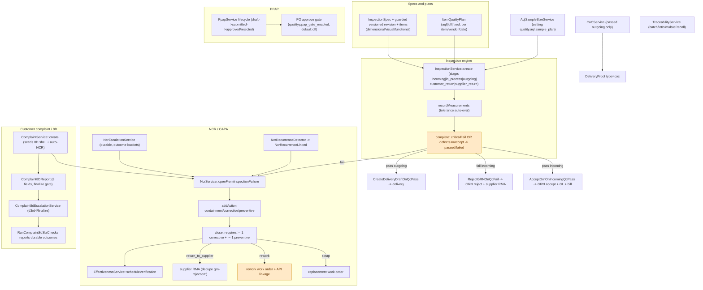

# Quality + Complaint/8D Audit

Date: 2026-09-18

## Re-audit 2026-09-19

Current verdict: **open**.

- Current fixes verified in this worktree: AQL unit counting, 8D failure signaling,
  declared sample enforcement, no-spec outgoing-QC fail-closed behavior, and
  one return inspection per product, PPAP expiry/rejection controls, NCR rework linkage,
  supplier-return fail-closed behavior, spec-revision immutability, and traceability
  gap signaling.
- Current residuals: full sampling is operationally unbounded; calibration is not linked
  to inspection evidence; and several role/configuration, decimal serialization, and
  approval-policy boundaries remain weak.
- `RE-AUDIT-REGISTER-2026-09-19.md` is the canonical cross-module classification.
  This report retains the detailed quality walkthrough and current quality residuals.
  Historical findings must not be read as open when the register marks them fixed.
- Focused verification after the re-audit changes: quality/return tests passed;
  the full repository suite and deployed runtime were not run.
Scope: `api/app/Modules/Quality/` (inspection engine, specs, quality plans, AQL, SPC,
calibration, CoC, traceability, NCR/CAPA, PPAP) and the CRM complaint → NCR → 8D flow.
Claims are marked **[confirmed]** (file:line, seed, or code read) or **[assumption/unverified]**.

---

## 1. Executive summary

Quality is the IATF differentiator and is substantially built: an inspection engine with
versioned spec history, plan-based sampling, AQL 0.65 Level II, a fail-closed incoming QC
gate, NCR/CAPA with durable escalation and recurrence detection, PPAP with an optional PO
gate, CoC generation and lot traceability. The historical AQL and 8D command-health defects
are fixed in the current worktree. The release remains open because full-sampling limits,
calibration evidence, role/configuration drift, decimal serialization, and approval-policy
decisions still have material gaps.

---

## 2. Flow diagram

---

## 3. Walkthrough

### 3.1 Inspection engine — `InspectionService`

- Stages: `incoming | in_process | outgoing | customer_return | supplier_return`.
  `create()` has special handling for outgoing (requires `work_order_output_id`, forces the
  work-order entity and `batchQty = output.good_count`); incoming/in-process/returns default
  to 100% sampling (accept 0), outgoing uses AQL.
- `recordMeasurements()` auto-evaluates tolerance-backed parameters, rejects a manual
  verdict that contradicts the computation, and sets `defect_count` to the number of
  distinct defective sample units.
- `complete()`: `passed = !criticalFail && defects <= accept`; requires every measurement
  resolved and at least the declared number of distinct sample units; on outgoing pass sets
  `accepted_quantity = batch_quantity`; on failure opens an NCR **inside the transaction**
  and emits `InspectionFailed`; otherwise `InspectionPassed`.
- `cancel()` is terminal (0 accepted qty).
- Incoming inspections are auto-created by `TriggerIncomingQC` from the quality plan or a
  fallback verdict; outgoing by `TriggerOutgoingQC` on `WorkOrderCompleted`; in-process by
  `TriggerInProcessQC` on `WorkOrderStatusChanged`.

### 3.2 AQL — `AqlSampleSizeService`

The table lives in setting `quality.aql.sample_plan` (seeded migration `0409`), matching
ANSI/ASQ Z1.4 **AQL 0.65, General Inspection Level II, normal single sampling** (codes G–Q,
overflow Q). `min(sample, batch)` caps oversampling. **Only one table exists**;
`aql_level`/`quality.aql.default_level` are stored and displayed but never used to select a
plan.

### 3.3 Specs and quality plans

- `InspectionSpecService::upsertForProduct` bumps the version, copies old items onto the new
  revision (so history stays readable), and soft-deletes old items. `InspectionSpecRevision`
  is documented immutable but still has no model/DB guard.
- `ItemQualityPlanService` resolves the active plan vendor-specific first then a null-vendor
  fallback for the effective date; `stage` is hardcoded `incoming`.
- Parameter contracts are enforced by DB CHECKs and `UpsertInspectionSpecRequest`
  (dimensional requires nominal + both tolerances; visual forbids numerics; functional
  allows tolerances but not a bare nominal; ≤100 items, unique names).
- Quality-plan routes live under **Inventory** (`/items/{item}/quality-plans`) but are gated
  on `quality.specs.manage`.

### 3.4 SPC, calibration, CoC, traceability

- `SpcService`: Cp/Cpk/capability + histogram; control charts were scoped out. Wired via
  `/quality/spc/*` and the spec SPC endpoint. `stdDev()` is dead.
- `CalibrationService`: create/update/record/recompute with backdating guards; daily
  `calibration:check-due`.
- `CoCService`: eligible only for passed outgoing inspections; re-reads an existing CoC from
  the vault (idempotent); `DeliveryService` already attaches it as a `DeliveryProof` of type
  `coc`. Evidence gates reject no-measurement / unresolved / contradictory / under-sampled.
- `TraceabilityService`: batch/lot/material-lot search and `simulateRecall`; the
  `whereJsonContains` lot query is correctly shaped.

### 3.5 NCR / CAPA

- `NcrSource = inspection_fail | customer_complaint`; `NcrStatus = open|in_progress|closed|cancelled`;
  `NcrDisposition = scrap|rework|use_as_is|return_to_supplier`.
- `openFromInspectionFailure()` is idempotent and race-safe (unique `inspection_id` +
  `QueryException` handler). Severity is critical/high/medium from failure type.
- `close()` requires a disposition and **≥1 corrective and ≥1 preventive action**; it uses
  `->reorder()` before its GROUP BY (the documented PG trap). `scrap`/`rework` on an outgoing
  inspection spawn a work order (`replacement_work_order_id` / `rework_work_order_id`);
  `return_to_supplier` opens a supplier RMA sharing the `grn-rejection:<grn>` dedupe key with
  the GRN rejection path; then schedules effectiveness verification.
- `NcrEscalationService` is hardened: outcome buckets (`considered/advanced/skipped/unstaffed/failed`),
  per-tier idempotency, a durable failure row, and a command that returns `FAILURE` when
  `failed > 0` (`ncr:escalate`, every 15 min).
- `NcrRecurrenceDetector` links same-product/same-signature NCRs in a window and emits
  `NcrRecurrenceLinked`; the outbox event triggers `AutoSpawn8DOnNcrRecurrence`.

### 3.6 Pareto, effectiveness, PPAP

- `DefectParetoService` is wired to `/quality/analytics/*` and a dashboard widget.
- `EffectivenessService`: `pending_verification → effective|ineffective|not_applicable`,
  scheduled on close, verified manually, overdue notifications idempotent; daily
  `ncr:check-effectiveness` (does not catch, so failures exit non-zero).
- `PpapService`: draft→submitted→approved/rejected with SoD and an expiry; the PO-approval
  gate calls `vendorHasActivePpap()` and is **off by default** (`quality.ppap_gate_enabled`).
  Items with no registered PPAP pass.

### 3.7 Customer complaint → NCR → 8D

- `ComplaintService::create()` validates provenance, stamps SLA due dates, **seeds an empty
  8D report**, and auto-creates an NCR; a business failure marks the handoff
  `manual_required` and stages a durable retry event.
- `finalize8D()` requires all 8 D fields; resolve/close require a finalized 8D **and** a
  closed, dispositioned NCR.
- `Complaint8dEscalationService` fires d3/d4/finalize tiers with durable claim/outcome rows;
  the table-name bug and command health signal are fixed (`complaint_8d_escalation_deliveries`,
  non-zero exit on failure).

---

## 4. Branch points

| # | Where | Condition | Paths |
|---|---|---|---|
| B1 | `InspectionService::create` | stage outgoing | requires WO output, AQL / else full batch |
| B2 | `complete` | criticalFail or defects > accept | failed (+NCR) / passed |
| B3 | `createIncomingFromPlan` | sampling aql/full/fixed | AQL accept/reject / accept 0 |
| B4 | `TriggerOutgoingQC` | no active spec | failed handoff / normal |
| B5 | `ItemQualityPlanService::activeFor` | vendor-specific plan exists | use it / null-vendor fallback |
| B6 | incoming QC pass/fail | — | GRN accept + GL + bill / GRN reject + RMA |
| B7 | `NcrService::close` | disposition scrap/rework/return_to_supplier | spawn WO / open RMA |
| B8 | `NcrService::close` | ≥1 corrective + ≥1 preventive | close / refuse |
| B9 | `openSupplierReturnRmaForNcr` | GRN/lineage missing | log-only, still closes / RMA |
| B10 | recurrence detector | same signature in window | link + notify / no link |
| B11 | PPAP PO gate | `quality.ppap_gate_enabled` + registered PPAP | block / pass |
| B12 | complaint create | NCR creation fails business rule | `manual_required` + retry / rollback |
| B13 | 8D escalate | audience empty / throwable | pending / durable failure + non-zero command |

---

## 5. Permission gates

| Action | Permission |
|---|---|
| Inspections view / manage | `quality.inspections.view` / `.manage` |
| Specs view / manage | `quality.specs.view` / `.manage` |
| Quality plans (under Inventory) | read `inventory.view`, write `quality.specs.manage` |
| Calibration view / manage | `quality.calibration.view` / `.manage` |
| NCR view / manage | `quality.ncr.view` / `.manage` |
| PPAP view / manage | `quality.ppap.view` / `.manage` |
| Analytics / traceability / SPC | `quality.view` / `quality.inspections.view` |
| Complaints (all routes incl. read) | `crm.complaints.manage` (no `.view` slug) |
| PPAP PO gate | setting `quality.ppap_gate_enabled` |

---

## 6. Glossary

- **AQL plan** — sampling table keyed to lot size, `Ac`/`Re`; currently one 0.65 Level II table.
- **Versioned spec revision** — parameter set pinned per inspection; immutability is currently
  a convention rather than a database/model invariant.
- **Quality plan** — per item/vendor sampling method + parameters, effective-dated.
- **NCR / CAPA** — non-conformance + corrective/preventive actions; close needs both.
- **Recurrence signature** — hash of the failed measurement tuple or description.
- **PPAP** — Production Part Approval Process; `activeApproved()` = approved and unexpired.
- **CoC** — Certificate of Conformance from passed outgoing measurements.
- **8D** — eight-discipline complaint report; the SLA escalation ledger is the durable side.

---

## 7. Incomplete, inconsistent, dead-ends

All **[confirmed]** unless marked. The AQL unit-counting, 8D command-health,
declared-sample, no-spec fallback, multi-product return, PPAP lifecycle, NCR linkage,
supplier-return closure, revision immutability, and traceability completeness findings from
the historical pass are now closed in the current worktree and covered by regression tests.
The remaining findings are:

1. **`full` sampling is unbounded.** In-process and incoming `full` plans scaffold
   `batch/qty_target × parameters` measurement rows; large WOs remain operationally expensive
   and there is no explicit finite-sampling override for that plan type.
2. **`crm.complaint_8d.notification_roles` references a non-existent role** — seed
   migration `0365` uses `['quality','qc_inspector']`, but `quality` is a **permission
   group**, not a role slug; only `qc_inspector` receives. **(verified)**
3. **NCR tier-3 escalation role is `system_admin`**, against the documented "system_admin is
   IT only, never a business-process approver" policy.
4. **Complaint routes conflate view and manage** under `crm.complaints.manage` (no
   `.view` slug), so only `customer_service_officer` + `system_admin` can even read them.
5. **`InspectionMeasurementResource` emits decimals as floats**, contradicting the repo's
   decimal-as-string rule.
6. **Calibration is not linked to inspection evidence.** An inspection does not retain the
    instrument/calibration record or validity snapshot used for its measurements.
7. **Dead code / stored-but-unused:** `SpcService::stdDev()`;
   `aql_level`/`quality.aql.default_level` never select a table;
   `NcrEscalationService::run()` wrapper; `CustomerComplaint.replacement_work_order_id` and
   `credit_memo_id` never written; `ComplaintStatus::Investigating`/`Cancelled` unreachable;
   stale "Task 66 will call…" CoC comments.
8. **`InspectionStage` enum docstrings swap the supplier/customer return descriptions.**
9. **No approval workflow inside the inspection engine** — completion is single-actor and
   permission-gated (though PPAP has SoD, and the QMS as a whole is IATF-scoped).

---

## 8. Assumptions vs confirmed facts

**Confirmed from code/seed:** the inspection lifecycle and pass/fail math; the AQL table and
its single level; declared sample enforcement; no-spec outgoing-QC fail-closed behavior;
per-product return inspection uniqueness; guarded spec revisioning; quality-plan resolution;
the CoC evidence gates; the NCR/CAPA close rules and the GROUP BY `reorder()`; the hardened
NCR and 8D escalation jobs; PPAP lifecycle and PO gate; archived/dangling trace signaling;
the complaint→NCR→8D flow; and the current residual findings in §7.

**Assumptions / not verified:**

- A1. The focused quality/return regression suites passed after the re-audit changes. The full
  repository suite, deployed scheduler, queue, database state, and external notification
  providers were not verified.
- A2. The SPA quality screens were not inspected.
- A3. Whether `quality.aql.sample_plan`, `quality.ppap_gate_enabled`, SLA role settings and
  other quality settings are populated in every environment was not verified beyond seeds.
- A4. Whether a role/slug literally named `quality` exists outside `RolePermissionSeeder`
  (e.g. a manually created role) is possible; the seed catalog has no such role.
- A5. PPAP expiration legality against IATF rules and the exact 18 AIAG element list were not
  audited field-by-field.
