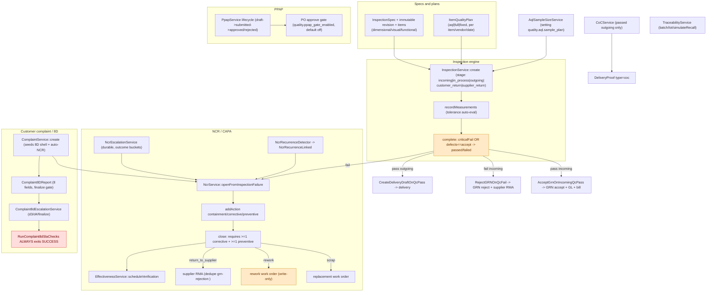

# Quality + Complaint/8D Audit

Date: 2026-09-18
Scope: `api/app/Modules/Quality/` (inspection engine, specs, quality plans, AQL, SPC,
calibration, CoC, traceability, NCR/CAPA, PPAP) and the CRM complaint → NCR → 8D flow.
Claims are marked **[confirmed]** (file:line, seed, or code read) or **[assumption/unverified]**.

---

## 1. Executive summary

Quality is the IATF differentiator and is substantially built: an inspection engine with
immutable spec revisions, plan-based sampling, AQL 0.65 Level II, a fail-closed incoming QC
gate, NCR/CAPA with durable escalation and recurrence detection, PPAP with an optional PO
gate, CoC generation and lot traceability. Two real problems stand out: **AQL semantics are
wrong** (measurement rows, not defective units, are counted against `Ac`), and the
**`crm.complaints`/8D SLA escalation still has the "silent success" dead-subsystem shape**
that the NCR side was hardened against. Multi-product return RMAs also cannot be
dispositioned.

---

## 2. Flow diagram

---

## 3. Walkthrough

### 3.1 Inspection engine — `InspectionService`

- Stages: `incoming | in_process | outgoing | customer_return | supplier_return`.
  `create()` has special handling for outgoing (requires `work_order_output_id`, forces the
  work-order entity and `batchQty = output.good_count`); incoming/in-process/returns default
  to 100% sampling (accept 0), outgoing uses AQL.
- `recordMeasurements()` auto-evaluates tolerance-backed parameters, rejects a manual
  verdict that contradicts the computation, and sets `defect_count = count(is_pass=false)`.
- `complete()`: `passed = !criticalFail && defects <= accept`; requires every measurement
  resolved; on outgoing pass sets `accepted_quantity = batch_quantity`; on failure opens an
  NCR **inside the transaction** and emits `InspectionFailed`; otherwise `InspectionPassed`.
- `cancel()` is terminal (0 accepted qty).
- Incoming inspections are auto-created by `TriggerIncomingQC` from the quality plan or a
  fallback verdict; outgoing by `TriggerOutgoingQC` on `WorkOrderCompleted`; in-process by
  `TriggerInProcessQC` on `WorkOrderStatusChanged`.

### 3.2 AQL — `AqlSampleSizeService`

The table lives in setting `quality.aql.sample_plan` (seeded migration `0409`), matching
ANSI/ASQ Z1.4 **AQL 0.65, General Inspection Level II, normal single sampling** (codes G–Q,
overflow Q). `min(sample, batch)` caps oversampling. **Only one table exists**;
`aql_level`/`quality.aql.default_level` are stored and displayed but never used to select a
plan.

### 3.3 Specs and quality plans

- `InspectionSpecService::upsertForProduct` bumps the version, copies old items onto the new
  revision (so history stays readable), and soft-deletes old items. `InspectionSpecRevision`
  is documented immutable but has no model/DB guard.
- `ItemQualityPlanService` resolves the active plan vendor-specific first then a null-vendor
  fallback for the effective date; `stage` is hardcoded `incoming`.
- Parameter contracts are enforced by DB CHECKs and `UpsertInspectionSpecRequest`
  (dimensional requires nominal + both tolerances; visual forbids numerics; functional
  allows tolerances but not a bare nominal; ≤100 items, unique names).
- Quality-plan routes live under **Inventory** (`/items/{item}/quality-plans`) but are gated
  on `quality.specs.manage`.

### 3.4 SPC, calibration, CoC, traceability

- `SpcService`: Cp/Cpk/capability + histogram; control charts were scoped out. Wired via
  `/quality/spc/*` and the spec SPC endpoint. `stdDev()` is dead.
- `CalibrationService`: create/update/record/recompute with backdating guards; daily
  `calibration:check-due`.
- `CoCService`: eligible only for passed outgoing inspections; re-reads an existing CoC from
  the vault (idempotent); `DeliveryService` already attaches it as a `DeliveryProof` of type
  `coc`. Evidence gates reject no-measurement / unresolved / contradictory / under-sampled.
- `TraceabilityService`: batch/lot/material-lot search and `simulateRecall`; the
  `whereJsonContains` lot query is correctly shaped.

### 3.5 NCR / CAPA

- `NcrSource = inspection_fail | customer_complaint`; `NcrStatus = open|in_progress|closed|cancelled`;
  `NcrDisposition = scrap|rework|use_as_is|return_to_supplier`.
- `openFromInspectionFailure()` is idempotent and race-safe (unique `inspection_id` +
  `QueryException` handler). Severity is critical/high/medium from failure type.
- `close()` requires a disposition and **≥1 corrective and ≥1 preventive action**; it uses
  `->reorder()` before its GROUP BY (the documented PG trap). `scrap`/`rework` on an outgoing
  inspection spawn a work order (`replacement_work_order_id` / `rework_work_order_id`);
  `return_to_supplier` opens a supplier RMA sharing the `grn-rejection:<grn>` dedupe key with
  the GRN rejection path; then schedules effectiveness verification.
- `NcrEscalationService` is hardened: outcome buckets (`considered/advanced/skipped/unstaffed/failed`),
  per-tier idempotency, a durable failure row, and a command that returns `FAILURE` when
  `failed > 0` (`ncr:escalate`, every 15 min).
- `NcrRecurrenceDetector` links same-product/same-signature NCRs in a window and emits
  `NcrRecurrenceLinked`; the outbox event triggers `AutoSpawn8DOnNcrRecurrence`.

### 3.6 Pareto, effectiveness, PPAP

- `DefectParetoService` is wired to `/quality/analytics/*` and a dashboard widget.
- `EffectivenessService`: `pending_verification → effective|ineffective|not_applicable`,
  scheduled on close, verified manually, overdue notifications idempotent; daily
  `ncr:check-effectiveness` (does not catch, so failures exit non-zero).
- `PpapService`: draft→submitted→approved/rejected with SoD and an expiry; the PO-approval
  gate calls `vendorHasActivePpap()` and is **off by default** (`quality.ppap_gate_enabled`).
  Items with no registered PPAP pass.

### 3.7 Customer complaint → NCR → 8D

- `ComplaintService::create()` validates provenance, stamps SLA due dates, **seeds an empty
  8D report**, and auto-creates an NCR; a business failure marks the handoff
  `manual_required` and stages a durable retry event.
- `finalize8D()` requires all 8 D fields; resolve/close require a finalized 8D **and** a
  closed, dispositioned NCR.
- `Complaint8dEscalationService` fires d3/d4/finalize tiers with durable claim/outcome rows;
  the table-name bug is fixed (`complaint_8d_escalation_deliveries`), but the command's
  health signal is not (see §7).

---

## 4. Branch points

| # | Where | Condition | Paths |
|---|---|---|---|
| B1 | `InspectionService::create` | stage outgoing | requires WO output, AQL / else full batch |
| B2 | `complete` | criticalFail or defects > accept | failed (+NCR) / passed |
| B3 | `createIncomingFromPlan` | sampling aql/full/fixed | AQL accept/reject / accept 0 |
| B4 | `TriggerOutgoingQC` | no active spec | bare inspection fallback (no scaffold) / normal |
| B5 | `ItemQualityPlanService::activeFor` | vendor-specific plan exists | use it / null-vendor fallback |
| B6 | incoming QC pass/fail | — | GRN accept + GL + bill / GRN reject + RMA |
| B7 | `NcrService::close` | disposition scrap/rework/return_to_supplier | spawn WO / open RMA |
| B8 | `NcrService::close` | ≥1 corrective + ≥1 preventive | close / refuse |
| B9 | `openSupplierReturnRmaForNcr` | GRN/lineage missing | log-only, still closes / RMA |
| B10 | recurrence detector | same signature in window | link + notify / no link |
| B11 | PPAP PO gate | `quality.ppap_gate_enabled` + registered PPAP | block / pass |
| B12 | complaint create | NCR creation fails business rule | `manual_required` + retry / rollback |
| B13 | 8D escalate | audience empty / throwable | pending (no alert) / recordFailure → `[]` |

---

## 5. Permission gates

| Action | Permission |
|---|---|
| Inspections view / manage | `quality.inspections.view` / `.manage` |
| Specs view / manage | `quality.specs.view` / `.manage` |
| Quality plans (under Inventory) | read `inventory.view`, write `quality.specs.manage` |
| Calibration view / manage | `quality.calibration.view` / `.manage` |
| NCR view / manage | `quality.ncr.view` / `.manage` |
| PPAP view / manage | `quality.ppap.view` / `.manage` |
| Analytics / traceability / SPC | `quality.view` / `quality.inspections.view` |
| Complaints (all routes incl. read) | `crm.complaints.manage` (no `.view` slug) |
| PPAP PO gate | setting `quality.ppap_gate_enabled` |

---

## 6. Glossary

- **AQL plan** — sampling table keyed to lot size, `Ac`/`Re`; currently one 0.65 Level II table.
- **Immutable spec revision** — versioned parameter set pinned per inspection (convention).
- **Quality plan** — per item/vendor sampling method + parameters, effective-dated.
- **NCR / CAPA** — non-conformance + corrective/preventive actions; close needs both.
- **Recurrence signature** — hash of the failed measurement tuple or description.
- **PPAP** — Production Part Approval Process; `activeApproved()` = approved and unexpired.
- **CoC** — Certificate of Conformance from passed outgoing measurements.
- **8D** — eight-discipline complaint report; the SLA escalation ledger is the durable side.

---

## 7. Incomplete, inconsistent, dead-ends

All **[confirmed]** unless marked.

1. **8D SLA escalation is still a silent-success dead subsystem.** `RunComplaint8dSlaChecks`
   always returns `self::SUCCESS` (`:26`) and `Complaint8dEscalationService` catches
   `Throwable` → `recordFailure` + `Log::warning` + `return []` (`:250-258`). If every
   candidate throws, the command prints `d3=0 d4=0 finalize=0` and exits 0 — indistinguishable
   from idle. The NCR escalation side was hardened with `runWithOutcome()` and a non-zero
   exit; the 8D side was not. **(verified)**
2. **AQL semantics are wrong.** `InspectionService::complete()` counts `is_pass=false`
   **measurement rows** against `Ac`, so one part failing three dimensions counts as three
   defects; and `accepted_quantity` is set to the **full batch** on any outgoing pass
   regardless of the sample/defects (`:597-599`), which feeds delivery reservations.
3. **Multi-product return RMAs cannot be dispositioned.** `create()`'s non-outgoing
   idempotency key omits `product_id`, so a second product silently reuses the first
   product's inspection; the DB partial unique index also forbids per-product return
   inspections. `ensureReturnInspectionsReady` then blocks disposition (documented in
   `ReturnRequestScenarioTest`).
4. **`full` sampling is unbounded.** In-process and incoming `full` plans scaffold
   `batch/qty_target × parameters` measurement rows and `complete()` refuses until every row
   is resolved; there is no endpoint to lower `sample_size`, so large WOs are effectively
   uncompletable (contradicts the inline comments).
5. **`TriggerOutgoingQC` no-spec fallback creates an inspection with no measurement
   scaffold**, which `complete()` then rejects for having no rows.
6. **`crm.complaint_8d.notification_roles` references a non-existent role** — seed
   migration `0365` uses `['quality','qc_inspector']`, but `quality` is a **permission
   group**, not a role slug; only `qc_inspector` receives. **(verified)**
7. **`PpapService::expireOverdue()` has no caller and no scheduled command** — approved
   PPAPs are never marked expired (the PO gate still evaluates `expires_at`, but the
   operational surfacing is missing); it also bulk-updates, bypassing `HasAuditLog`.
8. **`PpapService::reject()` can flip an already `approved` submission** while
   `updateElement()` explicitly freezes approved evidence — inconsistent.
9. **`AutoSpawn8DOnNcrRecurrence` is effectively a no-op** for API-created complaints because
   `ComplaintService::create()` already seeds the 8D shell; it only fires for imports/portal.
10. **`NcrService` rework WO is write-only** — `rework_work_order_id` is created on close but
    never eager-loaded or exposed by `show()`/`NcrResource`.
11. **`return_to_supplier` can close without an RMA** — `openSupplierReturnRmaForNcr` logs
    and returns when lineage/config is missing, deliberately not failing the close.
12. **NCR tier-3 escalation role is `system_admin`**, against the documented "system_admin is
    IT only, never a business-process approver" policy.
13. **Complaint routes conflate view and manage** under `crm.complaints.manage` (no
    `.view` slug), so only `customer_service_officer` + `system_admin` can even read them.
14. **`InspectionMeasurementResource` emits decimals as floats**, contradicting the repo's
    decimal-as-string rule.
15. **Dead code / stored-but-unused:** `SpcService::stdDev()`;
    `aql_level`/`quality.aql.default_level` never select a table;
    `NcrEscalationService::run()` wrapper; `CustomerComplaint.replacement_work_order_id` and
    `credit_memo_id` never written; `ComplaintStatus::Investigating`/`Cancelled` unreachable;
    stale "Task 66 will call…" CoC comments.
16. **`InspectionStage` enum docstrings swap the supplier/customer return descriptions.**
17. **No approval workflow inside the inspection engine** — completion is single-actor and
    permission-gated (though PPAP has SoD, and the QMS as a whole is IATF-scoped).

---

## 8. Assumptions vs confirmed facts

**Confirmed from code/seed:** the inspection lifecycle and pass/fail math; the AQL table and
its single level; spec revisioning and contracts; quality-plan resolution; the CoC evidence
gates; the NCR/CAPA close rules and the GROUP BY `reorder()`; the hardened NCR escalation
and recurrence jobs; PPAP lifecycle and PO gate; the complaint→NCR→8D flow; the two
dead-subsystem/config findings in §7.1/§7.6; and the rest of §7.

**Assumptions / not verified:**

- A1. No test suite or live database was run for this audit; findings are from source/seed
  inspection. The 8D silent-success behavior is read from code, not executed.
- A2. The SPA quality screens were not inspected.
- A3. Whether `quality.aql.sample_plan`, `quality.ppap_gate_enabled`, SLA role settings and
  other quality settings are populated in every environment was not verified beyond seeds.
- A4. Whether a role/slug literally named `quality` exists outside `RolePermissionSeeder`
  (e.g. a manually created role) is possible; the seed catalog has no such role.
- A5. PPAP expiration legality against IATF rules and the exact 18 AIAG element list were not
  audited field-by-field.
