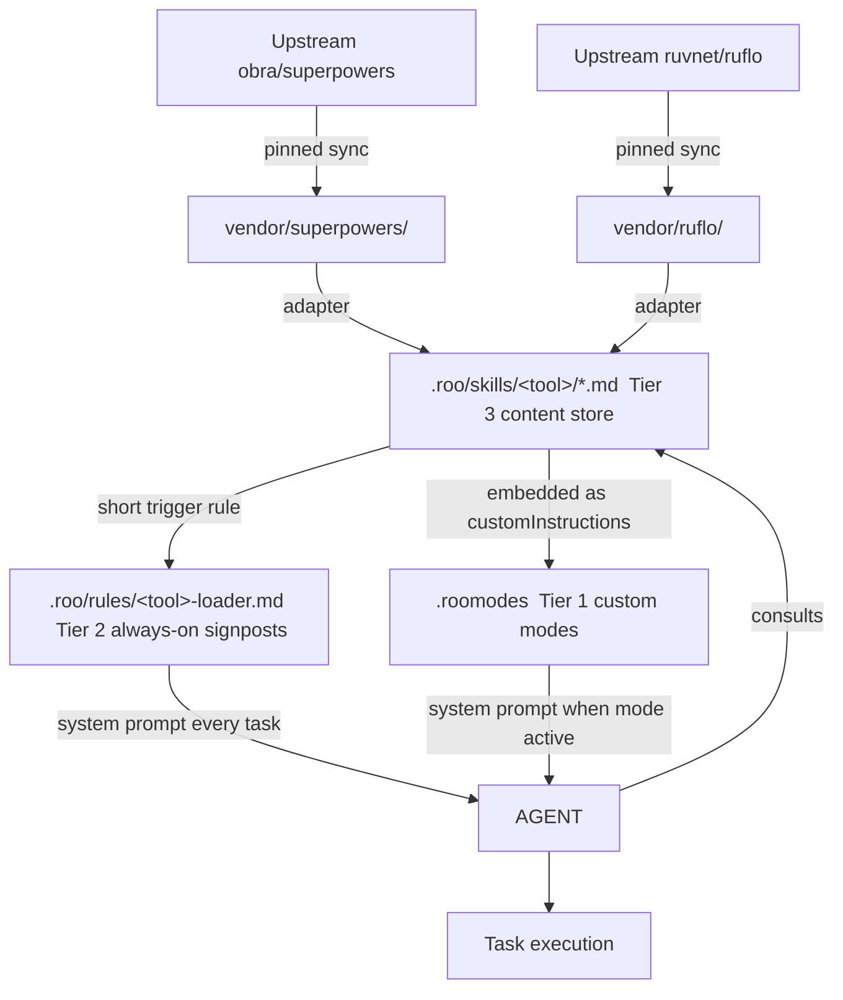

# Integrating `obra/superpowers` and `ruvnet/ruflo` into the kwatog Roo sandbox

## 1. Goal

Make external agent-tooling repositories ([`obra/superpowers`](https://github.com/obra/superpowers), [`ruvnet/ruflo`](https://github.com/ruvnet/ruflo)) **reliably usable** inside this Roo-driven sandbox - per task or per conversation - **without** per-task installation and **without** depending on the ephemeral container.

"Reliably usable" is the critical phrase. See Section 3.

## 2. Background / Reality Check

### `obra/superpowers`

A Claude Code plugin: `.claude-plugin/plugin.json` manifest plus a `skills/` directory of folders, each with a `SKILL.md` (front-matter + procedural instructions) and optional `commands/`, `agents/`, `hooks/` aimed at Claude Code's runtime.

It is **not a CLI** - it's prompt/process content an AI agent loads on demand. SKILL.md uses Claude Code tool names (`Read`, `Edit`, `Bash`); Roo's equivalents are `read_file`, `edit`, `execute_command`. A thin adaptation layer is required.

### `ruvnet/ruflo`

Lower confidence; characterized in Phase 0. Possible shapes:

| Possible shape of ruflo | Integration path |
|---|---|
| Markdown prompt / skill / workflow library | Same vendoring pattern as superpowers |
| Node/Rust CLI tool | Pinned install script + thin Roo wrapper rule |
| Agent orchestration framework requiring its own runtime | Document-only; port reusable prompt assets only; do not embed runtime |
| Mix | Selective application |

### Sandbox constraints

- Container is ephemeral; nothing uncommitted survives.
- No long-running or interactive processes.
- All persistent changes land via feature branch + PR.
- Roo supports `.roo/rules/`, custom modes (`.roomodes`), and a `skill` tool (but the latter only surfaces skills listed in the system prompt's "AVAILABLE SKILLS" section, which repo-local `.roo/skills/` files do **not** auto-populate).

## 3. Adherence Reality - the honest part

How Roo actually loads things determines whether vendored skills will *actually be used*:

| Mechanism | Auto-loaded? | Adherence likelihood |
|---|---|---|
| `.roomodes` custom modes (mode-specific instructions become part of system prompt) | Yes when switched into | **Highest** - strongest enforcement vector |
| `.roo/rules/*.md` (repo-local) and `~/.roo/rules/*.md` (user-global) | Yes, every task | **High** - I see them in every system prompt |
| `.roo/skills/*.md` (repo-local files) | **No** - just files until something tells me to read them | **Low** unless signposted by a rule or mode |
| `vendor/<tool>/` raw upstream | No | None - I will not browse it on my own |

Even with Tiers 1 and 2 in place, agent adherence to procedural guidance is **probabilistic, not deterministic**:

- Inside a custom mode: very strong adherence (system-prompt level).
- With short, trigger-explicit always-on rules: most of the time when the trigger matches.
- Long multi-step skills: drift is real. Mitigated by short imperative rule wording and periodic re-grounding inside the skill text.

**No mechanism is "guaranteed."** Mode switching is the only one that approaches enforcement. The plan therefore leans on modes for must-use workflows.

## 4. Three-Tier Architecture (revised)



**Tier 1 - Custom modes (primary vector for must-use workflows).** Embed the skill's procedural content as `customInstructions`. When the user switches into the mode, the workflow becomes part of my system prompt for the whole task.

**Tier 2 - Always-on rules (signposts, not full content).** Short, imperative entries in `.roo/rules/<tool>-loader.md` that name explicit triggers, e.g.:

> When the task involves writing new functionality with non-trivial logic, consult `.roo/skills/superpowers/tdd.md` before writing code.

Keep each entry to a few lines. Adds minimal context overhead on every task.

**Tier 3 - Skill files (canonical content store).** Full adapted skill text under `.roo/skills/<tool>/`. Both modes and rules point here so content lives in one place.

## 5. Repo Layout

```
.roo/
  skills/
    superpowers/
      INDEX.md
      tdd.md
      debugging.md
      root-cause-analysis.md
      code-review.md
      brainstorming.md
      ...
    ruflo/
      INDEX.md
      <ported assets, TBD after Phase 0>
  rules/
    superpowers-loader.md
    ruflo-loader.md
.roomodes                       # adds superpowers-tdd, superpowers-debug, ruflo-sparc, etc.
vendor/
  superpowers/   # pinned snapshot
  ruflo/         # pinned snapshot
scripts/
  sync-superpowers.sh
  sync-ruflo.sh
  list-skills.sh
  install-ruflo.sh             # only if Phase 0 confirms ruflo is a CLI worth invoking
docs/
  SUPERPOWERS.md
  RUFLO.md
  AGENT-TOOLS-ADHERENCE.md     # documents the three-tier model and its limits
```

## 6. Adaptation Rules (upstream -> Roo)

When converting any `SKILL.md` (or equivalent):

1. Strip Claude-Code-only front-matter; keep `name`, `description`, `when_to_use`.
2. Rewrite tool references: `Read` -> `read_file`, `Edit`/`Write` -> `edit`/`write_to_file`, `Bash` -> `execute_command`, `Grep`/`Glob` -> `search_files`/`list_files`.
3. Replace plugin-specific paths (`${CLAUDE_PLUGIN_ROOT}`, ruflo-internal paths) with repo-relative paths.
4. Preserve procedural content verbatim where possible.
5. Record provenance at top: `Source: <owner/repo> @ <commit-sha>, asset: <name>`.
6. Skills depending on Claude Code hooks/agents/commands or ruflo runtimes we cannot embed are skipped and listed in `INDEX.md` under "Not ported" with a one-line reason.

## 7. Curated Initial Set

### `superpowers` -> Tier 1 modes (must-use)

- `superpowers-tdd`
- `superpowers-debug`

### `superpowers` -> Tier 2/3 (consultable)

- Code review checklist
- Root-cause analysis
- Brainstorming / requirements elicitation
- Refactoring safety net
- Commit message / PR description

### `ruflo` -> TBD after Phase 0

If ruflo follows `ruvnet`'s pattern (e.g. SPARC), strong candidate for a `ruflo-sparc` Tier 1 mode. Otherwise port reusable prompts as Tier 2/3.

## 8. Per-Task vs Recurring Usage

**Recurring task types (high adherence):** user switches to `superpowers-tdd` / `superpowers-debug` / `ruflo-sparc`. Workflow enforced via mode-specific instructions.

**Ad hoc:** user says "use the X skill" -> agent reads `.roo/skills/<tool>/<skill>.md`. Or trigger rule fires implicitly when the task pattern matches.

**Discovery:** `bash scripts/list-skills.sh` prints available skills with descriptions.

## 9. Risks & Mitigations

| Risk | Mitigation |
|------|-----------|
| Adherence drift over long tasks | Prefer mode switching for must-use workflows; keep rule entries short and trigger-explicit |
| Context bloat from too many always-on rules | Keep loader rules to a single page total; full content stays in `.roo/skills/` (Tier 3) |
| Upstream license incompatibility | Verify each LICENSE in Phase 0; abort vendoring if incompatible; record SPDX in `INDEX.md` |
| Conflicts with existing kwatog `.roo/rules/` | Curate; explicit conflict notes; project rules win |
| Drift from upstream | Pinned SHA per vendor; quarterly sync via script; diff before merging |
| ruflo requires a runtime we cannot embed | Documentation-only fallback; port reusable prompts only |
| Two vendors evolving at different cadences | Independent sync scripts and SHAs; per-tool PRs |
| Ephemeral container loses everything | All content vendored; never rely on runtime `git clone` for skill content |

## 10. Implementation Plan

### Phase 0 - Reconnaissance

- [ ] Clone both upstream repos into a scratch dir
- [ ] Inventory each: skill/prompt assets, CLIs, hooks, agents, runtime requirements
- [ ] Verify LICENSE for each; record SPDX
- [ ] Classify ruflo (skill-library / CLI / agent-framework / mixed); choose integration path
- [ ] Update Section 7 with the confirmed `ruflo` curated set

### Phase 1 - Vendoring scaffold

- [ ] Create feature branch `feat/agent-tools-integration`
- [ ] Add `vendor/superpowers/` and `vendor/ruflo/` as pinned snapshots (`UPSTREAM_SHA` files)
- [ ] Add `scripts/sync-superpowers.sh`, `scripts/sync-ruflo.sh`, `scripts/list-skills.sh`
- [ ] If applicable: `scripts/install-ruflo.sh` (pinned, idempotent, non-interactive)

### Phase 2 - Adapter and Tier 3 content

- [ ] Implement adapter (Node or shell+sed) applying Section 6 rules
- [ ] Port curated `superpowers` set into `.roo/skills/superpowers/`
- [ ] Port curated `ruflo` set into `.roo/skills/ruflo/` (if applicable)
- [ ] Generate `INDEX.md` per vendor (ported, skipped, reasons)

### Phase 3 - Tier 2 rules

- [ ] Author `.roo/rules/superpowers-loader.md` with short trigger-explicit entries
- [ ] Author `.roo/rules/ruflo-loader.md` similarly
- [ ] Total combined size budget: ~100 lines max to limit context overhead

### Phase 4 - Tier 1 custom modes

- [ ] Add `superpowers-tdd` and `superpowers-debug` to `.roomodes` with skill content as `customInstructions`
- [ ] Add `ruflo-sparc` (or equivalent) if Phase 0 supports it
- [ ] Document mode triggers and scopes (file restrictions if any)

### Phase 5 - Validation (the honesty test)

- [ ] **Adherence test 1:** Run a debugging task in default mode. Without being told, do I consult `.roo/skills/superpowers/debugging.md`? If no, strengthen Tier 2 rule wording.
- [ ] **Adherence test 2:** Switch to `superpowers-tdd` mode and run a feature task. Verify red-green-refactor steps are followed.
- [ ] **Adherence test 3:** Run a task with a deliberately tempting shortcut. Does the rule still hold?
- [ ] Capture findings in [`docs/AGENT-TOOLS-ADHERENCE.md`](docs/AGENT-TOOLS-ADHERENCE.md); iterate on rule wording or promote skills to modes if adherence is weak.

### Phase 6 - PR and rollout

- [ ] Open PR `feat/agent-tools-integration` with summary, attributions, license notes, and adherence test results
- [ ] After merge, available across all future tasks/conversations with zero install

### Phase 7 - Maintenance

- [ ] Periodic sync per vendor; diff; bump pinned SHAs via PR
- [ ] Track adherence regressions in [`docs/AGENT-TOOLS-ADHERENCE.md`](docs/AGENT-TOOLS-ADHERENCE.md) and adjust

## 11. What I Will NOT Do

- Install superpowers as a Claude Code plugin (this is Roo).
- Embed a ruflo runtime if Phase 0 shows it conflicts with sandbox constraints.
- Auto-execute vendored content without user opt-in.
- Run long-lived processes or modify global system state.
- Vendor assets depending on hooks/agents/commands or runtimes we cannot honor (marked "Not ported").
- Promise deterministic adherence. The plan optimizes adherence; it cannot guarantee it.

## 12. Open Questions

1. Confirm three-tier model (modes + rules + skills) over a flat `.roo/skills/`-only approach.
2. For superpowers: confirm `superpowers-tdd` and `superpowers-debug` as Tier 1 modes; any others?
3. For ruflo: any prior knowledge that should override Phase 0 classification?
4. Sync cadence per vendor: pin once, or quarterly sync?
5. License posture: which licenses are acceptable for vendoring (MIT/Apache only, or also GPL family)?
6. Are you okay with the small permanent context overhead of Tier 2 rules (~100 lines added to every task's system prompt)?
