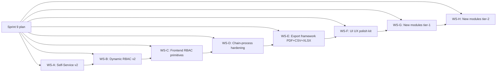

# Kwatog ERP — Sprint 9 Plan
## Self-Service v2, Dynamic RBAC, Chain-Process Hardening, PDF/CSV Export Overhaul, UI/UX Polish, and New Modules

**Repository:** `kwat0g/kwatog`
**Last migration on `main`:** verify with `ls api/database/migrations | tail -1`. New migrations in this sprint start at the next `0NNN`.
**Mandatory references already in scope:** [`CLAUDE.md`](CLAUDE.md:1), [`docs/PATTERNS.md`](docs/PATTERNS.md:1), [`docs/SCHEMA.md`](docs/SCHEMA.md:1), [`docs/SEEDS.md`](docs/SEEDS.md:1), [`docs/DESIGN-SYSTEM.md`](docs/DESIGN-SYSTEM.md:1), [`docs/QA-MATRIX.md`](docs/QA-MATRIX.md:1).
**Discipline:** Every workstream below is strict TDD ([`.roo/skills/superpowers/test-driven-development.md`](.roo/skills/superpowers/test-driven-development.md:1)). **Iron Law: no production code without a failing test first.** Quality gate ([`.roo/skills/kwatog/code-quality-gate.md`](.roo/skills/kwatog/code-quality-gate.md:1)) must pass before claiming completion of any workstream.

---

## 0. Current state (audit, do not skip)

What already exists and we will *not* duplicate:

- `users.employee_id` FK exists on the `users` table; payroll/leave/OT services already filter by `auth()->user()->employee_id`.
- Self-Service portal scaffolded at [`spa/src/pages/self-service/`](spa/src/pages/self-service): `index.tsx`, `dtr.tsx`, `leave.tsx`, `payslips.tsx`, `me.tsx`, `notification-preferences.tsx`. Layout is [`spa/src/layouts/SelfServiceLayout.tsx`](spa/src/layouts/SelfServiceLayout.tsx).
- Chain-process automation A1–A10 already planned in [`plans/ogami-erp-tasks-a1-a10-automation-execution-plan.md`](plans/ogami-erp-tasks-a1-a10-automation-execution-plan.md) (some shipped: `MrpRun`, `Alert`, `DeliveryConfirmed → AutoInvoice`, `CheckReorderPoint`, `HandleMachineBreakdown`).
- RBAC: `roles`, `permissions`, `role_permissions`, `users.role_id`, `users.permission_slugs` cache, [`User::hasPermission`](api/app/Modules/Auth/Models/User.php:87), system_admin bypass, admin role pages [`spa/src/pages/admin/roles/index.tsx`](spa/src/pages/admin/roles/index.tsx) and `permissions.tsx`, frontend [`PermissionGuard`](spa/src/components/guards/PermissionGuard.tsx:1), `usePermission` hook used in 179 spots.
- Exports today: payslip PDF ([`PayslipPdfService`](api/app/Modules/Payroll/Services/PayslipPdfService.php:1)), audit-log CSV ([`AuditLogController`](api/app/Modules/Admin/Controllers/AuditLogController.php:1)), bank file ([`BankFileService`](api/app/Modules/Payroll/Services/BankFileService.php:1)), financial-statement CSV ([`FinancialStatementController`](api/app/Modules/Accounting/Controllers/FinancialStatementController.php:1)). Most other list pages have **no export**.

What is missing or weak (the targets of this sprint):

1. **Self-Service v2** — no employee-driven user-account creation, no profile edit / address change / dependents / 201-file viewer / OT request / certificate-of-employment request / payslip e-signature / mobile responsiveness audit.
2. **Dynamic RBAC** — admin can list and toggle role permissions, but cannot **create**, **clone**, or **archive** custom roles, cannot define **role scope** (dept / branch), cannot enforce **segregation-of-duties** rules, cannot expire role assignments, cannot view assignment history.
3. **Frontend RBAC** — `PermissionGuard` only renders an `EmptyState`; there is no centralized hook to compute sidebar visibility from `permission_slugs`, no `<Can>` declarative component, no SoD client-side enforcement, no "permission denied" route page, and `Sidebar.tsx` likely hardcodes module visibility.
4. **Chain-process automation** — A4 (delivery → invoice) and A6 (auto-NCR) ship, but there is **no centralized chain registry** describing every chain, no **dry-run preview** before triggering side-effects, no **rollback / reverse-transition** flow, no **failed-job retry UI**, no **manual override with reason capture**, and chain status visualization is one-off per page.
5. **PDF & CSV export** — only payslip + audit-log + financials. No system-wide export framework; no XLSX support; no large-export queueing; no scheduled exports; no CONFIDENTIAL watermark / digital signature on most PDFs; no consistent letterhead component.
6. **UI / UX polish** — `CommandPalette.tsx` exists but is not wired everywhere; toast system is ad hoc; mobile responsiveness has not been audited; no global keyboard-shortcut help; breadcrumbs inconsistent; empty / error states are not uniform.
7. **New modules** — Employee onboarding, performance reviews, training & certifications, expense claims & reimbursements, petty-cash, timesheet approval, asset assignment to employee, helpdesk tickets, internal announcements, document management, vendor portal stub, customer portal stub, bank reconciliation, budgeting, multi-currency.

---

## 1. Workstreams (independent, parallelizable in execution)

Each workstream is broken into phases. Each phase begins with **failing tests** before any production code (TDD Iron Law).

---

## WS-A — Self-Service v2

**Goal:** Make the employee portal a real self-service hub, not a payslip viewer.

### A.1 Account creation linked to employee

**Backend** (`api/app/Modules/Auth/`)

| Order | File | Notes |
|---|---|---|
| 1 | `tests/Feature/Auth/CreateEmployeeAccountTest.php` | RED. Cases: (a) HR with `auth.users.create` can issue invite for an employee with no user; (b) cannot invite if employee already linked; (c) invite token expires after 72 h; (d) accepting invite forces password set + confirms email; (e) accepting invite assigns role from `position.default_role_id`; (f) audit-log entry written. |
| 2 | `database/migrations/0NNN_create_user_invites_table.php` | `id`, `employee_id` FK unique, `email`, `token` 64 hex unique, `role_id` FK nullable, `expires_at`, `used_at` nullable, `invited_by` FK users, timestamps. |
| 3 | `database/migrations/0NNN_add_default_role_to_positions.php` | `default_role_id` FK roles nullable. |
| 4 | `Auth/Models/UserInvite.php` (HasHashId), `Auth/Services/UserInviteService.php` (`invite`, `accept`, `revoke`), `Auth/Notifications/UserInviteEmail.php`. |
| 5 | `Auth/Controllers/UserInviteController.php` (`store`, `accept`, `revoke`), `Auth/Requests/CreateUserInviteRequest.php`, `Auth/Requests/AcceptUserInviteRequest.php`. |
| 6 | Routes in [`api/app/Modules/Auth/routes.php`](api/app/Modules/Auth/routes.php:1): `POST /auth/invites`, `POST /auth/invites/accept`, `DELETE /auth/invites/{invite}`. |
| 7 | Permissions seed: `auth.users.create`, `auth.users.invite`, `auth.users.revoke`. |

**Frontend** (`spa/src/pages/admin/users/`)

| Order | File | Notes |
|---|---|---|
| 1 | `spa/src/pages/admin/users/index.tsx` (new) | List of users with role + linked employee + status (active / locked / pending invite). |
| 2 | `spa/src/pages/admin/users/invite.tsx` (new) | Form to invite an employee who has no `user_id`. Auto-suggest from `employees` API (filter `where_user_is_null=1`). |
| 3 | `spa/src/pages/auth/accept-invite.tsx` (new, public) | Token in URL; password + confirmation; on submit → login. |
| 4 | Edit [`spa/src/pages/hr/employees/detail.tsx`](spa/src/pages/hr/employees/detail.tsx:1) | New "User account" panel: shows linked user or "Invite to portal" button gated by `auth.users.invite`. |

### A.2 Profile self-edit

| Order | File | Notes |
|---|---|---|
| 1 | `tests/Feature/SelfService/UpdateProfileTest.php` | RED. Employee can edit only: contact-no, personal-email, current-address; not name / DOB / SSS / TIN / salary. Edits go through `EmployeeProfileChangeRequest` workflow needing HR approval. |
| 2 | `database/migrations/0NNN_create_employee_profile_change_requests_table.php` | id, `employee_id`, `field`, `old_value`, `new_value`, `status` enum draft/pending/approved/rejected, `submitted_at`, `reviewed_by`, `reviewed_at`, `reason`, timestamps. |
| 3 | `HR/Models/EmployeeProfileChangeRequest.php`, `HR/Services/EmployeeProfileChangeService.php` (`submit`, `approve`, `reject`). |
| 4 | `HR/Controllers/SelfServiceProfileController.php` `index` (mine), `store` (submit). HR-side endpoints `index` (queue), `approve`, `reject`. |
| 5 | Frontend: `spa/src/pages/self-service/profile.tsx` (new), `spa/src/pages/hr/profile-changes/index.tsx` (new HR queue). |

### A.3 Self-service overtime, certificate-of-employment, document requests

| Order | File | Notes |
|---|---|---|
| 1 | `tests/Feature/SelfService/OvertimeRequestTest.php` | RED. Employee can submit OT for a future date; cannot for past date > 3 days; goes through department-head approval. |
| 2 | Reuse existing `attendance/overtime` module — add `mode=self` flow. Seed `attendance.overtime.request` permission to all `*_employee` roles. |
| 3 | `tests/Feature/SelfService/CoeRequestTest.php` | RED. Employee requests COE → HR generates via existing PDF service → notifies requester. |
| 4 | `database/migrations/0NNN_create_document_requests_table.php` | id, `employee_id`, `document_type` enum (coe, coe_with_compensation, payslip_reissue, employment_contract_copy), `purpose`, `status`, `pdf_path` nullable, `processed_by`, timestamps. |
| 5 | `HR/Services/DocumentRequestService.php`, `HR/Services/CoeGenerator.php` (Blade `resources/views/pdf/coe.blade.php`). |
| 6 | Frontend: `spa/src/pages/self-service/documents.tsx`, HR queue at `spa/src/pages/hr/document-requests/index.tsx`. |

### A.4 201-file viewer + payslip e-signature

| Order | File | Notes |
|---|---|---|
| 1 | `tests/Feature/SelfService/MyDocumentsTest.php` | RED. Employee sees only their own attachments; cannot see other employees'. |
| 2 | Reuse existing `employee_attachments` (verify in [`docs/SCHEMA.md`](docs/SCHEMA.md:1)); add `is_employee_visible` boolean. |
| 3 | `spa/src/pages/self-service/my-documents.tsx`. |
| 4 | `tests/Feature/SelfService/PayslipAcknowledgeTest.php` | RED. Employee acks payslip → `payroll_payslip_acks` row inserted; HR sees ack count per period. |
| 5 | `database/migrations/0NNN_create_payroll_payslip_acks_table.php` | unique(`payroll_id`,`employee_id`), `acknowledged_at`, `ip_address`, `user_agent`. |
| 6 | Edit [`spa/src/pages/self-service/payslips.tsx`](spa/src/pages/self-service/payslips.tsx) — "I acknowledge receipt" button. |

### A.5 Mobile responsiveness audit (self-service only)

- Viewport pass at 375 × 812 (iPhone SE+) and 412 × 915 (Pixel 7) on every self-service page.
- Acceptance: no horizontal scroll, primary actions reachable with thumb, payslip table swipes horizontally inside a scroll-container, not the page.

---

## WS-B — Dynamic RBAC v2

**Goal:** Admins can build new roles without code changes, scope assignments, and audit them.

### B.1 Custom role CRUD + clone + archive

| Order | File | Notes |
|---|---|---|
| 1 | `tests/Feature/Admin/RoleCrudTest.php` | RED. Cases: (a) create role with permission set; (b) cannot delete `system_admin`; (c) cannot delete role with users assigned (force `archive`); (d) clone role copies permissions; (e) archive sets `is_archived=1` and removes from assignment dropdowns; (f) updating role flushes `auth:permissions:*` cache for every user with that role. |
| 2 | `database/migrations/0NNN_add_archive_to_roles.php` | `is_archived` bool, `archived_at` ts, `cloned_from_role_id` nullable. |
| 3 | Extend [`Admin/Services/RoleService.php`](api/app/Modules/Admin/Services/RoleService.php:1) — `create`, `clone(Role $r)`, `archive(Role $r)`, `flushCacheForRoleUsers(Role $r)`. |
| 4 | Extend [`Admin/Controllers/RoleController.php`](api/app/Modules/Admin/Controllers/RoleController.php:1) — `store`, `update`, `destroy` (= archive when has users), `clone` action. |
| 5 | Frontend: edit [`spa/src/pages/admin/roles/index.tsx`](spa/src/pages/admin/roles/index.tsx) — add "New Role", "Clone", "Archive" actions. New form page `spa/src/pages/admin/roles/create.tsx` + `edit.tsx` (shared `form.tsx`). |

### B.2 Role scope (dept / branch / company)

| Order | File | Notes |
|---|---|---|
| 1 | `tests/Feature/Admin/RoleScopeTest.php` | RED. Cases: (a) dept-scoped role assignment; user with dept-scoped `hr.employees.view` only sees employees in their dept; (b) `system_admin` bypass works; (c) listing endpoint applies scope automatically. |
| 2 | `database/migrations/0NNN_create_user_role_assignments_table.php` | Replaces direct `users.role_id` for multi-role support: `user_id`, `role_id`, `scope_type` enum (`global`,`department`,`branch`), `scope_id` nullable, `effective_from`, `effective_to` nullable, timestamps. **Backfill** existing `users.role_id` rows. |
| 3 | `Auth/Services/RoleScopeService.php` — `userRolesActiveAt(User, Carbon)`, `applyScope(Builder, string $resource, User)`. |
| 4 | Extend [`User::hasPermission`](api/app/Modules/Auth/Models/User.php:87) to also accept optional `?Model $entity` and check scope. |
| 5 | Update key list services to call `RoleScopeService::applyScope(...)` (HR employees, payroll, attendance, leave, OT — phase-1; everything else can be additive in a follow-up). |

### B.3 Segregation of duties (SoD)

| Order | File | Notes |
|---|---|---|
| 1 | `tests/Feature/Admin/SodTest.php` | RED. Define rules in `database/seeders/SodRuleSeeder.php` (e.g. cannot have both `purchasing.po.approve` AND `accounting.bills.approve`). Saving a role that violates a rule → 422 with rule name. |
| 2 | `database/migrations/0NNN_create_sod_rules_table.php` | `id`, `name`, `description`, `permission_a`, `permission_b`, `severity` (block/warn), `is_active`. |
| 3 | `Admin/Services/SodRuleService.php` — `validateRolePermissionSet(array $slugs): array $violations`. |
| 4 | Frontend: `spa/src/pages/admin/sod-rules/index.tsx` list, "Violations" panel on role permissions page. |

### B.4 Assignment history & expiring roles

| Order | File | Notes |
|---|---|---|
| 1 | `tests/Feature/Admin/RoleAssignmentHistoryTest.php` | RED. Assigning / revoking a role writes an audit row; expired assignments deactivate at midnight via console command. |
| 2 | `Console/Commands/ExpireRoleAssignments.php` (`schedule->dailyAt('00:05')`). |
| 3 | Frontend: assignment history panel on user detail page. |

---

## WS-C — Frontend RBAC primitives

**Goal:** A single, correct way to gate UI on permissions, scopes, and SoD warnings.

| Order | File | Notes |
|---|---|---|
| 1 | `spa/src/__tests__/permissions.test.tsx` | RED. Cases: `<Can permission="x">child</Can>` renders / hides; `useAllowedRoutes` filters route tree by current `permission_slugs`; `Sidebar` items hidden when not allowed; `<RequirePermission>` redirects to `/403` when absent; `<Can.Any permissions=[a,b]>` and `<Can.All>`. |
| 2 | `spa/src/components/guards/Can.tsx` (new) | Declarative replacement for inline `if (can(...))` blocks. Provides `Can`, `Can.Any`, `Can.All`. |
| 3 | `spa/src/hooks/useAllowedRoutes.ts` (new) | Pure function: `(routes, permissionSlugs) => filteredRoutes`. |
| 4 | `spa/src/pages/error/Forbidden.tsx` (new) | 403 page with link back to `/dashboard`. Update `PermissionGuard` to render this instead of `EmptyState`. |
| 5 | Edit [`spa/src/components/layout/Sidebar.tsx`](spa/src/components/layout/Sidebar.tsx) | Drive items from a single config array filtered through `useAllowedRoutes`. |
| 6 | Codemod / search-and-replace: convert top 20 inline `can('xxx') && <Button…>` to `<Can permission="xxx"><Button…/></Can>` to enforce the new primitive. |
| 7 | `spa/src/hooks/useSod.ts` (new) | Read SoD rule violations from `/api/v1/auth/me/sod-warnings` and render a banner on settings pages. |

---

## WS-D — Chain-process automation hardening

**Goal:** Reduce manual record creation; make every chain transition idempotent, observable, reversible, and overridable with a reason.

### D.1 Chain registry

| Order | File | Notes |
|---|---|---|
| 1 | `tests/Unit/ChainRegistryTest.php` | RED. Registry returns chains by key (`o2c`, `p2p`, `h2r`, `leave`, `loan`, `ncr`, `complaint`, `separation`); each chain returns ordered `ChainStep[]`. Used by every `ChainHeader`. |
| 2 | `api/app/Common/Services/ChainRegistry.php` (new) — single source of truth. Exposes: `forEntity(Model $e)`, `forKey(string $key)`. |
| 3 | `api/app/Common/Resources/ChainStateResource.php` — uniform shape: `{ key, steps: [{ key, label, state: pending|active|done|blocked|skipped, completed_at, actor }] }`. |
| 4 | Replace per-page chain builders ([`spa/src/lib/chains.ts`](spa/src/lib/chains.ts)) with API-driven payload (single endpoint `GET /v1/chains/{type}/{id}`). |
| 5 | Frontend: extend [`ChainHeader`](spa/src/components/chain/ChainHeader.tsx) with `blocked` and `skipped` visuals + reason tooltip. |

### D.2 Automation reliability primitives

| Order | File | Notes |
|---|---|---|
| 1 | `tests/Feature/Chain/IdempotencyTest.php` | RED. Re-firing `DeliveryConfirmed` for the same delivery → only one draft invoice. Re-firing `InspectionFailed` → only one NCR. Re-running `RunDailyMrp` within the same minute → second run is a no-op + warning logged. |
| 2 | `Common/Concerns/Idempotent.php` trait — `idempotencyKey(string $resource, mixed $entityId): string` + `Cache::lock` based dedupe. Apply to `AutoInvoiceService`, `AutoNcrService`, `MrpEngineService::runForAllActiveSalesOrders`. |
| 3 | `database/migrations/0NNN_create_chain_events_table.php` | id, `chain_key`, `entity_type`, `entity_id`, `from_state`, `to_state`, `event_type`, `actor_id`, `reason` nullable, `metadata` json, timestamps. **Replaces ad-hoc audit-log usage for chain transitions.** Idempotent via unique key on `(entity_type, entity_id, event_type, idempotency_hash)`. |
| 4 | Hook every status mutation in services through `ChainEventRecorder::record(...)`. |

### D.3 Manual override + reverse + retry

| Order | File | Notes |
|---|---|---|
| 1 | `tests/Feature/Chain/OverrideTest.php` | RED. Plant manager can force-advance an SO from "in_production" → "delivered" with a 50-char reason; reason is recorded in `chain_events`; permission `chain.override` required; non-permitted users get 403. |
| 2 | `Common/Controllers/ChainOverrideController.php` `POST /v1/chains/{type}/{id}/override`. Validates target state belongs to chain. |
| 3 | `tests/Feature/Chain/ReverseTest.php` | RED. Reverse a transition (e.g. cancel a confirmed SO) writes a counter `chain_events` row, releases reservations, never deletes data. Some reversals are blocked (e.g. cannot reverse delivered → confirmed if invoice already issued). |
| 4 | Frontend: `spa/src/components/chain/ChainOverrideDialog.tsx` (reuses existing [`ReasonDialog`](spa/src/components/ui/ReasonDialog.tsx)). |
| 5 | `tests/Feature/Chain/JobRetryTest.php` | RED. Failed automation job (e.g. AutoInvoice) writes to `failed_chain_jobs` and shows on a retry queue; admin clicks retry → job re-dispatched. |
| 6 | `database/migrations/0NNN_create_failed_chain_jobs_table.php` and `Common/Services/ChainJobRetryService.php`. |
| 7 | Frontend: `spa/src/pages/admin/chain-jobs/index.tsx`. |

### D.4 Dry-run preview

| Order | File | Notes |
|---|---|---|
| 1 | `tests/Feature/Chain/DryRunTest.php` | RED. `POST /v1/sales-orders/{id}/confirm?dry_run=1` returns the side-effects (reservations, PRs that would be created, alerts) without committing them. |
| 2 | Add `?dry_run=1` query support to: SO confirm, MRP run, payroll auto-period, depreciation run, auto-invoice, auto-NCR. Wrap inside `DB::transaction(fn() => throw new DryRunRollback($report));` pattern. |
| 3 | Frontend: "Preview impact" button on the same actions, modal showing a diff. |

### D.5 More automations

Adopt the remaining A-series tasks not yet shipped, plus three new ones:

- A7 Overdue approval escalation (per [`plans/ogami-erp-tasks-a1-a10-automation-execution-plan.md`](plans/ogami-erp-tasks-a1-a10-automation-execution-plan.md)).
- A8 Critical-stock auto-PO from approved-supplier.
- A9 Payroll anomaly detection.
- A10 EOD production summary email.
- **NEW A11** — Auto material-issue at WO-start (currently manual; trigger `WorkOrderStarted` → reserve & issue).
- **NEW A12** — Auto GRN-to-Bill draft (3-way match: PO + GRN + Vendor invoice → draft AP bill).
- **NEW A13** — Birthday / anniversary HR notifications + leave anniversary balance reset.

(Each follows TDD: failing feature test → service → command/listener → schedule.)

---

## WS-E — Export framework (PDF + CSV + XLSX)

**Goal:** One framework, one button on every list, one consistent layout for every PDF.

### E.1 Backend export framework

| Order | File | Notes |
|---|---|---|
| 1 | `tests/Feature/Export/ExportFrameworkTest.php` | RED. Cases: (a) `GET /v1/exports?resource=hr.employees&format=csv` returns CSV stream when ≤ 5 000 rows; (b) when > 5 000 rows responds 202 with `export_id` and queues a job; (c) job stores file and emails requester when done; (d) export inherits requester's permissions and dept scope; (e) requester can re-download own export within 7 days; (f) supports `csv`, `xlsx`, `pdf`. |
| 2 | `composer require maatwebsite/excel` (XLSX) + reuse existing `barryvdh/laravel-dompdf` (PDF). |
| 3 | `database/migrations/0NNN_create_exports_table.php` | id, `requester_id`, `resource`, `format`, `filters` json, `status` enum queued/running/completed/failed, `row_count`, `file_path`, `expires_at`, timestamps. |
| 4 | `Common/Exports/ExportRegistry.php` — maps resource key → builder class. |
| 5 | One `ExportBuilder` per resource, starting with: `hr.employees`, `payroll.periods`, `payroll.payslips`, `attendance.dtr`, `inventory.items`, `inventory.stock-levels`, `accounting.invoices`, `accounting.bills`, `accounting.journal-entries`, `crm.sales-orders`, `purchasing.purchase-orders`, `production.work-orders`, `quality.ncrs`, `assets`, `admin.audit-logs` (already exists — refactor into framework). |
| 6 | `Jobs/RunExportJob.php` (`ShouldQueue`), `Common/Controllers/ExportController.php`. |

### E.2 PDF kit

| Order | File | Notes |
|---|---|---|
| 1 | `tests/Feature/Export/PdfKitTest.php` | RED. Cases: every kit-rendered PDF shows letterhead, generated-by footer, page-numbers, optional CONFIDENTIAL watermark, optional approval-signature block. |
| 2 | `resources/views/pdf/_letterhead.blade.php`, `_footer.blade.php`, `_watermark.blade.php`, `_signature_block.blade.php` (partials). |
| 3 | `Common/Services/PdfRenderer.php` — `render(string $view, array $data, array $options)` (options: `watermark`, `signature_block`, `recipient`, `confidential`). |
| 4 | Refactor [`PayslipPdfService`](api/app/Modules/Payroll/Services/PayslipPdfService.php) to use the renderer. New PDFs: PO, Invoice, Trial Balance, Income Statement, Balance Sheet, COE, COC, 8D, Payroll Register, Bill voucher, NCR, Gate Pass, Delivery Receipt. |
| 5 | Bulk PDF: extend existing [`Admin/Controllers/BulkPrintController.php`](api/app/Modules/Admin/Controllers/BulkPrintController.php). Returns ZIP with naming convention `{resource}_{date}_{id}.pdf`. |

### E.3 Frontend

| Order | File | Notes |
|---|---|---|
| 1 | `spa/src/__tests__/export-button.test.tsx` | RED. `<ExportButton resource="hr.employees" filters={...}>` triggers async export when row-count > 5 000. |
| 2 | `spa/src/components/ui/ExportButton.tsx` (new) — dropdown CSV / XLSX / PDF; small list → direct download via blob; large list → enqueue + toast "we will email you when ready"; the user's exports queue page. |
| 3 | `spa/src/pages/exports/index.tsx` — my exports queue (status, re-download). |
| 4 | Replace per-page CSV exports with `ExportButton` on every list page mentioned in E.1.5 (one PR per resource, smallest blast-radius first: audit-logs, then employees, then invoices…). |
| 5 | "Saved export templates" — column picker + filter set saved per user; backend `export_templates` table. |
| 6 | "Scheduled exports" — admin-only; `schedule` cron string + recipient list; dispatched via existing scheduler. |

---

## WS-F — UI / UX polish kit

| Order | File | Notes |
|---|---|---|
| 1 | `spa/src/__tests__/toast.test.tsx`, `keyboard-shortcuts.test.tsx` | RED. |
| 2 | `spa/src/components/ui/Toast.tsx` (consolidate) — single API `toast.success/error/info/warn`; queue; auto-dismiss; survives route change. |
| 3 | `spa/src/hooks/useShortcuts.ts` + global `?` keyboard-shortcut help dialog. |
| 4 | Wire [`CommandPalette.tsx`](spa/src/components/ui/CommandPalette.tsx) to global `Ctrl/Cmd+K` everywhere; populate from same config array as `Sidebar`. |
| 5 | Dark-mode pass (per [`docs/NEXT-STEPS.md`](docs/NEXT-STEPS.md) Blocker 4) — checklist of all routes; remediate any hardcoded colors. |
| 6 | Mobile pass on every page (not only self-service); responsive table → card switch below `md`. |
| 7 | Empty-state library — `<EmptyState>` standardized usage; verify illustrations. |
| 8 | Skeleton variants (table / card / detail / form) — single source. |
| 9 | Breadcrumbs derived automatically from route tree (no manual `<Breadcrumbs items=[]>` drift). |
| 10 | Accessibility audit: axe-core CI step (`npm run test:a11y`) on top 30 pages. |
| 11 | i18n scaffolding (en + tl placeholder) using `react-i18next`; only label / button strings extracted in this sprint. |

---

## WS-G — New modules tier-1 (HR adjacent, highest demo value)

For each module, **TDD first**, follow [`.roo/skills/kwatog/add-api-endpoint.md`](.roo/skills/kwatog/add-api-endpoint.md) and [`.roo/skills/kwatog/add-spa-page.md`](.roo/skills/kwatog/add-spa-page.md). Each ships migration + model + service + FormRequests + Resource + Controller + Routes + permissions seed + feature test + SPA pages + types + API client + tests.

### G.1 Employee onboarding & 201 file checklist
- `onboarding_tasks` (template) + `employee_onboarding_items` (per hire). Auto-seed items on employee create.
- Pages: `hr/onboarding/index.tsx`, `hr/onboarding/employee.tsx`. Self-service variant: my-onboarding.

### G.2 Performance reviews
- Configurable review template (KPIs + competencies + 1–5 ratings). Cycle `performance_review_cycles`. `performance_reviews` per employee.
- Approval chain: self → manager → HR. Outputs PDF.

### G.3 Training & certifications
- `trainings`, `training_sessions`, `training_attendees`, `employee_certifications` (with `expires_at` → integrates with WS-D auto-alert).

### G.4 Expense claims & reimbursements
- `expense_claims` + `expense_claim_items` + receipts upload. Approval chain. Posts to AP on approval (chain into accounting).

### G.5 Petty cash
- `petty_cash_funds`, `petty_cash_replenishments`, `petty_cash_disbursements`. Reconciles to GL.

### G.6 Timesheet (project / cost-center) — optional but valuable
- For monthly-salaried staff. `project_timesheets`. Feeds payroll cost-center allocation.

### G.7 Asset assignment to employee
- `employee_asset_assignments` (laptop, phone, vehicle…). Returns on separation. UI under existing assets module.

---

## WS-H — New modules tier-2 (cross-cutting)

### H.1 Helpdesk / IT tickets
- `tickets`, `ticket_replies`, `ticket_categories`. SLA + escalation via WS-D.

### H.2 Internal announcements & company calendar
- `announcements` (publish to roles or all), `calendar_events`, integrates with self-service home.

### H.3 Document management (general)
- `documents` (versioned, role-gated). Replaces ad-hoc attachments where appropriate.

### H.4 Vendor portal stub
- Vendor-only role; sees own POs / GRNs / payment status. Read-only first cut.

### H.5 Customer portal stub
- Customer-only role; sees own SOs / invoices / deliveries / open AR. Read-only first cut.

### H.6 Bank reconciliation
- `bank_statements` import (CSV) + `bank_reconciliations` matching against journal entries.

### H.7 Budgeting
- `budgets` (year + dept + GL account), variance report on accounting dashboard.

### H.8 Multi-currency (prep, not full)
- `currencies` table + `exchange_rates`. Add `currency_code` to invoices/bills nullable; reports stay PHP-base. Full multi-currency is its own sprint.

---

## 2. TDD per workstream — concrete first-test ordering (RED list)

Run these in this exact order. Each test must be observed failing before any implementation file touches.

1. `api/tests/Feature/Auth/CreateEmployeeAccountTest.php` (WS-A.1)
2. `api/tests/Feature/Admin/RoleCrudTest.php` (WS-B.1)
3. `spa/src/__tests__/permissions.test.tsx` (WS-C)
4. `api/tests/Unit/ChainRegistryTest.php` (WS-D.1)
5. `api/tests/Feature/Chain/IdempotencyTest.php` (WS-D.2)
6. `api/tests/Feature/Chain/OverrideTest.php` (WS-D.3)
7. `api/tests/Feature/Chain/DryRunTest.php` (WS-D.4)
8. `api/tests/Feature/Export/ExportFrameworkTest.php` (WS-E.1)
9. `api/tests/Feature/Export/PdfKitTest.php` (WS-E.2)
10. `spa/src/__tests__/export-button.test.tsx` (WS-E.3)
11. `spa/src/__tests__/toast.test.tsx` + `keyboard-shortcuts.test.tsx` (WS-F)
12. Tier-1 module feature tests (one per module) before any controller/service code.

Verify each fails for the right reason (per [`.roo/skills/superpowers/test-driven-development.md`](.roo/skills/superpowers/test-driven-development.md:117) RED step) before writing any production code.

---

## 3. Cross-cutting acceptance criteria

For every workstream:

1. `cd api && ./vendor/bin/phpunit` — all green, no warnings.
2. `cd spa && npm run lint && npm run typecheck && npm run test` — all green.
3. Quality gate ([`.roo/skills/kwatog/code-quality-gate.md`](.roo/skills/kwatog/code-quality-gate.md:1)) results pasted in completion message.
4. Permission seeder updated for every new permission; missing seeds = blocker.
5. [`docs/SCHEMA.md`](docs/SCHEMA.md), [`docs/PATTERNS.md`](docs/PATTERNS.md), [`docs/SEEDS.md`](docs/SEEDS.md), [`docs/QA-MATRIX.md`](docs/QA-MATRIX.md) updated as code lands.
6. PR title `feat(sprint-9/<workstream>): …`, body includes acceptance checklist.

---

## 4. Risks & mitigations

| Risk | Mitigation |
|---|---|
| `users.role_id` → `user_role_assignments` migration leaves the system without a role for some users | Backfill in the same migration; keep `role_id` column as a deprecated FK for one full sprint with a daily reconciliation job. |
| SoD rules break existing seed roles (e.g. `system_admin`) | `system_admin` exempt from SoD; rules `severity=warn` first, flip to `block` only after seed audit. |
| Chain idempotency lock contention | Use cache-lock with 10 s TTL + retry; never DB row-lock for queue jobs. |
| Excel export memory blowup | All XLSX go through queued `RunExportJob` with chunked writer; CSV uses streamed writer for large lists. |
| Frontend RBAC primitive change touches 179 sites | Land `Can` component first **alongside** `usePermission`; codemod gradually; do not delete the hook this sprint. |
| Mobile responsiveness regression on existing pages | Add Playwright mobile-viewport smoke tests in CI before refactoring layout. |

---

## 5. Out of scope (explicitly deferred)

- Full multi-currency revaluation, only stub tables are in scope.
- Real customer / vendor portal authentication (only role + read-only views shipped).
- Mobile native app.
- Power-BI / external analytics integration.
- AI-driven anomaly detection beyond rule-based.

---

## 6. Definition of Done

- All RED tests are green.
- Quality gate passes for `api/` and `spa/`.
- Every new endpoint and page lives where [`docs/PATTERNS.md`](docs/PATTERNS.md:1) says it should.
- Every new permission is seeded; every new role-assignment scope is enforced server-side, not only in the UI.
- Every list page has an `ExportButton`.
- Every chain transition flows through `ChainEventRecorder` and the chain registry.
- Every PDF uses the PDF kit partials.
- Self-service mobile pass complete.
- Demo script in [`docs/NEXT-STEPS.md`](docs/NEXT-STEPS.md:298) updated to mention the new screens.
