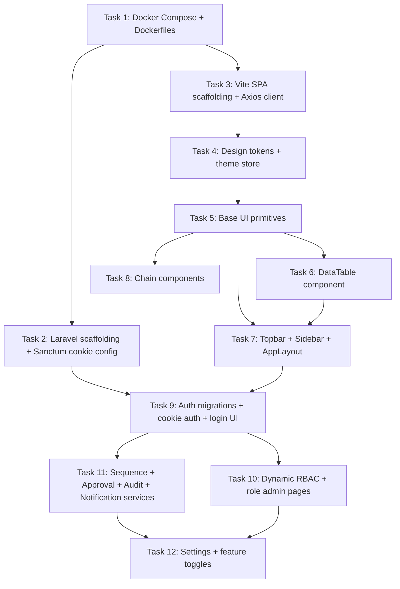

# Ogami ERP — Sprint 1 Foundation Plan (Tasks 1–12)

> Scope: build the bones. Nothing in Sprints 2–8 works until Sprint 1 is rock solid.
> Reference docs: [`CLAUDE.md`](CLAUDE.md:1), [`docs/PATTERNS.md`](docs/PATTERNS.md:1), [`docs/DESIGN-SYSTEM.md`](docs/DESIGN-SYSTEM.md:1), [`docs/SCHEMA.md`](docs/SCHEMA.md:1), [`docs/TASKS.md`](docs/TASKS.md:1), [`docs/SEEDS.md`](docs/SEEDS.md:1).

---

## 0. Mission & Non-Negotiables

Ship 12 tasks that produce: a Docker dev environment, a Laravel 11 modular monolith with Sanctum SPA cookie auth + HashIDs + dynamic RBAC + audit + approval + sequence services, a Vite/React 18 SPA with the tokenized monochrome design system, base primitives, dense DataTable, layout shell, chain visualization components, login + change-password flows, role/permission admin, and feature toggles.

**Non-negotiables (re-checked at every PR):**
- HTTP-only Sanctum SPA cookies — never Bearer tokens, never localStorage for auth
- Every model uses `HasHashId`; every Resource emits `hash_id` (string), never integer `id`
- Every list page handles 5 states: loading, error, empty, data, stale (per [`docs/PATTERNS.md`](docs/PATTERNS.md:1522))
- Every form: Zod schema mirroring FormRequest, disabled-while-pending submit, server-error mapping, cancel, success/error toast, query invalidation
- Every route wrapped: `AuthGuard` → `ModuleGuard` → `PermissionGuard`
- Numbers `font-mono tabular-nums` right-aligned; status uses `<Chip>` with semantic variant
- Canvas is grayscale; color only on chips, primary buttons, KPI deltas, alert dots, links
- Money `decimal(15,2)` only — never float (no money in Sprint 1, but the convention is set)
- All mutations in `DB::transaction`
- Geist + Geist Mono; rows 32px; 6px radius; 0.5px borders

---

## 1. Repository Layout (after Sprint 1)

```
kwatog/
├── CLAUDE.md  README.md  Makefile  docker-compose.yml  .env.example
├── docker/
│   ├── php/Dockerfile
│   ├── nginx/default.conf
│   └── node/Dockerfile
├── api/                                     # Laravel 11
│   ├── app/
│   │   ├── Modules/                         # 15 module dirs (most empty in Sprint 1)
│   │   │   ├── Auth/        (Task 9, 10)
│   │   │   ├── Admin/       (Task 10, 12)
│   │   │   └── HR/ Attendance/ Leave/ Payroll/ Loans/ Accounting/ Inventory/
│   │   │     Purchasing/ SupplyChain/ Production/ MRP/ CRM/ Quality/ Maintenance/ Dashboard/
│   │   │     (each: Controllers/ Models/ Services/ Requests/ Resources/ Jobs/ Enums/ routes.php)
│   │   ├── Common/
│   │   │   ├── Traits/      HasHashId.php  HasAuditLog.php  HasApprovalWorkflow.php
│   │   │   ├── Services/    DocumentSequenceService.php  ApprovalService.php
│   │   │   │                NotificationService.php       SettingsService.php
│   │   │   ├── Enums/       (shared enums)
│   │   │   └── Middleware/  CheckPermission.php  CheckFeature.php  SessionTimeout.php
│   │   │                    CheckPasswordExpiry.php  SanitizeInput.php  ForceJsonResponse.php
│   │   └── Providers/       ModuleServiceProvider.php
│   ├── config/   (cors, sanctum, session, hashids, auth, sanitize)
│   ├── database/migrations/  (0001_…0013_ in Sprint 1)
│   ├── database/seeders/     (Role, Permission, Workflow, Setting, Admin user)
│   ├── routes/api.php        (mounts ModuleServiceProvider routes under /api/v1)
│   └── tests/
└── spa/                                     # Vite + React 18 + TS
    ├── index.html
    ├── tailwind.config.ts  postcss.config.js  vite.config.ts  tsconfig.json
    └── src/
        ├── api/             client.ts  auth.ts  admin/{roles,permissions,settings}.ts
        ├── components/
        │   ├── ui/          Button Input Select Textarea Checkbox Radio Switch Chip
        │   │                StatCard Panel Modal Toast Skeleton Spinner EmptyState
        │   │                Badge Avatar Tooltip DataTable FilterBar
        │   ├── chain/       ChainHeader StageBreakdown LinkedRecords ActivityStream
        │   ├── layout/      Topbar Sidebar PageHeader Breadcrumbs NotificationBell
        │   └── guards/      AuthGuard ModuleGuard PermissionGuard
        ├── hooks/           usePermission useFeature useDebounce useTheme
        ├── layouts/         AppLayout AuthLayout SelfServiceLayout
        ├── pages/
        │   ├── auth/        login change-password
        │   ├── admin/       roles/{index,[id]/permissions} settings audit-logs
        │   └── dashboard/   index (placeholder shell)
        ├── stores/          authStore themeStore sidebarStore
        ├── types/           index.ts (ApiResponse, Paginated, ListParams, User, Role…)
        ├── lib/             cn.ts formatNumber.ts formatDate.ts http.ts
        └── styles/          tokens.css  globals.css
```

---

## 2. Task Sequencing (dependency graph)



Build order: T1 → (T2 ‖ T3) → T4 → T5 → T6 → T7 → T8 → T9 → T10 → T11 → T12.
T2 and T3 may be done in parallel by the same engineer; they don't conflict.

---

## 3. Per-Task Plans

### Task 1 — Docker Compose (+ Dockerfiles + Makefile)

**Files to create:**
- [`docker-compose.yml`](docker-compose.yml:1) — services: `api` (php 8.3-fpm), `spa` (node 20), `nginx` (alpine), `db` (postgres:16-alpine), `redis` (redis:7-alpine), `meilisearch`, `reverb` (php), `queue` (php worker `php artisan queue:work`), `mailpit`. Bind volumes: `./api:/var/www`, `./spa:/app`, `pgdata`, `redisdata`, `meilidata`. Network: `ogami-net`.
- [`docker/php/Dockerfile`](docker/php/Dockerfile:1) — `FROM php:8.3-fpm-alpine`; install `pdo_pgsql, pdo, redis (pecl), gd, zip, bcmath, intl, exif, opcache`; install Composer 2; non-root user `www`; workdir `/var/www`.
- [`docker/nginx/default.conf`](docker/nginx/default.conf:1) — server block: `location /api/` and `/sanctum/` → `fastcgi_pass api:9000`; `location /ws` → `proxy_pass http://reverb:8080` with WS upgrade headers; `location /` → `proxy_pass http://spa:5173` in dev (later: serve static `dist/` in prod). Add the security headers from CLAUDE.md §"Security Headers".
- [`docker/node/Dockerfile`](docker/node/Dockerfile:1) — `FROM node:20-alpine`; workdir `/app`; default cmd `npm run dev -- --host 0.0.0.0`.
- [`.env.example`](.env.example:1) — `APP_URL`, `FRONTEND_URL=http://localhost:3000`, `DB_*` (postgres), `REDIS_*`, `SESSION_DRIVER=database`, `SESSION_HTTP_ONLY=true`, `SESSION_SECURE_COOKIE=false` (true in prod), `SESSION_SAME_SITE=lax`, `SANCTUM_STATEFUL_DOMAINS=localhost,localhost:3000`, `MEILISEARCH_*`, `REVERB_*`, `MAIL_*` (mailpit), `HASHIDS_SALT=`, `HASHIDS_LENGTH=10`.
- [`Makefile`](Makefile:1) — targets: `up`, `down`, `build`, `migrate`, `seed`, `fresh` (= migrate:fresh + seed), `test` (PHPUnit + Vitest), `shell` (api), `logs`, `tinker`, `lint`, `analyse` (Larastan optional).

**Decisions:**
- SPA dev port 3000 outside, 5173 inside (Vite default) — Nginx proxies to it. Production: Nginx serves `spa/dist/`.
- Postgres exposed on 5432 only inside the docker network; no host port to keep dev clean (override via compose.override.yml if needed).
- `SESSION_DOMAIN` left empty in dev (works on `localhost`); set to `.ogami.example.com` in prod.

**Risks:**
- WebSocket cookie auth at `/ws` — Reverb must read the same session. Validate `withCredentials` works on WS upgrade; document in T78 if it bites.
- Same-site behavior across subdomains in prod → defer SSL/domain decisions until Task 38.

**Exit criteria:** `make up` boots all services healthy; `curl http://localhost/api/v1/up` returns Laravel's health response; `http://localhost/` shows Vite welcome.

---

### Task 2 — Laravel API scaffolding

**Steps:**
1. Inside `api/`: `composer create-project laravel/laravel . "^11.0"`.
2. Install packages: `laravel/sanctum`, `vinkla/hashids`, `barryvdh/laravel-dompdf`, `maatwebsite/excel`, `laravel/scout`, `meilisearch/meilisearch-php`, `laravel/reverb`.
3. `php artisan install:api --passport=no` then **remove the API token middleware**, keeping only stateful session middleware. Or skip `install:api` and configure manually for SPA cookie mode (preferred).

**Files to create / modify:**
- [`api/config/cors.php`](api/config/cors.php:1) — `paths => ['api/*', 'sanctum/csrf-cookie', 'login', 'logout']`, `allowed_origins => [env('FRONTEND_URL')]`, `supports_credentials => true`.
- [`api/config/sanctum.php`](api/config/sanctum.php:1) — `stateful` reads `SANCTUM_STATEFUL_DOMAINS`. Remove token guard; the SPA flow doesn't need Sanctum personal access tokens.
- [`api/config/session.php`](api/config/session.php:1) — `driver=database`, `lifetime=30`, `expire_on_close=false`, `secure=env('SESSION_SECURE_COOKIE',true)`, `http_only=true`, `same_site=lax`, `domain=env('SESSION_DOMAIN')`.
- [`api/config/hashids.php`](api/config/hashids.php:1) — published from vinkla; one default connection using `HASHIDS_SALT` and `min_length` 10.
- [`api/bootstrap/app.php`](api/bootstrap/app.php:1) — register the `EnsureFrontendRequestsAreStateful` Sanctum middleware on the `api` group; register `ForceJsonResponse`; register the modular service provider; add `route_prefix => 'api/v1'`.
- [`api/app/Providers/ModuleServiceProvider.php`](api/app/Providers/ModuleServiceProvider.php:1) — scans `app/Modules/*/routes.php`, mounts each under `Route::prefix('v1')->middleware('api')->group(...)`. Also auto-registers Form Request validators and Eloquent observers when modules are added later.
- [`api/routes/api.php`](api/routes/api.php:1) — minimal: `Route::get('/up', ...)` plus a delegating call to ModuleServiceProvider.
- [`api/app/Modules/{Auth,Admin,HR,Attendance,Leave,Payroll,Loans,Accounting,Inventory,Purchasing,SupplyChain,Production,MRP,CRM,Quality,Maintenance,Dashboard}/`](api/app/Modules:1) — empty subdir tree (`Controllers/`, `Models/`, `Services/`, `Requests/`, `Resources/`, `Jobs/`, `Enums/`, `routes.php` empty).
- [`api/app/Common/{Traits,Services,Enums,Middleware}/`](api/app/Common:1) — empty for now, populated in T9 / T11.

**Decisions:**
- Use Laravel 11's slim skeleton (`bootstrap/app.php` for middleware/route registration) rather than the legacy `Kernel.php`.
- Sanctum SPA cookie mode only — do **not** publish or use `personal_access_tokens` table. Migration for that table will be removed if Sanctum publishes it by default.
- HashIDs salt rotated only with explicit migration tooling (write a comment in `config/hashids.php`).

**Exit criteria:** `php artisan serve` (or via docker) responds at `/api/v1/up`; `composer test` passes the default skeleton test; `php artisan route:list` shows the `api/v1` prefix and the Sanctum CSRF route.

---

### Task 3 — Vite SPA scaffolding

**Steps:**
1. Inside `spa/`: `npm create vite@latest . -- --template react-ts`.
2. Install: `react-router-dom @tanstack/react-query @tanstack/react-table zustand axios react-hook-form @hookform/resolvers zod recharts lucide-react date-fns clsx react-hot-toast`.
3. Dev: `tailwindcss postcss autoprefixer @types/react vitest @testing-library/react @testing-library/jest-dom @vitejs/plugin-react eslint prettier`.

**Files to create:**
- [`spa/vite.config.ts`](spa/vite.config.ts:1) — `@/` alias → `src/`; dev `server.host=0.0.0.0`; `server.proxy['/api'] = 'http://nginx:80'` and `'/sanctum' = 'http://nginx:80'` for direct access during dev.
- [`spa/tsconfig.json`](spa/tsconfig.json:1) — `paths: { "@/*": ["./src/*"] }`, `strict: true`.
- [`spa/tailwind.config.ts`](spa/tailwind.config.ts:1) — placeholder; T4 fills in token bindings.
- [`spa/postcss.config.js`](spa/postcss.config.js:1) — Tailwind + autoprefixer.
- [`spa/src/main.tsx`](spa/src/main.tsx:1) — bootstrap React, QueryClientProvider with sane defaults (`staleTime: 30s`, `retry: 1`, `refetchOnWindowFocus: false`), `<Toaster />` from react-hot-toast, `<BrowserRouter>` (later replaced with `<App />`'s router setup from PATTERNS §21).
- [`spa/src/App.tsx`](spa/src/App.tsx:1) — placeholder shell; T9 turns this into the route tree from [`docs/PATTERNS.md`](docs/PATTERNS.md:1634).
- [`spa/src/api/client.ts`](spa/src/api/client.ts:1) — exact copy of [`docs/PATTERNS.md`](docs/PATTERNS.md:663) Axios client + 401 interceptor + `getCsrfCookie()` helper.
- [`spa/src/types/index.ts`](spa/src/types/index.ts:1) — `PaginatedResponse<T>`, `ListParams`, `ApiValidationError`, `ApiSuccess<T>` shapes from PATTERNS §9.
- [`spa/src/lib/cn.ts`](spa/src/lib/cn.ts:1) — `clsx` re-export + `cn(...args)` helper.
- [`spa/src/lib/formatNumber.ts`](spa/src/lib/formatNumber.ts:1) — `formatPeso`, `formatInt`, `formatDecimal`, `formatPercent` (Intl.NumberFormat, `en-PH`).
- [`spa/src/lib/formatDate.ts`](spa/src/lib/formatDate.ts:1) — `formatDate(d, 'short' | 'long' | 'iso')`, `formatDateTime`, `formatRelative` (date-fns). All numeric output ready to slap `font-mono tabular-nums` on.
- [`spa/index.html`](spa/index.html:1) — Geist + Geist Mono Google Fonts link, `data-theme` attribute on `<html>`.
- [`spa/src/styles/globals.css`](spa/src/styles/globals.css:1) — `@tailwind base/components/utilities`; `@import './tokens.css'` (file added in T4); body styles per [`docs/DESIGN-SYSTEM.md`](docs/DESIGN-SYSTEM.md:127).

**Decisions:**
- Use **Axios for HTTP** (not fetch) because of automatic XSRF cookie reading and interceptor ergonomics.
- TanStack Query is the only server-state cache; Zustand is for client state (theme, sidebar, auth user/permissions snapshot).
- Single `<Toaster />` mounted at root; toast positions `top-right`, duration `4000ms`.

**Risks:**
- During dev, the SPA must talk to Nginx so cookies are scoped correctly. Vite's HMR works fine through Nginx with `Connection: upgrade` proxy.

**Exit criteria:** `npm run dev` boots; `client.get('/up')` returns 200; CSRF cookie endpoint sets `XSRF-TOKEN`.

---

### Task 4 — Design system foundation

**Files to create:**
- [`spa/src/styles/tokens.css`](spa/src/styles/tokens.css:1) — full set from [`docs/DESIGN-SYSTEM.md`](docs/DESIGN-SYSTEM.md:14) (light + dark): `--bg-canvas/surface/elevated/subtle`, `--border-subtle/default/strong`, `--text-primary/secondary/muted/subtle`, `--accent`/`--accent-hover`/`--accent-fg`, semantic color sets (`--success/--success-bg/--success-fg`, warning, danger, info, purple), `--ring`/`--ring-offset`, `--shadow-focus`/`--shadow-menu`, `--font-sans`/`--font-mono`, `--radius-sm/md/lg/full`, `--duration-fast/normal/slow`, `--ease-default`. Dark mode under `[data-theme="dark"]`.
- [`spa/tailwind.config.ts`](spa/tailwind.config.ts:1) — extend colors mapping every CSS var (canvas, surface, elevated, subtle, primary, secondary, muted, subtle text→`text-subtle`, accent + variants, success/warning/danger/info/purple with `-bg`/`-fg` suffixes), fontFamily `sans: ['Geist', ...]` and `mono: ['Geist Mono', ...]`, fontSize `'2xs': ['10px', { lineHeight: '1.4' }]`, borderRadius `md: '6px'`. Add `tabular-nums` plugin via small custom utility.
- [`spa/src/stores/themeStore.ts`](spa/src/stores/themeStore.ts:1) — Zustand store: `mode: 'light' | 'dark' | 'system'`, `resolvedTheme`, `setMode(mode)` (writes `data-theme` on `<html>`, calls `PATCH /auth/user/preferences` to persist server-side, falls back gracefully if user not authenticated), `init()` (reads `prefers-color-scheme`).
- [`spa/src/hooks/useTheme.ts`](spa/src/hooks/useTheme.ts:1) — convenience hook over the store; subscribes to system color scheme when `mode === 'system'`.

**Decisions:**
- **Persist theme to DB**, not localStorage (per [`docs/DESIGN-SYSTEM.md`](docs/DESIGN-SYSTEM.md:755)). Backend column `users.theme_mode` already in schema. Pre-auth pages use `system`.
- Use real 0.5px borders via `border-[0.5px]` arbitrary or a `border-hairline` utility; document fallback to 1px on non-retina via media query in `globals.css`.

**Exit criteria:** Toggling `data-theme` on `<html>` flips the entire palette; Tailwind classes like `bg-canvas text-primary border-default` resolve via tokens; Geist loads (visual check on a temp page).

---

### Task 5 — Base UI primitives

**Files to create in [`spa/src/components/ui/`](spa/src/components/ui:1):**
- `Button.tsx` — variants `primary | secondary | danger | ghost`, sizes `sm (28) | md (32) | lg (36)`, `loading` prop (replaces children with spinner + provided loading text), `icon` slot, press scale-98 100ms. Forwards `ref`. Disabled style: `opacity-60 cursor-not-allowed`.
- `Input.tsx` — `label`, `helper`, `error`, `prefix`, `suffix` (₱ prefix used in money inputs), 32px height, error state turns border `--danger`, focus ring `--ring`. Forwards `ref` for RHF.
- `Select.tsx` — same shell as Input; native `<select>` first, then a searchable variant (Combobox) using `cmdk` or hand-rolled with TanStack — pick **native** for Sprint 1 to ship; upgrade later when CRM/Production need search.
- `Textarea.tsx`, `Checkbox.tsx`, `Radio.tsx`, `Switch.tsx` — minimal, accessible, Tailwind tokens only.
- `Chip.tsx` — variants `success | warning | danger | info | neutral | purple`. 4×7 padding, 10px font, 4px radius, weight 500. Exports `chipVariantForStatus(status)` mapping table from [`docs/DESIGN-SYSTEM.md`](docs/DESIGN-SYSTEM.md:461).
- `StatCard.tsx` — label (10px uppercase muted), value (22px mono medium), delta (11px mono, success/danger). 14px padding, surface bg, 0.5px border.
- `Panel.tsx` — `<header>`-`<body>` slot card; 0.5px border, no shadow.
- `Modal.tsx` — Radix Dialog OR hand-rolled with portal + focus trap. Sizes `sm | md | lg | xl`. ESC close, overlay click close (configurable), 200ms fade + 8px slide-up.
- `Skeleton.tsx` — three exports: `SkeletonTable({columns, rows})`, `SkeletonForm()`, `SkeletonDetail()` exactly per [`docs/PATTERNS.md`](docs/PATTERNS.md:1551).
- `Spinner.tsx` — sizes `sm | md | lg`; `FullPageLoader` variant fills viewport.
- `EmptyState.tsx` — `icon` (lucide name string), `title`, `description`, `action` slot. Centered, ~40px icon, muted body.
- `Badge.tsx` — small numeric badge for sidebar (10px, indigo bg).
- `Avatar.tsx` — 28px (topbar) and 32px sizes; initials fallback when no `src`.
- `Tooltip.tsx` — Radix Tooltip wrapper, 11px label, dark surface, 4px offset.
- `Toast.tsx` — re-export react-hot-toast theme config (uses tokens for bg/fg).

**Pattern guarantees per component:**
- All accept `className` and forward refs where reasonable.
- All consume only token-mapped Tailwind classes — zero raw hex.
- Storybook is **out of scope for Sprint 1** (cut). A single `pages/_kitchen-sink.tsx` (gated behind `import.meta.env.DEV`) shows every primitive for visual QA.

**Exit criteria:** Kitchen-sink page renders every primitive in light + dark, every variant + size + state (default / hover / focus / disabled / error / loading).

---

### Task 6 — DataTable

**File:** [`spa/src/components/ui/DataTable.tsx`](spa/src/components/ui/DataTable.tsx:1)

**Built on:** TanStack Table v8 (`@tanstack/react-table`).

**Props (typed):**
```ts
interface DataTableProps<T> {
  columns: ColumnDef<T>[];          // wrap TanStack ColumnDef + our cell helpers
  data: T[];
  meta?: PaginationMeta;             // server-side pagination
  onPageChange?: (page: number) => void;
  onSort?: (sort: string, dir: 'asc' | 'desc') => void;
  currentSort?: string;
  currentDirection?: 'asc' | 'desc';
  onRowClick?: (row: T) => void;
  selectable?: boolean;
  bulkActions?: BulkAction[];        // shown when >0 rows selected
  contextMenu?: ContextMenuItem<T>[];
  density?: 'compact' | 'default' | 'spacious';   // 28 / 32 / 40
  getRowId?: (row: T) => string;
}
```

**Visual rules (from [`docs/DESIGN-SYSTEM.md`](docs/DESIGN-SYSTEM.md:472)):**
- Header row 32px, `text-2xs uppercase tracking-wider text-muted font-medium`, sticky on scroll.
- Body row 32px (compact 28, spacious 40); hover `bg-subtle`; row separator `0.5px border-subtle`.
- Cell padding `0 10px` (`px-2.5`).
- Numeric cells: `font-mono tabular-nums text-right`; provided helper `cellNumber(value, formatter?)`.
- Status cells: provided helper `cellStatus(status)` returns a `<Chip>`.

**Sub-features:**
- Sortable columns: click header toggles asc/desc (icon shown). Calls `onSort`.
- Server-side pagination footer: page X of Y, prev/next, jump-to-page input, page-size selector (10/20/50/100).
- Row selection: leading checkbox column when `selectable`; "select all visible" header checkbox; bulk action toolbar slides in above the header.
- Right-click row → context menu (uses Radix DropdownMenu).
- Density toggle: persisted via prefs API (T9) per user.
- Column visibility: dropdown next to density toggle. Persisted per table id.
- Export buttons (CSV/PDF): triggers a callback prop `onExport(format)` — actual file generation is server-side, deferred.

**Risks:**
- Sticky header inside the AppLayout needs careful overflow management; document the wrapping div pattern in PageHeader (T7).
- TanStack Table v8's row-model is client-side by default; we use it only for column definitions and let the server paginate. Configure `manualPagination`, `manualSorting`, `manualFiltering`.

**Exit criteria:** Renders a 50-row demo via the kitchen sink with all states; numbers align vertically; status chips render; selection toggles bulk bar; sort/page calls fire.

---

### Task 7 — Layout shell

**Files:**
- [`spa/src/components/layout/Topbar.tsx`](spa/src/components/layout/Topbar.tsx:1) — 48px, sticky, bottom 0.5px border. Slots: logo (22px black square + "O", inverts in dark), `<Breadcrumbs>` derived from React Router matched routes, `<SearchTrigger>` (180px width, ⌘K hint, opens command palette in T75 — Sprint 1 stub), theme toggle button, `<NotificationBell>` (stub, real in T77), `<AvatarMenu>` (logout).
- [`spa/src/components/layout/Sidebar.tsx`](spa/src/components/layout/Sidebar.tsx:1) — two modes (240px / 56px rail) per [`docs/DESIGN-SYSTEM.md`](docs/DESIGN-SYSTEM.md:303). Section labels (OPERATIONS / FINANCE / PEOPLE / ADMIN) — items conditionally rendered based on `useFeature(moduleSlug)` (T12) and `usePermission(...)` (T10). Active state: 2px indigo left border, `bg-elevated`. Lucide icons. Collapsible toggle saves to `users.sidebar_collapsed`.
- [`spa/src/components/layout/PageHeader.tsx`](spa/src/components/layout/PageHeader.tsx:1) — title (text-xl medium), subtitle/meta, optional `backTo`/`backLabel`, optional `actions` slot, optional bottom slot for `<ChainHeader>` (T8). 16–20px padding, bottom 0.5px border.
- [`spa/src/components/layout/Breadcrumbs.tsx`](spa/src/components/layout/Breadcrumbs.tsx:1) — derives from `useMatches()`; segment data attached to route definitions.
- [`spa/src/layouts/AppLayout.tsx`](spa/src/layouts/AppLayout.tsx:1) — flex shell: Topbar on top; Sidebar + `<Outlet/>` below. Auto-shrinks sidebar at < 1280px width.
- [`spa/src/layouts/AuthLayout.tsx`](spa/src/layouts/AuthLayout.tsx:1) — centered card on canvas, no sidebar/topbar. For login + change-password.
- [`spa/src/layouts/SelfServiceLayout.tsx`](spa/src/layouts/SelfServiceLayout.tsx:1) — mobile-friendly shell stub for Sprint 8 self-service portal; only the bones in Sprint 1.
- [`spa/src/stores/sidebarStore.ts`](spa/src/stores/sidebarStore.ts:1) — `collapsed: bool`, `toggle()`, `init(initial)`; persists via `PATCH /auth/user/preferences`.

**Exit criteria:** Visiting any non-auth route shows Topbar + Sidebar; collapsing the sidebar persists across reload (after auth); breadcrumbs reflect the URL.

---

### Task 8 — Chain visualization components

**Files in [`spa/src/components/chain/`](spa/src/components/chain:1):**
- `ChainHeader.tsx` — props `steps: ChainStep[]`, `activeStepIndex?: number`. Visual per [`docs/DESIGN-SYSTEM.md`](docs/DESIGN-SYSTEM.md:556): 9px dots (emerald done, indigo active, gray pending) with 1px outline, 1px connecting lines, labels 11px medium + 10px mono date. Used at the top of detail pages.
- `StageBreakdown.tsx` — props `title`, `stages: { label, count, percent, color: 'success'|'info'|'warning'|'danger' }[]`. Each stage: row with label + count, 4px progress bar below.
- `LinkedRecords.tsx` — props `groups: { label, items: { id, chip?, meta?, href? }[] }[]`. Renders right-side panel content; group label 10px uppercase muted; record id 12px mono primary clickable.
- `ActivityStream.tsx` — props `items: { dot: 'success'|'info'|'warning'|'danger', text: ReactNode, time: string }[]`. 6px dot + content + time mono muted.

**Decisions:**
- These are **pure presentational** components in Sprint 1 — they accept fully formed props and don't fetch. Real data wiring happens per detail page in Sprints 2+.
- Add type definitions in [`spa/src/types/chain.ts`](spa/src/types/chain.ts:1).

**Exit criteria:** Kitchen-sink page renders all four with realistic mocked data in both themes.

---

### Task 9 — Authentication (HTTP-only cookies)

**Migrations** (numbered exactly as TASKS.md specifies):
- [`api/database/migrations/0001_create_roles_table.php`](api/database/migrations/0001_create_roles_table.php:1) — per [`docs/SCHEMA.md`](docs/SCHEMA.md:12).
- [`0002_create_permissions_table.php`](api/database/migrations/0002_create_permissions_table.php:1) — index on `module`.
- [`0003_create_role_permissions_table.php`](api/database/migrations/0003_create_role_permissions_table.php:1) — composite PK.
- [`0004_create_users_table.php`](api/database/migrations/0004_create_users_table.php:1) — full SCHEMA columns including `theme_mode`, `sidebar_collapsed`, `failed_login_attempts`, `locked_until`, `must_change_password`, `password_changed_at`, `last_activity`, `employee_id` (nullable, FK added later in Task 14 via deferred migration), `is_active`, soft deletes. Drop default Laravel `users` table migration.
- [`0005_create_password_history_table.php`](api/database/migrations/0005_create_password_history_table.php:1).
- [`0006_create_sessions_table.php`](api/database/migrations/0006_create_sessions_table.php:1) — Laravel default `php artisan session:table` shape.

**Backend code:**
- [`api/app/Common/Traits/HasHashId.php`](api/app/Common/Traits/HasHashId.php:1) — exact pattern from [`CLAUDE.md`](CLAUDE.md:130): `resolveRouteBinding`, `getHashIdAttribute`, plus `scopeWhereHash($query, string|array $hash)` for filters and a static `decodeOrFail(string $hash): int` helper.
- [`api/app/Modules/Auth/Models/Role.php`](api/app/Modules/Auth/Models/Role.php:1), `Permission.php`, `User.php` — User uses `HasHashId, SoftDeletes, HasFactory, Notifiable`, `belongsTo Role`, `hasMany passwordHistory`. Casts include `password_changed_at`, `locked_until`, `last_activity` as datetime; `is_active`, `must_change_password`, `sidebar_collapsed` as bool.
- [`api/app/Common/Middleware/CheckPermission.php`](api/app/Common/Middleware/CheckPermission.php:1) — `permission:hr.employees.view` route param; aborts 403 if user lacks it. Permissions resolved through user → role → permissions, cached in Redis per user with `auth:permissions:{userId}` key, busted on role change.
- `SessionTimeout.php` — reads `users.role.slug`; 15 min for `employee` role, 30 min for others. Compares `Auth::user()->last_activity`; logs out on timeout (delete session + clear cookie). Updates `last_activity` on every request.
- `CheckPasswordExpiry.php` — if `password_changed_at < now() - 90 days` OR `must_change_password = true`, returns 403 with `{ code: 'password_expired' }` — front-end client.ts already redirects to `/change-password`.
- `SanitizeInput.php` — strips tags from all string inputs.
- `ForceJsonResponse.php` — sets `Accept: application/json` so Laravel returns JSON validation errors instead of redirects.
- [`api/app/Modules/Auth/Controllers/LoginController.php`](api/app/Modules/Auth/Controllers/LoginController.php:1) — `POST /api/v1/auth/login`. Steps:
  1. RateLimiter::for('auth') 5/min per IP+email.
  2. Validate `email`, `password`.
  3. Lookup user. If `locked_until > now()` → 423 Locked.
  4. `Hash::check($password, $user->password)` → on failure: increment `failed_login_attempts`; at 5 → set `locked_until = now()+15min`; return 422 with generic message.
  5. On success: reset attempts, set `last_activity = now()`, log auth event with IP+UA, `Auth::login($user)`, `request()->session()->regenerate()`. Return UserResource.
- `LogoutController.php` — `POST /api/v1/auth/logout` → invalidate session, regenerate token, log event.
- `AuthUserController.php` — `GET /api/v1/auth/user` → returns user + role + permissions array (slugs) + features (from settings). Used by AuthGuard on app boot.
- `ChangePasswordController.php` — `POST /api/v1/auth/change-password`. Validates: old password matches, new policy (min 8 + upper + number + special via custom Rule), not in last 3 hashes from `password_history`. On success: store old hash to history, prune to keep last 3, set `password_changed_at = now()`, `must_change_password = false`, log event.
- [`api/app/Modules/Auth/Resources/UserResource.php`](api/app/Modules/Auth/Resources/UserResource.php:1) — returns `id` (hash), `name`, `email`, `is_active`, `role: { id (hash), name, slug }`, `permissions: string[]`, `must_change_password`, `theme_mode`, `sidebar_collapsed`. **No password, no failed_login_attempts.**
- [`api/app/Modules/Auth/routes.php`](api/app/Modules/Auth/routes.php:1) — `Route::prefix('auth')->group(...)`. Login/logout routes apply `throttle:auth` and `EnsureFrontendRequestsAreStateful`. Authenticated routes use `auth:sanctum`, `SessionTimeout`, and (except logout & change-password) `CheckPasswordExpiry`.
- Rate limiters in `bootstrap/app.php` boot closure: `auth` (5/min by IP+email), `api` (60/min by user-or-IP), `sensitive` (10/min by user).
- Bcrypt cost 12 set in `config/hashing.php`.

**Frontend:**
- [`spa/src/api/auth.ts`](spa/src/api/auth.ts:1) — `getCsrfCookie()`, `login({email, password})`, `logout()`, `me()`, `changePassword({current, new, new_confirmation})`, `updatePreferences({theme_mode?, sidebar_collapsed?})`.
- [`spa/src/stores/authStore.ts`](spa/src/stores/authStore.ts:1) — Zustand: `user`, `permissions: Set<string>`, `features: Set<string>`, `isAuthenticated`, `isLoading`, actions `bootstrap()` (calls `me()`), `login(creds)`, `logout()`. **Never persists to localStorage.**
- [`spa/src/components/guards/AuthGuard.tsx`](spa/src/components/guards/AuthGuard.tsx:1) — on first render runs `bootstrap()`; while loading shows `<FullPageLoader>`; if not authenticated, `<Navigate to='/login' replace />`. Re-checks on focus.
- `ModuleGuard.tsx` — `if (!features.has(moduleSlug)) return <FeatureDisabled />;`
- `PermissionGuard.tsx` — `if (!permissions.has(perm)) return <Forbidden />;`
- [`spa/src/hooks/usePermission.ts`](spa/src/hooks/usePermission.ts:1) — `{ can: (perm) => bool, canAny: (...) => bool }`.
- [`spa/src/hooks/useFeature.ts`](spa/src/hooks/useFeature.ts:1) — `(slug) => bool` reading `features` set from authStore.
- [`spa/src/pages/auth/login.tsx`](spa/src/pages/auth/login.tsx:1) — RHF + Zod (email, password). On submit: `getCsrfCookie()` → `login()`. On 422 map errors. On 423 show "Account locked, try again in N minutes." On success: `bootstrap()` and `navigate(redirectAfter ?? '/dashboard')`. Includes "Forgot password?" placeholder (not implemented in Sprint 1).
- [`spa/src/pages/auth/change-password.tsx`](spa/src/pages/auth/change-password.tsx:1) — three fields, policy hints (min 8, upper, number, special), live validation, server error mapping. On success: `me()` then redirect to dashboard.
- [`spa/src/App.tsx`](spa/src/App.tsx:1) — full router from PATTERNS §21: lazy imports, `<AuthLayout>` for `/login`, `/change-password`; `<AuthGuard><AppLayout/></AuthGuard>` for the rest; nested `ModuleGuard` + `PermissionGuard` per module group; root `/` → `Navigate to='/dashboard'`; catch-all `<NotFound />`.

**Seed:** `AdminUserSeeder` creates one System Admin user (email `admin@ogami.test`, random strong password printed to console + saved to `storage/app/admin-credentials.txt`, `must_change_password = true`).

**Risks:**
- CSRF token rotation on session regenerate: Laravel handles this; SPA's Axios reads the new XSRF cookie automatically on every response. Verified in dev.
- `same_site=lax` requires backend + frontend on same parent domain in prod (handled in Task 38).
- Account-lock countdown UI: show server-provided unlock time, not a client clock — server is the source of truth.

**Exit criteria:**
- `POST /auth/login` with bad password 5× locks the account; correct password rejected with 423 until 15 min pass.
- After login, `GET /auth/user` returns shape consumed by SPA.
- Refreshing the SPA on a protected route keeps the user signed in.
- Manually deleting the session row logs the user out on next request.

---

### Task 10 — Dynamic RBAC

**Backend:**
- [`api/database/seeders/PermissionSeeder.php`](api/database/seeders/PermissionSeeder.php:1) — ~100 permissions. Naming: `{module}.{resource}.{action}` (`hr.employees.view|create|edit|delete|export|view_sensitive`, `payroll.periods.view|create|compute|approve|finalize`, `quality.inspections.view|create|edit`, `admin.roles.manage`, `admin.settings.manage`, `admin.audit_logs.view`, etc.). Stored with `module` field for grouping.
- [`api/database/seeders/RoleSeeder.php`](api/database/seeders/RoleSeeder.php:1) — 12 roles per TASKS.md: `system_admin` (all), `hr_officer`, `finance_officer`, `production_manager`, `ppc_head`, `purchasing_officer`, `warehouse_staff`, `qc_inspector`, `maintenance_tech`, `impex_officer`, `department_head`, `employee`. Permission assignments declared as PHP arrays so they're version-controlled.
- [`api/database/seeders/RolePermissionSeeder.php`](api/database/seeders/RolePermissionSeeder.php:1) — calls the above two and pivots them.
- [`api/app/Modules/Admin/Controllers/RoleController.php`](api/app/Modules/Admin/Controllers/RoleController.php:1) — `index/show/store/update/destroy` with `admin.roles.manage` permission. Plus `POST /api/v1/admin/roles/{role}/permissions` (sync the matrix).
- `PermissionController.php` — `GET /api/v1/admin/permissions` returns all permissions grouped by module (one call powers the matrix UI).
- Form Requests, Resources, routes mounted under `/api/v1/admin`.

**Frontend:**
- [`spa/src/api/admin/roles.ts`](spa/src/api/admin/roles.ts:1), `permissions.ts`.
- [`spa/src/pages/admin/roles/index.tsx`](spa/src/pages/admin/roles/index.tsx:1) — List with name, slug, member count, permission count, edit/delete actions. Uses DataTable. All 5 states.
- [`spa/src/pages/admin/roles/[id]/permissions.tsx`](spa/src/pages/admin/roles/[id]/permissions.tsx:1) — Matrix: rows = permissions grouped by module (collapsible accordion per module), columns = checkboxes for "this role has it", "select all in module" header. Single Save button at the bottom; warns about unsaved changes on navigate. Server returns the full set; the page just toggles. Bulk actions: "Grant all in module", "Revoke all in module".
- Optional: a small "Cloned from" UX so admins can copy another role's matrix as a starting point.

**Caching invalidation:** When a role is updated, dispatch a job that flushes `auth:permissions:*` for affected users (or just flushes the role-level cache and lazy-rebuilds per user). Ship the simple "flush all" approach in Sprint 1; optimize later.

**Exit criteria:** Logging in as a role with reduced perms hides sidebar items, gates routes, and the API rejects forbidden calls with 403.

---

### Task 11 — Core shared services

**Migrations:**
- [`0007_create_document_sequences_table.php`](api/database/migrations/0007_create_document_sequences_table.php:1) — per SCHEMA: `(document_type, year, month)` unique with `last_number`.
- [`0008_create_audit_logs_table.php`](api/database/migrations/0008_create_audit_logs_table.php:1) — index on `(model_type, model_id)` and `created_at`.
- [`0009_create_workflow_definitions_table.php`](api/database/migrations/0009_create_workflow_definitions_table.php:1).
- [`0010_create_approval_records_table.php`](api/database/migrations/0010_create_approval_records_table.php:1) — index on `(approvable_type, approvable_id)`.
- [`0011_create_notifications_table.php`](api/database/migrations/0011_create_notifications_table.php:1) — Laravel default shape (uuid id).
- [`0012_create_notification_preferences_table.php`](api/database/migrations/0012_create_notification_preferences_table.php:1) — unique `(user_id, notification_type, channel)`.

**Services:**
- [`api/app/Common/Services/DocumentSequenceService.php`](api/app/Common/Services/DocumentSequenceService.php:1) — method `generate(string $documentType): string`. Format map:
  ```
  employee → OGM-{YYYY}-{NNNN}      (annual reset)
  purchase_order → PO-{YYYYMM}-{NNNN}  (monthly)
  invoice → INV-{YYYYMM}-{NNNN}
  journal_entry → JE-{YYYYMM}-{NNNN}
  work_order → WO-{YYYYMM}-{NNNN}
  ncr → NCR-{YYYYMM}-{NNNN}
  grn → GRN-{YYYYMM}-{NNNN}
  sales_order → SO-{YYYYMM}-{NNNN}
  leave_request → LR-{YYYYMM}-{NNNN}
  inspection → QC-{YYYYMM}-{NNNN}
  pr → PR-{YYYYMM}-{NNNN}
  delivery → DR-{YYYYMM}-{NNNN}
  bill → BILL-{YYYYMM}-{NNNN}
  bank_payment → BPAY-{YYYYMM}-{NNNN}
  ```
  Atomic: wraps in `DB::transaction` with `lockForUpdate` on the matching row, increments `last_number`, returns formatted string. Reset granularity (annual vs monthly) is per-document-type config.
- [`api/app/Common/Services/ApprovalService.php`](api/app/Common/Services/ApprovalService.php:1) — methods:
  - `submit(Model $approvable, string $workflowType, ?float $amount = null): void` — looks up `workflow_definitions`, picks the steps array (filters by `amount_threshold` if applicable), creates one `pending` approval_record per step.
  - `approve(Model $approvable, User $user, ?string $remarks): void` — finds the next pending step matching the user's role, marks it approved; if it was the last step, fires `Approved` event.
  - `reject(Model $approvable, User $user, string $remarks): void` — marks rejected; fires `Rejected` event; downstream pending steps become `skipped`.
  - `currentStep(Model $approvable)`, `nextStep(Model $approvable)`, `isFullyApproved(Model $approvable)`.
  - All wrapped in `DB::transaction`. Authorization (is the current user the expected approver?) checked here AND via FormRequest in callers.
- [`api/app/Common/Traits/HasAuditLog.php`](api/app/Common/Traits/HasAuditLog.php:1) — boots an Eloquent observer that on `created/updated/deleted` writes an `audit_logs` row with diff (`old_values`, `new_values`), `user_id`, `ip_address`, `user_agent`. Excludes encrypted casts from logged values to avoid leaking sensitive plaintext (logs `'***'` instead).
- [`api/app/Common/Traits/HasApprovalWorkflow.php`](api/app/Common/Traits/HasApprovalWorkflow.php:1) — adds `approvalRecords()` morph-to-many, plus `submitForApproval`, `currentApprovalStep`, `isFullyApproved` shortcuts that delegate to ApprovalService.
- [`api/app/Common/Services/NotificationService.php`](api/app/Common/Services/NotificationService.php:1) — wraps Laravel notifications. Method `notify(User|Collection $users, Notification $notification)` — for each recipient, checks `notification_preferences` for the matching `(notification_type, channel)`; only dispatches enabled channels.

**Seeds (from [`docs/SEEDS.md`](docs/SEEDS.md:1) — workflow definitions section):**
- [`api/database/seeders/WorkflowSeeder.php`](api/database/seeders/WorkflowSeeder.php:1) — seeds workflow_definitions for: `leave_request` (Employee → Dept Head → HR Officer), `purchase_request` (Staff → Dept Head → Manager → Purchasing → VP, threshold ₱50,000 for VP), `cash_advance` (Staff → Dept Head → Accounting → VP), `company_loan` (4-level), `purchase_order` (with VP threshold), `payroll_period_finalize` (HR → Finance), `bill_payment`, `journal_entry_post`. Each step entry: `{ step_order, role_slug, label }`.

**Frontend (Sprint 1 surface only):**
- [`spa/src/pages/admin/audit-logs.tsx`](spa/src/pages/admin/audit-logs.tsx:1) — admin DataTable: filters (user, model_type, action, date range), expandable row showing old/new diff. Also stub at `/admin/audit-logs` route.

**Risks:**
- The audit log can become huge fast; partition by month from day one (Postgres declarative partitioning) OR plan the cleanup job in Sprint 8. Document the decision in `audit_logs` migration comment.
- `ApprovalService` runs before any module uses it; build it generic and write **unit tests** (PHPUnit) for the workflow state machine.

**Exit criteria:** Generating sequences in tinker returns correctly formatted, sequential numbers; generating two simultaneously (concurrent test) returns no duplicates. Approval test fixture: leave request walks through Employee → Dept Head → HR with the right state at every step.

---

### Task 12 — Settings + feature toggles

**Migration:** [`0013_create_settings_table.php`](api/database/migrations/0013_create_settings_table.php:1) — per SCHEMA: `key` unique, `value` json, `group`.

**Backend:**
- [`api/app/Common/Services/SettingsService.php`](api/app/Common/Services/SettingsService.php:1) — `get($key, $default=null)`, `set($key, $value)`, `getGroup($group)`, `all()`. Reads through Redis cache (`settings:{key}`, TTL 1 hour); writes invalidate matching keys. Singleton, bound in service provider.
- [`api/app/Common/Middleware/CheckFeature.php`](api/app/Common/Middleware/CheckFeature.php:1) — `feature:hr` route param. Aborts 403 with `{ code: 'feature_disabled', module: 'hr' }` if `modules.hr` setting is false.
- [`api/app/Modules/Admin/Controllers/SettingsController.php`](api/app/Modules/Admin/Controllers/SettingsController.php:1) — `GET /api/v1/admin/settings` (returns grouped), `PUT /api/v1/admin/settings/{key}` (admin only, validates value type per registered schema, busts cache).
- Form Request `UpdateSettingRequest` performs server-side validation by setting key (e.g., booleans for `modules.*`, strings for `company.name`, integers for `fiscal.year_start_month` 1-12).

**Seed:** [`api/database/seeders/SettingsSeeder.php`](api/database/seeders/SettingsSeeder.php:1):
- `company.name = "Philippine Ogami Corporation"`, `company.address`, `company.tin`
- `fiscal.year_start_month = 1`
- `payroll.schedule = "semi_monthly"`
- Feature toggles (Semester 1 default — enable HR/Attendance/Leave/Payroll/Loans/Accounting; disable rest):
  ```
  modules.hr = true
  modules.attendance = true
  modules.leave = true
  modules.payroll = true
  modules.loans = true
  modules.accounting = true
  modules.inventory = false
  modules.purchasing = false
  modules.supply_chain = false
  modules.production = false
  modules.mrp = false
  modules.crm = false
  modules.quality = false
  modules.maintenance = false
  ```

**Wire-up:**
- The `auth/user` endpoint includes a `features` array (slugs of enabled modules) so the SPA can hide sidebar items and short-circuit `<ModuleGuard>` without an extra round trip.
- ModuleServiceProvider maps each module's `routes.php` group to an automatic `feature:{slug}` middleware so backend enforcement is one line per module.

**Frontend:**
- [`spa/src/api/admin/settings.ts`](spa/src/api/admin/settings.ts:1).
- [`spa/src/pages/admin/settings.tsx`](spa/src/pages/admin/settings.tsx:1) — sectioned form (Company / Fiscal / Payroll / Modules). Module toggles use `<Switch>`; saving triggers a re-fetch of `auth/user` so sidebar updates immediately.
- Sidebar reads `useFeature(slug)` to hide disabled module sections.

**Exit criteria:** Toggling `modules.hr=false` in admin settings hides HR from the sidebar and returns 403 from `/api/v1/employees` (proven in T13+, but the wiring is checkable today by hitting any test route mounted under HR's group).

---

## 4. Cross-Cutting Concerns

### 4.1 Testing scaffold
- PHPUnit: keep default `tests/Feature` and `tests/Unit`. Sprint 1 must include:
  - `LoginTest` — happy path, wrong password increments counter, 5 fails locks, lock auto-release, password expiry redirect.
  - `ChangePasswordTest` — policy enforcement, history check (last 3).
  - `HashIdTest` — round-trip encode/decode, route binding 404 on bad hash.
  - `DocumentSequenceTest` — concurrent generation produces no duplicates (use `Bus::fake` or pcntl-fork in CLI).
  - `ApprovalServiceTest` — 4-level workflow walkthrough, threshold-based skipping.
  - `RBACTest` — middleware blocks unauthorized, allows authorized.
- Vitest: smoke test the `<Chip>` variant mapping; `formatNumber` rounding; `usePermission` boolean logic with mocked store.

### 4.2 Linting & CI
- PHP: PHPStan/Larastan level 6, PHP CS Fixer (PSR-12) — config files only, no enforcement script in Sprint 1; add to CI in Task 81.
- TS: ESLint + Prettier with React + TanStack rules; `tsc --noEmit` in CI.

### 4.3 Logging
- Auth events (login, logout, lock, password change) → `auth.log` channel (daily rotation).
- Financial events placeholder channel `financial.log` — wired in Sprint 4.

### 4.4 Error envelopes
- All API errors return JSON shape:
  ```json
  { "message": "Human-readable", "code": "snake_case_code", "errors": { "field": ["..."] } }
  ```
  Used by Axios interceptor and FormRequest validation responses.

### 4.5 Rate limit headers
- Custom middleware appends `X-RateLimit-Limit`, `X-RateLimit-Remaining`, `Retry-After` so the SPA can show graceful UX (already wired in `<LoginPage>` for 429).

---

## 5. Risks & Open Questions

1. **CSRF + Vite HMR through Nginx in dev.** Vite's WebSocket HMR must pass through Nginx without breaking `same-origin` cookie scope. Plan: in dev, Vite's HMR runs over the Nginx-proxied 80 port via WS upgrade; verified during Task 1.
2. **Audit log volume.** Even Sprint 1 RBAC management can generate noise. Decision: log `users`, `roles`, `permissions`, `settings` updates only in Sprint 1; expand per module later.
3. **HashID collisions.** vinkla/hashids with `min_length=10` and a per-environment `HASHIDS_SALT` is collision-safe for our scale (≪10^9 records). Document salt rotation (DB record export → re-encode → ship new salt) as a Sprint 8 ops task.
4. **Sidebar feature flag flicker.** First paint must not show modules that are about to be hidden. Solution: `AuthGuard` blocks render until `bootstrap()` resolves; `<FullPageLoader />` shows in the meantime.
5. **Lockout UX clock.** Use the server's `locked_until` ISO timestamp in the 423 response; the SPA displays a countdown via `formatRelative`.
6. **System-Admin "all permissions" wildcard.** Decision: do **not** use a wildcard. The seeder explicitly assigns every permission to `system_admin`. This keeps the `permissions` array on the user predictable and simplifies the `usePermission` hook (no special-casing).
7. **Seed admin password handoff.** Print to console + write to `storage/app/admin-credentials.txt` (gitignored), `must_change_password=true` so the admin rotates on first login.

---

## 6. Definition of Done — Sprint 1

A Sprint 1 PR is mergeable when **every** item below is true:

**Infra**
- [ ] `make up` boots all 9 services; `make fresh` runs all 13 migrations + all seeders cleanly.
- [ ] `https://localhost` (or `http://localhost` in dev) serves the SPA; `/api/v1/up` returns 200; `/sanctum/csrf-cookie` sets `XSRF-TOKEN`.

**Backend**
- [ ] 13 migrations present and ordered `0001_…0013_`.
- [ ] User model uses `HasHashId, SoftDeletes, HasFactory`; encrypted casts ready (none used yet, pattern in place).
- [ ] All Sprint 1 routes mounted under `/api/v1`, behind `auth:sanctum` + `feature:*` (where applicable) + `permission:*`.
- [ ] Sanctum SPA cookie auth verified (login → cookie → subsequent call works without Bearer).
- [ ] Account lockout, password expiry, password history, rate limits all enforced and tested.
- [ ] Document sequences atomic and concurrency-tested.
- [ ] Approval workflow tested for a 4-level chain with threshold.
- [ ] Audit log records create/update/delete on at least one model (Setting, Role) with old/new diff.
- [ ] Settings cached in Redis; cache busted on update.

**Frontend**
- [ ] Tokens.css drives every color; toggling `data-theme` flips light/dark for every page.
- [ ] All Sprint 1 primitives render in the kitchen sink in both themes; every component has hover/focus/disabled/error states.
- [ ] DataTable: server-side pagination, sort, density toggle, row selection, bulk action bar, export buttons (callback-only) all functional.
- [ ] Topbar + Sidebar render on every protected route; sidebar collapses and persists.
- [ ] Login page: CSRF flow works, validation errors land on fields, lockout shows graceful message.
- [ ] Change-password page enforces policy on the client; server is the source of truth.
- [ ] Auth bootstrap on app load fetches `me()` and populates store before rendering protected routes.
- [ ] Three guards (`AuthGuard`, `ModuleGuard`, `PermissionGuard`) wrap every route in `<App />`.
- [ ] Role permission matrix saves and reflects in `usePermission` after re-fetch.
- [ ] Settings page toggles modules; sidebar updates without full reload.
- [ ] Audit log page renders the 5 mandatory states.
- [ ] No `localStorage.setItem` for any auth-related value (grep proof).

**Code quality**
- [ ] No raw integer `id` in any API response (grep proof: every Resource references `$this->hash_id`).
- [ ] No `Bearer` string in the SPA (grep proof).
- [ ] No raw hex colors outside `tokens.css` (grep proof).
- [ ] No font-family declarations besides `Geist`/`Geist Mono` in components.
- [ ] Every list page (audit-logs, roles) has skeleton/empty/error/data branches.
- [ ] Every form page (login, change-password, role-permissions, settings) has disabled-while-pending submit + cancel + toast + error mapping.
- [ ] PHPUnit + Vitest pass locally and in CI (CI itself ships in Task 81 — locally is enough now).

---

## 7. Commit Strategy

One commit per task, following the existing convention from [`docs/TASKS.md`](docs/TASKS.md:309):

```
feat: task 1 — docker compose + dockerfiles + makefile
feat: task 2 — laravel scaffolding with sanctum spa cookie auth
feat: task 3 — vite spa scaffolding with axios cookie client
feat: task 4 — design tokens, theme store, tailwind binding
feat: task 5 — base ui primitives
feat: task 6 — dense data table with tanstack
feat: task 7 — topbar, sidebar, app layout
feat: task 8 — chain visualization components
feat: task 9 — sanctum cookie auth, login, change password
feat: task 10 — dynamic rbac with role/permission matrix
feat: task 11 — sequence, approval, audit, notification services
feat: task 12 — settings and feature toggles
```

PR per task or per pair of related tasks (1 PR per commit is fine; 12 small PRs are reviewable). Each PR description links the task in [`docs/TASKS.md`](docs/TASKS.md:1) and ticks the relevant DoD checklist items.

---

## 8. What Happens After Sprint 1

With foundation in place, Sprint 2 (Tasks 13–22) becomes a pure copy-paste exercise from [`docs/PATTERNS.md`](docs/PATTERNS.md:1) for HR + Attendance + Leave + Loans. No further architectural decisions until Sprint 4 (lean accounting) or Sprint 6 (CRM/MRP/Production).
