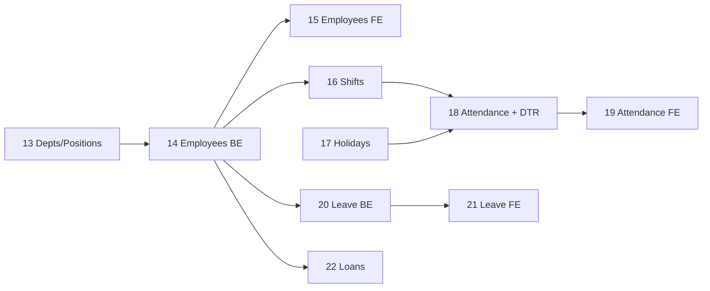

# Ogami ERP — Sprint 2 Implementation Plan
**Tasks 13-22 — Hire-to-Retire (Part 1): HR + Attendance + Leave + Loans**

> Pre-read: [`CLAUDE.md`](../CLAUDE.md:1), [`docs/PATTERNS.md`](../docs/PATTERNS.md:1), [`docs/DESIGN-SYSTEM.md`](../docs/DESIGN-SYSTEM.md:1), [`docs/SCHEMA.md`](../docs/SCHEMA.md:1), [`docs/SEEDS.md`](../docs/SEEDS.md:1).
> Sprint 1 (Tasks 1-12) is assumed complete: Sanctum SPA auth, RBAC, HashIDs, DocumentSequenceService, ApprovalService, AuditLog, Settings, base UI, DataTable, layouts, Chain components.

---

## 0. Sprint Overview

| Task | Scope | Tables | New permissions |
|---|---|---|---|
| 13 | Departments + Positions | `departments`, `positions` | `hr.departments.*`, `hr.positions.*` |
| 14 | Employees backend | `employees`, `employee_documents`, `employment_history`, `employee_property` | `hr.employees.*`, `hr.employees.view_sensitive` |
| 15 | Employees frontend | (consumes 14) | — |
| 16 | Shifts | `shifts`, `employee_shift_assignments` | `attendance.shifts.*` |
| 17 | Holidays | `holidays` | `attendance.holidays.*` |
| 18 | Attendance + DTR engine | `attendances`, `overtime_requests` | `attendance.attendances.*`, `attendance.overtime.approve` |
| 19 | Attendance frontend | (consumes 18) | — |
| 20 | Leave backend | `leave_types`, `employee_leave_balances`, `leave_requests` | `leave.types.*`, `leave.requests.*`, `leave.requests.approve_dept`, `leave.requests.approve_hr` |
| 21 | Leave frontend | (consumes 20) | — |
| 22 | Loans + Cash Advance | `employee_loans`, `loan_payments` | `loans.requests.*`, `loans.approve_*` |

Migration sequence: `0014` → `0029` (16 migrations). Add ALL new permissions to [`RolePermissionSeeder`](../api/database/seeders/RolePermissionSeeder.php:1) and assign to the 12 roles created in Task 10.

### Dependencies / order of execution within the sprint



### Cross-cutting rules (applied to every task)

- Every model: `HasHashId`, `HasAuditLog`, `SoftDeletes` where appropriate.
- Every API Resource returns `id => $this->hash_id` — never the raw integer.
- Every controller method delegates to a Service. Mutations wrapped in `DB::transaction()`.
- Every FormRequest has `authorize()` that calls `$this->user()->can('...')`.
- Every route group uses `auth:sanctum`, `feature:<module>`, `permission:<slug>`.
- Every list page handles 5 states: loading (Skeleton), error (EmptyState + retry), empty (EmptyState + create), data (DataTable), stale (placeholderData).
- Every form: Zod schema, RHF + zodResolver, mutation with `onSuccess`/`onError`, server-error mapping for 422, disabled-while-pending submit, cancel button, success toast + `invalidateQueries`.
- All numbers/dates/IDs in tables: `font-mono tabular-nums`, right-aligned for numeric, left for ID/date.
- All status fields: `<Chip variant=...>` with mapping defined in [`docs/DESIGN-SYSTEM.md`](../docs/DESIGN-SYSTEM.md:461).
- All routes registered in [`spa/src/App.tsx`](../spa/src/App.tsx:1) with `lazy()` + `AuthGuard` + `ModuleGuard module="hr"|"attendance"|"leave"|"loans"` + `PermissionGuard`.

### Settings to enable

In [`api/database/seeders/SettingsSeeder.php`](../api/database/seeders/SettingsSeeder.php:1), confirm flags: `modules.hr=true`, `modules.attendance=true`, `modules.leave=true`, `modules.loans=true` (already enabled per Task 12).

---

## TASK 13 — Departments & Positions

**Goal:** CRUD for the org structure. Departments are self-referencing (parent_id). Positions belong to departments.

### Backend files

```
api/database/migrations/0014_create_departments_table.php
api/database/migrations/0015_create_positions_table.php
api/app/Modules/HR/Enums/DepartmentCode.php          (optional, for seed reference)
api/app/Modules/HR/Models/Department.php
api/app/Modules/HR/Models/Position.php
api/app/Modules/HR/Services/DepartmentService.php
api/app/Modules/HR/Services/PositionService.php
api/app/Modules/HR/Requests/StoreDepartmentRequest.php
api/app/Modules/HR/Requests/UpdateDepartmentRequest.php
api/app/Modules/HR/Requests/ListDepartmentsRequest.php
api/app/Modules/HR/Requests/StorePositionRequest.php
api/app/Modules/HR/Requests/UpdatePositionRequest.php
api/app/Modules/HR/Requests/ListPositionsRequest.php
api/app/Modules/HR/Resources/DepartmentResource.php
api/app/Modules/HR/Resources/PositionResource.php
api/app/Modules/HR/Controllers/DepartmentController.php
api/app/Modules/HR/Controllers/PositionController.php
api/app/Modules/HR/routes.php                         (append)
api/database/seeders/DepartmentSeeder.php
api/database/seeders/PositionSeeder.php
```

### Migration specifics

`0014_create_departments_table.php` — per [`SCHEMA.md` lines 56](../docs/SCHEMA.md:56):
- `id`, `name string(100)`, `code string(20) unique`, `parent_id` (self-FK nullable, `constrained('departments')->nullOnDelete()`), `head_employee_id` (nullable, NOT constrained yet — circular FK; add separate alter migration after `employees` exists, OR leave as plain `bigInteger->nullable()->index()` and constrain in `0017_alter_departments_add_head_employee_fk.php` after task 14), `is_active bool default true`, timestamps. Index `parent_id`.
- Pattern: [`docs/PATTERNS.md` §1 Migration](../docs/PATTERNS.md:35).

`0015_create_positions_table.php` — per [`SCHEMA.md` lines 59](../docs/SCHEMA.md:59):
- `id`, `title string(100)`, `department_id` FK constrained, `salary_grade string(20) nullable`, timestamps. Index `department_id`.

### Model specifics

[`Department.php`](../api/app/Modules/HR/Models/Department.php:1):
- Traits: `HasFactory`, `HasHashId`, `HasAuditLog`. (No SoftDeletes — orgs use `is_active` flag.)
- Casts: `is_active => 'boolean'`.
- Relationships: `parent()` BelongsTo self, `children()` HasMany self, `positions()` HasMany Position, `employees()` HasMany Employee, `headEmployee()` BelongsTo Employee.
- Scopes: `scopeActive`, `scopeRoots` (where `parent_id` null).

[`Position.php`](../api/app/Modules/HR/Models/Position.php:1):
- Traits: `HasFactory`, `HasHashId`, `HasAuditLog`.
- Relationships: `department()` BelongsTo, `employees()` HasMany.

### Service specifics

[`DepartmentService.php`](../api/app/Modules/HR/Services/DepartmentService.php:1) — methods:
- `tree()` — returns flat list with `parent_id` already as `hash_id`; frontend builds tree. Eager load `parent`, `positions`, with `withCount('employees')`.
- `list($filters)` — paginated, filterable by `is_active`, search by `name`/`code`.
- `create($data)`, `update($dept, $data)`, `delete($dept)` (block delete if employees exist — return 422). All wrapped in `DB::transaction()`.

[`PositionService.php`](../api/app/Modules/HR/Services/PositionService.php:1):
- `list($filters)` — paginated, filter by `department_id`, search `title`. Eager load `department`, `withCount('employees')`.
- Standard CRUD.

### Resource specifics

```
DepartmentResource → { id, name, code, parent_id (hash_id), parent (when loaded),
  head_employee_id (hash_id), head_employee (when loaded), is_active,
  positions_count, employees_count, created_at, updated_at }
PositionResource → { id, title, department_id (hash_id), department (when loaded),
  salary_grade, employees_count, created_at, updated_at }
```

### Routes (append to [`api/app/Modules/HR/routes.php`](../api/app/Modules/HR/routes.php:1))

```
Route::middleware(['auth:sanctum','feature:hr'])->prefix('hr')->group(function(){
  Route::prefix('departments')->group(function(){
    Route::get('/',           [DepartmentController::class,'index'])->middleware('permission:hr.departments.view');
    Route::get('/tree',       [DepartmentController::class,'tree'])->middleware('permission:hr.departments.view');
    Route::post('/',          [DepartmentController::class,'store'])->middleware('permission:hr.departments.create');
    Route::get('/{department}', [DepartmentController::class,'show'])->middleware('permission:hr.departments.view');
    Route::put('/{department}', [DepartmentController::class,'update'])->middleware('permission:hr.departments.edit');
    Route::delete('/{department}', [DepartmentController::class,'destroy'])->middleware('permission:hr.departments.delete');
  });
  Route::apiResource('positions', PositionController::class)
      ->middleware([...permission map...]);
});
```

### Seeders

[`DepartmentSeeder.php`](../api/database/seeders/DepartmentSeeder.php:1) — 11 rows from [`SEEDS.md` §1](../docs/SEEDS.md:7).
[`PositionSeeder.php`](../api/database/seeders/PositionSeeder.php:1) — ~35 rows from [`SEEDS.md` §2](../docs/SEEDS.md:24); resolve `department_id` by code lookup.
Add both to [`DatabaseSeeder.php`](../api/database/seeders/DatabaseSeeder.php:1) call list AFTER `RolePermissionSeeder`.

### Frontend files

```
spa/src/types/hr.ts                                  (Department, Position interfaces)
spa/src/api/hr/departments.ts
spa/src/api/hr/positions.ts
spa/src/pages/hr/departments/index.tsx               (tree view + side panel)
spa/src/pages/hr/departments/create.tsx              (modal route or page)
spa/src/pages/hr/departments/[id]/edit.tsx
spa/src/pages/hr/positions/index.tsx                 (DataTable, filter by dept)
spa/src/pages/hr/positions/create.tsx
spa/src/pages/hr/positions/[id]/edit.tsx
spa/src/App.tsx                                      (register routes)
```

### Frontend specifics

- **Departments tree page** — left side: nested list, indent 16px per level, expand/collapse chevrons (Lucide). Right side: detail panel showing selected dept name/code/head/positions/employees count + Edit/Delete buttons. Use `<Panel>`. Tree built from `tree()` API — sort by `name`. All 5 states.
- **Positions list page** — copy [`docs/PATTERNS.md` §10](../docs/PATTERNS.md:830) verbatim. Columns: Title, Department (chip-style link), Salary Grade (mono), Employees count (mono right). Filter: department_id select. Search: title.
- **Forms** — copy [`docs/PATTERNS.md` §12](../docs/PATTERNS.md:1084). Department form: name, code, parent_id (Select w/ tree indentation), head_employee_id (async select — defer until Task 14 deployed; pass `null` initially), is_active switch. Position form: title, department_id, salary_grade.
- Zod schemas: `code: z.string().min(2).max(20).regex(/^[A-Z0-9]+$/)`, name max 100.

### Acceptance checks for Task 13

- [ ] `make migrate seed` produces 11 departments + ~35 positions.
- [ ] `/api/v1/hr/departments` returns 11 rows with `id` as hash strings.
- [ ] `/hr/departments` page renders tree, all 5 states.
- [ ] Cannot delete a department that has positions or employees (422).

---

## TASK 14 — Employees (Backend)

**Goal:** Employee master + history + property + documents. Employee numbers auto-generated `OGM-YYYY-NNNN` via `DocumentSequenceService`.

### Migrations

```
0016_create_employees_table.php
0017_alter_departments_add_head_employee_fk.php   (FK now safe to add)
0018_create_employee_documents_table.php
0019_create_employment_history_table.php
0020_create_employee_property_table.php
0021_alter_users_add_employee_fk.php              (only if Task 9 deferred this)
```

`0016_create_employees_table.php` — full column list per [`SCHEMA.md` line 62](../docs/SCHEMA.md:62). Notes:
- `employee_no string(20) unique`.
- All sensitive columns (`sss_no`, `philhealth_no`, `pagibig_no`, `tin`, `bank_account_no`) declared as `text()->nullable()` (encrypted casts expand size).
- `basic_monthly_salary decimal(15,2) nullable`, `daily_rate decimal(15,2) nullable`.
- `status string(20) default 'active'`.
- `softDeletes()`, `timestamps()`.
- Indexes: `status`, `department_id`, `position_id`, `date_hired`, `employment_type`, `pay_type`.

`0018_create_employee_documents_table.php`:
- `employee_id` FK, `document_type string(50)`, `file_name string(200)`, `file_path string(500)`, `uploaded_at timestamp`, `created_at`.

`0019_create_employment_history_table.php`:
- `employee_id` FK, `change_type string(30)`, `from_value json nullable`, `to_value json`, `effective_date date`, `remarks text nullable`, `approved_by` FK users nullable, `created_at`. Index `(employee_id, effective_date)`.

`0020_create_employee_property_table.php`:
- `employee_id` FK, `item_name string(200)`, `description text nullable`, `quantity int default 1`, `date_issued date`, `date_returned date nullable`, `status string(20) default 'issued'`, timestamps.

### Enums (PHP 8.1 backed enums in `api/app/Modules/HR/Enums/`)

```
EmployeeStatus.php      → active|on_leave|suspended|resigned|terminated|retired
EmploymentType.php      → regular|probationary|contractual|project_based
PayType.php             → monthly|daily
CivilStatus.php         → single|married|widowed|separated|divorced
Gender.php              → male|female
EmploymentChangeType.php → hired|promoted|transferred|salary_adjusted|regularized|separated
PropertyStatus.php      → issued|returned|lost
```

Each enum: case constants + `label(): string` method for UI display.

### Model specifics

[`Employee.php`](../api/app/Modules/HR/Models/Employee.php:1):
- Traits: `HasFactory, SoftDeletes, HasHashId, HasAuditLog`.
- Fillable: every column except sensitive plain numbers (those go through encrypted casts so still fillable).
- Casts: birth_date/date_hired/date_regularized → `date`; basic_monthly_salary/daily_rate → `decimal:2`; sss_no/philhealth_no/pagibig_no/tin/bank_account_no → `encrypted`; status → `EmployeeStatus::class`; employment_type → `EmploymentType::class`; pay_type → `PayType::class`; gender → `Gender::class`; civil_status → `CivilStatus::class`.
- Accessor: `getFullNameAttribute` (per [`docs/PATTERNS.md` §2](../docs/PATTERNS.md:170)).
- Relationships: department, position, user (HasOne via `users.employee_id`), documents (HasMany), employmentHistory (HasMany), property (HasMany), shiftAssignments (HasMany), attendances (HasMany), leaveBalances (HasMany), leaveRequests (HasMany), loans (HasMany), payrolls (HasMany).
- Scopes: `active`, `inDepartment($id)`.

`EmployeeDocument`, `EmploymentHistory`, `EmployeeProperty` — straightforward, all use `HasHashId`. EmploymentHistory casts `from_value`/`to_value` as `array`.

### Service — [`EmployeeService.php`](../api/app/Modules/HR/Services/EmployeeService.php:1)

Pattern: [`docs/PATTERNS.md` §3](../docs/PATTERNS.md:212). Methods:

- `list($filters)` — eager load `['department','position']`. Search across first/middle/last/employee_no. Filters: `department_id`, `status`, `employment_type`, `pay_type`. Allowed sorts: `employee_no`, `last_name`, `date_hired`, `status`. Default sort `employee_no desc`. Paginate (max 100/page).
- `show(Employee $e)` — eager load `['department','position','user','employmentHistory','property','documents']`.
- `create(array $data)` — `DB::transaction`: `employee_no = $sequences->generate('employee')` (format `OGM-YYYY-NNNN`, **yearly reset** — see [`CLAUDE.md` lines 401](../CLAUDE.md:401)); create employee; create initial `employment_history` row (change_type=`hired`, to_value snapshot); create default `employee_leave_balances` rows for current year (one per active leave type, total_credits=`default_balance`) — guard against task ordering by checking `Schema::hasTable('leave_types')`.
- `update(Employee $e, array $data)` — `DB::transaction`: detect material changes (department, position, salary, status), append `employment_history` rows for each (e.g., `salary_adjusted`, `transferred`, `promoted`, `regularized`).
- `separate(Employee $e, array $data)` — set status to one of resigned/terminated/retired, write `employment_history` row (change_type=`separated`, to_value carries reason+date), DO NOT delete; return employee. Future Task 71 builds full clearance/final-pay flow.
- `delete(Employee $e)` — soft delete (audit logs preserved).

Note: `DocumentSequenceService` `generate('employee')` must accept a custom format. Confirm Task 11's implementation supports `{PREFIX}-{YYYY}-{NNNN}` (yearly reset) in addition to default `{PREFIX}-{YYYYMM}-{NNNN}`. If not, add a sequence config in `DocumentSequenceService`:
```
'employee' => ['prefix' => 'OGM', 'reset' => 'yearly'],
```

### FormRequests

`StoreEmployeeRequest` — full rules per [`docs/PATTERNS.md` §4](../docs/PATTERNS.md:340). Validation highlights:
- `first_name`, `last_name` required string max 100.
- `birth_date` required date before today minus 18 years.
- `gender` required `Rule::enum(Gender::class)`. Same for `civil_status`, `employment_type`, `pay_type`.
- `department_id`, `position_id` required exists. Custom rule: position must belong to department.
- `basic_monthly_salary` required_if `pay_type,monthly`, decimal:0,2, min:0.
- `daily_rate` required_if `pay_type,daily`, decimal:0,2, min:0.
- `email` nullable email, unique on employees + users.
- `mobile_number` nullable string max 20, regex `/^[0-9+\-\s()]{7,20}$/`.
- Sensitive IDs: nullable string max 30, no format validation (encryption-stored).
- `authorize()` → `can('hr.employees.create')`.

`UpdateEmployeeRequest` — `sometimes` on each rule, `unique` rules ignore current id.
`ListEmployeesRequest` — validates filter/sort/page params.
`SeparateEmployeeRequest` — `separation_reason` Rule::in([resigned,terminated,retired,end_of_contract]), `separation_date` date, `remarks` text nullable.

### Resource — [`EmployeeResource.php`](../api/app/Modules/HR/Resources/EmployeeResource.php:1)

Pattern: [`docs/PATTERNS.md` §5](../docs/PATTERNS.md:422). Output:

```
{
  id: hash_id,
  employee_no, first_name, middle_name, last_name, suffix, full_name,
  birth_date, gender (value), civil_status (value), nationality,
  address: { street, barangay, city, province, zip_code },
  contact: { mobile_number, email, emergency_contact_{name,relation,phone} },
  status (value), employment_type (value), pay_type (value),
  date_hired, date_regularized,
  basic_monthly_salary, daily_rate,
  bank_name,
  // sensitive — masked unless self or has hr.employees.view_sensitive
  sss_no, philhealth_no, pagibig_no, tin, bank_account_no,
  department: DepartmentResource (whenLoaded),
  position: PositionResource (whenLoaded),
  created_at, updated_at,
}
```

`maskField()` helper as in pattern. Mask logic: returns `null` if null; full value if `$user->employee_id === $this->id` (self) OR `$user->can('hr.employees.view_sensitive')`; otherwise `••••` + last 4.

Sister resources: `EmployeeDocumentResource`, `EmploymentHistoryResource`, `EmployeePropertyResource`.

### Controller — [`EmployeeController.php`](../api/app/Modules/HR/Controllers/EmployeeController.php:1)

Pattern: [`docs/PATTERNS.md` §6](../docs/PATTERNS.md:506). Methods: `index`, `store`, `show`, `update`, `destroy`, plus:
- `separate(SeparateEmployeeRequest $req, Employee $employee)` — calls `service->separate()`, returns updated EmployeeResource.

### Routes (in [`api/app/Modules/HR/routes.php`](../api/app/Modules/HR/routes.php:1) under `prefix('hr')`)

```
Route::prefix('employees')->group(function(){
  Route::get('/',                 [EmployeeController::class,'index'])->middleware('permission:hr.employees.view');
  Route::post('/',                [EmployeeController::class,'store'])->middleware('permission:hr.employees.create');
  Route::get('/{employee}',       [EmployeeController::class,'show'])->middleware('permission:hr.employees.view');
  Route::put('/{employee}',       [EmployeeController::class,'update'])->middleware('permission:hr.employees.edit');
  Route::delete('/{employee}',    [EmployeeController::class,'destroy'])->middleware('permission:hr.employees.delete');
  Route::patch('/{employee}/separate', [EmployeeController::class,'separate'])->middleware('permission:hr.employees.separate');
});
```

### Permissions to add to seeder

```
hr.departments.{view,create,edit,delete}
hr.positions.{view,create,edit,delete}
hr.employees.{view,create,edit,delete,separate,view_sensitive,export}
```

Assign appropriate sets to: System Admin (all), HR Officer (all hr.* incl. sensitive), Department Head (view + view their dept only — row-level via service), Employee (view self only), others view-only.

### Acceptance checks for Task 14

- [ ] Can create employee → `employee_no` returned as `OGM-2026-0001`.
- [ ] Sensitive fields masked for non-HR user.
- [ ] Soft-deleting an employee preserves attendance/payroll history.
- [ ] PHPUnit feature test: full CRUD round-trip.

---

## TASK 15 — Employees (Frontend)

**Goal:** List, multi-section create form, tabbed detail page, edit form.

### Files

```
spa/src/api/hr/employees.ts
spa/src/types/hr.ts                                       (Employee + Document + History + Property interfaces)
spa/src/pages/hr/employees/index.tsx                      (list)
spa/src/pages/hr/employees/create.tsx                     (multi-section form)
spa/src/pages/hr/employees/[id].tsx                       (detail with tabs)
spa/src/pages/hr/employees/[id]/edit.tsx                  (edit form)
spa/src/pages/hr/employees/[id]/separate.tsx              (modal/page)
spa/src/components/hr/EmployeeTabs.tsx                    (tab strip)
spa/src/components/hr/tabs/OverviewTab.tsx
spa/src/components/hr/tabs/EmploymentHistoryTab.tsx
spa/src/components/hr/tabs/AttendanceTab.tsx              (placeholder until task 18-19)
spa/src/components/hr/tabs/PayrollTab.tsx                 (placeholder until sprint 3)
spa/src/components/hr/tabs/LeavesTab.tsx                  (placeholder until task 20-21)
spa/src/components/hr/tabs/LoansTab.tsx                   (placeholder until task 22)
spa/src/components/hr/tabs/DocumentsTab.tsx
spa/src/components/hr/tabs/PropertyTab.tsx
spa/src/components/hr/tabs/ActivityTab.tsx                (audit logs)
spa/src/App.tsx                                           (register routes)
```

### List page — [`pages/hr/employees/index.tsx`](../spa/src/pages/hr/employees/index.tsx:1)

Copy [`docs/PATTERNS.md` §10](../docs/PATTERNS.md:830) directly. Adjust:
- Columns (32px rows, mono numbers): Employee No (mono link), Name (full_name + position subtitle muted), Department, Pay Type, Date Hired (mono), Status (Chip).
- Status → variant map exact: active=success, on_leave=info, suspended=warning, resigned/retired=neutral, terminated=danger.
- Filter bar: department_id (Select async from `/hr/departments`), status (Select), employment_type (Select), pay_type (Select), search.
- Page header actions: Export CSV (calls `/hr/employees?export=csv`), Add Employee (permission `hr.employees.create`).
- All 5 states. `placeholderData` on useQuery.

### Create page — [`pages/hr/employees/create.tsx`](../spa/src/pages/hr/employees/create.tsx:1)

Pattern: [`docs/PATTERNS.md` §12](../docs/PATTERNS.md:1084). Sections (each `<fieldset>` with uppercase legend):

1. **Personal Information** — first_name, middle_name, last_name, suffix, birth_date (date input), gender (select), civil_status (select), nationality (default Filipino).
2. **Address** — street_address, barangay, city, province, zip_code.
3. **Contact** — mobile_number, email, emergency_contact_name, emergency_contact_relation, emergency_contact_phone.
4. **Employment Details** — department_id (select, populated via `useQuery` to /hr/departments), position_id (select, dependent — filtered by department), employment_type (select), pay_type (select), date_hired (date), basic_monthly_salary OR daily_rate (conditional, mono w/ ₱ prefix), status (default active).
5. **Government IDs** — sss_no, philhealth_no, pagibig_no, tin (all string, no format validation; helper text: "Stored encrypted").
6. **Banking** — bank_name, bank_account_no.

Submit → POST /hr/employees → toast success → navigate `/hr/employees/{hash_id}`. Server 422 errors mapped via `setError(field as keyof FormValues, ...)`. Submit disabled while pending. Cancel returns to list.

### Detail page — [`pages/hr/employees/[id].tsx`](../spa/src/pages/hr/employees/[id].tsx:1)

Layout (per [`docs/DESIGN-SYSTEM.md` line 676](../docs/DESIGN-SYSTEM.md:676)):
- Page header: full_name + employee_no, status Chip, action buttons (Edit, Separate, ⋯ menu with Print Profile / Soft Delete).
- 2/3 left main + 1/3 right panel grid (lg). On smaller screens stack.
- Main: tab strip (Overview, Employment History, Attendance, Payroll, Leaves, Loans, Documents, Property, Activity). Tab content lazy-loaded.
- Right `<Panel>`: LinkedRecords showing Department / Position / User account / Active Loans count. Below it ActivityStream from audit logs.

Loading/error/empty states for the main fetch. Each tab handles its own 5 states.

### Edit page

Reuses the create form sections. Pre-populate via `useQuery` then `reset()` form. PUT request. On success: invalidate `['employees']` and `['employee', id]`, toast, navigate to detail.

### Separate page/modal — [`[id]/separate.tsx`](../spa/src/pages/hr/employees/[id]/separate.tsx:1)

Small form: separation_reason (select), separation_date, remarks. Confirms with danger-styled button. PATCHes `/hr/employees/{id}/separate`.

### Routes registration

```tsx
<Route element={<ModuleGuard module="hr" />}>
  <Route path="/hr/employees" element={<PermissionGuard permission="hr.employees.view"><EmployeeList/></PermissionGuard>}/>
  <Route path="/hr/employees/create" element={<PermissionGuard permission="hr.employees.create"><EmployeeCreate/></PermissionGuard>}/>
  <Route path="/hr/employees/:id" element={<PermissionGuard permission="hr.employees.view"><EmployeeDetail/></PermissionGuard>}/>
  <Route path="/hr/employees/:id/edit" element={<PermissionGuard permission="hr.employees.edit"><EmployeeEdit/></PermissionGuard>}/>
  <Route path="/hr/employees/:id/separate" element={<PermissionGuard permission="hr.employees.separate"><EmployeeSeparate/></PermissionGuard>}/>
</Route>
```

### Acceptance checks for Task 15

- [ ] All 5 states render correctly in list (verified by toggling network).
- [ ] Pay-type conditional reveals correct salary/rate field.
- [ ] Submitting invalid form shows server errors inline + toast.
- [ ] Detail page tabs lazy-load and show their own loading skeletons.

---

## TASK 16 — Shifts

**Goal:** Shift master + employee shift assignments. Bulk-assign by department.

### Files

```
api/database/migrations/0022_create_shifts_table.php
api/database/migrations/0023_create_employee_shift_assignments_table.php
api/app/Modules/Attendance/Models/Shift.php
api/app/Modules/Attendance/Models/EmployeeShiftAssignment.php
api/app/Modules/Attendance/Services/ShiftService.php
api/app/Modules/Attendance/Services/ShiftAssignmentService.php
api/app/Modules/Attendance/Requests/{Store,Update,List}ShiftRequest.php
api/app/Modules/Attendance/Requests/AssignShiftRequest.php
api/app/Modules/Attendance/Requests/BulkAssignShiftRequest.php
api/app/Modules/Attendance/Resources/ShiftResource.php
api/app/Modules/Attendance/Resources/EmployeeShiftAssignmentResource.php
api/app/Modules/Attendance/Controllers/ShiftController.php
api/app/Modules/Attendance/Controllers/ShiftAssignmentController.php
api/app/Modules/Attendance/routes.php
api/database/seeders/ShiftSeeder.php

spa/src/types/attendance.ts
spa/src/api/attendance/shifts.ts
spa/src/pages/attendance/shifts/index.tsx              (list + detail panel)
spa/src/pages/attendance/shifts/create.tsx
spa/src/pages/attendance/shifts/[id]/edit.tsx
spa/src/pages/attendance/shifts/assign.tsx             (bulk assignment page)
```

### Migration `0022_create_shifts_table.php`

`name string(50)`, `start_time time`, `end_time time`, `break_minutes int`, `is_night_shift bool default false`, `is_extended bool default false`, `auto_ot_hours decimal(3,1) nullable`, timestamps.

### Migration `0023_create_employee_shift_assignments_table.php`

`employee_id`, `shift_id`, `effective_date date`, `end_date date nullable`, `created_at`. Index `(employee_id, effective_date)`.

### Service — `ShiftAssignmentService`

`bulkAssign($departmentId, $shiftId, $effectiveDate, $endDate=null)` — `DB::transaction`: close existing open assignments for those employees (set their `end_date` to `effectiveDate - 1 day`), then create new assignment rows. Returns count.

`current(Employee $e, Carbon $date)` — returns assignment row whose `effective_date <= $date` and (`end_date is null` or `end_date >= $date`). Used by DTR engine in Task 18.

### Seeder

4 shifts from [`SEEDS.md` §3](../docs/SEEDS.md:39).

### Frontend

- **Shifts list** — DataTable: Name, Start (mono), End (mono), Break (mono), Night (Chip info if true), Extended (Chip warning if true), Auto-OT (mono).
- **Bulk assign page** — form: Department (select), Shift (select), Effective Date, End Date (optional). Preview list of affected employees (shows count). Submit calls `POST /attendance/shift-assignments/bulk`. Toast: "Assigned X employees to Day Shift effective ...".

### Permissions

```
attendance.shifts.{view,create,edit,delete}
attendance.shift_assignments.{view,assign,bulk_assign}
```

---

## TASK 17 — Holidays

**Goal:** Holiday calendar that drives DTR computation in Task 18.

### Files

```
api/database/migrations/0024_create_holidays_table.php
api/app/Modules/Attendance/Enums/HolidayType.php       (regular|special_non_working)
api/app/Modules/Attendance/Models/Holiday.php
api/app/Modules/Attendance/Services/HolidayService.php
api/app/Modules/Attendance/Requests/{Store,Update,List}HolidayRequest.php
api/app/Modules/Attendance/Resources/HolidayResource.php
api/app/Modules/Attendance/Controllers/HolidayController.php
api/database/seeders/HolidaySeeder.php

spa/src/api/attendance/holidays.ts
spa/src/pages/attendance/holidays/index.tsx     (calendar + list view toggle)
spa/src/pages/attendance/holidays/create.tsx
spa/src/pages/attendance/holidays/[id]/edit.tsx
```

### Migration `0024_create_holidays_table.php`

`name string(100)`, `date date`, `type string(30)`, `is_recurring bool default false`, timestamps. Unique `(date, name)` to prevent duplicates. Index `date`.

### Service helper

`HolidayService::forDate(Carbon $d): ?Holiday` — used by DTR engine. Cache results in Redis for current year (key `holidays:2026`).

### Seeder

21 PH holidays from [`SEEDS.md` §4](../docs/SEEDS.md:48).

### Frontend

- **List/Calendar page** — toggle (`<Switch>` or two ghost buttons in header) between:
  - **List view**: DataTable with Date (mono), Name, Type (Chip — regular=warning, special_non_working=info).
  - **Calendar view**: month grid. Use `date-fns` to build month matrix; days with holidays show colored dot + name truncated. Click a day → opens modal showing/letting you add a holiday on that date (permission gated). Use the design tokens; no external calendar library needed for v1.
- All 5 states.

### Permissions

```
attendance.holidays.{view,create,edit,delete}
```

---

## TASK 18 — Attendance + DTR Computation Engine (CRITICAL)

**Goal:** Record attendance, import biometric CSVs, compute payroll-ready hours per Philippine labor law.

### Files

```
api/database/migrations/0025_create_attendances_table.php
api/database/migrations/0026_create_overtime_requests_table.php

api/app/Modules/Attendance/Enums/AttendanceStatus.php       (present|absent|late|halfday|on_leave|holiday|rest_day)
api/app/Modules/Attendance/Enums/OvertimeStatus.php         (pending|approved|rejected)
api/app/Modules/Attendance/Models/Attendance.php
api/app/Modules/Attendance/Models/OvertimeRequest.php

api/app/Modules/Attendance/Services/DTRComputationService.php   ★ critical
api/app/Modules/Attendance/Services/DTRImportService.php
api/app/Modules/Attendance/Services/AttendanceService.php
api/app/Modules/Attendance/Services/OvertimeService.php

api/app/Modules/Attendance/Requests/{Store,Update,List}AttendanceRequest.php
api/app/Modules/Attendance/Requests/ImportAttendanceRequest.php
api/app/Modules/Attendance/Requests/{Store,List}OvertimeRequestRequest.php
api/app/Modules/Attendance/Requests/ApproveOvertimeRequest.php
api/app/Modules/Attendance/Resources/AttendanceResource.php
api/app/Modules/Attendance/Resources/OvertimeRequestResource.php
api/app/Modules/Attendance/Controllers/AttendanceController.php
api/app/Modules/Attendance/Controllers/OvertimeController.php

api/tests/Unit/DTRComputationServiceTest.php          ★ exhaustive
api/tests/Feature/AttendanceImportTest.php
```

### Migration `0025_create_attendances_table.php`

Per [`SCHEMA.md` line 87](../docs/SCHEMA.md:87). Key indexes: `(employee_id, date)` unique, `date`, `status`. `day_type_rate decimal(5,2) default 1.00`.

### Migration `0026_create_overtime_requests_table.php`

`employee_id`, `date`, `hours_requested decimal(3,1)`, `reason text`, `status string(20) default 'pending'`, `approved_by` FK users nullable, `approved_at` timestamp nullable, `rejection_reason text nullable`, timestamps.

### DTRComputationService — design

Public API:

```php
public function computeForRecord(Attendance $a): Attendance
```

Inputs (resolved internally):
- `time_in`, `time_out` (Carbon timestamps; `time_out` may be next-day for night shift).
- `shift` (resolved via `ShiftAssignmentService::current($employee, $a->date)`; fall back to default Day Shift if none).
- `holiday` (via `HolidayService::forDate($a->date)`).
- `is_rest_day` (boolean, computed from employee's standard work week — for Sprint 2 use a simple "Sunday is rest day" rule; configurable per employee in Sprint 3).

Outputs (writes back onto `$a`):
- `regular_hours`, `overtime_hours`, `night_diff_hours`, `tardiness_minutes`, `undertime_minutes`, `holiday_type`, `is_rest_day`, `day_type_rate`, `status`.

#### Rules (codify as private methods)

1. **Worked minutes** = `time_out - time_in - break_minutes`. If `time_out < time_in` and shift is night, add 24h to time_out (cross-midnight). Negative or absurd (>20h) → throw with diagnostic; mark status=`absent` if both timestamps null.
2. **Tardiness** = max(0, time_in - shift_start) in minutes (capped at 480).
3. **Undertime** = max(0, shift_end - time_out) in minutes — but never count the OT extension as undertime.
4. **Regular hours** = min(worked_hours - overtime_hours, scheduled_hours = (shift_end - shift_start - break_minutes)/60). For Day Shift: 7.5 (8h - 0.5h break). Office: 8.0 (9h - 1h break).
5. **Overtime hours**:
   - If shift `is_extended` (Extended Day): regular = 7.5h, OT auto = up to `auto_ot_hours` (4.0h) without explicit approval. Anything beyond requires approved `OvertimeRequest`.
   - If non-extended: any time worked beyond shift end is OT *only if* there is an approved `OvertimeRequest` for that date. Otherwise, treated as unpaid (excess capped at 0 OT).
   - Rules clamp: OT minimum 30 minutes (round down to 0 if <30); maximum 4 hours.
6. **Night differential**: 10% premium for hours worked between **22:00 and 06:00 only**. Compute by intersecting `[time_in, time_out]` with the night band, summing minutes, dividing by 60. Does NOT depend on shift type.
7. **Holiday detection**:
   - `holiday = HolidayService::forDate($date)`.
   - `is_rest_day = $a->is_rest_day` (resolved from employee/shift schedule).
   - 14 combinations driven by `(holiday_type, is_rest_day, worked_or_not)`. Build `day_type_rate` per the Philippine DOLE rules:

| Day type | Worked? | Multiplier on basic |
|---|---|---|
| Regular working day | yes | 1.00 |
| Regular working day | no (with paid leave) | 1.00 (paid via leave; not OT) |
| Special non-working | not worked | 0.00 (no-work-no-pay unless company policy) |
| Special non-working | worked | 1.30 |
| Special non-working + rest day | worked | 1.50 |
| Regular holiday | not worked | 1.00 |
| Regular holiday | worked | 2.00 |
| Regular holiday + rest day | worked | 2.60 |
| Rest day | worked | 1.30 |
| Rest day | not worked | 0.00 |

   OT premiums apply on top of `day_type_rate` × 1.25 (regular OT) or × 1.30 (rest/holiday OT). Night diff applies on top: × 1.10 of resulting hourly.
   Monster case (regular holiday + rest day + night shift + OT): `day_type_rate=2.60`, OT multiplier 1.30 on top, night diff 1.10 → effective rate 2.60 × 1.30 × 1.10 ≈ **3.718** of basic for those OT hours; combined with the regular hours' 2.60 the day total can approach the cited 487% figure for the day. Encode this as composition, not magic constants.

   `day_type_rate` stored on the row is the multiplier for **regular hours only**. OT/night-diff multipliers are applied later by the payroll engine (Sprint 3) — DTR service stores raw hours buckets per category.

8. **Status assignment**:
   - both timestamps null & no leave → `absent`.
   - tardiness > 0 & worked_hours > 0 → `late`.
   - worked_hours <= half scheduled → `halfday`.
   - else → `present`.
   - Override to `holiday` / `rest_day` / `on_leave` if applicable & not worked.

#### Unit tests (exhaustive — Task 18 cannot ship without these)

[`DTRComputationServiceTest.php`](../api/tests/Unit/DTRComputationServiceTest.php:1) — 25+ cases covering:
- All 14 holiday/rest-day combinations × worked/not-worked.
- Day shift normal day; Day shift with 1h tardiness; Day shift with undertime.
- Extended Day with full 4h auto-OT; Extended Day with 6h actual (only 4h OT counted).
- Night Shift cross-midnight; night-diff hours equal to portion of shift in 22:00-06:00 band.
- Regular OT request approved → counts; not approved → does not count beyond shift end.
- Monster case: regular holiday + rest day + night shift + 4h OT.
- Edge: time_out before time_in on day shift (data error → throw).
- Edge: missing time_out (still in progress) → status `present` with worked = 0, no error.

### DTRImportService — CSV import

Method `import(UploadedFile $file): ImportResult`:
1. Parse CSV (`maatwebsite/excel`). Required columns: `employee_no`, `date`, `time_in`, `time_out`. Optional: `remarks`.
2. Validate header. Reject row if `employee_no` not found, or date invalid.
3. Build collection of rows; chunk 500.
4. For each row, `DB::transaction`: upsert attendance by `(employee_id, date)` (manual entry stays manual unless overwriting), call `DTRComputationService::computeForRecord` to fill computed fields.
5. Return `{ total, imported, skipped, errors: array<{row, message}> }`.

The controller endpoint accepts the file and returns the structured result so the frontend can show a summary.

### Service — `OvertimeService`

`request($employee, $date, $hours, $reason)`, `approve($otId, $approver)`, `reject($otId, $approver, $reason)`. On approve: if there's an existing attendance for that date, re-compute via DTR service so OT now counts.

### Routes

```
Route::middleware(['auth:sanctum','feature:attendance'])->prefix('attendance')->group(function(){
  Route::get('/attendances',                   [AttendanceController::class,'index'])->middleware('permission:attendance.attendances.view');
  Route::post('/attendances',                  [AttendanceController::class,'store'])->middleware('permission:attendance.attendances.create');
  Route::get('/attendances/{attendance}',      [AttendanceController::class,'show'])->middleware('permission:attendance.attendances.view');
  Route::put('/attendances/{attendance}',      [AttendanceController::class,'update'])->middleware('permission:attendance.attendances.edit');
  Route::delete('/attendances/{attendance}',   [AttendanceController::class,'destroy'])->middleware('permission:attendance.attendances.delete');
  Route::post('/attendances/import',           [AttendanceController::class,'import'])->middleware('permission:attendance.attendances.import');

  Route::get('/overtime-requests',             [OvertimeController::class,'index'])->middleware('permission:attendance.overtime.view');
  Route::post('/overtime-requests',            [OvertimeController::class,'store'])->middleware('permission:attendance.overtime.create');
  Route::patch('/overtime-requests/{ot}/approve', [OvertimeController::class,'approve'])->middleware('permission:attendance.overtime.approve');
  Route::patch('/overtime-requests/{ot}/reject',  [OvertimeController::class,'reject'])->middleware('permission:attendance.overtime.approve');
});
```

### Resource — `AttendanceResource`

```
{ id, employee_id (hash), employee {whenLoaded}, date, shift {whenLoaded},
  time_in, time_out,
  regular_hours, overtime_hours, night_diff_hours,
  tardiness_minutes, undertime_minutes,
  holiday_type, is_rest_day, day_type_rate, status,
  is_manual_entry, remarks, created_at, updated_at }
```

### Permissions

```
attendance.attendances.{view,create,edit,delete,import}
attendance.overtime.{view,create,approve}
```

### Acceptance checks for Task 18

- [ ] All DTR unit tests pass.
- [ ] CSV import of 100-row file completes < 10s and produces accurate aggregates per employee.
- [ ] Approving an OT request triggers recomputation for the matching attendance row.

---

## TASK 19 — Attendance Frontend

### Files

```
spa/src/api/attendance/attendances.ts
spa/src/api/attendance/overtime.ts
spa/src/pages/attendance/index.tsx                   (DataTable)
spa/src/pages/attendance/import.tsx                  (CSV upload)
spa/src/pages/attendance/[id].tsx                    (detail/edit modal)
spa/src/pages/attendance/overtime/index.tsx          (Kanban + list toggle)
spa/src/pages/attendance/overtime/create.tsx
spa/src/components/attendance/CsvDropzone.tsx
spa/src/components/attendance/ImportSummary.tsx
spa/src/components/attendance/OvertimeKanban.tsx
```

### List page

- DataTable columns: Date (mono), Employee No (mono link), Name, Shift, Time In (mono), Time Out (mono), Regular (mono), OT (mono), Night Diff (mono), Tardy (mono), Status (Chip).
- Filters: employee (async select), department, date range (two date inputs), status.
- Permission: `attendance.attendances.view`.
- All 5 states.

### Import page

- Drag-and-drop dropzone (file input fallback). Accept `.csv`. Max 5MB.
- After file selected: show preview of first 10 rows in a simple table (parsed client-side via PapaParse — already a TanStack peer or add). Validate header columns match; show errors inline.
- Submit button disabled until file valid.
- POST multipart/form-data `/attendance/attendances/import`.
- On success: render `<ImportSummary>` panel — total / imported / skipped / errors list. Toast.

### Overtime page

- Toggle (header buttons): List | Kanban.
- **Kanban view**: 3 columns (Pending / Approved / Rejected). Cards show: employee + date + hours + reason. Drag is NOT supported (read-only); approve/reject buttons on each pending card (only visible to approvers). On click: confirmation modal with optional remarks; reject requires remarks (per [`docs/PATTERNS.md` §15](../docs/PATTERNS.md:1434)).
- **List view**: DataTable with same columns + Status chip + Actions.

### Routes

```tsx
<Route element={<ModuleGuard module="attendance" />}>
  <Route path="/attendance" element={<PermissionGuard permission="attendance.attendances.view"><AttendanceList/></PermissionGuard>}/>
  <Route path="/attendance/import" element={<PermissionGuard permission="attendance.attendances.import"><AttendanceImport/></PermissionGuard>}/>
  <Route path="/attendance/overtime" element={<PermissionGuard permission="attendance.overtime.view"><OvertimeList/></PermissionGuard>}/>
  <Route path="/attendance/overtime/create" element={<PermissionGuard permission="attendance.overtime.create"><OvertimeCreate/></PermissionGuard>}/>
</Route>
```

### Acceptance

- [ ] CSV with 100 rows imports and renders import summary.
- [ ] Kanban shows correct counts; rejecting requires remarks.
- [ ] All numeric columns mono right-aligned.

---

## TASK 20 — Leave Management Backend

**Goal:** Leave types + balances + 2-tier approval (Employee → Dept Head → HR Officer).

### Files

```
api/database/migrations/0027_create_leave_types_table.php
api/database/migrations/0028_create_employee_leave_balances_table.php
api/database/migrations/0029_create_leave_requests_table.php

api/app/Modules/Leave/Enums/LeaveRequestStatus.php   (pending_dept|pending_hr|approved|rejected|cancelled)
api/app/Modules/Leave/Models/LeaveType.php
api/app/Modules/Leave/Models/EmployeeLeaveBalance.php
api/app/Modules/Leave/Models/LeaveRequest.php

api/app/Modules/Leave/Services/LeaveTypeService.php
api/app/Modules/Leave/Services/LeaveBalanceService.php
api/app/Modules/Leave/Services/LeaveRequestService.php

api/app/Modules/Leave/Requests/{Store,Update}LeaveTypeRequest.php
api/app/Modules/Leave/Requests/{Store,List}LeaveRequestRequest.php
api/app/Modules/Leave/Requests/ApproveLeaveRequest.php

api/app/Modules/Leave/Resources/LeaveTypeResource.php
api/app/Modules/Leave/Resources/EmployeeLeaveBalanceResource.php
api/app/Modules/Leave/Resources/LeaveRequestResource.php

api/app/Modules/Leave/Controllers/LeaveTypeController.php
api/app/Modules/Leave/Controllers/LeaveRequestController.php
api/app/Modules/Leave/Controllers/LeaveBalanceController.php
api/app/Modules/Leave/routes.php

api/database/seeders/LeaveTypeSeeder.php
```

### Migrations

`0027_create_leave_types_table.php` per [`SCHEMA.md` line 100](../docs/SCHEMA.md:100).

`0028_create_employee_leave_balances_table.php` per [`SCHEMA.md` line 102](../docs/SCHEMA.md:102). Unique `(employee_id, leave_type_id, year)`.

`0029_create_leave_requests_table.php` per [`SCHEMA.md` line 105](../docs/SCHEMA.md:105). Add `dept_approver_id` FK users nullable, `dept_approved_at` ts nullable, `hr_approver_id` FK users nullable, `hr_approved_at` ts nullable. Indexes `(employee_id, status)`, `(status)`.

### Service — `LeaveRequestService`

- `submit($employee, $data)` — `DB::transaction`:
  1. Generate `leave_request_no` via `DocumentSequenceService::generate('leave_request')` → `LR-YYYYMM-NNNN` per [`CLAUDE.md` line 408](../CLAUDE.md:408).
  2. Validate balance: ensure `EmployeeLeaveBalance::remaining >= days` for current year. Reject (422) if insufficient (HR can override via flag).
  3. Validate no overlap with another `pending_*|approved` request.
  4. Validate `start_date >= today` (HR override allowed via flag).
  5. Create row with `status = pending_dept`.
  6. Create `ApprovalRecord` rows (uses `HasApprovalWorkflow` trait + `ApprovalService` from Task 11): step 1 `dept_head`, step 2 `hr_officer`.
- `approveDept($req, $approver, $remarks)` — checks approver is dept head of employee's department; sets `status=pending_hr`, writes ApprovalRecord, notifies HR Officer.
- `approveHR($req, $approver, $remarks)` — final approval. `DB::transaction`:
  1. Set `status=approved`, `hr_approver_id`, `hr_approved_at`.
  2. **Deduct balance**: `EmployeeLeaveBalance::increment('used', $days)`, recompute `remaining`.
  3. **Mark attendance**: for each date in range, upsert `attendances` row with `status=on_leave`, `holiday_type=null`, `regular_hours = (shift scheduled hours)` if leave_type.is_paid else 0. (Day-type rate handled by payroll later.)
  4. Notify employee.
- `reject($req, $approver, $reason)` — sets `status=rejected`, writes ApprovalRecord; balance untouched.
- `cancel($req, $employee)` — only if `pending_*`; sets `status=cancelled`. If was `approved`, also restores balance + reverts attendance (HR-only override flag).

### Balance management

- On Employee creation (Task 14): seed `employee_leave_balances` for current year using `default_balance` per active leave type.
- Year-rollover (deferred to a console command in Sprint 3): for `is_convertible_year_end`, convert remaining to cash via Accounting JE; reset balances.

### Permissions

```
leave.types.{view,create,edit,delete}
leave.requests.{view,create,view_all,cancel}
leave.requests.approve_dept
leave.requests.approve_hr
leave.balances.view
leave.balances.adjust            (HR only — manual balance corrections)
```

Row-level rule (enforced server-side in `LeaveRequestService::list`): non-admins, non-HR see only their own requests + (if dept head) requests pending their approval.

### Routes

```
Route::middleware(['auth:sanctum','feature:leave'])->prefix('leaves')->group(function(){
  Route::apiResource('types', LeaveTypeController::class)->middleware([...]);
  Route::get('/balances/me', [LeaveBalanceController::class,'me']);
  Route::get('/balances/{employee}', [LeaveBalanceController::class,'forEmployee']);
  Route::get('/requests', [LeaveRequestController::class,'index'])->middleware('permission:leave.requests.view');
  Route::post('/requests', [LeaveRequestController::class,'store'])->middleware('permission:leave.requests.create');
  Route::get('/requests/{leaveRequest}', [LeaveRequestController::class,'show'])->middleware('permission:leave.requests.view');
  Route::patch('/requests/{leaveRequest}/approve-dept', [LeaveRequestController::class,'approveDept'])->middleware('permission:leave.requests.approve_dept');
  Route::patch('/requests/{leaveRequest}/approve-hr', [LeaveRequestController::class,'approveHR'])->middleware('permission:leave.requests.approve_hr');
  Route::patch('/requests/{leaveRequest}/reject', [LeaveRequestController::class,'reject']);   // both approvers can reject (checked in controller)
  Route::patch('/requests/{leaveRequest}/cancel', [LeaveRequestController::class,'cancel'])->middleware('permission:leave.requests.cancel');
});
```

### Seeder

8 leave types from [`SEEDS.md` §5](../docs/SEEDS.md:74).

### Acceptance

- [ ] Submit, dept-approve, HR-approve flow updates balance and attendance rows.
- [ ] Cannot submit overlapping leave.
- [ ] Cannot submit when balance insufficient (unless HR override).

---

## TASK 21 — Leave Management Frontend

### Files

```
spa/src/api/leave/types.ts
spa/src/api/leave/balances.ts
spa/src/api/leave/requests.ts
spa/src/pages/leaves/index.tsx               (list + Kanban toggle)
spa/src/pages/leaves/create.tsx
spa/src/pages/leaves/[id].tsx
spa/src/pages/leaves/calendar.tsx
spa/src/pages/leaves/approvals.tsx
spa/src/pages/admin/leave-types/index.tsx    (HR admin)
spa/src/pages/admin/leave-types/create.tsx
spa/src/pages/admin/leave-types/[id]/edit.tsx
spa/src/components/leave/LeaveBalanceBar.tsx
spa/src/components/leave/LeaveCalendar.tsx
spa/src/components/leave/LeaveKanban.tsx
spa/src/components/leave/ApprovalChainTimeline.tsx
```

### List/Kanban page

- Toggle in page header.
- List: DataTable. Columns: LR No (mono link), Employee, Type, Start (mono), End (mono), Days (mono), Status (Chip — pending_dept=warning, pending_hr=info, approved=success, rejected=danger, cancelled=neutral).
- Kanban: columns Pending Dept / Pending HR / Approved / Rejected. Cards show LR No, employee, type, dates, days, reason snippet.
- Header action: "Request Leave" (any user) → `/leaves/create`.

### Create form

- Field: leave_type_id (Select). On change, fetch + display `<LeaveBalanceBar>` showing remaining/total visually.
- Date range (start_date, end_date). On change, compute `days` (excluding Sundays + holidays — query `/attendance/holidays?from&to`). Display computed days mono.
- Reason textarea.
- Document upload (only shown if leave_type.requires_document).
- Submit POSTs `/leaves/requests`, then navigates to detail page.

### Detail page

- Header: LR No + status chip + employee.
- Two-column: main shows leave info, document download, reason. Right `<Panel>`: `<ApprovalChainTimeline>` (uses ChainHeader-style component with steps Submitted → Dept Approved → HR Approved).
- If user is current approver: `<ApprovalActions>` from [`docs/PATTERNS.md` §15](../docs/PATTERNS.md:1434).
- Cancel button if `pending_*` and owner.

### Calendar page

- Month view with Lucide chevrons. For each day, render colored dots (one per approved leave overlapping that day, capped 3 visible "+N more"). Filter: department.
- Click a day → side panel listing leaves on that day.

### Approvals page

- Two tabs: "Pending My Approval" (uses dept-head's permission to see their dept's requests; HR officer sees pending_hr).
- Each row has approve/reject inline (modal pattern).

### Admin: leave types management

- DataTable list at `/admin/leave-types`. Form has all fields per schema.

### Acceptance

- [ ] Self-service user sees only own requests in list (server-enforced).
- [ ] Dept head sees requests for their dept under "Pending Dept Approval".
- [ ] Approving as HR: balance goes down on detail page after refresh.

---

## TASK 22 — Loans & Cash Advance

**Goal:** Two products (company_loan, cash_advance) with distinct approval chains and amortization schedules.

### Migrations

`0030_create_employee_loans_table.php` per [`SCHEMA.md` line 138](../docs/SCHEMA.md:138). Augment with:
- `interest_rate decimal(5,2) default 0.00` (per CLAUDE business rule: zero interest, but make it a column for future flexibility).
- `pay_periods_total int`.
- `approval_step int default 0`, `approval_chain_size int`.
- `purpose text nullable`.

`0031_create_loan_payments_table.php` per [`SCHEMA.md` line 141](../docs/SCHEMA.md:141). Add `payment_type string(20)` (`payroll_deduction`/`manual`/`final_pay`).

(Note: matches the schema but renumbered to fit Sprint 2's `0030`/`0031`. If Sprint 3 already reserves these numbers in [`docs/TASKS.md`](../docs/TASKS.md:99) for payroll, RENUMBER these here to `0030`/`0031` and shift payroll migrations later. Resolution: Sprint 3 starts at `0030_create_government_contribution_tables_table.php`. **Therefore renumber Sprint 2 loans migrations to `0028_create_employee_loans_table.php` and `0029_create_employee_loan_payments_table.php` and renumber the leave migrations to `0025/0026/0027`.** See revised migration map at the end of this document.)

### Files

```
api/app/Modules/Loans/Enums/LoanType.php       (company_loan|cash_advance)
api/app/Modules/Loans/Enums/LoanStatus.php     (pending|active|paid|cancelled|rejected)
api/app/Modules/Loans/Enums/LoanPaymentType.php (payroll_deduction|manual|final_pay)
api/app/Modules/Loans/Models/EmployeeLoan.php
api/app/Modules/Loans/Models/LoanPayment.php
api/app/Modules/Loans/Services/LoanService.php
api/app/Modules/Loans/Services/AmortizationService.php
api/app/Modules/Loans/Requests/{Store,Update,List}LoanRequest.php
api/app/Modules/Loans/Requests/ApproveLoanRequest.php
api/app/Modules/Loans/Resources/EmployeeLoanResource.php
api/app/Modules/Loans/Resources/LoanPaymentResource.php
api/app/Modules/Loans/Controllers/LoanController.php
api/app/Modules/Loans/routes.php

spa/src/api/loans/loans.ts
spa/src/pages/loans/index.tsx
spa/src/pages/loans/create.tsx
spa/src/pages/loans/[id].tsx
spa/src/pages/loans/approvals.tsx
spa/src/components/loans/AmortizationPreview.tsx
spa/src/components/loans/LoanApprovalChain.tsx
```

### Service — `LoanService`

`request($employee, array $data)` — `DB::transaction`:
1. Validate one-active-loan-per-type rule: count active company_loan = 0; count active cash_advance = 0. Else 422.
2. Validate amount caps:
   - `cash_advance`: max = 1 month basic (or 30 × daily_rate). Configurable via Setting `loans.cash_advance.max_multiplier=1.0`.
   - `company_loan`: max = 1 month basic_monthly_salary. (No tiered cap for v1.)
3. Generate `loan_no` (`CL-YYYYMM-NNNN` for company, `CA-YYYYMM-NNNN` for cash advance).
4. Compute amortization via `AmortizationService::generate($principal, $payPeriods)` — equal split, no interest. Return list of `{period_index, due_date_estimate, amount}` (due dates left null, computed at payroll time).
5. Set `pay_periods_remaining = pay_periods_total = $data['pay_periods']`.
6. Create approval chain:
   - `cash_advance` (3-level): Staff → Dept Head → Accounting → VP. (Reading [`docs/TASKS.md` line 87](../docs/TASKS.md:87) — note: that's 4 steps including Staff submission. Treat Staff as the submitter, so the chain is 3 approvers: Dept Head → Accounting → VP. Set `approval_chain_size=3`.)
   - `company_loan` (4 approvers): Dept Head → Manager → Accounting → VP. `approval_chain_size=4`.
   - Use `ApprovalService::start($loan, $stepsConfig)` from Task 11.
7. Set status=`pending`.

`approve($loan, $approver, $remarks)` — `DB::transaction`:
1. `ApprovalService::approve($loan, $approver, $remarks)`.
2. If returned chain is fully approved: set `status=active`, `start_date=today`, recompute amortization with concrete dates (next semi-monthly payroll forward), notify employee + payroll team.

`reject($loan, $approver, $reason)` — sets `status=rejected`.

`recordPayment($loan, $amount, $type, $payrollId=null)` — `DB::transaction`: appends LoanPayment, increments `total_paid`, decrements `balance` and `pay_periods_remaining`. If balance ≤ 0: set `status=paid`. (Sprint 3 payroll engine calls this for each finalized period.)

`activeForPayroll($employeeId)` — used by Sprint 3's `PayrollCalculatorService`: returns active loans + their `monthly_amortization` to deduct.

### AmortizationService

```php
public function generate(string $principal, int $periods): array
{
    $perPeriod = bcdiv($principal, (string)$periods, 2);
    $sched = [];
    $running = $principal;
    for ($i = 1; $i <= $periods; $i++) {
        $amt = $i === $periods ? $running : $perPeriod;
        $running = bcsub($running, $amt, 2);
        $sched[] = ['period' => $i, 'amount' => $amt, 'remaining_after' => $running];
    }
    return $sched;
}
```

### Permissions

```
loans.requests.{view,create,view_all,cancel}
loans.approve_dept_head
loans.approve_manager
loans.approve_accounting
loans.approve_vp
```

### Routes

```
Route::middleware(['auth:sanctum','feature:loans'])->prefix('loans')->group(function(){
  Route::get('/',                 [LoanController::class,'index'])->middleware('permission:loans.requests.view');
  Route::post('/',                [LoanController::class,'store'])->middleware('permission:loans.requests.create');
  Route::get('/{loan}',           [LoanController::class,'show'])->middleware('permission:loans.requests.view');
  Route::patch('/{loan}/approve', [LoanController::class,'approve']);    // controller checks permission per current step
  Route::patch('/{loan}/reject',  [LoanController::class,'reject']);
  Route::patch('/{loan}/cancel',  [LoanController::class,'cancel'])->middleware('permission:loans.requests.cancel');
});
```

### Frontend

- **List page** — DataTable: Loan No (mono link), Employee, Type (Chip neutral), Principal (mono right ₱), Balance (mono right ₱), Periods Remaining (mono), Status (Chip).
- **Create page** —
  - Section 1: type (radio: Company Loan vs Cash Advance). Selecting one fetches `/loans/limits/me` to display max. Helper: "You can borrow up to ₱X based on your basic salary."
  - Section 2: principal (mono ₱), pay_periods (number), purpose.
  - Live `<AmortizationPreview>` panel showing per-period breakdown (mono table). Updates as user types.
- **Detail page** — header: loan_no + status chip. Main: amortization schedule table (period | due date | amount | status), payment history table. Right: `<LoanApprovalChain>` showing 3 or 4 steps with current approver highlighted (uses ChainHeader pattern).
- **Approvals page** — pending loans for current user's role.

### Acceptance

- [ ] Cannot create a 2nd active loan of same type (422 validation).
- [ ] Amortization preview matches saved schedule.
- [ ] After all approvals: status flips to active, employee notified.

---

## CONSOLIDATED MIGRATION MAP (Sprint 2)

Resolves numbering conflicts with Sprint 3 reservations.

```
0014_create_departments_table.php
0015_create_positions_table.php
0016_create_employees_table.php
0017_alter_departments_add_head_employee_fk.php
0018_create_employee_documents_table.php
0019_create_employment_history_table.php
0020_create_employee_property_table.php
0021_create_shifts_table.php
0022_create_employee_shift_assignments_table.php
0023_create_holidays_table.php
0024_create_attendances_table.php
0025_create_overtime_requests_table.php
0026_create_leave_types_table.php
0027_create_employee_leave_balances_table.php
0028_create_leave_requests_table.php
0029_create_employee_loans_table.php
0030_alter_employees_constrain_to_users.php       (any pending FK alters; optional)
```

(Sprint 3 starts at `0031_create_government_contribution_tables_table.php` — adjust [`docs/TASKS.md`](../docs/TASKS.md:99) numbering accordingly when Sprint 3 begins.)

If `loan_payments` is needed in this sprint for completeness, slot it as `0030_create_loan_payments_table.php` and shift the alter migration to `0031`. Recommend: **do create `loan_payments` now** so the schema is complete and the model relationships work.

```
0030_create_loan_payments_table.php
```

---

## SEEDER ORDER (DatabaseSeeder.php)

After Sprint 1 seeders (`RolePermissionSeeder`, `WorkflowSeeder`, `SettingsSeeder`):

```
DepartmentSeeder
PositionSeeder
ShiftSeeder
HolidaySeeder
LeaveTypeSeeder
DemoEmployeesSeeder        (tiny — 3-5 employees for dev smoke testing; full demo in Task 80)
```

`DemoEmployeesSeeder` creates: 1 system admin (already created in Task 9), 1 HR Officer, 1 Dept Head (Production), 2 Operators. Each linked to its `users` row. Used to test approvals end-to-end.

---

## ROUTE REGISTRATION SUMMARY

Append to [`spa/src/App.tsx`](../spa/src/App.tsx:1) (lazy imports + ModuleGuard groups):

```tsx
// Lazy imports
const DepartmentList   = lazy(() => import('@/pages/hr/departments'));
const DepartmentCreate = lazy(() => import('@/pages/hr/departments/create'));
// ... (full list — one per page file enumerated above)

// HR group
<Route element={<ModuleGuard module="hr" />}>
  <Route path="/hr/departments" element={...} />
  <Route path="/hr/departments/create" element={...} />
  <Route path="/hr/departments/:id/edit" element={...} />
  <Route path="/hr/positions" element={...} />
  <Route path="/hr/positions/create" element={...} />
  <Route path="/hr/positions/:id/edit" element={...} />
  <Route path="/hr/employees" element={...} />
  <Route path="/hr/employees/create" element={...} />
  <Route path="/hr/employees/:id" element={...} />
  <Route path="/hr/employees/:id/edit" element={...} />
  <Route path="/hr/employees/:id/separate" element={...} />
</Route>

// Attendance group
<Route element={<ModuleGuard module="attendance" />}>
  <Route path="/attendance/shifts" element={...} />
  <Route path="/attendance/shifts/create" element={...} />
  <Route path="/attendance/shifts/:id/edit" element={...} />
  <Route path="/attendance/shifts/assign" element={...} />
  <Route path="/attendance/holidays" element={...} />
  <Route path="/attendance" element={...} />
  <Route path="/attendance/import" element={...} />
  <Route path="/attendance/overtime" element={...} />
  <Route path="/attendance/overtime/create" element={...} />
</Route>

// Leave group
<Route element={<ModuleGuard module="leave" />}>
  <Route path="/leaves" element={...} />
  <Route path="/leaves/create" element={...} />
  <Route path="/leaves/:id" element={...} />
  <Route path="/leaves/calendar" element={...} />
  <Route path="/leaves/approvals" element={...} />
  <Route path="/admin/leave-types" element={...} />
</Route>

// Loans group
<Route element={<ModuleGuard module="loans" />}>
  <Route path="/loans" element={...} />
  <Route path="/loans/create" element={...} />
  <Route path="/loans/:id" element={...} />
  <Route path="/loans/approvals" element={...} />
</Route>
```

Sidebar nav entries (append to `Sidebar.tsx` config):

```
PEOPLE
  Employees                  /hr/employees           hr.employees.view
  Departments                /hr/departments         hr.departments.view
  Positions                  /hr/positions           hr.positions.view
ATTENDANCE
  Daily Time Records         /attendance             attendance.attendances.view
  Import DTR                 /attendance/import      attendance.attendances.import
  Overtime Requests          /attendance/overtime    attendance.overtime.view
  Shifts                     /attendance/shifts      attendance.shifts.view
  Holidays                   /attendance/holidays    attendance.holidays.view
LEAVE
  My Leaves / All Leaves     /leaves                 leave.requests.view
  Leave Calendar             /leaves/calendar        leave.requests.view
  Approvals                  /leaves/approvals       leave.requests.approve_dept|approve_hr
LOANS
  Loans & Cash Advance       /loans                  loans.requests.view
  Approvals                  /loans/approvals        loans.approve_*
```

---

## TESTING CHECKLIST (run before declaring sprint done)

Backend (PHPUnit):
- [ ] `tests/Feature/HR/DepartmentTest.php` — CRUD + tree.
- [ ] `tests/Feature/HR/EmployeeTest.php` — CRUD + masking + separate.
- [ ] `tests/Feature/Attendance/ShiftAssignmentTest.php` — bulk assign.
- [ ] `tests/Feature/Attendance/AttendanceImportTest.php` — CSV import success + partial fail.
- [ ] `tests/Unit/DTRComputationServiceTest.php` — 25+ cases (see Task 18).
- [ ] `tests/Feature/Leave/LeaveRequestTest.php` — submit → dept approve → HR approve, balance + attendance side-effects.
- [ ] `tests/Feature/Loans/LoanTest.php` — request, approval chain, amortization.

Frontend (Vitest):
- [ ] Smoke render of each list page (mock client returns paginated empty + non-empty).
- [ ] Form validation tests for employee, leave, loan create forms.
- [ ] DTR import preview parser test.

Manual QA (matrix):
- [ ] Light + dark mode each page.
- [ ] All 5 page states observable on every list page (use Network throttling / mock 500).
- [ ] Sensitive fields masked when logged in as non-HR user.
- [ ] Sidebar filters out modules when feature toggle off.

Final pre-commit checklist (every task):
- [ ] No raw integer IDs in any API response.
- [ ] No Bearer tokens; `withCredentials: true` everywhere.
- [ ] All numeric/ID/date table cells `font-mono tabular-nums`.
- [ ] All status fields use `<Chip>` with mapped variants.
- [ ] Every route has AuthGuard + ModuleGuard + PermissionGuard.
- [ ] Every page lazy-loaded.
- [ ] Geist + Geist Mono active.
- [ ] 32px row height on tables; uppercase 10px headers.
- [ ] Commit per task: `feat: task NN — <short>`. Push branch `feat/sprint-2-hire-to-retire-pt1`. Open PR against `main`.

---

## RISKS / OPEN QUESTIONS

1. **Migration numbering** — assumed Sprint 1 ended at `0013_create_settings_table.php`. Verify before applying. If different, shift the whole map.
2. **DocumentSequenceService format** — Task 11 may have hard-coded `{PREFIX}-{YYYYMM}-{NNNN}`. The employee number (`OGM-YYYY-NNNN`) needs **yearly** reset. Add a `reset` config option (`monthly|yearly`) before Task 14 begins.
3. **Department head circular FK** — handled by deferring `head_employee_id` constraint to `0017_alter_departments_add_head_employee_fk.php` after `employees` table exists.
4. **Rest day per employee** — Sprint 2 uses "Sunday by default". For a per-employee rest day, add `rest_day_of_week tinyint nullable` to employees in a Sprint 3 alter migration; DTR engine currently reads from a static rule but the interface is shaped to swap in a per-employee resolver later.
5. **OT request linkage** — DTR engine recomputes attendance on OT approval; ensure approval handler explicitly calls `DTRComputationService::computeForRecord` and saves.
6. **Leave-attendance interaction** — when leave approved, we mutate `attendances`. Make sure that flow is idempotent (re-approving / canceling cleans up its own rows only). Tag rows written by leave with `is_manual_entry=false` and `remarks="leave:LR-...".` so we can identify them.
7. **Self-service portal scope** — Task 22 frontend lists are admin/HR-oriented. Self-service simplified views (employee sees only their own) come in Task 74 (Sprint 8). For Sprint 2, list pages enforce row-level filtering server-side and that's enough.
8. **Reverb / WebSocket** — not required this sprint; payroll real-time progress arrives in Sprint 3.

---

## DELIVERABLE STATE AT END OF SPRINT 2

- 16 new migrations applied; 5 seeders populated.
- 4 modules (HR, Attendance, Leave, Loans) fully wired backend + frontend.
- ~30 frontend pages + ~12 reusable HR/attendance/leave/loan components.
- DTR engine tested against all 14 holiday/rest-day combinations + monster case.
- Approval workflows operating end-to-end for Leaves and Loans.
- Foundation ready for Sprint 3 Payroll: it will read from `attendances`, `employee_loans`, `government_contribution_tables` (new), and `payroll_periods` (new).
