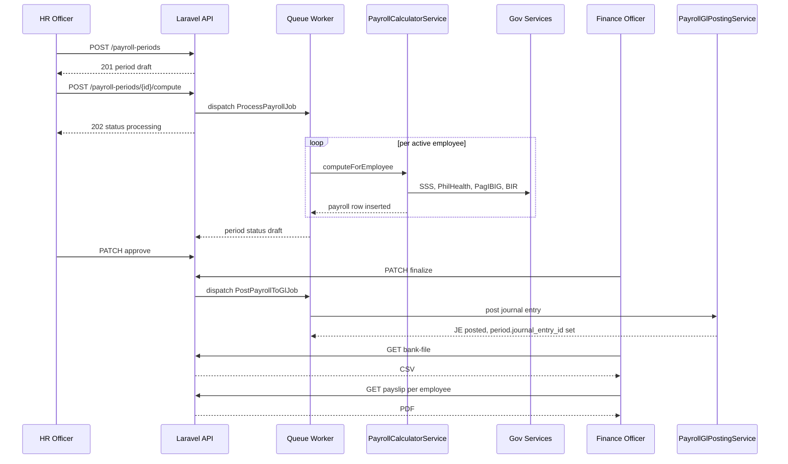

# Sprint 3 — Hire-to-Retire Part 2: Payroll (Tasks 23–30)

> Chain 3 (Hire → Retire) reaches its commercial peak here: government tables → contribution math → DTR-aware payroll engine → queued processing → payslip PDF + bank file → 13th month accrual → GL auto-posting → admin UI + self-service. Every screen mirrors [`docs/PATTERNS.md`](docs/PATTERNS.md:1) section-for-section; every column matches [`docs/SCHEMA.md`](docs/SCHEMA.md:110); every constant comes from [`docs/SEEDS.md`](docs/SEEDS.md:154).

---

## 0. Scope, dependencies, and ground rules

### Inbound dependencies (must already exist from Sprints 1–2)

- Sprint 1 foundation: [`HasHashId`](api/app/Common/Traits/HasHashId.php:1), [`HasAuditLog`](api/app/Common/Traits/HasAuditLog.php:1), `DocumentSequenceService`, `ApprovalService`, [`tokens.css`](spa/src/styles/tokens.css:1), [`DataTable`](spa/src/components/ui/DataTable.tsx:1), [`Chip`](spa/src/components/ui/Chip.tsx:1), [`PageHeader`](spa/src/components/layout/PageHeader.tsx:1), guards.
- Sprint 2: [`Employee`](spa/src/api/hr/employees.ts:1) model with `pay_type`, `basic_monthly_salary`, `daily_rate`, `bank_account_no` (encrypted); `Attendance` with computed `regular_hours`, `overtime_hours`, `night_diff_hours`, `tardiness_minutes`, `undertime_minutes`, `day_type_rate`; `EmployeeLoan` with `monthly_amortization`, `pay_periods_remaining`, `status='active'`.
- Sprint 1 Task 12 settings + feature toggle `modules.payroll=true`.
- Sprint 4 prerequisite that Sprint 3 produces but does **not yet consume**: COA accounts (Salaries Expense `5050`, OT Expense, SSS/PhilHealth/Pag-IBIG Expense + Payable, Withholding Tax Payable, Loans Payable, Cash in Bank, 13th Month Pay Payable). Task 29 needs these accounts to exist; if Sprint 4 is not yet built, the GL posting service must **degrade gracefully** by storing a pending `journal_entries` payload OR the seeder must front-load the minimum 11 payroll-related accounts. **Decision: front-load the 11 accounts in `PayrollChartAccountsSeeder` so Task 29 is fully testable before Sprint 4.**

### Cross-cutting guarantees (verify on every file)

- ✅ All money columns: `decimal(15, 2)`. Never float. Never raw `id` in API output.
- ✅ All models that touch URLs use [`HasHashId`](api/app/Common/Traits/HasHashId.php:1).
- ✅ Every mutating service method wrapped in `DB::transaction()`.
- ✅ Every controller action gated by `permission:payroll.*` middleware AND `FormRequest::authorize()`.
- ✅ Every list page renders all 5 mandatory states (loading skeleton, error+retry, empty, data, stale via `placeholderData`).
- ✅ Every monetary value rendered with `font-mono tabular-nums`; status with `<Chip variant=…>`; canvas stays grayscale.
- ✅ Routes registered with lazy import + `AuthGuard` + `ModuleGuard` + `PermissionGuard`.
- ✅ Permission strings registered in `RolePermissionSeeder` extension (Task 23 entry point lists them all below).

### Schema ambiguity resolved up front

[`docs/SCHEMA.md`](docs/SCHEMA.md:124) defines `government_contribution_tables` with only `ee_amount` and `er_amount`, but [`docs/SEEDS.md`](docs/SEEDS.md:212) shows BIR rows need `fixed_tax` + `rate_on_excess`, and PhilHealth/Pag-IBIG rows store **rates** (not amounts).

**Resolution (do NOT add new columns — repurpose semantically per agency):**

| Agency | `bracket_min` | `bracket_max` | `ee_amount` semantics | `er_amount` semantics |
|---|---|---|---|---|
| `sss` | bracket floor | bracket ceiling | EE flat peso | ER flat peso |
| `philhealth` | floor (10000) | ceiling (100000) | EE rate (0.0225) | ER rate (0.0225) |
| `pagibig` | bracket floor | bracket ceiling | EE rate (0.01 / 0.02) | ER rate (0.02) |
| `bir` | bracket floor | bracket ceiling | `fixed_tax` peso | `rate_on_excess` rate |

Each computation service knows how to interpret its own agency's rows. This keeps the schema as documented while expressing four different math models. Document this convention as a header docblock comment on the migration and on each computation service.

---

## 1. Permission catalogue (extend `RolePermissionSeeder`)

Register **before** any controller is wired up; backend permission middleware will 403 otherwise.

```
payroll.gov_tables.view
payroll.gov_tables.edit
payroll.periods.view
payroll.periods.create
payroll.periods.compute
payroll.periods.approve         (HR Officer)
payroll.periods.finalize        (Finance Officer)
payroll.payrolls.view
payroll.payrolls.view_all       (HR/Finance see every employee; otherwise self only)
payroll.payslip.download
payroll.payslip.download_any
payroll.bank_file.generate
payroll.adjustments.view
payroll.adjustments.create
payroll.adjustments.approve
payroll.thirteenth_month.run
```

Role grants:

- **System Admin:** all
- **HR Officer:** view/create/compute/approve periods, view all payrolls, view+download payslip, view/create adjustments, run 13th month
- **Finance Officer:** view periods, finalize periods, view all payrolls, generate bank file, approve adjustments, view+edit gov tables
- **Department Head:** view periods + own department payrolls only (server-side filter)
- **Employee:** view own payrolls + download own payslip only

---

## 2. Task-by-task execution plan

### Task 23 — Government contribution tables

**Backend**

- Migration `0030_create_government_contribution_tables_table.php` matching [`SCHEMA.md`](docs/SCHEMA.md:124) exactly. Indexes: `(agency, is_active)`, `(agency, effective_date)`, `(agency, bracket_min, bracket_max)`.
- Enum `App\Modules\Payroll\Enums\ContributionAgency` (`sss`, `philhealth`, `pagibig`, `bir`).
- Model `App\Modules\Payroll\Models\GovernmentContributionTable` with `HasHashId`, `HasAuditLog` (audit log is critical — admin edits to these tables must be traceable). Casts: `bracket_min/max/ee_amount/er_amount` → `decimal:4` (rates need 4 places, money 2 — chose 4 for the union; render 2 in UI, 4 in admin edit), `effective_date` → `date`, `is_active` → `boolean`.
- `GovernmentTableSeeder` already declared in [`SEEDS.md`](docs/SEEDS.md:340) (#10). Seed full official SSS table (~30 rows from current SSS website), PhilHealth (1 row, 2.25% / 2.25%), Pag-IBIG (2 rows), BIR semi-monthly TRAIN (6 rows). All `effective_date` per [`SEEDS.md`](docs/SEEDS.md:154); all `is_active=true`.
- `Service`: `GovernmentContributionTableService` with `list(agency)`, `update(id, data)`, `deactivate(id)` (soft via `is_active=false` rather than hard delete — historical payrolls must be reproducible). New version of a bracket = new row with new `effective_date`.
- `FormRequest`: `UpdateGovTableBracketRequest` (`payroll.gov_tables.edit`).
- `Resource`: `GovernmentTableResource` returning `hash_id` + raw bracket fields + `agency_label` (computed for UI).
- `Controller`: `GovernmentTableController` (`index?agency=sss`, `update`, `deactivate`).
- Routes:
  ```
  Route::middleware(['auth:sanctum', 'feature:payroll'])->prefix('gov-tables')->group(function () {
      Route::get('/',         [..,'index'])->middleware('permission:payroll.gov_tables.view');
      Route::put('/{table}',  [..,'update'])->middleware('permission:payroll.gov_tables.edit');
      Route::patch('/{table}/deactivate', [..,'deactivate'])->middleware('permission:payroll.gov_tables.edit');
  });
  ```

**Frontend**

- Types in [`spa/src/types/payroll.ts`](spa/src/types/payroll.ts:1).
- API: `spa/src/api/admin/gov-tables.ts` (`list`, `update`, `deactivate`).
- Page: `spa/src/pages/admin/gov-tables.tsx` — tabbed interface (one tab per agency), each tab is a `<DataTable>` with inline-edit modal (Modal + form). Numbers `font-mono tabular-nums`. Effective-date column with status chip (`active`/`inactive`).
- Route registration in [`spa/src/App.tsx`](spa/src/App.tsx:1) under admin section: `/admin/gov-tables` with `PermissionGuard permission="payroll.gov_tables.view"`.

**Tests**: `tests/Feature/GovTableSeederTest.php` asserts row counts (`sss>=30`, `philhealth=1`, `pagibig=2`, `bir=6`).

---

### Task 24 — Government deduction services (4 pure compute services)

Pure functions. **No DB writes here.** Inputs: salary basis (Decimal). Output: `array{ee: float, er: float}` (or for BIR, just `tax`).

**Files (all under `app/Modules/Payroll/Services/Government/`):**

1. `SssComputationService::compute(string $monthlySalary): array`
   - Find first row where `monthlySalary BETWEEN bracket_min AND bracket_max` AND `agency='sss'` AND `is_active=true`, ordered by `effective_date DESC` (latest version wins).
   - Return `['ee' => $row->ee_amount, 'er' => $row->er_amount]`.

2. `PhilhealthComputationService::compute(string $monthlySalary): array`
   - Pull rate row (`agency='philhealth'`).
   - `basis = clamp($monthlySalary, $row->bracket_min, $row->bracket_max)`.
   - `ee = bcmul($basis, $row->ee_amount, 2)` (2.25% encoded as `0.0225` in `ee_amount`).
   - `er = bcmul($basis, $row->er_amount, 2)`.

3. `PagibigComputationService::compute(string $monthlySalary): array`
   - `basis = min($monthlySalary, '10000.00')` (ceiling per [`SEEDS.md`](docs/SEEDS.md:202)).
   - Find bracket where `basis BETWEEN bracket_min AND bracket_max`.
   - Multiply by stored rates.

4. `BirTaxComputationService::compute(string $taxablePay, string $periodType = 'semi_monthly'): string`
   - Find bracket where `taxablePay BETWEEN bracket_min AND bracket_max` AND `agency='bir'`.
   - `tax = fixed_tax + rate_on_excess * (taxablePay - bracket_min)` (`fixed_tax`=ee_amount, `rate_on_excess`=er_amount per the convention).
   - Return string-formatted `decimal(15,2)`.

**Common patterns:**

- All services use BC Math (`bcadd`, `bcmul`) on string inputs to avoid float drift on currency. Never cast to float.
- Inject `GovernmentContributionTableService` for table loads; cache bracket sets per agency in a Redis key keyed by `effective_date` for hot-path performance (Task 82 will tune; basic `Cache::remember` 60s TTL is enough now).
- Each service exposes `__invoke` as a thin alias so they compose cleanly inside `PayrollCalculatorService`.

**Tests (mandatory before Task 25):**

`tests/Unit/Payroll/SssComputationServiceTest.php`, etc. Each must include reference cases from official calculators:

- SSS: salary `15,500` → EE `787.50`, ER `1,652.50` (whatever the seeded bracket says — pin to seed values).
- PhilHealth: salary `25,000` → EE `562.50`, ER `562.50` (25,000 × 0.0225 each).
- PhilHealth floor: salary `8,000` → EE `225.00` (uses 10,000 floor).
- PhilHealth ceiling: salary `120,000` → EE `2,250.00` (uses 100,000 ceiling).
- Pag-IBIG: salary `1,500` → EE `15.00`, ER `30.00`. Salary `30,000` → EE `200.00`, ER `200.00` (10,000 × 0.02 capped).
- BIR: taxable `15,000` semi-monthly → tax `687.60` (15,000−10,416 = 4,584 × 0.15).
- BIR: taxable `10,000` → tax `0.00` (exempt bracket).
- BIR: taxable `100,000` → tax `21,770.83 + 0.30 × (100,000−83,332) = 26,770.93`.

---

### Task 25 — Payroll engine (data layer + orchestrator)

**Migrations (in this exact order, single sprint number sequence):**

- `0031_create_payroll_periods_table.php` — exact SCHEMA.md columns + indexes on `(period_start, period_end)`, `(status)`. Add `is_thirteenth_month` boolean default false (used by Task 28 to separate the December 13th-month run from the regular semi-monthly period).
- `0032_create_payrolls_table.php` — exact SCHEMA.md columns, plus `error_message` (text nullable) for per-employee batch failures (Task 26 needs this), `computed_at` (timestamp nullable). Indexes on `(payroll_period_id)`, `(employee_id, payroll_period_id)` UNIQUE.
- `0033_create_payroll_deduction_details_table.php` — `deduction_type` enum-string (`sss`, `philhealth`, `pagibig`, `withholding_tax`, `loan`, `cash_advance`, `adjustment`, `other`). Index on `(payroll_id)`.
- `0034_create_payroll_adjustments_table.php` — exact columns. Indexes `(payroll_period_id)`, `(employee_id)`, `(status)`.
- `0035_create_thirteenth_month_accruals_table.php` — exact columns. Already includes UNIQUE `(employee_id, year)`.

**Enums:**

- `PayrollPeriodStatus` (`draft`, `processing`, `approved`, `finalized`)
- `DeductionType` (matches above list)
- `PayrollAdjustmentType` (`underpayment`, `overpayment`)
- `PayrollAdjustmentStatus` (`pending`, `approved`, `rejected`, `applied`)

**Models:**

- `PayrollPeriod`: `HasHashId`, `HasAuditLog`. `payrolls()` hasMany. `journalEntry()` belongsTo (nullable). Cast `is_first_half`, `is_thirteenth_month` boolean, statuses to enums. Scope `notFinalized()`.
- `Payroll`: `HasHashId`, `HasAuditLog`. `period()`, `employee()`, `deductionDetails()` hasMany. All money fields cast to `decimal:2`.
- `PayrollDeductionDetail`: no HashID needed (always nested), but include `HasAuditLog` so refunds are traceable.
- `PayrollAdjustment`: `HasHashId`, `HasAuditLog`, `HasApprovalWorkflow`.
- `ThirteenthMonthAccrual`: `HasHashId`, `HasAuditLog`.

**Service: `PayrollCalculatorService` (the orchestrator — heart of the sprint)**

Public API:

```
public function computeForEmployee(
    PayrollPeriod $period,
    Employee $employee,
): Payroll
```

Wraps in `DB::transaction()`. Steps in order:

1. **Guard:** if `$period->status === finalized`, throw `PayrollFinalizedException`.
2. **Load attendance** for `employee_id` between `period_start` and `period_end` with `with(['shift','holiday'])`. Sum `regular_hours`, `overtime_hours`, `night_diff_hours`, `holiday_pay_amount`, `tardiness_minutes`, `undertime_minutes`. **Source-of-truth is the DTR engine from Task 18; do not recompute here.**
3. **Compute basic pay** (handles pro-ration for mid-period hire/separation):
   - Monthly: `basic_pay = monthly_salary / 2` if entire half worked. If `date_hired > period_start` OR `separation_date < period_end`: `basic_pay = monthly_salary / 2 × (working_days_within_period / total_working_days_in_period)`.
   - Daily: `basic_pay = days_worked_in_period × daily_rate` (days_worked is summed from attendance with status `present` or `on_leave_with_pay`).
4. **Compute earnings stacking:** `gross_pay = basic_pay + overtime_pay + night_diff_pay + holiday_pay − tardiness_deduction − undertime_deduction`. Each derived from attendance hours × applicable rate (use employee's hourly rate = monthly_salary / 22 / 8 for monthly, daily_rate / 8 for daily).
5. **Government deductions — only on first half of month** (`$period->is_first_half === true`). Otherwise zero out `sss_ee/er`, `philhealth_ee/er`, `pagibig_ee/er`, `withholding_tax`. This is the Philippine semi-monthly convention from [`CLAUDE.md`](CLAUDE.md:466). **Determining basis:** use `monthly_salary` for monthly-rated; for daily-rated, basis = `daily_rate × 22` projected monthly.
6. Call `SssComputationService`, `PhilhealthComputationService`, `PagibigComputationService` → write to `payroll.sss_ee/er`, etc. AND insert `payroll_deduction_details` rows.
7. **Compute taxable** = `gross_pay − sss_ee − philhealth_ee − pagibig_ee`. Call `BirTaxComputationService` → `withholding_tax`.
8. **Loan auto-deductions:** for every `EmployeeLoan` where `employee_id=$emp->id AND status='active' AND pay_periods_remaining>0`, take `monthly_amortization / 2` (split across both halves of the month) for company_loan, full amortization for cash_advance (cash advance amortizes fast). Insert one `payroll_deduction_details` row per loan with `reference_id=loan.id`, accumulate into `payroll.loan_deductions`. Decrement `pay_periods_remaining`, increment `total_paid`, recompute `balance`. Mark `status='paid'` when `pay_periods_remaining=0` and `balance≤0`.
9. **Adjustment carry-over:** find any `PayrollAdjustment` where `payroll_period_id=$period->id AND employee_id=$emp->id AND status='approved'`. Set `payroll.adjustment_amount` (signed: positive = underpayment refund to employee = adds to net, negative = overpayment recovery = subtracts).
10. **Totals:** `total_deductions = sss_ee + philhealth_ee + pagibig_ee + withholding_tax + loan_deductions + other_deductions`. `net_pay = gross_pay − total_deductions + adjustment_amount`. Defensive guard: `net_pay >= 0`; if computed negative, log warning and clamp to 0 (pursue recovery via adjustment in next period — never garnish below zero in one shot).
11. Persist `Payroll` row with `computed_at = now()`. Return.

**Service: `PayrollPeriodService`**

- `create(array $data): PayrollPeriod` — validates non-overlap with existing periods of same fiscal month/half.
- `approve(PayrollPeriod): PayrollPeriod` — guard `status === draft`, set to `approved`, ensure all employees have a payroll row (if any failed in batch, cannot approve until adjusted/retried).
- `finalize(PayrollPeriod): PayrollPeriod` — guard `status === approved`, set to `finalized`, dispatch `PostPayrollToGlJob` (Task 29). After this, period is locked.
- `availableEmployees(PayrollPeriod): Collection` — active employees whose `date_hired ≤ period_end` AND (`separation_date IS NULL OR separation_date ≥ period_start`).

**FormRequests**

- `CreatePayrollPeriodRequest` (`payroll.periods.create`): `period_start`, `period_end`, `payroll_date`, `is_first_half` boolean, optional `is_thirteenth_month` (only HR with `payroll.thirteenth_month.run`).
- `ComputePayrollPeriodRequest` (`payroll.periods.compute`): no body, just permission gate.
- `ApprovePayrollPeriodRequest` (`payroll.periods.approve`).
- `FinalizePayrollPeriodRequest` (`payroll.periods.finalize`).

**Resources**

- `PayrollPeriodResource`: `hash_id`, period dates, payroll_date, `is_first_half`, status, `is_thirteenth_month`, derived `summary` (only on detail endpoint via `whenLoaded` aggregation: `total_gross`, `total_deductions`, `total_net`, `employee_count`, `failed_count`).
- `PayrollResource`: `hash_id`, employee summary, period summary, money fields as strings, deduction breakdown via `whenLoaded('deductionDetails')` → `PayrollDeductionDetailResource`. Mask `bank_account_no` on the embedded employee using existing rule.
- `PayrollDeductionDetailResource`: type, description, amount.
- `PayrollAdjustmentResource`: hash_id, employee summary, type, amount, reason, status, approval chain.

**Tests**

- `tests/Unit/Payroll/PayrollCalculatorServiceTest.php`:
  - Monthly employee, full half worked, first half of month → all gov deductions present.
  - Same employee, second half → only loan + tax + 0 gov deductions.
  - Daily employee, partial days → basic = days × rate; gov uses projected monthly.
  - Mid-period hire → basic pro-rated by working days.
  - Active loan present → deduction detail row created, loan balance decremented.
  - Negative net guard → clamped to 0, warning logged.
- `tests/Feature/PayrollPeriodTest.php`:
  - Cannot create overlapping periods.
  - Cannot finalize a period in `draft`.
  - Cannot recompute a finalized period.

---

### Task 26 — Payroll processing job + controller + adjustments

**Job: `App\Modules\Payroll\Jobs\ProcessPayrollJob`**

- Constructor: `PayrollPeriod $period`, `User $triggeredBy`.
- `handle(PayrollCalculatorService $calc, PayrollPeriodService $periods, Broadcaster $broadcaster)`:
  - Set `$period->status = 'processing'`; save.
  - Wrap the **outer loop** in a `try/finally` (NOT a single transaction — per-employee transactions are inside the calculator, so one bad row doesn't roll back the others).
  - Iterate `$periods->availableEmployees($period)`:
    - try: `$calc->computeForEmployee($period, $emp)` → success counter++.
    - catch `Throwable $e`: write a `Payroll` stub row with `error_message = $e->getMessage()`, `computed_at = now()`, all money fields zero. Failure counter++. Continue.
    - **Broadcast** `PayrollProgressEvent` to channel `payroll.period.{hash_id}` every 10 employees + at end. (Task 78 will add the actual broadcaster; for now just dispatch the event class — Echo subscriber is not yet built but the channel name must be stable.)
  - Set `$period->status = 'draft'` once loop finishes (regardless of failures — UI surfaces failures, HR retries individual employees).

**Controller: `PayrollPeriodController`**

```
GET    /payroll-periods                index   permission:payroll.periods.view
POST   /payroll-periods                store   permission:payroll.periods.create
GET    /payroll-periods/{period}       show
POST   /payroll-periods/{period}/compute   compute (dispatch ProcessPayrollJob)
PATCH  /payroll-periods/{period}/approve   approve permission:payroll.periods.approve
PATCH  /payroll-periods/{period}/finalize  finalize permission:payroll.periods.finalize
```

`compute` returns `202 Accepted` with the period resource (status `processing`). UI polls/subscribes for progress.

**Controller: `PayrollController`** (the per-employee record)

```
GET    /payrolls                  index   permission:payroll.payrolls.view (server scopes to own dept/self if no view_all)
GET    /payrolls/{payroll}        show
GET    /payrolls/{payroll}/payslip   payslip (Task 27)
```

Server-side scoping in `PayrollService::list($filters, $user)`:

- If `$user->can('payroll.payrolls.view_all')` → no scope.
- Else if `$user->isDepartmentHead()` → scope to employees in same department.
- Else → scope to `$user->employee_id` only.

**Service: `PayrollAdjustmentService`**

- `create(Employee, PayrollPeriod, type, amount, reason): PayrollAdjustment` — guard period must be `finalized` (adjustments only against locked periods; otherwise just edit the draft). Status starts `pending`. Submit through `ApprovalService` for the `payroll_adjustment` workflow (HR Officer → Finance Officer; reuse existing `HasApprovalWorkflow`).
- `approve(adjustment, user): PayrollAdjustment` — on final approval: set status `approved` on the row. Adjustment is now eligible to be picked up by `PayrollCalculatorService` step 9 in the **next non-finalized** period.
- `apply(adjustment): void` — called by calculator step 9; flips status to `applied` once the adjustment's amount has been baked into a payroll row.

**Controller: `PayrollAdjustmentController`** with full CRUD + `approve`/`reject` patches.

**FormRequests + Resources** as above.

**Routes file:** `app/Modules/Payroll/routes.php` registered via `ModuleServiceProvider`.

---

### Task 27 — Payslip PDF + bank file

**Payslip**

- View: `resources/views/pdf/payslip.blade.php`. **A5 portrait** (configure DomPDF: paper `A5`, orientation `portrait`). Two payslips fit per A4 when printed duplex.
- Layout (top to bottom):
  - Ogami header (logo + address + TIN from settings).
  - "PAYSLIP" title + period range (`Apr 1–15, 2026`) + payroll date.
  - Employee block: full name, employee_no (mono), department, position, pay_type.
  - Earnings table (Item / Amount): basic, overtime, night diff, holiday, gross.
  - Deductions table: SSS, PhilHealth, Pag-IBIG, Withholding Tax, Loan(s) (one row per loan from `payroll_deduction_details`), Other.
  - Adjustment line if non-zero.
  - **Net pay** prominent (text-md medium, mono).
  - Footer: "Generated by {user.name} on {timestamp}" + "CONFIDENTIAL" diagonal watermark.
- Numbers use the same monospace + tabular figures rule visually (apply `font-family: 'Geist Mono'` in the Blade `<style>`).
- Service: `PayslipPdfService::generate(Payroll $payroll, User $generator): string` (returns binary PDF). Wraps DomPDF. Filename `Payslip_{employee_no}_{period_start}.pdf`.
- Endpoint: `GET /payrolls/{payroll}/payslip` returns `Content-Type: application/pdf`, `Content-Disposition: attachment`. Authorization: `payroll.payslip.download_any` OR (`payroll.payslip.download` AND `$payroll->employee_id === $user->employee_id`).

**Bank file**

- Service: `BankFileService::generate(PayrollPeriod $period, User $generator): BankFileRecord`. Wrap in `DB::transaction`.
  - Guard: `$period->status === 'finalized'` (cannot generate before finalization).
  - Build CSV. Columns: `employee_no, full_name, bank_name, account_number, net_pay`. Decrypt `bank_account_no` server-side (FormRequest authorize already gated by `payroll.bank_file.generate`). Skip employees with null bank info, surface count in the response.
  - Path: `storage/app/private/bank-files/{period_id}-{timestamp}.csv` (private disk; never web-accessible). Random filename suffix to prevent enumeration.
  - Insert `BankFileRecord` row referencing the path, count, total amount, generator.
  - Return record.
- Migration `0036_create_bank_file_records_table.php` (note: numbering continues from Task 25's last migration `0035`).

**Wait — schema number conflict check:** Task 31 (Sprint 4) reserves `0036_create_accounts_table`. Two options:

1. **Push bank_file_records to `0035a` style** — Laravel migrations don't support letters, but they'll run alphabetically; the `_create_…` part disambiguates. Cleanest is to **claim 0036 here and renumber Sprint 4 starting at 0037.** Document this in the plan so the Sprint 4 plan (when written) starts at `0037_create_accounts_table.php`.
2. Rationale: Sprint 3 ships first. Bank file is core payroll, not optional. Decision: **Sprint 3 owns 0036.**

- Endpoint: `GET /payroll-periods/{period}/bank-file` calls service, streams CSV with `Content-Disposition: attachment; filename="bank_{period_start}.csv"`.

**Controller additions on `PayrollPeriodController`:** `bankFile` action.

---

### Task 28 — 13th month pay

**Service: `ThirteenthMonthService`**

- `accrue(Payroll $payroll): ThirteenthMonthAccrual` — called from `PayrollCalculatorService` after every successful payroll: upsert by `(employee_id, year)`, increment `total_basic_earned` by this payroll's `basic_pay`. (Hook this into Task 25 — the calculator calls `$thirteenthMonth->accrue($payroll)` at step 11.)
- `computeAndPay(int $year, User $triggeredBy): PayrollPeriod` — admin-triggered (early December). Steps in `DB::transaction()`:
  1. Create a special `PayrollPeriod` with `is_thirteenth_month=true`, `is_first_half=false`, `period_start=Dec 1`, `period_end=Dec 31`, `payroll_date=Dec 15` (or configurable).
  2. For each `ThirteenthMonthAccrual` for `$year` where `is_paid=false`:
     - `accrued_amount = total_basic_earned / 12` (computed final; previous incremental writes were running totals, this is the canonical formula).
     - Create a `Payroll` row with `gross_pay = accrued_amount`, deductions zero (13th month is tax-exempt up to ₱90,000 — for v1, treat the entire amount as exempt; document as known simplification, future enhancement to apply excess-of-90K BIR rule), `net_pay = accrued_amount`. Add `payroll_deduction_details` row of type `other` with description "13th Month Pay" (so payslip shows it).
     - Mark accrual `is_paid=true`, `paid_date=now()`, `payroll_id=…`.
  3. Period status starts in `draft` → goes through normal approve/finalize chain → on finalize, GL posting differs (Task 29 detects `is_thirteenth_month` and posts to `2080 13th Month Pay Payable`).

**Controller endpoint:** `POST /payroll-periods/thirteenth-month` body `{year}` permission `payroll.thirteenth_month.run`.

**Test:** `tests/Unit/Payroll/ThirteenthMonthServiceTest.php` — accrual upserts correctly; computeAndPay creates one payroll per employee with non-zero accrual; idempotent via UNIQUE constraint.

---

### Task 29 — Payroll → GL auto-posting

**Prerequisite (Sprint 4 may not exist yet):** front-load minimum accounts via `PayrollChartAccountsSeeder` (called from `DatabaseSeeder` BEFORE `RolePermissionSeeder` per `SEEDS.md` ordering). Accounts:

- `1010 Cash in Bank` (asset)
- `2020 SSS Payable`, `2030 PhilHealth Payable`, `2040 Pag-IBIG Payable`, `2050 Withholding Tax Payable`, `2080 13th Month Pay Payable`, `2100 Loans Payable` (all liabilities, credit normal)
- `5050 Salaries Expense`, `5060 Overtime Expense`, `6030 SSS Expense (Employer)`, `6040 PhilHealth Expense (Employer)`, `6050 Pag-IBIG Expense (Employer)` (all expenses, debit normal)

These are a strict subset of [`SEEDS.md`](docs/SEEDS.md:105) Chart of Accounts — Sprint 4's full seeder will be idempotent (`firstOrCreate` by code).

**Migrations needed by this task** (might also need a stub of `journal_entries` / `journal_entry_lines` if Sprint 4 hasn't shipped):

- If `journal_entries` table doesn't yet exist: add migrations `0037_create_journal_entries_table.php` + `0038_create_journal_entry_lines_table.php` matching [`SCHEMA.md`](docs/SCHEMA.md:1) journal entry definitions (Task 32 covers this in Sprint 4). **Decision: keep these migrations in Sprint 4 ownership; if they don't exist when Task 29 runs, wrap the GL-posting service in a feature flag check `settings.modules.accounting=true` and just skip posting (with `audit_log` entry "GL posting skipped — accounting module disabled"). When Sprint 4 ships, a one-time backfill command re-posts.** This matches Task 12's feature-toggle model.

**Service: `PayrollGlPostingService`**

```
public function post(PayrollPeriod $period): ?JournalEntry
```

- Guard `$period->status === 'finalized'`.
- Guard `$period->journal_entry_id === null` (idempotency — never double post).
- Skip + log if `accounting` feature disabled.
- Wrap in `DB::transaction()`:
  - Aggregate from `payrolls` for this period:
    - `total_basic = SUM(basic_pay)`
    - `total_ot = SUM(overtime_pay) + SUM(night_diff_pay) + SUM(holiday_pay)`
    - `total_sss_ee, total_sss_er, total_philhealth_ee, total_philhealth_er, total_pagibig_ee, total_pagibig_er`
    - `total_wht = SUM(withholding_tax)`
    - `total_loans = SUM(loan_deductions)`
    - `total_net = SUM(net_pay)`
  - Build journal entry via `DocumentSequenceService::generate('journal_entry')` (`JE-YYYYMM-NNNN`):

```
DR Salaries Expense                           total_basic
DR Overtime Expense                           total_ot
DR SSS Expense (Employer)                     total_sss_er
DR PhilHealth Expense (Employer)              total_philhealth_er
DR Pag-IBIG Expense (Employer)                total_pagibig_er
   CR SSS Payable                                 total_sss_ee + total_sss_er
   CR PhilHealth Payable                          total_philhealth_ee + total_philhealth_er
   CR Pag-IBIG Payable                            total_pagibig_ee + total_pagibig_er
   CR Withholding Tax Payable                     total_wht
   CR Loans Payable                               total_loans
   CR Cash in Bank                                total_net
```

- For 13th month period: replace Salaries Expense with `13th Month Expense` debit and Cash in Bank credit with `2080 13th Month Pay Payable` credit (cash effective when paid via separate disbursement).
- Validate `SUM(debits) === SUM(credits)` to the cent. Throw `JournalEntryUnbalancedException` on mismatch (rolls back).
- Create `journal_entry` with status `posted`, `reference_type='payroll_period'`, `reference_id=$period->id`. Create `journal_entry_lines`.
- Set `$period->journal_entry_id` and save.

**Trigger:** dispatch `PostPayrollToGlJob` from `PayrollPeriodService::finalize` (queued so finalize endpoint returns instantly).

**Tests:**

- `tests/Feature/PayrollGlPostingTest.php`:
  - Finalized period creates balanced journal entry.
  - Idempotent: calling `post` twice returns same entry, doesn't double-write lines.
  - Disabled accounting module → skip + audit log entry, no JE.
  - Unbalanced math (forced via mock) → exception, no partial JE.
  - 13th month period uses `2080` instead of `1010`.

---

### Task 30 — Payroll frontend

**Type & API layer**

- Append to `spa/src/types/payroll.ts`: `PayrollPeriod`, `Payroll`, `PayrollDeductionDetail`, `PayrollAdjustment`, `ThirteenthMonthAccrual`, `BankFileRecord`. All `id` are `string` (HashID).
- `spa/src/api/payroll/periods.ts` (`list`, `show`, `create`, `compute`, `approve`, `finalize`, `bankFile`, `runThirteenthMonth`).
- `spa/src/api/payroll/payrolls.ts` (`list`, `show`, `payslipUrl(id)` — returns the auth-cookie-protected URL string for a download anchor).
- `spa/src/api/payroll/adjustments.ts` (`list`, `create`, `approve`, `reject`).
- `spa/src/api/payroll/gov-tables.ts` already created in Task 23.

**Pages (each must implement the 5 mandatory states from PATTERNS.md §19)**

1. **`pages/payroll/periods/index.tsx`** — list page (Pattern §10).
   - Columns: Period (Apr 1–15, 2026 mono), Payroll Date (mono), Half (1st/2nd or 13th-Month chip variant `info`), Status (Chip: draft=warning, processing=info, approved=info, finalized=success), Employees count (mono right-aligned), Total Net (mono right-aligned).
   - Filters: status, year, half.
   - Actions: "Create Period" (permission `payroll.periods.create`), "Run 13th Month" button (year picker modal, permission `payroll.thirteenth_month.run`).
   - Row click → detail page.

2. **`pages/payroll/periods/create.tsx`** — form page (Pattern §12). Fields: `period_start`, `period_end`, `payroll_date`, `is_first_half`. Zod schema mirrors backend FormRequest. Cancel + submit pattern. After create, navigate to detail.

3. **`pages/payroll/periods/[id].tsx`** — detail page. Layout:
   - **Page header** with status chip + action buttons:
     - `Compute` button (visible if `status === 'draft' && employee_count === 0`, permission compute, dispatches job, switches to processing UI).
     - `Approve` (if `status === 'draft'` AND HR).
     - `Finalize` (if `status === 'approved'` AND Finance).
     - `Generate Bank File` (if `status === 'finalized'` AND Finance).
   - **ChainHeader** showing payroll lifecycle: Draft → Processing → Approved → Finalized → GL Posted → Bank File Generated.
   - **KPI row** (4 `<StatCard>`): Total Gross, Total Deductions, Total Net, Employee Count (mono numbers, ₱ prefix).
   - **WebSocket subscription** to `payroll.period.{id}` for live progress while `status === 'processing'`. Show progress bar (e.g., 47/120 employees computed) with % (Task 78 hooks; for now poll every 3s as fallback if Echo not yet wired).
   - **Tabs**: Employees, Failures, Deduction Summary, Activity.
     - Employees: dense `<DataTable>` columns Employee No (mono link), Name, Department, Pay Type, Days Worked (mono), Gross, Total Deductions, Adjustment, Net (all mono, right-aligned). Row click → per-employee detail.
     - Failures: rows where `error_message IS NOT NULL`. Show retry button per row (calls a `recompute` endpoint we should add: `POST /payrolls/{payroll}/recompute` permission `payroll.periods.compute`).
     - Deduction Summary: aggregated by `deduction_type`.
     - Activity: audit log feed using existing `<ActivityStream>`.
   - **Right panel** (`LinkedRecords`): linked Journal Entry (when posted), linked Bank File, linked 13th-Month accruals (if applicable).

4. **`pages/payroll/periods/[id]/employee/[eid].tsx`** — single employee payroll breakdown.
   - Header: employee name + period.
   - Earnings table (basic, OT, night diff, holiday, gross — mono, right-aligned).
   - Deductions table (one row per `payroll_deduction_details` entry, mono).
   - Net pay highlighted.
   - Buttons: Download Payslip (calls `/payrolls/{id}/payslip`, opens in new tab), Recompute (if not finalized), Adjust (opens adjustment create modal pre-filled).

5. **`pages/payroll/adjustments/index.tsx`** — list with filters (status, period, employee). Approval actions per row using existing `ApprovalActions` pattern (PATTERNS.md §15). Reject requires remarks.

6. **`pages/payroll/adjustments/create.tsx`** — modal-or-page form. Fields: employee picker (search), period (only finalized), type (under/overpayment), amount, reason (textarea). Zod validation.

7. **`pages/self-service/payslips.tsx`** — employee self-service. Backend already scopes to self via `payroll.payrolls.view`. Simple list of own payrolls with download buttons. Mobile-responsive (uses `SelfServiceLayout`). Icons via Lucide.

**Route registration in [`spa/src/App.tsx`](spa/src/App.tsx:1)**

```
const PayrollPeriodList     = lazy(() => import('@/pages/payroll/periods'));
const PayrollPeriodCreate   = lazy(() => import('@/pages/payroll/periods/create'));
const PayrollPeriodDetail   = lazy(() => import('@/pages/payroll/periods/[id]'));
const PayrollEmployeeDetail = lazy(() => import('@/pages/payroll/periods/[id]/employee/[eid]'));
const PayrollAdjustments    = lazy(() => import('@/pages/payroll/adjustments'));
const PayrollAdjustmentNew  = lazy(() => import('@/pages/payroll/adjustments/create'));
const SelfServicePayslips   = lazy(() => import('@/pages/self-service/payslips'));
const AdminGovTables        = lazy(() => import('@/pages/admin/gov-tables'));
```

Wrap each in `ModuleGuard module="payroll"` + `PermissionGuard permission="payroll.…"`.

**Sidebar**

Update [`Sidebar.tsx`](spa/src/components/layout/Sidebar.tsx:1) PEOPLE section to add a "Payroll" group:

- Periods (`/payroll/periods`)
- Adjustments (`/payroll/adjustments`)
- 13th Month (`/payroll/thirteenth-month`) — actually a button that opens the year-picker modal on the periods page (no separate route needed; can omit from sidebar or link as a deep query param).

Add Admin section entry: Government Tables (`/admin/gov-tables`).

---

## 3. File-creation order (strict)

The order matters because later files import earlier ones. Execute top-to-bottom.

### Backend (api/)

1. `database/migrations/0030_create_government_contribution_tables_table.php`
2. `database/migrations/0031_create_payroll_periods_table.php`
3. `database/migrations/0032_create_payrolls_table.php`
4. `database/migrations/0033_create_payroll_deduction_details_table.php`
5. `database/migrations/0034_create_payroll_adjustments_table.php`
6. `database/migrations/0035_create_thirteenth_month_accruals_table.php`
7. `database/migrations/0036_create_bank_file_records_table.php`
8. `app/Modules/Payroll/Enums/{ContributionAgency,DeductionType,PayrollPeriodStatus,PayrollAdjustmentType,PayrollAdjustmentStatus}.php`
9. `app/Modules/Payroll/Models/{GovernmentContributionTable,PayrollPeriod,Payroll,PayrollDeductionDetail,PayrollAdjustment,ThirteenthMonthAccrual,BankFileRecord}.php`
10. `app/Modules/Payroll/Services/Government/{Sss,Philhealth,Pagibig,BirTax}ComputationService.php`
11. `app/Modules/Payroll/Services/GovernmentContributionTableService.php`
12. `app/Modules/Payroll/Services/PayrollCalculatorService.php`
13. `app/Modules/Payroll/Services/ThirteenthMonthService.php` (calculator depends on this in step 11)
14. `app/Modules/Payroll/Services/PayrollPeriodService.php`
15. `app/Modules/Payroll/Services/PayrollAdjustmentService.php`
16. `app/Modules/Payroll/Services/PayslipPdfService.php`
17. `app/Modules/Payroll/Services/BankFileService.php`
18. `app/Modules/Payroll/Services/PayrollGlPostingService.php`
19. `app/Modules/Payroll/Jobs/ProcessPayrollJob.php`
20. `app/Modules/Payroll/Jobs/PostPayrollToGlJob.php`
21. `app/Modules/Payroll/Events/PayrollProgressEvent.php`
22. `app/Modules/Payroll/Requests/{Create,Compute,Approve,Finalize}PayrollPeriodRequest.php`
23. `app/Modules/Payroll/Requests/{Create,Approve,Reject}PayrollAdjustmentRequest.php`
24. `app/Modules/Payroll/Requests/UpdateGovTableBracketRequest.php`
25. `app/Modules/Payroll/Resources/{PayrollPeriod,Payroll,PayrollDeductionDetail,PayrollAdjustment,ThirteenthMonthAccrual,BankFileRecord,GovernmentTable}Resource.php`
26. `app/Modules/Payroll/Controllers/{PayrollPeriod,Payroll,PayrollAdjustment,GovernmentTable}Controller.php`
27. `app/Modules/Payroll/routes.php`
28. `database/seeders/GovernmentTableSeeder.php`
29. `database/seeders/PayrollChartAccountsSeeder.php` (idempotent, only seeds 11 accounts; safe alongside Sprint 4's full COA seeder)
30. Extend `database/seeders/RolePermissionSeeder.php` with the 16 new permissions and role grants.
31. `resources/views/pdf/payslip.blade.php`
32. Tests (in parallel with implementation): unit tests for the four computation services, calculator, 13th month, GL posting. Feature tests for the period lifecycle and bank file.

### Frontend (spa/)

33. `spa/src/types/payroll.ts`
34. `spa/src/api/admin/gov-tables.ts`
35. `spa/src/api/payroll/{periods,payrolls,adjustments}.ts`
36. `spa/src/pages/admin/gov-tables.tsx`
37. `spa/src/pages/payroll/periods/index.tsx`
38. `spa/src/pages/payroll/periods/create.tsx`
39. `spa/src/pages/payroll/periods/[id].tsx`
40. `spa/src/pages/payroll/periods/[id]/employee/[eid].tsx`
41. `spa/src/pages/payroll/adjustments/index.tsx`
42. `spa/src/pages/payroll/adjustments/create.tsx`
43. `spa/src/pages/self-service/payslips.tsx`
44. `spa/src/components/layout/Sidebar.tsx` — add Payroll + Admin/Gov Tables nav items
45. `spa/src/App.tsx` — register all new routes lazy + guards

---

## 4. Sequence diagram — happy path payroll run



---

## 5. Risk register & known compromises

| Risk | Mitigation |
|---|---|
| BC Math vs Eloquent decimal cast — Eloquent returns strings, but PHP arithmetic on strings silently floats. | Use `bcadd`, `bcmul`, `bcsub`, `bcdiv` everywhere money is added; final write uses string. Add a `Money` value object only if time permits — out of scope for this sprint. |
| 13th-month BIR ₱90k exemption not implemented. | Document as known simplification; flag in payslip Blade comment. Future Task: subtract excess-of-90K from taxable in December BIR computation. |
| GL posting depends on Sprint 4 COA. | Front-load 11 accounts via `PayrollChartAccountsSeeder`; gate posting on `modules.accounting` feature flag with audit-log skip path; one-time backfill command after Sprint 4. |
| Migration number collision with Sprint 4 (0036). | Sprint 3 claims 0036 for `bank_file_records`; Sprint 4 plan must start at 0037. Document in Sprint 4 plan when written. |
| `payroll.payrolls.view` for an employee must scope to own data — frontend guard insufficient. | Server-side scoping in `PayrollService::list($filters, $user)`; covered by feature test that asserts a non-HR user cannot see other employees' payrolls. |
| Bank account numbers leak through bank file. | Bank file stored on private disk, served only via authenticated endpoint with `payroll.bank_file.generate` permission, random filename suffix, audit log entry on each generation. |
| `availableEmployees` excludes separated employees mid-period unfairly if separation_date < period_start but final pay still due. | Separation-final-pay flow (Sprint 8 Task 71) handles this — flag in Task 71 plan to consume any unpaid `loan_deductions` and unused-leave conversions outside of regular payroll. |
| Long-running compute job exceeds queue timeout. | Set `public $timeout = 1800;` on `ProcessPayrollJob` (30 min) — ample for 200 employees. Per-employee transactions ensure crash recovery via re-dispatch finds already-computed rows by UNIQUE `(employee_id, payroll_period_id)`. |
| Race: two HR users both press Compute. | Queue's job uniqueness via `ShouldBeUnique` on `(period_id)`. Lock period with `lockForUpdate()` at top of handle and bail if status already `processing`. |
| Activity stream / WebSocket not yet wired (Task 78 in Sprint 8). | Use TanStack Query polling fallback (`refetchInterval: 3000` while `status === 'processing'`). Channel name `payroll.period.{hash_id}` is set now so Task 78 plugs in without UI changes. |

---

## 6. Definition of Done (Sprint 3 exit criteria)

A green Sprint 3 means **every** box ticks:

- [ ] All 7 migrations run cleanly via `make fresh`; no FK violations.
- [ ] `php artisan db:seed` populates ≥ 30 SSS rows, 1 PhilHealth row, 2 Pag-IBIG rows, 6 BIR rows, 11 payroll-related accounts, 16 new permissions, role grants.
- [ ] Unit tests pass for all 4 government computation services with 6+ reference cases each.
- [ ] `PayrollCalculatorServiceTest` covers monthly+daily, both halves, mid-period hire, active loan, negative-net guard.
- [ ] `PayrollGlPostingServiceTest` proves balanced JE and idempotency.
- [ ] Feature test runs full happy path: create → compute (sync) → approve → finalize → JE created → bank file generated → payslip PDF returned.
- [ ] `pages/payroll/periods/index.tsx` shows all 5 states; lists ≥ 1 seeded period.
- [ ] Detail page polls and renders progress while `status === 'processing'`.
- [ ] Self-service payslip page hides other employees' data even when curl'd directly (server-scoped).
- [ ] No raw integer IDs in any API response (grep `'id' => $this->id` in `Resources/` returns nothing).
- [ ] All money in tables uses `font-mono tabular-nums`; no canvas color violations (eyeball + `git diff` review).
- [ ] All new routes wrapped in `AuthGuard + ModuleGuard module="payroll" + PermissionGuard`.
- [ ] One commit per task: `feat: task 23 — government contribution tables`, …, `feat: task 30 — payroll frontend`.
- [ ] Pushed to `feature/sprint-3-payroll`; PR opened against `main` with screenshots of the period detail page (light + dark) and a sample payslip PDF in description.

---

## 7. Open questions for the human

These would not be addressed in pure execution; surface them before code starts if the answers diverge from the assumed defaults baked in above.

1. **Daily-rate gov contribution basis.** Default assumption: `daily_rate × 22` projected monthly. Confirm vs. any company-specific rule (some firms use actual days in the month).
2. **First-half-only gov deductions.** Confirm this is the company convention vs. splitting deductions across both halves. CLAUDE.md says first-period only — sticking with that.
3. **13th-month pay date.** Default Dec 15. Configurable via `settings.payroll.thirteenth_month_date` if the company prefers Nov payout for cash-flow.
4. **Adjustment carry-over scope.** Default: applied to next non-finalized period. Some firms apply to next first-half only. Confirm.
5. **BIR ₱90k exempt threshold for 13th month.** Defer to v2; document.
6. **Bank file format.** Plain CSV vs. bank-specific fixed-width (BPI, BDO have proprietary formats). Default CSV; if real banks need a specific format, that becomes a separate per-bank `BankFileFormatter` strategy in Sprint 8 polish.

These have safe defaults — execution can proceed without blocking. Flag mid-execution if the customer rep gives a different answer.
