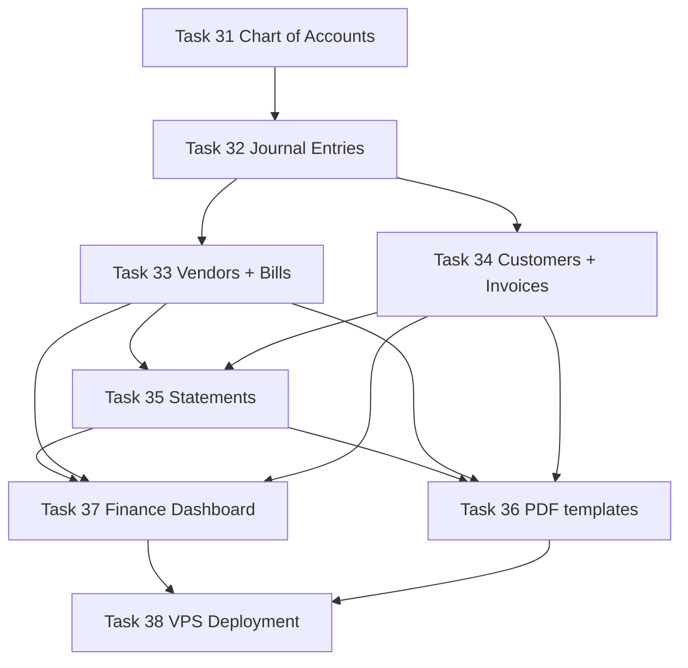

# Sprint 4 — Lean Accounting (Tasks 31–38)

> Closes Semester 1. Builds the General Ledger backbone (COA + Journal Entries), then the two sub-ledgers feeding it (AP via Vendors → Bills → Payments, AR via Customers → Invoices → Collections), the live financial-statement endpoints (Trial Balance, Income Statement, Balance Sheet), DomPDF print templates for every printable artifact, the finance section of the dashboard, and a production deployment to a VPS. Every screen mirrors [`docs/PATTERNS.md`](docs/PATTERNS.md:1) section-for-section; every column matches [`docs/SCHEMA.md`](docs/SCHEMA.md:147); every account comes from [`docs/SEEDS.md`](docs/SEEDS.md:87).

---

## 0. Scope, dependencies, and ground rules

### Inbound dependencies (must already exist from Sprints 1–3)

- Sprint 1 foundation: [`HasHashId`](api/app/Common/Traits/HasHashId.php:1), [`HasAuditLog`](api/app/Common/Traits/HasAuditLog.php:1), [`DocumentSequenceService`](api/app/Common/Services/DocumentSequenceService.php:1), [`ApprovalService`](api/app/Common/Services/ApprovalService.php:1), [`tokens.css`](spa/src/styles/tokens.css:1), [`DataTable`](spa/src/components/ui/DataTable.tsx:1), [`Chip`](spa/src/components/ui/Chip.tsx:1), [`PageHeader`](spa/src/components/layout/PageHeader.tsx:1), the three guards.
- Sprint 1 Task 12 settings + feature toggle `modules.accounting=true`.
- Sprint 3 Task 29: [`PayrollGlPostingService`](api/app/Modules/Payroll/Services/PayrollGlPostingService.php:1) already writes against the `accounts` table and references codes `5050/5060/5070/6030/6040/6050/2020/2030/2040/2050/2080/2100/1010` (front-loaded by [`PayrollChartAccountsSeeder`](api/database/seeders/PayrollChartAccountsSeeder.php:1)). Sprint 4 must NOT break this — see Schema reconciliation below.
- Sprint 2 Task 22 loans + Sprint 5 prerequisites that we DO NOT consume yet (PO/GRN linkage on bills exists in [`docs/SCHEMA.md`](docs/SCHEMA.md:160) but `purchase_order_id` stays nullable until Sprint 5; same for `sales_order_id` / `delivery_id` on invoices).

### Outbound consumers (what later sprints will call into)

- Task 33 Bills are consumed by Sprint 5 Task 43 (3-way matching against PO + GRN).
- Task 34 Invoices are consumed by Sprint 7 Task 66 (auto-create draft invoice on delivery confirm).
- Task 35 statements are consumed by Sprint 8 Task 72 (Plant Manager dashboard) and Task 80 demo seeder.

### Cross-cutting guarantees (verify on every file)

- ✅ All money columns: `decimal(15, 2)`. Never float. Never raw `id` in API output — every Resource emits `hash_id`.
- ✅ Every model that touches URLs uses [`HasHashId`](api/app/Common/Traits/HasHashId.php:1).
- ✅ Every mutating service method wrapped in `DB::transaction()`.
- ✅ Every controller action gated by `permission:accounting.*` middleware AND `FormRequest::authorize()`.
- ✅ Every list page renders all 5 mandatory states (loading skeleton, error+retry, empty, data, stale via `placeholderData`).
- ✅ Every monetary value rendered with `font-mono tabular-nums`; status with `<Chip variant=…>`; canvas stays grayscale.
- ✅ Routes registered with lazy import + [`AuthGuard`](spa/src/components/guards/AuthGuard.tsx:1) + [`ModuleGuard`](spa/src/components/guards/ModuleGuard.tsx:1) + [`PermissionGuard`](spa/src/components/guards/PermissionGuard.tsx:1).
- ✅ Customer/vendor `tin` and `bank_account_no` (where added) use Laravel `encrypted` cast with masking in Resource.
- ✅ Posted journal entries are immutable. Reversal = create a mirror JE pointing at the original via `reversed_by_entry_id`. Never UPDATE or DELETE a posted row.
- ✅ Debit/credit balance enforcement on EVERY JE create (server-side, in `DB::transaction`, throw before insert).

### Schema reconciliation resolved up front

| Issue | Resolution |
|---|---|
| [`docs/SCHEMA.md`](docs/SCHEMA.md:148) names the column `account_type` but the existing [`PayrollChartAccountsSeeder`](api/database/seeders/PayrollChartAccountsSeeder.php:38) inserts `type`. | Migration `0036_create_accounts_table.php` MUST use `account_type` per SCHEMA. Update [`PayrollChartAccountsSeeder`](api/database/seeders/PayrollChartAccountsSeeder.php:1) to use `account_type` in the same PR (one-line edit in the array literal). Run `make fresh && make seed` to verify [`PayrollGlPostingTest`](api/tests/Feature/Payroll/PayrollGlPostingTest.php:1) still passes. |
| [`docs/SEEDS.md`](docs/SEEDS.md:87) canonical COA does NOT include codes `5050 Salaries`, `5060 Overtime`, `5070 13th Month` — it has `6010 Salaries & Wages`, `6015 Overtime`, and no dedicated 13th-month expense. But [`PayrollGlPostingService`](api/app/Modules/Payroll/Services/PayrollGlPostingService.php:87) hardcodes `5050/5060/5070`. | **Decision: preserve back-compat.** The new `ChartOfAccountsSeeder` seeds all 45 SEEDS.md accounts AND keeps `5050/5060/5070` as additional rows with description `"Used by PayrollGlPostingService (Sprint 3). Co-exists with 6010/6015 until refactor."`. Add a TODO ticket "Reconcile payroll posting accounts" to [`docs/TASKS.md`](docs/TASKS.md:1) under Sprint 8 polish. Tests stay green. |
| [`docs/SCHEMA.md`](docs/SCHEMA.md:148) accounts table has no soft delete; CRUD must use `is_active=false` instead of delete. | Service exposes `deactivate()` not `delete()`. Controller maps `DELETE /accounts/{id}` → service `deactivate()` and returns 204. Block deactivation if account has posted JE lines (validation rule). |
| `bills.bill_number` is `string 50` (vendor-supplied, not auto-generated). [`docs/SCHEMA.md`](docs/SCHEMA.md:160) has no `unique` constraint. | Add a partial index `(vendor_id, bill_number)` unique to prevent duplicate vendor invoices. |
| `invoices.invoice_number` IS auto-generated and unique → use `INV-YYYYMM-NNNN` via [`DocumentSequenceService`](api/app/Common/Services/DocumentSequenceService.php:1) sequence key `invoice`. JE `entry_number` uses `JE-YYYYMM-NNNN` sequence key `journal_entry`. | Confirm both sequence keys are seeded in [`SettingsSeeder`](api/database/seeders/SettingsSeeder.php:1) / `document_sequences`. Add them in Task 32 / Task 34 migrations if missing. |
| `bill_payments.bill_id` and `collections.invoice_id` should cascade-restrict (you can't delete a bill/invoice with payments). | `->constrained()->restrictOnDelete()` in migrations. |

### Currency, VAT, rounding rules (the unsexy stuff that will bite us)

- All amounts: 2-decimal Philippine peso. Use the existing [`Money`](api/app/Common/Support/Money.php:1) helper (or BCMath) for any multi-step arithmetic; never accumulate via float.
- VAT: 12% standard rate, **VAT-inclusive** entry on bills/invoices (most ERPs do). Bill/invoice total = `subtotal + vat_amount`. VAT amount stored explicitly so it can be posted to `1310 VAT Input` (purchases) or `2060 VAT Output` (sales) without recomputation.
- Rounding policy: round HALF UP at every persistence boundary. Document in a service docblock.
- Aging buckets: `current` (≤ due_date), `1-30` (1–30 days overdue), `31-60`, `61-90`, `91+`. Computed from `due_date` vs `now()` at request time (never stored — recomputes change the answer next day).

---

## 1. Permission catalogue (extend `RolePermissionSeeder`)

A subset already exists in [`RolePermissionSeeder.php`](api/database/seeders/RolePermissionSeeder.php:87) (`accounting.coa.manage`, `accounting.journal.create`, `accounting.journal.post`, `accounting.bills.create`, `accounting.bills.pay`, `accounting.invoices.create`, `accounting.invoices.collect`, `accounting.statements.view`). Add the remaining ones BEFORE wiring controllers:

```
accounting.coa.view
accounting.coa.deactivate
accounting.journal.view
accounting.journal.reverse
accounting.bills.view
accounting.bills.update
accounting.bills.delete                 (only if status=unpaid AND no payments)
accounting.invoices.view
accounting.invoices.update
accounting.invoices.delete              (only if status=draft)
accounting.vendors.view
accounting.vendors.manage
accounting.customers.view
accounting.customers.manage
accounting.statements.export            (PDF/CSV download)
accounting.dashboard.view
```

**Role grants:**

- **System Admin:** all
- **Finance Officer:** all `accounting.*` (already partly granted at [`RolePermissionSeeder.php`](api/database/seeders/RolePermissionSeeder.php:202))
- **HR Officer:** none (payroll posts via service, not UI)
- **Purchasing Officer:** `accounting.vendors.view`, `accounting.bills.view` (read-only ledger insight for 3-way match preview)
- **CRM/Sales:** `accounting.customers.view`, `accounting.invoices.view` (read-only)
- **Department Head, Employee:** none

---

## 2. Task-by-task execution plan

### Task 31 — Chart of Accounts

**Backend**

- Migration `0036_create_accounts_table.php` per [`docs/SCHEMA.md`](docs/SCHEMA.md:148): `id`, `code (string 20 unique)`, `name (string 200)`, `account_type (string 20)`, `parent_id (FK accounts nullable, ->nullOnDelete())`, `normal_balance (string 10)`, `is_active (boolean default true)`, `description (text nullable)`, `timestamps`. Indexes: `account_type`, `parent_id`, `is_active`.
- Enum `App\Modules\Accounting\Enums\AccountType` (`asset/liability/equity/revenue/expense`).
- Enum `App\Modules\Accounting\Enums\NormalBalance` (`debit/credit`).
- Model `App\Modules\Accounting\Models\Account` with `HasHashId`, `HasAuditLog`. Casts: `account_type` → enum, `normal_balance` → enum, `is_active` → bool. Relationships: `parent()` BelongsTo self, `children()` HasMany self, `journalLines()` HasMany. Scope `scopeActive`. Accessor `getIsLeafAttribute()` = no children. Validation method `canDeactivate()` returns false if it has posted JE lines OR active children.
- Service `AccountService` with `tree()` (returns nested array, eager loads children recursively up to N levels), `list(filters)` (flat paginated), `create(data)` (validates parent's `account_type` matches), `update(id, data)` (forbids `account_type` / `normal_balance` change after lines exist), `deactivate(id)` (validation guard).
- FormRequests: `StoreAccountRequest` (`accounting.coa.manage`), `UpdateAccountRequest`. Rules: `code` regex `^[0-9]{4}$`, unique; `account_type` in enum; `normal_balance` in enum; `parent_id` exists+same `account_type`.
- Resource `AccountResource`: `id (hash_id)`, `code`, `name`, `account_type`, `account_type_label`, `parent_id (hash_id)`, `parent_code` (whenLoaded), `normal_balance`, `is_active`, `is_leaf`, `description`, `created_at`, `updated_at`. **Include `current_balance` only when explicitly requested via `?with=balance`** (computed via single SUM query — guard against accidental N+1 in tree views).
- Controller `AccountController`: `index` (flat), `tree` (nested), `show`, `store`, `update`, `deactivate` (mapped from `DELETE`). Standard HTTP codes (201 / 204).
- Routes (`api/app/Modules/Accounting/routes.php`):
  ```php
  Route::middleware(['auth:sanctum','feature:accounting'])->prefix('accounts')->group(function () {
      Route::get('/',         [AccountController::class,'index'])  ->middleware('permission:accounting.coa.view');
      Route::get('/tree',     [AccountController::class,'tree'])   ->middleware('permission:accounting.coa.view');
      Route::get('/{account}',[AccountController::class,'show'])   ->middleware('permission:accounting.coa.view');
      Route::post('/',        [AccountController::class,'store'])  ->middleware('permission:accounting.coa.manage');
      Route::put('/{account}',[AccountController::class,'update']) ->middleware('permission:accounting.coa.manage');
      Route::delete('/{account}',[AccountController::class,'deactivate'])->middleware('permission:accounting.coa.deactivate');
  });
  ```
- **Seeder** `ChartOfAccountsSeeder` — seeds all 45 accounts from [`docs/SEEDS.md`](docs/SEEDS.md:87). Two-pass insert: pass 1 inserts parent-less (1000/2000/3000/4000/5000/6000), pass 2 inserts the rest with `parent_id` resolved from the just-inserted codes. Plus three back-compat rows (`5050/5060/5070`) marked with description per Section 0.
- Update [`DatabaseSeeder.php`](api/database/seeders/DatabaseSeeder.php:1) so `ChartOfAccountsSeeder` runs BEFORE `PayrollChartAccountsSeeder` (the latter becomes idempotent upsert no-op once full COA exists).
- Tests: `tests/Feature/Accounting/AccountTreeTest.php` (asserts 45 + 3 = 48 rows, 6 parents, every child's `account_type` matches its parent), `tests/Unit/Accounting/AccountDeactivationTest.php`.

**Frontend**

- Types in [`spa/src/types/accounting.ts`](spa/src/types/accounting.ts:1): `Account`, `AccountTree` (recursive), `AccountType`, `NormalBalance`, `CreateAccountData`, `UpdateAccountData`.
- API: `spa/src/api/accounting/accounts.ts` (`tree`, `list`, `show`, `create`, `update`, `deactivate`).
- Page `spa/src/pages/accounting/coa/index.tsx` — collapsible tree view. Each row: code (mono), name, type chip (`asset/liability/equity/revenue/expense` → neutral chip with text-only color, since canvas rule forbids tinting whole rows), normal_balance (small badge), `is_active` chip. Right-click context menu: edit, deactivate (if leaf and inactive-eligible). "Add account" button opens modal with parent picker (cascading select that filters by parent's `account_type`).
- Page handles all 5 states: skeleton tree, error+retry, empty (only possible before seed), data, stale.
- Route registered in [`spa/src/App.tsx`](spa/src/App.tsx:1) as `/accounting/coa` under `ModuleGuard module="accounting"` + `PermissionGuard permission="accounting.coa.view"`.

---

### Task 32 — Journal Entries

**Backend**

- Migrations:
  - `0037_create_journal_entries_table.php` per [`SCHEMA.md`](docs/SCHEMA.md:151): `id`, `entry_number (string 20 unique)`, `date`, `description (text)`, `reference_type (string 30 nullable)`, `reference_id (bigint nullable)`, `total_debit (decimal 15,2)`, `total_credit (decimal 15,2)`, `status (string 20 default 'draft')`, `reversed_by_entry_id (FK self nullable)`, `created_by (FK users)`, `posted_by (FK users nullable)`, `posted_at (timestamp nullable)`, `timestamps`. Indexes: `(date)`, `(status)`, `(reference_type, reference_id)`.
  - `0038_create_journal_entry_lines_table.php`: `id`, `journal_entry_id (FK ->cascadeOnDelete only when JE.status='draft')` — emulate via service guard since FK-level conditional cascade isn't possible. `account_id (FK accounts ->restrictOnDelete)`, `debit (decimal 15,2 default 0)`, `credit (decimal 15,2 default 0)`, `description (string 200 nullable)`. Indexes: `journal_entry_id`, `account_id`. CHECK constraint (PostgreSQL): `(debit = 0 AND credit > 0) OR (debit > 0 AND credit = 0)`.
- Enum `App\Modules\Accounting\Enums\JournalEntryStatus` (`draft/posted/reversed`).
- Models `JournalEntry` and `JournalEntryLine` with `HasHashId` (JE only — lines aren't routed). JournalEntry uses `HasAuditLog` (every status transition logged). Relationships: `lines()`, `reversedBy()`, `reversal()` (inverse), `creator()`, `poster()`, polymorphic `reference()` (manual: switch on `reference_type` string).
- Service `JournalEntryService` with:
  - `create(array $data)` — wrap in `DB::transaction()`. Generate `entry_number` via [`DocumentSequenceService`](api/app/Common/Services/DocumentSequenceService.php:1) (`generate('journal_entry')` → `JE-YYYYMM-NNNN`). Sum debit/credit, **assert equal** (BCMath `bccomp`, scale 2) → throw `UnbalancedJournalEntryException` with array of errors mapped to `lines.{i}.debit`. Insert JE + lines atomically. Status starts `draft`.
  - `post(JournalEntry $je, User $by)` — guard `status='draft'`. Set `status='posted'`, `posted_by=$by->id`, `posted_at=now()`. Audit-logged. **Re-validate balance** in case lines were edited while draft.
  - `reverse(JournalEntry $je, User $by, ?Carbon $date=null)` — guard `status='posted'` and `reversed_by_entry_id IS NULL`. Atomically: create new JE with mirrored lines (debit↔credit swapped), `description` = `"REVERSAL of {$je->entry_number}"`, `reference_type='journal_entry_reversal'`, `reference_id=$je->id`. Mark new JE `posted` immediately. Set `$je->reversed_by_entry_id = $newJe->id`, `$je->status = 'reversed'`. Returns the new JE.
  - `update(JournalEntry $je, array $data)` — only allowed when `status='draft'`. Replace lines wholesale (delete + insert) inside transaction.
  - `delete(JournalEntry $je)` — only allowed when `status='draft'`. Hard delete (cascade lines).
  - `list(filters)` — filters: `status`, `from`, `to`, `account_id`, `reference_type`, `search` (entry_number / description). Eager loads `lines.account`, `creator`, `poster`. Default sort: `date DESC, id DESC`. Paginate.
- FormRequests:
  - `StoreJournalEntryRequest`: `date` required date ≤ today; `description` required max 500; `lines` array min 2; per-line: `account_id` exists+active+is_leaf, `debit` decimal:0,2 ≥ 0, `credit` decimal:0,2 ≥ 0, custom rule "exactly one of debit/credit > 0". Authorize: `accounting.journal.create`.
  - `UpdateJournalEntryRequest`: same rules, authorize `accounting.journal.create`.
  - `ReverseJournalEntryRequest`: `reverse_date` optional date ≥ original entry date. Authorize: `accounting.journal.reverse`.
- Resources:
  - `JournalEntryResource`: `id (hash_id)`, `entry_number`, `date`, `description`, `reference_type`, `reference_label` (computed: human-readable), `reference_url` (whenLoaded — link to source record), `total_debit`, `total_credit`, `status`, `reversed_by_entry_id (hash_id)`, `created_by` → small user object, `posted_by` (whenLoaded), `posted_at`, `lines` (whenLoaded, `JournalEntryLineResource[]`).
  - `JournalEntryLineResource`: `account: { id, code, name }`, `debit`, `credit`, `description`.
- Controller `JournalEntryController`: `index`, `show`, `store` (201), `update` (200), `destroy` (204), `post` (PATCH), `reverse` (POST returns new JE 201).
- Routes:
  ```php
  Route::middleware(['auth:sanctum','feature:accounting'])->prefix('journal-entries')->group(function () {
      Route::get('/',                      [JournalEntryController::class,'index'])->middleware('permission:accounting.journal.view');
      Route::get('/{journalEntry}',        [JournalEntryController::class,'show']) ->middleware('permission:accounting.journal.view');
      Route::post('/',                     [JournalEntryController::class,'store'])->middleware('permission:accounting.journal.create');
      Route::put('/{journalEntry}',        [JournalEntryController::class,'update'])->middleware('permission:accounting.journal.create');
      Route::delete('/{journalEntry}',     [JournalEntryController::class,'destroy'])->middleware('permission:accounting.journal.create');
      Route::patch('/{journalEntry}/post', [JournalEntryController::class,'post'])  ->middleware('permission:accounting.journal.post');
      Route::post('/{journalEntry}/reverse',[JournalEntryController::class,'reverse'])->middleware('permission:accounting.journal.reverse');
  });
  ```
- Tests:
  - `tests/Feature/Accounting/JournalEntryCreateTest.php`: rejects unbalanced JE; accepts 2-line balanced JE; entry_number is sequential.
  - `tests/Feature/Accounting/JournalEntryPostTest.php`: cannot post unbalanced; cannot edit posted; cannot post twice.
  - `tests/Feature/Accounting/JournalEntryReversalTest.php`: reversal mirrors lines; original status flips to `reversed`; cannot reverse twice; cannot reverse a draft.

**Frontend**

- Types in [`spa/src/types/accounting.ts`](spa/src/types/accounting.ts:1): `JournalEntry`, `JournalEntryLine`, `CreateJournalEntryData`.
- API: `spa/src/api/accounting/journal-entries.ts` (`list`, `show`, `create`, `update`, `delete`, `post`, `reverse`).
- Pages:
  - `spa/src/pages/accounting/journal-entries/index.tsx` — DataTable. Columns: entry_number (mono link), date (mono), description (truncated), reference_label, debit total (mono right), status chip (`draft=warning, posted=success, reversed=neutral`). Filters: status, date range, account, search. Reuse the [`FilterBar`](spa/src/components/ui/FilterBar.tsx:1).
  - `spa/src/pages/accounting/journal-entries/create.tsx` — line-by-line builder. React Hook Form with `useFieldArray` for lines. Each line row: account select (searchable, leaf-only), debit input, credit input (mutually exclusive — typing in one zeroes the other), description. Running totals at bottom: `Total Debit | Total Credit | Difference`. Difference cell colored `success-fg` when zero, `danger-fg` otherwise. Submit button disabled while difference ≠ 0. Zod schema enforces same rules as backend FormRequest. Server-side errors mapped via `setError('lines.0.debit', ...)`.
  - `spa/src/pages/accounting/journal-entries/[id].tsx` — detail page. Header: entry_number + status chip + actions (Edit if draft, Post if draft+balanced, Reverse if posted, Print). Lines table read-only. Right panel: `LinkedRecords` showing `reference` (e.g., "Bill BL-2026-0042") and reversal pair if applicable. Activity stream of status transitions.
- All 5 states. Numbers `font-mono tabular-nums`. Status `<Chip>`. Routes registered with the three guards.

---

### Task 33 — Vendors + AP Bills + Bill Payments

**Backend**

- Migrations:
  - `0039_create_vendors_table.php`: per SCHEMA. `tin` add `encrypted` cast on model. Soft delete. Indexes: `is_active`, `name`.
  - `0040_create_bills_table.php`: per SCHEMA. Add unique `(vendor_id, bill_number)`. Add `created_by` for audit. Indexes: `vendor_id`, `due_date`, `status`.
  - `0041_create_bill_items_table.php`: per SCHEMA. `expense_account_id` FK accounts (extension to SCHEMA — needed so each line knows which expense account to debit). Document this addition.
  - `0042_create_bill_payments_table.php`: per SCHEMA. `cash_account_id` FK accounts (extension — pick which cash account funds it).
- Enums: `BillStatus` (`unpaid/partial/paid/cancelled`), `PaymentMethod` (`cash/check/bank_transfer/online`).
- Models with `HasHashId`, `HasAuditLog`. `Vendor` adds `SoftDeletes` + `tin` encrypted cast. `Bill` belongsTo `vendor`, hasMany `items`, hasMany `payments`, belongsTo `journalEntry`. `BillItem` belongsTo `bill`, belongsTo `expenseAccount`. `BillPayment` belongsTo `bill`, belongsTo `cashAccount`, belongsTo `journalEntry`. Accessor `Bill::balance` recomputed `total_amount - amount_paid` (also stored for query speed; reconciled on every payment).
- Services:
  - `VendorService`: standard CRUD + `deactivate()` (no hard delete if any bills exist).
  - `BillService`:
    - `create(array $data)` — `DB::transaction`. Insert bill + items. Compute `subtotal = SUM(item.total)`, `vat_amount` (12% of subtotal if `is_vatable=true`), `total_amount = subtotal + vat_amount`. Build JE: per item line DR `expense_account_id` for `item.total`; if VATable add DR `1310 VAT Input` for `vat_amount`; CR `2010 Accounts Payable` for `total_amount`. Call `JournalEntryService::create()` then `post()` immediately (bills auto-post on creation — they represent a real economic event). Store `journal_entry_id` on bill.
    - `update($bill, $data)` — only when `status='unpaid'` AND `amount_paid=0`. Reverse the existing JE then create a new one.
    - `cancel($bill)` — only when `amount_paid=0`. Reverse JE, set status `cancelled`.
    - `recordPayment($bill, $data)` — `DB::transaction`. Insert `bill_payment`. Build JE: DR `2010 Accounts Payable` for `amount`; CR `cash_account_id` for `amount`. Auto-post. Increment `amount_paid` on bill. Recompute `status`: `paid` if `amount_paid >= total_amount`, else `partial`. Store `journal_entry_id` on payment.
    - `aging(?Carbon $asOf=null)` — service-only method (no separate route), used by Tasks 35/37. Returns array buckets: `{vendor_id, vendor_name, current, d1_30, d31_60, d61_90, d91_plus, total}` for unpaid/partial bills. PostgreSQL `CASE WHEN due_date >= now THEN ...`.
- FormRequests: `StoreVendorRequest`, `UpdateVendorRequest`, `StoreBillRequest` (line items required min 1, each with positive quantity + unit_price + valid expense_account_id), `StoreBillPaymentRequest` (amount > 0, ≤ remaining balance, payment_date, payment_method enum, cash_account_id required).
- Resources: `VendorResource` (mask `tin` for users without `accounting.vendors.manage`), `BillResource` (with `aging_bucket` computed at request time, `items` whenLoaded, `payments` whenLoaded, `journal_entry_id` as hash_id), `BillItemResource`, `BillPaymentResource`.
- Controller `VendorController` (CRUD), `BillController` (CRUD + `cancel`, `payments` GET subroute, `recordPayment` POST subroute), routes per pattern.

**Frontend**

- Types `Vendor`, `Bill`, `BillItem`, `BillPayment`, all DTOs.
- API `spa/src/api/accounting/{vendors,bills}.ts`.
- Pages:
  - `pages/accounting/vendors/index.tsx` — DataTable: name, contact, phone, payment_terms_days (mono), open_balance (mono right; computed on backend Resource), is_active chip. Filter by active.
  - `pages/accounting/vendors/[id].tsx` — detail with tabs: Overview, Bills, Payments. Open balance KPI card.
  - `pages/accounting/bills/index.tsx` — DataTable: bill_number (mono), vendor, date (mono), due_date (mono), total_amount (mono right), balance (mono right, danger-fg if overdue), status chip (`unpaid=warning, partial=info, paid=success, cancelled=neutral`). Filter: vendor, status, date range, overdue toggle.
  - `pages/accounting/bills/create.tsx` — form: vendor select (searchable), bill_number (vendor-supplied), date, due_date (defaults to date + vendor.payment_terms_days), is_vatable toggle, line items (`useFieldArray`: description, quantity, unit, unit_price, expense_account_id select, total computed). Running totals. Submit creates bill + auto-posts JE.
  - `pages/accounting/bills/[id].tsx` — detail with: header (bill_number, vendor, status chip, actions: Edit if eligible, Cancel if eligible, Record Payment, Print PDF). Body: line items table, payments table, posted JE link. Right panel `LinkedRecords` showing the JE and the originating PO (when Sprint 5 lands; for now just the JE).
  - `pages/accounting/bills/[id]/payments/create.tsx` — modal-ish form (amount, payment_date, payment_method, reference_number, cash_account_id select). Validates amount ≤ balance. Auto-posts JE. Toast + refetch on success.
- All forms: Zod schema, server-error mapping via `setError`, disabled while pending, cancel button.
- Routes registered with guards. Permissions `accounting.vendors.*`, `accounting.bills.*`.

---

### Task 34 — Customers + AR Invoices + Collections

Mirrors Task 33 structurally on the AR side. Highlights of the differences only:

**Backend**

- Migrations `0043_create_customers_table.php`, `0044_create_invoices_table.php`, `0045_create_invoice_items_table.php`, `0046_create_collections_table.php` per [`SCHEMA.md`](docs/SCHEMA.md:168).
- Customer model `HasHashId`, `HasAuditLog`, `SoftDeletes`. `tin` encrypted, masked in Resource for non-`accounting.customers.manage`.
- Invoice number is auto-generated via [`DocumentSequenceService`](api/app/Common/Services/DocumentSequenceService.php:1) → `INV-YYYYMM-NNNN` (sequence key `invoice`). Migration must seed the row in `document_sequences` if not present.
- `InvoiceStatus` enum: `draft/finalized/unpaid/partial/paid/cancelled`. Status flow: `draft` (editable, no JE) → `finalized` (atomically posts JE: DR `1100 AR`, CR `4010 Sales Revenue` per item, CR `2060 VAT Output`) → `unpaid` (alias-compatibility: same as finalized but no payments) → `partial` → `paid`. Decision: collapse to `draft/finalized/partial/paid/cancelled` in code; map `unpaid` UI label = `finalized AND amount_paid=0` (note this in InvoiceResource as `display_status`).
- `InvoiceService`:
  - `create(data)` — status `draft`. NO JE yet.
  - `update(draftInvoice, data)` — only when `draft`.
  - `finalize(draft)` — `DB::transaction`. Generate invoice_number, build & post JE, status → `finalized`.
  - `recordCollection(invoice, data)` — DR `cash_account_id`, CR `1100 AR`. Increment `amount_paid`, update status. Cannot collect against `draft` (force finalize first).
  - `cancel(invoice)` — only if no collections. Reverses JE if finalized.
  - `aging(?$asOf)` — same buckets as bills, AR side.
- FormRequests: same shape as Task 33.
- Resources: `CustomerResource` (mask `tin`, expose `credit_limit`, computed `credit_used` = sum of unpaid balances, `credit_available`), `InvoiceResource`, `InvoiceItemResource`, `CollectionResource`.
- Controllers + routes per pattern. Permissions `accounting.customers.*`, `accounting.invoices.*`.

**Frontend**

- Pages mirror Task 33: customers list/detail, invoices list/create/detail, collection form. Detail page header includes a "Print Invoice" button (Task 36 PDF) and "Send to Customer" stub (no SMTP yet — link copies a download URL).
- Customer detail page shows credit_limit / credit_used / credit_available KPI cards; warns if `credit_used > 0.8 * credit_limit`.
- All numbers mono. Status chips. 5 states. 3 guards.

---

### Task 35 — Financial statements (live API endpoints)

**Backend** — services live at `app/Modules/Accounting/Services/Statements/`:

- `TrialBalanceService::generate(Carbon $from, Carbon $to): array`
  - Single SQL query (Eloquent or DB facade) joining `accounts` ⨝ `journal_entry_lines` ⨝ `journal_entries WHERE status='posted' AND date BETWEEN $from AND $to`. Group by account. Returns `[ {account: {id,code,name,type,normal_balance}, debit_total, credit_total, balance, balance_side} ]`.
  - Order: by `code ASC`. Include only accounts with movement OR explicitly `is_active`.
  - Compute grand totals at the end. Assert `SUM(debit_total) == SUM(credit_total)` (sanity check; throw `LedgerImbalanceException` if not — reveals a bug elsewhere).
- `IncomeStatementService::generate(Carbon $from, Carbon $to): array`
  - Two sections: `revenue` (account_type=revenue, balance = credit_total - debit_total) and `expenses` (account_type=expense, balance = debit_total - credit_total). Sub-sections by parent account (e.g., 4000 Revenue, 5000 COGS, 6000 OpEx).
  - `gross_profit = revenue - cogs`, `operating_income = gross_profit - opex`, `net_income = operating_income + other_income - other_expense`.
- `BalanceSheetService::generate(Carbon $asOf): array`
  - As-of = inclusive. Assets, Liabilities, Equity sections. Equity includes a synthetic "Current Period Net Income" line computed via `IncomeStatementService::generate(fiscal_year_start, $asOf).net_income` so the equation balances.
  - Assert `total_assets == total_liabilities + total_equity` (sanity check).
- All three services cache results in Redis (key `stmt:{name}:{from}:{to}`, TTL 60s). Cache invalidates on any JE post/reverse via a model observer dispatching a tagged-cache flush.
- Controller `FinancialStatementController` with 3 GET endpoints accepting `from`, `to`, `as_of`. Each returns JSON. Add `?format=csv` for direct CSV export. Permission `accounting.statements.view` (and `.export` for CSV).

**Frontend**

- Types: `TrialBalance`, `IncomeStatement`, `BalanceSheet`.
- API `spa/src/api/accounting/statements.ts`.
- Pages:
  - `spa/src/pages/accounting/trial-balance.tsx` — date range picker (defaults: month-to-date), dense table: code | name | debit_total | credit_total. Footer row totals. Print PDF button (Task 36). CSV export button.
  - `spa/src/pages/accounting/income-statement.tsx` — date range picker. Sectioned table: Revenue rows, Total Revenue; COGS rows, Total COGS, Gross Profit; OpEx rows, Total OpEx, Operating Income; Other; **Net Income** in larger mono text at the bottom (positive=success-fg, negative=danger-fg).
  - `spa/src/pages/accounting/balance-sheet.tsx` — single date picker (defaults: today). Three columns layout: Assets | Liabilities | Equity. Totals at bottom of each, plus "Total Liabilities + Equity". Indicator chip if equation doesn't balance (should never trigger; if it does, flag a server bug).
- Numbers `font-mono tabular-nums`. Negative numbers shown in parentheses `(1,234.00)`, optionally `text-danger-fg`.
- All 5 states (especially: error → "Failed to generate statement" with retry).
- Routes with guards.

---

### Task 36 — DomPDF print templates

**Backend** — Blade templates in `api/resources/views/pdf/`:

- `bill.blade.php` — vendor header, bill_number, date, due_date, line items table, totals box, payment history. No watermark.
- `invoice.blade.php` — Ogami letterhead (logo + address + TIN from settings), invoice_number, customer info, line items, VAT breakdown, total, "Please remit to" bank info from settings. Optional CONFIDENTIAL only if status=draft.
- `journal-entry.blade.php` — entry_number, date, description, lines table (account code+name | debit | credit), totals. "Prepared by", "Posted by", "Date" signature lines.
- `trial-balance.blade.php` — period header, accounts table, grand totals.
- `income-statement.blade.php` — period header, sectioned table, net income highlight. CONFIDENTIAL diagonal watermark.
- `balance-sheet.blade.php` — as-of date header, three-column layout, totals. CONFIDENTIAL watermark.
- All templates extend `pdf/_layout.blade.php` providing: A4 portrait base, Ogami letterhead include, page numbers (`{PAGENO} of {nbpages}` via DomPDF setting), "Generated by {user.name} on {now}" footer, font set to DejaVu Sans (DomPDF-safe — Geist is for the SPA only; document this so devs don't waste time embedding Geist into PDFs).
- Service `PdfService` (extends from existing PayslipPdfService pattern in Sprint 3): `bill($bill)`, `invoice($invoice)`, `journalEntry($je)`, `trialBalance($from,$to)`, `incomeStatement($from,$to)`, `balanceSheet($asOf)`. Each method renders the matching Blade and returns `Response::make($pdf->output(), 200, ['Content-Type' => 'application/pdf', 'Content-Disposition' => 'inline; filename="…"'])`.
- Controllers expose `GET /bills/{bill}/pdf`, `GET /invoices/{invoice}/pdf`, `GET /journal-entries/{je}/pdf`, `GET /accounting/statements/{name}/pdf?from=&to=&as_of=` — all gated by the matching `view` permission (download permits read-level access; export-level permission only adds the CSV variant).
- Tests: `tests/Feature/Accounting/PdfRenderTest.php` — assert HTTP 200, `Content-Type=application/pdf`, response body starts with `%PDF-`.

**Frontend**

- No new pages. Each existing detail page gets a Print button that opens `/api/v1/{resource}/{id}/pdf` in a new tab (cookie auth carries through). Statement pages already have the button per Task 35.

---

### Task 37 — Dashboard — Finance section

**Backend**

- Service `FinanceDashboardService::summary(): array` returning:
  - `cash_balance` — sum of all `asset/cash` accounts (codes 1010, 1020, 1030) computed from posted JE lines.
  - `ar_outstanding` — sum of `invoices.balance` where status in [`finalized`, `partial`].
  - `ap_outstanding` — sum of `bills.balance` where status in [`unpaid`, `partial`].
  - `revenue_mtd` — sum of credits to revenue accounts for current month.
  - `ar_aging_summary` — output of `InvoiceService::aging()` aggregated to totals only.
  - `ap_aging_summary` — output of `BillService::aging()` aggregated to totals only.
  - `recent_journal_entries` — last 10 posted JEs.
  - `top_overdue_customers` — top 5 by overdue balance.
- All cached in Redis 30s. Endpoint `GET /dashboard/finance`. Permission `accounting.dashboard.view`.

**Frontend**

- `spa/src/pages/dashboard/index.tsx` — gets a Finance section (or, if a dashboard already exists from Sprint 3 onboarding, this task adds a `<FinanceSection>` component). KPI row: 4 [`StatCard`](spa/src/components/ui/StatCard.tsx:1) (Cash Balance, AR Outstanding, AP Outstanding, Revenue MTD). All values mono.
- Below: 2-column grid.
  - Left column [`Panel`](spa/src/components/ui/Panel.tsx:1) "AR & AP Aging" — two stacked aging tables (AR on top, AP below) with bucket totals.
  - Right column Panel "Recent Journal Entries" — last 10 with entry_number, date, description, total_amount. Click row → JE detail.
  - Below the grid, full-width Panel "Top Overdue Customers" — table.
- Drill-downs: clicking AR card → `/accounting/invoices?status=unpaid&overdue=1`. Clicking AP card → `/accounting/bills?status=unpaid&overdue=1`. Clicking Revenue MTD → income-statement page with current-month range pre-selected.
- All 5 states. Numbers mono. Status chips. No color on the canvas.

---

### Task 38 — VPS deployment

This task ships the system. Treat it as a runbook, not code.

**Deliverables**

- `docker-compose.prod.yml` at repo root:
  - Services: `api` (PHP-FPM, prod build), `spa` removed (replaced by static build served by nginx), `nginx` with SSL, `db` (postgres:16), `redis`, `meilisearch`, `reverb`, `queue`. NO `mailpit`. `db` uses a named volume `pgdata`. All services restart `unless-stopped`. Internal-only ports except nginx 80/443.
  - Builds the SPA at deploy time (`npm ci && npm run build`) and bind-mounts `/spa/dist` into the nginx container.
  - PHP container runs `php artisan config:cache`, `route:cache`, `view:cache` on container start; `php artisan migrate --force` is gated behind a Makefile `make deploy` step (not auto on container start) so a bad migration cannot crash the container loop.
- `docker/nginx/prod.conf`:
  - HTTP server on port 80 redirects all to HTTPS.
  - HTTPS server on 443 with full SSL config (Mozilla Intermediate), HSTS preload, the seven security headers from [`CLAUDE.md`](CLAUDE.md:168), gzip + brotli for static, proxies `/api/*` and `/sanctum/*` to `api:9000` via FastCGI, `/ws` to `reverb:8080`, everything else falls through to the SPA `index.html` (SPA fallback for client-side routing).
- `.env.production.example` (NOT committed with secrets) listing every required env var: `APP_KEY`, `APP_ENV=production`, `APP_DEBUG=false`, `APP_URL=https://<domain>`, `DB_*`, `REDIS_*`, `SESSION_DOMAIN=<domain>`, `SESSION_SECURE_COOKIE=true`, `SANCTUM_STATEFUL_DOMAINS=<domain>`, `FRONTEND_URL=https://<domain>`, `MAIL_*` (real SMTP), `BROADCAST_DRIVER=reverb`, `REVERB_*`, `MEILISEARCH_KEY`, `HASHIDS_SALT` (long random — different from dev), `QUEUE_CONNECTION=redis`.

**VPS runbook (documented in `docs/DEPLOY.md` — new file):**

1. Provision DigitalOcean droplet: Ubuntu 22.04 LTS, 4 GB RAM minimum, 2 vCPU, 80 GB SSD. Add SSH key. Disable password auth. UFW: allow 22, 80, 443.
2. Install: `docker.io`, `docker-compose-plugin`, `git`, `certbot`, `cron`.
3. Clone repo to `/opt/ogami-erp`.
4. Copy `.env.production.example` → `.env`, fill secrets.
5. Run `certbot certonly --standalone -d <domain>` (stop nginx if running). Mount cert into nginx container at `/etc/nginx/ssl/`.
6. Add post-renew hook script to reload nginx in container after Certbot renewal.
7. `make deploy` = `docker compose -f docker-compose.prod.yml pull && build && up -d && exec api php artisan migrate --force && exec api php artisan db:seed --class=DatabaseSeeder --force` (idempotent — only runs if data is empty).
8. Smoke-test auth flow end-to-end with HTTPS cookies (curl with `--cookie-jar`):
   - `GET /sanctum/csrf-cookie` returns 204 + `XSRF-TOKEN` cookie.
   - `POST /api/v1/auth/login` with `X-XSRF-TOKEN` header, returns 200 + `ogami_session` HTTP-only cookie.
   - `GET /api/v1/auth/user` with the cookie returns 200.
   - Inspect cookies in browser devtools: `HttpOnly`, `Secure`, `SameSite=Lax` all set.
9. Add cron `/etc/cron.daily/ogami-pgdump`:
   ```sh
   #!/bin/sh
   docker compose -f /opt/ogami-erp/docker-compose.prod.yml exec -T db \
     pg_dump -U postgres ogami | gzip > /var/backups/ogami-$(date +%Y%m%d).sql.gz
   find /var/backups -name 'ogami-*.sql.gz' -mtime +30 -delete
   ```
10. Add cron weekly `certbot renew --post-hook "docker exec ogami-nginx nginx -s reload"`.
11. Document the rollback procedure: `git checkout <prev-tag> && make deploy`. Migrations should always be backwards-compatible within a sprint or include a `down()` that's been tested.
12. Verify HTTPS: SSL Labs grade ≥ A. Verify HSTS via curl `-I`. Verify CSP via browser console (no violations on dashboard).

**Acceptance: Semester 1 complete.** A panel reviewer can:
- Visit `https://<domain>/login`, sign in.
- Navigate the HR + Attendance + Leave + Loans + Payroll + Accounting modules.
- Run a payroll period (Sprint 3) and watch it auto-post to GL (Task 29).
- Open the Trial Balance (Task 35) and see the payroll JE reflected.
- Print a payslip + a bill PDF + an income statement.
- Log out and back in — session cookies behave correctly across HTTPS.

---

## 3. File inventory (what gets created or touched)

### New backend files (~70)

```
api/database/migrations/
  0036_create_accounts_table.php
  0037_create_journal_entries_table.php
  0038_create_journal_entry_lines_table.php
  0039_create_vendors_table.php
  0040_create_bills_table.php
  0041_create_bill_items_table.php
  0042_create_bill_payments_table.php
  0043_create_customers_table.php
  0044_create_invoices_table.php
  0045_create_invoice_items_table.php
  0046_create_collections_table.php

api/database/seeders/
  ChartOfAccountsSeeder.php           (new)
  DatabaseSeeder.php                  (modified — register ChartOfAccountsSeeder before PayrollChartAccountsSeeder)
  RolePermissionSeeder.php            (modified — add new permissions + Finance Officer grants)
  PayrollChartAccountsSeeder.php      (modified — rename `type` → `account_type`)

api/app/Modules/Accounting/
  Enums/AccountType.php
  Enums/NormalBalance.php
  Enums/JournalEntryStatus.php
  Enums/BillStatus.php
  Enums/InvoiceStatus.php
  Enums/PaymentMethod.php

  Models/Account.php
  Models/JournalEntry.php
  Models/JournalEntryLine.php
  Models/Vendor.php
  Models/Bill.php
  Models/BillItem.php
  Models/BillPayment.php
  Models/Customer.php
  Models/Invoice.php
  Models/InvoiceItem.php
  Models/Collection.php

  Services/AccountService.php
  Services/JournalEntryService.php
  Services/VendorService.php
  Services/BillService.php
  Services/CustomerService.php
  Services/InvoiceService.php
  Services/PdfService.php
  Services/FinanceDashboardService.php
  Services/Statements/TrialBalanceService.php
  Services/Statements/IncomeStatementService.php
  Services/Statements/BalanceSheetService.php
  Exceptions/UnbalancedJournalEntryException.php
  Exceptions/LedgerImbalanceException.php

  Requests/StoreAccountRequest.php
  Requests/UpdateAccountRequest.php
  Requests/StoreJournalEntryRequest.php
  Requests/UpdateJournalEntryRequest.php
  Requests/ReverseJournalEntryRequest.php
  Requests/StoreVendorRequest.php
  Requests/UpdateVendorRequest.php
  Requests/StoreBillRequest.php
  Requests/UpdateBillRequest.php
  Requests/StoreBillPaymentRequest.php
  Requests/StoreCustomerRequest.php
  Requests/UpdateCustomerRequest.php
  Requests/StoreInvoiceRequest.php
  Requests/UpdateInvoiceRequest.php
  Requests/StoreCollectionRequest.php

  Resources/AccountResource.php
  Resources/JournalEntryResource.php
  Resources/JournalEntryLineResource.php
  Resources/VendorResource.php
  Resources/BillResource.php
  Resources/BillItemResource.php
  Resources/BillPaymentResource.php
  Resources/CustomerResource.php
  Resources/InvoiceResource.php
  Resources/InvoiceItemResource.php
  Resources/CollectionResource.php
  Resources/StatementResource.php
  Resources/FinanceDashboardResource.php

  Controllers/AccountController.php
  Controllers/JournalEntryController.php
  Controllers/VendorController.php
  Controllers/BillController.php
  Controllers/BillPaymentController.php
  Controllers/CustomerController.php
  Controllers/InvoiceController.php
  Controllers/CollectionController.php
  Controllers/FinancialStatementController.php
  Controllers/FinanceDashboardController.php

  routes.php                          (modified — replace the empty placeholder)

api/resources/views/pdf/
  _layout.blade.php
  bill.blade.php
  invoice.blade.php
  journal-entry.blade.php
  trial-balance.blade.php
  income-statement.blade.php
  balance-sheet.blade.php

api/tests/Feature/Accounting/
  AccountTreeTest.php
  JournalEntryCreateTest.php
  JournalEntryPostTest.php
  JournalEntryReversalTest.php
  BillCreateTest.php
  BillPaymentTest.php
  InvoiceFinalizeTest.php
  CollectionTest.php
  TrialBalanceTest.php
  IncomeStatementTest.php
  BalanceSheetTest.php
  PdfRenderTest.php
api/tests/Unit/Accounting/
  AccountDeactivationTest.php
  JournalEntryBalanceValidatorTest.php
  AgingCalculatorTest.php
```

### New frontend files (~35)

```
spa/src/types/accounting.ts

spa/src/api/accounting/
  accounts.ts
  journal-entries.ts
  vendors.ts
  bills.ts
  bill-payments.ts
  customers.ts
  invoices.ts
  collections.ts
  statements.ts
  dashboard.ts

spa/src/pages/accounting/
  coa/index.tsx
  journal-entries/index.tsx
  journal-entries/create.tsx
  journal-entries/[id].tsx
  vendors/index.tsx
  vendors/create.tsx
  vendors/[id].tsx
  vendors/[id]/edit.tsx
  bills/index.tsx
  bills/create.tsx
  bills/[id].tsx
  bills/[id]/edit.tsx
  bills/[id]/payments/create.tsx
  customers/index.tsx
  customers/create.tsx
  customers/[id].tsx
  customers/[id]/edit.tsx
  invoices/index.tsx
  invoices/create.tsx
  invoices/[id].tsx
  invoices/[id]/edit.tsx
  invoices/[id]/collections/create.tsx
  trial-balance.tsx
  income-statement.tsx
  balance-sheet.tsx

spa/src/pages/dashboard/index.tsx                 (modified — add FinanceSection)
spa/src/components/dashboard/FinanceSection.tsx   (new)
spa/src/App.tsx                                   (modified — register all new routes)
spa/src/components/layout/Sidebar.tsx             (modified — add Accounting section)
```

### New deployment files (Task 38)

```
docker-compose.prod.yml
docker/nginx/prod.conf
docker/php/Dockerfile.prod                        (multi-stage with composer install --no-dev, opcache enabled)
.env.production.example
docs/DEPLOY.md                                    (new — VPS runbook)
.github/workflows/deploy.yml                      (optional — manual-trigger workflow with SSH)
```

---

## 4. Execution order (respect dependencies)



Notes:
- Task 32 cannot start until Task 31's `accounts` table exists (FK dependency).
- Tasks 33 and 34 are siblings — can be parallelized by two devs but solo dev should do 33 → 34 because they share the JE-auto-post pattern; 34 reuses Task 33's lessons.
- Task 35 needs both sub-ledgers posted at least once for meaningful smoke tests. Use the existing payroll JE from Sprint 3 as a third source of test data.
- Task 36 templates can be drafted earlier but only validated end-to-end once the data exists.
- Task 37 is read-only and can be built any time after Task 35.
- Task 38 must be last; it requires green tests and a working full stack.

Commit cadence: one commit per task, message `feat: task 31 — chart of accounts (sprint 4)` etc. Tag the final commit `v0.1-sem1` for the defense snapshot.

---

## 5. Risks & decisions log

| Risk | Mitigation |
|---|---|
| The double-entry invariant (debit = credit) is the foundation. A single bug here corrupts every report downstream. | Validate at THREE layers: PostgreSQL CHECK on lines (one of debit/credit > 0, not both); service-level BCMath comparison before insert; unit test covering ±0.01 edge cases. Add a nightly job that re-validates trial balance equality and emails Finance Officer if it ever drifts. |
| Schema reconciliation: `account_type` vs `type` column name. | Fix the column name in the migration to match SCHEMA.md. Patch [`PayrollChartAccountsSeeder`](api/database/seeders/PayrollChartAccountsSeeder.php:1) in the same PR. Run [`PayrollGlPostingTest`](api/tests/Feature/Payroll/PayrollGlPostingTest.php:1) to confirm green before merging. |
| Invoice/Bill numbering collision under concurrency. | [`DocumentSequenceService`](api/app/Common/Services/DocumentSequenceService.php:1) already uses `SELECT … FOR UPDATE`. Add a feature test that fires 50 concurrent invoice creations and asserts unique sequential numbers. |
| Statement endpoints can be slow on large data sets. | Single SQL query per statement (no N+1). Index `journal_entries(date, status)`, `journal_entry_lines(account_id, journal_entry_id)`. Cache 60s in Redis with tagged invalidation on JE post/reverse. |
| PDF renders fail silently on missing fonts. | Standardize on DejaVu Sans (DomPDF default) — document this; do NOT try to embed Geist (DomPDF's Geist support is flaky and triples rendering time). |
| Cookie-auth across HTTPS in production has hidden gotchas (`SESSION_DOMAIN`, `SANCTUM_STATEFUL_DOMAINS`, `SESSION_SECURE_COOKIE`). | Task 38 runbook step 8 explicitly tests the auth flow with curl + browser before declaring done. |
| VPS first-deploy migrations could destroy the running prod data on rerun. | `make deploy` runs `migrate --force` exactly once; subsequent deploys re-run it (Laravel skips already-run migrations). NEVER use `migrate:fresh` in production. Document this in red in `docs/DEPLOY.md`. |
| 5050/5060/5070 vs 6010/6015 expense codes living side by side will confuse the auditor at defense. | Add a one-paragraph explanation in `docs/DEPLOY.md` and the COA seeder docblock, plus a TODO ticket for Sprint 8 reconciliation. Defense answer: "Sprint 3 hardcoded operational codes; Sprint 4 establishes the canonical chart and we kept the legacy codes mapped during the bridge period to preserve audit history." |

---

## 6. Final checklist (run mentally at the end of each task)

Per [`docs/PATTERNS.md`](docs/PATTERNS.md:1716):

- [ ] Migration uses correct types (decimal 15,2 for money; text for description; indexes on FKs and date)
- [ ] Model has `HasHashId`
- [ ] Model has `encrypted` cast for sensitive fields (vendor.tin, customer.tin)
- [ ] Service wraps mutations in `DB::transaction()`
- [ ] Controller returns 201 on create, 204 on delete
- [ ] FormRequest `authorize()` checks the right permission
- [ ] Resource returns `hash_id`, never raw `id`
- [ ] Resource masks sensitive fields when caller lacks `*.manage`
- [ ] Routes declare `auth:sanctum` + `feature:accounting` + `permission:…`
- [ ] Frontend API uses hash_id strings, never numbers
- [ ] Page handles LOADING (skeleton)
- [ ] Page handles ERROR (EmptyState + retry)
- [ ] Page handles EMPTY (contextual message)
- [ ] Page uses `placeholderData` for STALE state
- [ ] Form: Zod schema matches FormRequest rules; submit disabled while pending; server errors mapped via `setError`; cancel button navigates back; success/error toast
- [ ] Numbers use `font-mono tabular-nums`
- [ ] Status fields use `<Chip>` with semantic variant
- [ ] Negative numbers shown in parentheses on financial statements
- [ ] Routes wrapped in `AuthGuard` + `ModuleGuard module="accounting"` + `PermissionGuard`
- [ ] Page is lazy-loaded in App.tsx
- [ ] Canvas stays grayscale (no tinted rows, no tinted backgrounds)
- [ ] No Bearer tokens; no localStorage auth
- [ ] Trial balance reconciles after every test (`SUM(debit) == SUM(credit)`)
- [ ] Sprint 3 payroll posting test still green after schema reconciliation
- [ ] Tests written for: JE balance validator, JE reversal idempotency, bill auto-post, invoice finalize+collect, aging buckets, three statements
