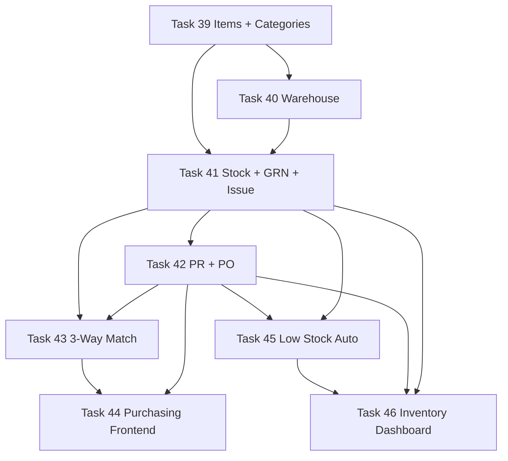

# Sprint 5 — Procure to Pay (Part 1: Inventory + Purchasing) (Tasks 39–46)

> Stands up the operational foundation of **Chain 2 — Procure to Pay**. We seed the item master, the warehouse hierarchy, and the stock ledger; then build Purchase Requests and Purchase Orders with a 4–5 level approval chain, a 3-way matching engine that gates Sprint 4 bills, low-stock auto-replenishment, and the inventory dashboard. Every screen mirrors [`docs/PATTERNS.md`](docs/PATTERNS.md:1) section-for-section; every column matches [`docs/SCHEMA.md`](docs/SCHEMA.md:182); every demo row comes from [`docs/SEEDS.md`](docs/SEEDS.md:295).

---

## 0. Scope, dependencies, and ground rules

### Inbound dependencies (must already exist from Sprints 1–4)

- **Sprint 1 foundation** — [`HasHashId`](api/app/Common/Traits/HasHashId.php:1), [`HasAuditLog`](api/app/Common/Traits/HasAuditLog.php:1), [`HasApprovalWorkflow`](api/app/Common/Traits/HasApprovalWorkflow.php:1), [`DocumentSequenceService`](api/app/Common/Services/DocumentSequenceService.php:1), [`ApprovalService`](api/app/Common/Services/ApprovalService.php:1), [`NotificationService`](api/app/Common/Services/NotificationService.php:1), [`SettingsService`](api/app/Common/Services/SettingsService.php:1), [`tokens.css`](spa/src/styles/tokens.css:1), [`DataTable`](spa/src/components/ui/DataTable.tsx:1), [`Chip`](spa/src/components/ui/Chip.tsx:1), [`PageHeader`](spa/src/components/layout/PageHeader.tsx:1), [`FilterBar`](spa/src/components/ui/FilterBar.tsx:1), the three guards.
- **Sprint 1 Task 12** — feature toggles `modules.inventory=true`, `modules.purchasing=true`, `modules.supply_chain=true` (the last is needed by Task 41 stock movements that reference `shipments` polymorphically — toggle the rest of supply-chain UI in Sprint 7).
- **Sprint 1 Task 11** — workflow definitions seeded: must include `purchase_request` (4 levels) and `purchase_order` (5 levels) per [`docs/SEEDS.md`](docs/SEEDS.md:235); add them in this sprint if missing in `WorkflowDefinitionSeeder`.
- **Sprint 2 Task 13** — `departments` table exists (PR.department_id FK).
- **Sprint 4 Task 31** — `accounts` table exists. Inventory needs `1200 Inventory — Raw Materials`, `1310 VAT Input`, `1010 Cash`, `2010 Accounts Payable`. These are seeded by [`ChartOfAccountsSeeder`](api/database/seeders/ChartOfAccountsSeeder.php:1) from Sprint 4. Sprint 5 does NOT post to GL on receipt yet — weighted-average cost is tracked in `stock_levels`; the GL posting for inventory receipts happens via the Sprint 4 `Bill` (DR Inventory / CR AP) and is reconciled in **Task 43 (3-way match)**. Document this clearly in the GRN service docblock.
- **Sprint 4 Task 33** — `bills` and `bill_items` exist with nullable `purchase_order_id`. Task 43 (3-way matching) populates and validates that link.

### Outbound consumers (what later sprints will call into)

- **Sprint 6 Task 49** (BOM): `bom_items.item_id` → `items.id`. Items must exist before BOMs.
- **Sprint 6 Task 51** (Work Orders): `work_order_materials.item_id` → `items.id`; `material_reservations` ties WOs to stock.
- **Sprint 6 Task 52** (MRP engine): consumes `stock_levels`, `purchase_orders`, `approved_suppliers`, and creates draft `purchase_requests`.
- **Sprint 7 Task 60** (Incoming QC): GRN status `pending_qc` blocks acceptance until inspection passes; `goods_receipt_notes.qc_inspection_id` is set then.
- **Sprint 7 Task 65** (Shipments / ImpEx): adds `shipment_id` semantics on top of existing PO; PO created in Sprint 5 must support `shipment_type=import` linkage when Sprint 7 lands. Keep the relation schema-clean now (FK already in [`docs/SCHEMA.md`](docs/SCHEMA.md:238)); UI is Sprint 7.

### Cross-cutting guarantees (verify on every file)

- ✅ All money columns: `decimal(15, 2)`. Standard cost / unit cost: `decimal(15, 4)` per [`docs/SCHEMA.md`](docs/SCHEMA.md:188) (sub-cent precision needed for weighted average). Quantities: `decimal(15, 3)` for stock, `decimal(10, 2)` for documents (PO line, PR line). **Never float**.
- ✅ Every model with a routable URL uses [`HasHashId`](api/app/Common/Traits/HasHashId.php:1).
- ✅ Every mutating service method wrapped in `DB::transaction()`. Stock movements use `lockForUpdate()` on the affected `stock_levels` row to prevent concurrent weighted-avg drift.
- ✅ Every controller action gated by `permission:inventory.*` or `permission:purchasing.*` middleware AND `FormRequest::authorize()`.
- ✅ Every list page renders all 5 mandatory states (loading skeleton, error+retry, empty, data, stale via `placeholderData`).
- ✅ Every monetary value rendered with `font-mono tabular-nums`; status with `<Chip variant=…>`; canvas stays grayscale.
- ✅ Routes registered with lazy import + [`AuthGuard`](spa/src/components/guards/AuthGuard.tsx:1) + [`ModuleGuard`](spa/src/components/guards/ModuleGuard.tsx:1) + [`PermissionGuard`](spa/src/components/guards/PermissionGuard.tsx:1).
- ✅ PR/PO numbering goes through [`DocumentSequenceService`](api/app/Common/Services/DocumentSequenceService.php:1) (`PR-YYYYMM-NNNN`, `PO-YYYYMM-NNNN`, `GRN-YYYYMM-NNNN`, `MIS-YYYYMM-NNNN` for material issue slip).
- ✅ Approval workflows reuse [`HasApprovalWorkflow`](api/app/Common/Traits/HasApprovalWorkflow.php:1) — no new approval engine.

### Schema reconciliation resolved up front

| Issue | Resolution |
|---|---|
| [`docs/SCHEMA.md`](docs/SCHEMA.md:225) lists `purchase_orders.status` enum without `closed`. The procure-to-pay chain in [`CLAUDE.md`](CLAUDE.md:19) ends with PO → Bill → Payment → **Closed**. | Extend the enum to `draft / pending_approval / approved / sent / partially_received / received / closed / cancelled`. `closed` is set when (a) status was `received` AND (b) all linked bills are `paid`. Service-driven, no FK to bills required. |
| [`docs/SCHEMA.md`](docs/SCHEMA.md:206) `goods_receipt_notes.items` is JSON. Inventory traceability needs row-level FK to PO line so 3-way match can reconcile per item. | Add child table `goods_receipt_note_items` (NEW, not in SCHEMA) — `id, goods_receipt_note_id, purchase_order_item_id (FK), item_id (FK), quantity_received (decimal 15,3), quantity_accepted (decimal 15,3), location_id (FK warehouse_locations), unit_cost (decimal 15,4)`. Keep the legacy `items` JSON column populated for back-compat (mirror data). Document this addition in the migration docblock. |
| [`docs/SCHEMA.md`](docs/SCHEMA.md:209) `material_issue_slips.items` is JSON; same problem. | Add child table `material_issue_slip_items` (NEW) — `id, material_issue_slip_id, work_order_material_id (FK nullable — Sprint 6), item_id, quantity_issued (decimal 15,3), location_id, unit_cost (decimal 15,4)`. JSON column kept for back-compat. |
| [`docs/SCHEMA.md`](docs/SCHEMA.md:219) `purchase_requests` has no `total_estimated_amount`. The PO approval threshold (Task 42 — VP required ≥ ₱50,000) needs a derivable total. | Compute on the fly via `SUM(estimated_unit_price * quantity)` in the service / Resource. Do not denormalize. |
| [`docs/SCHEMA.md`](docs/SCHEMA.md:218) `purchase_requests` has no `priority`. Auto-generated PRs from low-stock automation (Task 45) and MRP (Sprint 6 Task 52) need `urgent` flag. | Add `priority` enum (`normal/urgent/critical`) defaulting to `normal`. Document this addition. |
| [`docs/SCHEMA.md`](docs/SCHEMA.md:225) `purchase_orders` has no `created_by`. Audit trail needs it. | Add `created_by` (FK users) — additive. |
| `stock_movements.movement_type` is a free `string 30` per [`docs/SCHEMA.md`](docs/SCHEMA.md:203). | Constrain via PHP 8.1 backed enum `StockMovementType` (`grn_receipt / material_issue / production_receipt / delivery / transfer / adjustment_in / adjustment_out / scrap / return_to_vendor / cycle_count`). Validate in service; do NOT add a DB CHECK (we want flexibility for future types). |

### Inventory math, rounding, and concurrency rules (the unsexy stuff that bites)

- **Weighted-average cost** is the per-`stock_levels` row metric. On every receipt to a location:
  ```
  new_qty       = old_qty + receive_qty
  new_total_val = (old_qty * old_wac) + (receive_qty * unit_cost)
  new_wac       = new_total_val / new_qty                        (4-decimal rounding HALF UP)
  ```
  Issues, scrap, and outbound transfers use the **current** `weighted_avg_cost` for the cost-out value; they do NOT change WAC. Returns to vendor reverse the receipt at the original `unit_cost` (track via `stock_movements.unit_cost` reference). Document this in [`StockMovementService`](api/app/Modules/Inventory/Services/StockMovementService.php:1) docblock.
- **Concurrency**: `StockMovementService::move()` MUST `SELECT … FOR UPDATE` on the affected `stock_levels` row(s) inside the transaction. Dual-location movements (transfers) lock both rows in `(item_id, location_id)` lexical order to avoid deadlocks.
- **Negative stock**: forbidden by default. `StockMovementService` throws `InsufficientStockException` if a movement would drive `quantity - reserved_quantity` negative. Setting `settings.inventory.allow_negative=true` (rare; off by default) lets it through with a warning broadcast.
- **Reservations vs. issues**: A reservation deducts from "available" (`quantity - reserved_quantity`) but NOT from `quantity`. The actual issue (Material Issue Slip in Task 41) decrements `quantity` AND decrements `reserved_quantity` for the matched reservation — keeping reservation accounting clean.
- **Aging / on-hand reports**: computed at request time from `stock_levels` + `stock_movements` joined to `received_date`. Never stored.
- **Rounding policy**: HALF UP on every persistence boundary. Quantities to 3 decimals; unit costs to 4; totals to 2.

### Decision log (made up front so we don't relitigate during build)

1. **GL posting on GRN: NO.** Inventory receipts hit the GL via Sprint 4 `Bill` (Task 33 already auto-posts DR Expense / CR AP). Sprint 5 stays out of the GL. We document a future Sprint 8 task: "Refactor bill auto-post to DR Inventory (1200) for stock items, expensing only on consumption". This is the conventional perpetual-inventory model but requires consumption tracking from Sprint 6. Avoid premature complexity now.
2. **Auto-PR consolidation: NO.** Task 45 creates one draft PR per item that crosses reorder point. The Purchasing Officer manually consolidates (or uses Task 42's PO-from-PR consolidation by supplier). Keeps audit trail clean.
3. **Approval chain configurable threshold.** PO requires VP if `total_amount >= settings.purchasing.vp_approval_threshold` (default 50000.00). Setting is loaded at runtime, not baked into the workflow definition.
4. **PO email to supplier: stub in Sprint 5.** Status transitions to `sent` and a `sent_to_supplier_at` timestamp is recorded; the actual SMTP send is wired in Sprint 7 (alongside ImpEx) where the supplier portal also gets defined. Today we render the PO PDF and copy a download URL.
5. **Item code generation: manual, not auto.** Per [`docs/SCHEMA.md`](docs/SCHEMA.md:188), `items.code` is unique and human-meaningful (`RM-001`, `PKG-002`). The form requires manual entry with uniqueness validation. No `DocumentSequenceService` here.

---

## 1. Permission catalogue (extend `RolePermissionSeeder`)

A subset already exists from Sprint 1 Task 10. Sprint 5 adds the rest **before** wiring controllers. Edit [`RolePermissionSeeder`](api/database/seeders/RolePermissionSeeder.php:1):

```
inventory.items.view
inventory.items.manage              (create/update items + categories)
inventory.items.delete              (soft-delete; only if no movements)
inventory.warehouse.view
inventory.warehouse.manage          (create/update warehouses, zones, locations)
inventory.stock.view
inventory.stock.adjust              (manual adjustment in/out, with reason)
inventory.stock.transfer            (location-to-location)
inventory.stock.cycle_count
inventory.grn.view
inventory.grn.create                (create GRN against a PO)
inventory.grn.accept                (mark accepted after QC pass — Sprint 7 wires QC; for now manual)
inventory.grn.reject
inventory.issue.view
inventory.issue.create              (material issue slip)
inventory.dashboard.view

purchasing.suppliers.view
purchasing.suppliers.manage         (approved suppliers list)
purchasing.pr.view
purchasing.pr.create
purchasing.pr.update                (only when status=draft)
purchasing.pr.delete                (only when status=draft)
purchasing.pr.approve_l1            (Department Head)
purchasing.pr.approve_l2            (Manager)
purchasing.pr.approve_l3            (Purchasing Officer)
purchasing.pr.approve_l4            (VP)
purchasing.po.view
purchasing.po.create                (from approved PR)
purchasing.po.update                (only when status=draft)
purchasing.po.delete                (only when status=draft)
purchasing.po.approve               (covers all PO approval levels — workflow tracks step)
purchasing.po.send                  (mark as sent to supplier)
purchasing.po.cancel
purchasing.po.close                 (manual close; auto-close runs server-side)
```

**Role grants:**

- **System Admin:** all
- **Purchasing Officer:** all `purchasing.*` except VP-level approval; `inventory.items.view`, `inventory.grn.view`, `inventory.stock.view`, `purchasing.suppliers.manage`
- **Warehouse Staff:** `inventory.items.view`, `inventory.warehouse.view`, `inventory.stock.view`, `inventory.stock.adjust`, `inventory.stock.transfer`, `inventory.stock.cycle_count`, `inventory.grn.create`, `inventory.grn.view`, `inventory.issue.create`, `inventory.issue.view`
- **Department Head:** `purchasing.pr.create`, `purchasing.pr.view`, `purchasing.pr.approve_l1` (own department only — enforced server-side via row scope), `inventory.items.view`, `inventory.stock.view`
- **Production Manager:** `purchasing.pr.approve_l2`, plus department-head perms
- **PPC Head:** `inventory.dashboard.view`, `inventory.stock.view`, `purchasing.pr.view` (read-only oversight); receives low-stock notifications
- **Vice President:** `purchasing.pr.approve_l4`, `purchasing.po.approve`
- **Finance Officer:** read-only on PO/PR for 3-way match panel: `purchasing.po.view`, `purchasing.pr.view`, `inventory.grn.view`
- **Employee:** none

---

## 2. Task-by-task execution plan

### Task 39 — Item master + categories

**Backend**

- Migrations:
  - `0047_create_item_categories_table.php` per [`docs/SCHEMA.md`](docs/SCHEMA.md:184): `id`, `name (string 100)`, `parent_id (FK self nullable, ->nullOnDelete)`, `timestamps`. Index `parent_id`.
  - `0048_create_items_table.php` per [`docs/SCHEMA.md`](docs/SCHEMA.md:188): all columns. `code` UNIQUE. Indexes: `category_id`, `item_type`, `is_active`, `is_critical`. SoftDeletes column. **Add** `description (text nullable)` (additive, useful for UI; document in migration).
- Enums:
  - `App\Modules\Inventory\Enums\ItemType` (`raw_material/finished_good/packaging/spare_part`).
  - `App\Modules\Inventory\Enums\ReorderMethod` (`fixed_quantity/days_of_supply`).
  - `App\Modules\Inventory\Enums\UnitOfMeasure` — string-backed enum with the canonical ten units (`pcs/kg/g/L/mL/m/cm/box/pack/pallet`). Migration stores raw string; enum validates writes.
- Models:
  - `ItemCategory` with `HasHashId`, `HasAuditLog`. Self-referencing `parent()`, `children()`. Accessor `path` (e.g., "Raw Materials > Resins").
  - `Item` with `HasHashId`, `HasAuditLog`, `SoftDeletes`. Casts: `item_type` → enum, `reorder_method` → enum, `standard_cost` → `decimal:4`, `reorder_point/safety_stock` → `decimal:3`, `lead_time_days` → int, booleans cast. Relationships: `category()`, `stockLevels()`, `approvedSuppliers()`, `purchaseOrderItems()`. Computed `getOnHandAttribute()` = `SUM(stock_levels.quantity)` (eager-loadable via subquery), `getAvailableAttribute()` = `SUM(quantity - reserved_quantity)`. Accessor `getStockStatusAttribute()` returns `'critical'` if `available <= safety_stock`, `'low'` if `available <= reorder_point`, else `'ok'`.
  - Validation method `Item::canDelete()` returns false if `stock_movements` exist, any `purchase_order_items` reference it, any `bom_items` reference it (Sprint 6 may exist), or `stock_levels.quantity > 0`.
- Service `ItemCategoryService`:
  - `tree()`, `list()`, `create()`, `update()`, `delete()` (only if no items reference it and no children).
- Service `ItemService`:
  - `list(filters)` — eager loads `category`, includes subquery for `available_quantity` and `on_hand_quantity` to prevent N+1. Filters: `item_type`, `category_id`, `is_active`, `is_critical`, `stock_status` (`critical/low/ok`), `search` (code/name).
  - `create(data)` — `DB::transaction`. Insert item; auto-create `stock_levels` rows at zero for every existing `warehouse_locations` matching the category-zone-type rule (Task 40 wires zone matching; for now, create one row per active location).
  - `update(item, data)` — `DB::transaction`. Forbid changing `item_type` or `unit_of_measure` if any movements exist (would corrupt costing).
  - `delete(item)` — soft delete; guard via `canDelete()`.
- FormRequests:
  - `StoreItemRequest`: `code` required regex `^[A-Z0-9-]{2,30}$`, unique; `name` required max 200; `category_id` exists; `item_type` enum; `unit_of_measure` enum; `standard_cost` decimal:0,4 ≥ 0; `reorder_method` enum; `reorder_point/safety_stock` decimal:0,3 ≥ 0; `lead_time_days` int ≥ 0. Authorize: `inventory.items.manage`.
  - `UpdateItemRequest`: same; `code` unique except self.
  - `StoreItemCategoryRequest`, `UpdateItemCategoryRequest`.
- Resources:
  - `ItemResource`: `id (hash_id)`, `code`, `name`, `description`, `category` (whenLoaded), `item_type`, `item_type_label`, `unit_of_measure`, `standard_cost`, `reorder_method`, `reorder_point`, `safety_stock`, `lead_time_days`, `is_critical`, `is_active`, `on_hand_quantity` (always), `available_quantity` (always), `reserved_quantity` (always), `stock_status` (computed), `created_at`, `updated_at`.
  - `ItemCategoryResource`: `id`, `name`, `parent_id (hash_id)`, `path`, `children` (whenLoaded for tree).
- Controller `ItemController` (CRUD), `ItemCategoryController` (CRUD + `tree`).
- Routes:
  ```php
  Route::middleware(['auth:sanctum','feature:inventory'])->prefix('inventory')->group(function () {
      Route::get('/items',                  [ItemController::class,'index'])->middleware('permission:inventory.items.view');
      Route::get('/items/{item}',           [ItemController::class,'show'])->middleware('permission:inventory.items.view');
      Route::post('/items',                 [ItemController::class,'store'])->middleware('permission:inventory.items.manage');
      Route::put('/items/{item}',           [ItemController::class,'update'])->middleware('permission:inventory.items.manage');
      Route::delete('/items/{item}',        [ItemController::class,'destroy'])->middleware('permission:inventory.items.delete');
      Route::get('/item-categories',        [ItemCategoryController::class,'index'])->middleware('permission:inventory.items.view');
      Route::get('/item-categories/tree',   [ItemCategoryController::class,'tree'])->middleware('permission:inventory.items.view');
      Route::post('/item-categories',       [ItemCategoryController::class,'store'])->middleware('permission:inventory.items.manage');
      Route::put('/item-categories/{cat}',  [ItemCategoryController::class,'update'])->middleware('permission:inventory.items.manage');
      Route::delete('/item-categories/{cat}',[ItemCategoryController::class,'destroy'])->middleware('permission:inventory.items.manage');
  });
  ```
- **Seeder** `InventoryItemSeeder` — seeds 4 root categories (Raw Materials, Packaging, Finished Goods, Spare Parts) + sub-categories (Resins, Colorants, Metal Inserts), then the 12 items from [`docs/SEEDS.md`](docs/SEEDS.md:295). Reorder points and lead times derived from realistic injection-molding norms (resin: reorder 500kg, lead 14 days; colorant: reorder 50kg, lead 7 days; metal inserts: reorder 5000pcs, lead 21 days; packaging: reorder 2000pcs, lead 5 days). Document the rationale in the seeder docblock.
- Tests:
  - `tests/Feature/Inventory/ItemListTest.php` — assert filters, pagination, stock_status field is computed.
  - `tests/Feature/Inventory/ItemCreateTest.php` — duplicate code rejected; auto-creates stock_levels rows for all locations.
  - `tests/Unit/Inventory/ItemCanDeleteTest.php` — guards.

**Frontend**

- Types in [`spa/src/types/inventory.ts`](spa/src/types/inventory.ts:1) (NEW): `Item`, `ItemCategory`, `ItemType`, `ReorderMethod`, `UnitOfMeasure`, `StockStatus`, `CreateItemData`, `UpdateItemData`.
- API: [`spa/src/api/inventory/items.ts`](spa/src/api/inventory/items.ts:1) (`list`, `show`, `create`, `update`, `delete`), [`spa/src/api/inventory/categories.ts`](spa/src/api/inventory/categories.ts:1).
- Pages:
  - `spa/src/pages/inventory/items/index.tsx` — DataTable. Columns: code (mono link), name (with category subtitle), item_type chip (text-only neutral chip per canvas rule), UOM, standard_cost (mono right), on_hand (mono right), available (mono right), reorder_point (mono right, danger-fg if `available <= reorder_point`), stock_status chip (`ok=neutral, low=warning, critical=danger`), is_active chip. FilterBar: item_type, category, stock_status, is_critical, is_active, search. "Add Item" button (permission `inventory.items.manage`).
  - `spa/src/pages/inventory/items/create.tsx` — form: code (uppercased input), name, description, category select (tree-aware), item_type, unit_of_measure, standard_cost, reorder_method, reorder_point, safety_stock, lead_time_days, is_critical toggle.
  - `spa/src/pages/inventory/items/[id].tsx` — detail with tabs: Overview (specs + stock_status KPI), Stock by Location, Movements (paginated `stock_movements`), Suppliers (Task 42 approved suppliers), Purchase History.
  - `spa/src/pages/inventory/items/[id]/edit.tsx` — same form, `item_type` and `unit_of_measure` disabled if movements exist (with tooltip).
  - `spa/src/pages/inventory/categories/index.tsx` — tree view with inline add/edit/delete.
- All 5 states. Numbers mono. Routes registered with three guards.

---

### Task 40 — Warehouse structure

**Backend**

- Migrations:
  - `0049_create_warehouses_table.php` per [`docs/SCHEMA.md`](docs/SCHEMA.md:191): `id`, `name (string 100)`, `code (string 20 unique)`, `address (text nullable)`, `is_active (boolean default true)` (additive — useful), `timestamps`. Index `is_active`.
  - `0050_create_warehouse_zones_table.php`: `id`, `warehouse_id (FK ->cascadeOnDelete)`, `name (string 50)`, `code (string 10)`, `zone_type (string 30)`, `created_at`. Add UNIQUE `(warehouse_id, code)`. **`zone_type` enum (string-backed)**: `raw_materials/staging/finished_goods/spare_parts/quarantine/scrap`.
  - `0051_create_warehouse_locations_table.php`: `id`, `zone_id (FK ->cascadeOnDelete)`, `code (string 20 unique)`, `rack (string 10 nullable)`, `bin (string 10 nullable)`, `is_active (boolean default true)` (additive), `created_at`. Index `zone_id`.
- Enums: `WarehouseZoneType` (the six values).
- Models `Warehouse` (HasHashId, HasAuditLog), `WarehouseZone` (HasHashId), `WarehouseLocation` (HasHashId). Relationships: warehouse hasMany zones; zone belongsTo warehouse, hasMany locations; location belongsTo zone, hasMany stockLevels. Accessor `WarehouseLocation::full_code` = `"{warehouse.code}-{zone.code}-{code}"` for display.
- Service `WarehouseService` with full CRUD for all three levels. Guards: cannot delete warehouse/zone/location with non-zero `stock_levels.quantity` or pending movements. Use SoftDeletes? **No** — hard delete with guards (warehouse structure rarely changes; soft delete adds confusion). Use `is_active=false` for retirement.
- FormRequests, Resources, Controller, Routes per pattern. Three URL prefixes: `/inventory/warehouses`, `/inventory/zones`, `/inventory/locations`.
- **Seeder** `WarehouseSeeder` — seeds:
  ```
  Warehouse: "Main Warehouse" (code MW)
    Zone A (raw_materials): locations A-01 through A-20 (4 racks × 5 bins)
    Zone B (staging):       locations B-01 through B-08
    Zone C (finished_goods): locations C-01 through C-30 (5 racks × 6 bins)
    Zone D (spare_parts):   locations D-01 through D-10
    Zone Q (quarantine):    locations Q-01 through Q-04
  ```
  Total: 1 warehouse, 5 zones, 72 locations. After seeding, `ItemSeeder` extension fills `stock_levels` at zero for every (item, default-zone-by-item-type) combination (raw materials → Zone A, packaging → Zone D-overflow or new Zone P later, etc.). For Sprint 5 simplicity: seed every item at zero on **one** default location per item_type.

**Frontend**

- Types `Warehouse`, `WarehouseZone`, `WarehouseLocation`.
- API `spa/src/api/inventory/warehouse.ts` with three resource scopes.
- Pages:
  - `spa/src/pages/inventory/warehouse/index.tsx` — three-pane tree-then-table: warehouse list (left panel, narrow), zones for selected warehouse (middle), locations for selected zone (right table). Each level has add/edit/delete buttons gated on `inventory.warehouse.manage`.
  - Inline editing where reasonable; full modal forms for create.
- Five states. Three guards. Permission `inventory.warehouse.view` for read, `.manage` for write.

---

### Task 41 — Stock movements + GRN + Material Issue

**Backend** — this is the largest task in the sprint; isolate strictly into services.

- Migrations:
  - `0052_create_stock_levels_table.php` per [`docs/SCHEMA.md`](docs/SCHEMA.md:200): `id`, `item_id (FK)`, `location_id (FK)`, `quantity (decimal 15,3 default 0)`, `reserved_quantity (decimal 15,3 default 0)`, `weighted_avg_cost (decimal 15,4 default 0)`, `last_counted_at (timestamp nullable)`, `updated_at`. UNIQUE `(item_id, location_id)`. Index `item_id`. **Trigger row-version column** `lock_version (bigint default 0)` for optimistic-lock fallback (only used if `SELECT FOR UPDATE` is unavailable in tests).
  - `0053_create_stock_movements_table.php` per [`docs/SCHEMA.md`](docs/SCHEMA.md:203): all columns. Indexes: `(item_id, created_at)`, `(reference_type, reference_id)`, `created_at`. **`movement_type` validation enforced at service layer** via `StockMovementType` enum.
  - `0054_create_goods_receipt_notes_table.php` per [`docs/SCHEMA.md`](docs/SCHEMA.md:206): all columns. `grn_number` UNIQUE. Indexes: `purchase_order_id`, `vendor_id`, `received_date`, `status`. Add `created_by (FK users)` and `accepted_at (timestamp nullable)`, `accepted_by (FK users nullable)`, `rejected_reason (text nullable)` (additive, audit needs).
  - `0055_create_grn_items_table.php` (NEW per Section 0): `id`, `goods_receipt_note_id (FK ->cascadeOnDelete)`, `purchase_order_item_id (FK ->restrictOnDelete)`, `item_id (FK)`, `location_id (FK warehouse_locations)`, `quantity_received (decimal 15,3)`, `quantity_accepted (decimal 15,3 default 0)`, `unit_cost (decimal 15,4)`, `remarks (string 200 nullable)`, `created_at`. Index `purchase_order_item_id`.
  - `0056_create_material_issue_slips_table.php` per [`docs/SCHEMA.md`](docs/SCHEMA.md:209): all columns. Add `created_by (FK users)`, `total_value (decimal 15,2 default 0)` (denormalized for reporting). Indexes: `work_order_id`, `issued_date`.
  - `0057_create_material_issue_slip_items_table.php` (NEW per Section 0): `id`, `material_issue_slip_id (FK ->cascadeOnDelete)`, `item_id (FK)`, `location_id (FK)`, `quantity_issued (decimal 15,3)`, `unit_cost (decimal 15,4)`, `total_cost (decimal 15,2)`, `material_reservation_id (FK material_reservations nullable)`, `remarks (string 200 nullable)`. Index `material_reservation_id`.
  - `0058_create_material_reservations_table.php` per [`docs/SCHEMA.md`](docs/SCHEMA.md:212): all columns + `location_id (FK warehouse_locations nullable)` (additive — when a specific bin is earmarked). Indexes: `item_id`, `work_order_id`, `status`.
- Enums:
  - `StockMovementType` (10 values per Section 0).
  - `GrnStatus` (`pending_qc/accepted/partial_accepted/rejected`).
  - `MaterialIssueStatus` (`draft/issued/cancelled`).
  - `ReservationStatus` (`reserved/issued/released`).
- Models: `StockLevel` (HasHashId NOT needed — never URL-routed), `StockMovement` (HasHashId for drill-down URL), `GoodsReceiptNote` (HasHashId, HasAuditLog), `GrnItem`, `MaterialIssueSlip` (HasHashId, HasAuditLog), `MaterialIssueSlipItem`, `MaterialReservation` (HasHashId).
- **Service `StockMovementService`** — the linchpin. Single public method:
  ```php
  public function move(StockMovementInput $input): StockMovement
  ```
  Where `StockMovementInput` is a value object with `type, itemId, fromLocationId?, toLocationId?, quantity, unitCost?, referenceType?, referenceId?, remarks?, createdBy`.
  Logic:
  1. `DB::transaction()`.
  2. For each affected location (from + to), `StockLevel::lockForUpdate()->firstOrCreate(['item_id'=>…, 'location_id'=>…])`.
  3. Validate availability for `from` (`available = quantity - reserved >= move.quantity` unless type is `adjustment_in/grn_receipt/production_receipt/return_to_vendor` which have no `from`).
  4. Decrement `from.quantity` (cost-out at `from.weighted_avg_cost`).
  5. For `to`: recompute weighted average per the formula in Section 0. If `unitCost` is null (for transfers), inherit `from.weighted_avg_cost`.
  6. Insert `StockMovement` row with `unit_cost`, `total_cost = quantity * unit_cost`.
  7. Broadcast `StockLevelChanged` event (Sprint 7 wires WebSocket; for now the event fires into log + observers can subscribe).
  8. Return the persisted `StockMovement`.
  Throw: `InsufficientStockException`, `InvalidMovementException`, `LocationMismatchException`.
- **Service `GrnService`**:
  - `create(PurchaseOrder $po, array $items, array $meta): GoodsReceiptNote` — `DB::transaction`. Validate every line: `purchase_order_item_id` belongs to `$po`; `quantity_received` ≤ `purchase_order_item.quantity - quantity_already_received`; `location_id` is in a zone with `zone_type=raw_materials/spare_parts` matching the item's type. Auto-generate `grn_number` via [`DocumentSequenceService`](api/app/Common/Services/DocumentSequenceService.php:1) (`grn`). Insert GRN + `grn_items` rows. **Status starts `pending_qc`** (per [`docs/SCHEMA.md`](docs/SCHEMA.md:206)). **Do NOT increment stock yet** — wait for QC acceptance. Update `purchase_order_items.quantity_received` (running total). Update PO status: if all items fully received → `received`; else `partially_received`.
  - `accept(GoodsReceiptNote $grn, User $by): GoodsReceiptNote` — `DB::transaction`. For each `grn_item`: set `quantity_accepted = quantity_received` (default; QC may have rejected portion via `reject(ids, qty)`). Call `StockMovementService::move()` per item with type `grn_receipt`, `to_location_id = grn_item.location_id`, `unit_cost = grn_item.unit_cost`, `reference_type='goods_receipt_note'`, `reference_id=$grn->id`. Set GRN status `accepted` (or `partial_accepted` if any `quantity_accepted < quantity_received`). Set `accepted_at`, `accepted_by`. **Sprint 7 will gate this behind QC inspection pass.** Today, the controller exposes the action under `inventory.grn.accept`.
  - `reject(GoodsReceiptNote $grn, string $reason, User $by)` — set status `rejected`, `rejected_reason`. No stock movement. Linked PO line `quantity_received` is NOT decremented (the PO already shipped this batch; rejection is a quality event tracked separately for vendor scorecards in Sprint 7).
  - `partialAccept(GoodsReceiptNote $grn, array $itemIdToAcceptedQty, User $by)` — accept some lines fully and others partially. Persist `grn_items.quantity_accepted` per input. Move stock only for the accepted portion. Status `partial_accepted`.
- **Service `MaterialIssueService`**:
  - `create(WorkOrder $wo, array $items, User $by): MaterialIssueSlip` — `DB::transaction`. Validate each line: `quantity_issued <= material_reservations.quantity for (item, wo)` if a reservation exists; otherwise consume free stock. Auto-generate `slip_number` (`MIS-YYYYMM-NNNN`). For each line: call `StockMovementService::move()` with `material_issue` type, `from_location_id`, `unit_cost = current weighted_avg_cost`, `reference_type='material_issue_slip'`. If a reservation matched, decrement `material_reservations.quantity` by `quantity_issued`; if reservation hits zero → status `issued`. Compute `total_value` = SUM of line `total_cost`.
  - `cancel(MaterialIssueSlip $slip, User $by)` — only when `status='draft'`. **Note**: in Sprint 5 we treat MIS as posted-on-create (status `issued` immediately) because we lack the WO orchestration to draft it first. Sprint 6 may re-introduce a `draft` step.
- **Service `StockAdjustmentService`** — separate from issue/receipt to keep audit clean. Methods `adjustIn(item, location, qty, unitCost, reason, by)` and `adjustOut(item, location, qty, reason, by)`. Each calls `StockMovementService::move()` with type `adjustment_in/adjustment_out`. Permission `inventory.stock.adjust`. Reason is mandatory (free text); audit log captures it.
- **Service `StockTransferService`** — `transfer(item, fromLocation, toLocation, qty, by, remarks?)`. Single movement record with both `from_location_id` and `to_location_id` set. WAC at destination recalculates against incoming cost = source WAC.
- FormRequests: per service entrypoint (`StoreGrnRequest`, `AcceptGrnRequest`, `RejectGrnRequest`, `StoreMaterialIssueRequest`, `StoreStockAdjustmentRequest`, `StoreStockTransferRequest`). All authorize the matching permission.
- Resources: `StockLevelResource` (item + location + quantity + reserved + available + WAC + total_value + last_counted_at), `StockMovementResource` (with polymorphic `reference` — `referenceLabel()` resolved via switch on `reference_type` to a `{type, id (hash), display}` shape), `GoodsReceiptNoteResource`, `GrnItemResource`, `MaterialIssueSlipResource`, `MaterialIssueSlipItemResource`, `MaterialReservationResource`.
- Controllers: `StockLevelController` (read-only list), `StockMovementController` (read-only list with rich filters), `StockAdjustmentController` (POST), `StockTransferController` (POST), `GoodsReceiptNoteController` (CRUD + accept/reject/partialAccept), `MaterialIssueSlipController` (CRUD).
- Routes (excerpt):
  ```php
  Route::middleware(['auth:sanctum','feature:inventory'])->prefix('inventory')->group(function () {
      Route::get('/stock-levels',           [StockLevelController::class,'index'])->middleware('permission:inventory.stock.view');
      Route::get('/stock-movements',        [StockMovementController::class,'index'])->middleware('permission:inventory.stock.view');
      Route::post('/stock-adjustments',     [StockAdjustmentController::class,'store'])->middleware('permission:inventory.stock.adjust');
      Route::post('/stock-transfers',       [StockTransferController::class,'store'])->middleware('permission:inventory.stock.transfer');

      Route::get('/grn',                    [GoodsReceiptNoteController::class,'index'])->middleware('permission:inventory.grn.view');
      Route::get('/grn/{grn}',              [GoodsReceiptNoteController::class,'show'])->middleware('permission:inventory.grn.view');
      Route::post('/grn',                   [GoodsReceiptNoteController::class,'store'])->middleware('permission:inventory.grn.create');
      Route::patch('/grn/{grn}/accept',     [GoodsReceiptNoteController::class,'accept'])->middleware('permission:inventory.grn.accept');
      Route::patch('/grn/{grn}/reject',     [GoodsReceiptNoteController::class,'reject'])->middleware('permission:inventory.grn.reject');
      Route::patch('/grn/{grn}/partial-accept',[GoodsReceiptNoteController::class,'partialAccept'])->middleware('permission:inventory.grn.accept');

      Route::get('/material-issues',        [MaterialIssueSlipController::class,'index'])->middleware('permission:inventory.issue.view');
      Route::get('/material-issues/{mis}',  [MaterialIssueSlipController::class,'show'])->middleware('permission:inventory.issue.view');
      Route::post('/material-issues',       [MaterialIssueSlipController::class,'store'])->middleware('permission:inventory.issue.create');
  });
  ```
- Tests:
  - `tests/Unit/Inventory/StockMovementServiceTest.php` — receipt updates WAC formula correctly across 3 sequential receipts at different costs; insufficient stock throws; transfer locks both rows; reservation does not affect quantity but reduces available.
  - `tests/Feature/Inventory/GrnLifecycleTest.php` — create pending_qc, accept moves stock, partial_accept correct; reject keeps stock untouched.
  - `tests/Feature/Inventory/MaterialIssueTest.php` — issues consume reservation first; over-issue throws; WAC unchanged on issue.
  - `tests/Feature/Inventory/ConcurrentReceiptTest.php` — two parallel receipts on the same `(item, location)` produce correct cumulative WAC (uses `pcntl_fork` or DB-level transaction tests).

**Frontend**

- Types: `StockLevel`, `StockMovement`, `GoodsReceiptNote`, `GrnItem`, `MaterialIssueSlip`, `MaterialIssueSlipItem`, `MaterialReservation`, all DTOs.
- API in [`spa/src/api/inventory/`](spa/src/api/inventory/grn.ts:1): `stock-levels.ts`, `stock-movements.ts`, `stock-adjustments.ts`, `stock-transfers.ts`, `grn.ts`, `material-issues.ts`.
- Pages:
  - `spa/src/pages/inventory/stock-levels/index.tsx` — DataTable. Columns: item (code+name), location (full_code mono), quantity (mono right), reserved (mono right), available (mono right, danger-fg if <=0), WAC (mono right 4-decimal), total_value (`quantity * WAC` mono right), last_counted (mono date). Filters: warehouse, zone, item_type, item, low/critical only.
  - `spa/src/pages/inventory/movements/index.tsx` — DataTable. Columns: created_at (mono datetime), item, type chip (`grn_receipt=success, material_issue=info, adjustment_*=warning, scrap=danger, transfer=neutral`), from, to, quantity (mono right, signed), unit_cost (mono right), total_cost (mono right), reference (link to source: GRN/MIS/etc.), created_by. Filters: type, item, date range, reference type. CSV export.
  - `spa/src/pages/inventory/grn/index.tsx` — DataTable. Columns: grn_number (mono link), purchase_order_id (link to PO once Task 42 lands), vendor, received_date, status chip (`pending_qc=warning, accepted=success, partial_accepted=info, rejected=danger`), received_by. Filters: status, date range, vendor, PO.
  - `spa/src/pages/inventory/grn/create.tsx` — form: PO select (only `approved/sent/partially_received` POs); after PO chosen, line-item table populated from PO with editable `quantity_received` (max = remaining), `location_id` select (filtered by zone_type compatible with item_type), `unit_cost` defaulted to PO line `unit_price` and editable for landed-cost adjustments. Submit creates GRN in `pending_qc` state. Toast: "GRN GRN-202604-0011 created. Pending QC inspection."
  - `spa/src/pages/inventory/grn/[id].tsx` — detail with: header (grn_number, status chip, accept/reject/partial-accept actions gated by status and permission), `ChainHeader` showing `PO → GRN → QC → Inventory → Bill → Payment → Closed` (Sprint 7 fills the QC step; today it shows `pending` for QC). Body: line items table with per-line accept/reject inputs in partial-accept modal. Right panel `LinkedRecords`: PO, vendor, future QC inspection (Sprint 7), bill (when matched).
  - `spa/src/pages/inventory/material-issues/index.tsx` — list filterable by WO, date, issued_by.
  - `spa/src/pages/inventory/material-issues/create.tsx` — Sprint 5 form is partial: WO select is a stub (Sprint 6 fills WOs); for now allow free-text reference and disable until Sprint 6. **Decision: ship the read-only list + service + tests in Sprint 5; defer the create UI to Sprint 6 Task 51 where WOs exist.** Document in the page placeholder.
  - `spa/src/pages/inventory/stock-adjustments/create.tsx` — form: item, location, direction (in/out), quantity, unit_cost (only for `in`), reason (required textarea, min 10 chars).
  - `spa/src/pages/inventory/stock-transfers/create.tsx` — form: item, from_location, to_location, quantity, remarks. Validates source has available stock.
- All pages: 5 states; numbers `font-mono tabular-nums`; status `<Chip>`; routes registered with three guards.

---

### Task 42 — Purchasing — Request + PO

**Backend**

- Migrations:
  - `0059_create_purchase_requests_table.php` per [`docs/SCHEMA.md`](docs/SCHEMA.md:219): all columns. **Add** `priority (string 10 default 'normal')`, `current_approval_step (int default 0)`, `submitted_at (timestamp nullable)`, `approved_at (timestamp nullable)`. Indexes: `status`, `requested_by`, `department_id`, `is_auto_generated`. UNIQUE `pr_number`.
  - `0060_create_purchase_request_items_table.php` per [`docs/SCHEMA.md`](docs/SCHEMA.md:222): all columns + `purpose (string 200 nullable)` (additive). Index `purchase_request_id`.
  - `0061_create_purchase_orders_table.php` per [`docs/SCHEMA.md`](docs/SCHEMA.md:225): all columns. **Status enum extended** per Section 0. **Add** `created_by (FK users)`, `current_approval_step (int default 0)`, `requires_vp_approval (boolean default false)` (computed at create time from total). Indexes: `status`, `vendor_id`, `purchase_request_id`, `expected_delivery_date`. UNIQUE `po_number`.
  - `0062_create_purchase_order_items_table.php` per [`docs/SCHEMA.md`](docs/SCHEMA.md:228): all columns + `purchase_request_item_id (FK nullable)` (additive — traces back which PR line spawned it). Index `(purchase_order_id, item_id)`, `purchase_request_item_id`.
  - `0063_create_approved_suppliers_table.php` per [`docs/SCHEMA.md`](docs/SCHEMA.md:231): all columns. UNIQUE `(item_id, vendor_id)`.
- Enums:
  - `PurchaseRequestStatus` (`draft/pending/approved/rejected/converted/cancelled`).
  - `PurchaseRequestPriority` (`normal/urgent/critical`).
  - `PurchaseOrderStatus` (8 values per Section 0).
- Models: `PurchaseRequest` (HasHashId, HasAuditLog, HasApprovalWorkflow), `PurchaseRequestItem`, `PurchaseOrder` (HasHashId, HasAuditLog, HasApprovalWorkflow), `PurchaseOrderItem`, `ApprovedSupplier` (HasHashId).
- Relationships: PR belongsTo `requester` (User), `department`; hasMany `items`, hasMany `purchaseOrders` (consolidated). PO belongsTo `vendor`, `purchaseRequest` (nullable for ad-hoc POs), `approver`, `creator`; hasMany `items`, hasMany `goodsReceiptNotes`, hasMany `bills` (via Sprint 4 `bills.purchase_order_id`). PO accessor `getQuantityReceivedPercentAttribute()` — used by `closed` auto-transition.
- Services:
  - `PurchaseRequestService`:
    - `create(data, user)` — `DB::transaction`. Status `draft`. Generate `pr_number` via [`DocumentSequenceService`](api/app/Common/Services/DocumentSequenceService.php:1) (`purchase_request`).
    - `submit(pr)` — `DB::transaction`. Validate at least one item with quantity > 0. Initialize approval workflow via `ApprovalService::start($pr, 'purchase_request')`. Status → `pending`. Set `submitted_at`. Notify level-1 approver (`requester.department.head`).
    - `approve(pr, user)` / `reject(pr, user, reason)` — delegate to [`ApprovalService`](api/app/Common/Services/ApprovalService.php:1). On final approval → status `approved`. On rejection → `rejected`.
    - `convertToPo(pr, user)` — `DB::transaction`. Group `purchase_request_items` by `approved_suppliers.preferred = true` for that item; if multiple suppliers preferred, prompt UI to choose. For each supplier-group, call `PurchaseOrderService::createFromPrItems()`. Status → `converted`.
    - `cancel(pr, user, reason)` — only when `status in [draft, pending]`. Releases approval workflow.
    - `list(filters)` — eager loads `requester`, `department`, `items`, `approvalRecords`. Filters: status, priority, requested_by, department_id, is_auto_generated, date range, search (pr_number).
  - `PurchaseOrderService`:
    - `createFromPrItems(items, vendor, user, expectedDelivery, remarks)` — `DB::transaction`. Generate `po_number` (`purchase_order`). Insert PO + items. Compute `subtotal`, `vat_amount` (12% of vatable lines — vatability stored on item or vendor toggle), `total_amount`. Set `requires_vp_approval = total_amount >= settings.purchasing.vp_approval_threshold` (default 50000.00). Status `draft`.
    - `createAdHoc(data, user)` — same, without PR linkage. Audit log captures the rationale.
    - `submit(po)` — initialize approval. Levels: Purchasing Officer (L1) → if `requires_vp_approval` then VP (L2). Set `current_approval_step=1`. Status remains `draft` until first approval, then transitions to `pending_approval`. (Decision: skip the explicit `pending_approval` step; status `draft → approved` is sufficient because PO approval workflow rides on top of approval_records. Track step via `approval_records`, not via `purchase_orders.status`.)
    - `approve(po, user)` — delegate to `ApprovalService`. On final approval: status `approved`, `approved_by`, `approved_at`. Update `approved_suppliers.last_price` for each line.
    - `markAsSent(po, user)` — guards: `status='approved'`. Status → `sent`. Set `sent_to_supplier_at`. **In Sprint 5: trigger PDF render and copy URL — the actual SMTP send is Sprint 7.**
    - `cancel(po, user, reason)` — only `status in [draft, approved, sent]` AND no GRNs. Status → `cancelled`. Releases reservations.
    - `closeIfPaid(po)` — observer-driven: when a `Bill` linked to this PO is fully paid, AND `status='received'`, transition to `closed`. Implemented as a Sprint 4 `Bill::saved` event listener registered in this module's `EventServiceProvider`.
    - `list(filters)` — eager loads `vendor`, `items.item`, `creator`, `approver`. Filters: status, vendor_id, requires_vp_approval, date range, search.
  - `ApprovedSupplierService` — CRUD; on PO approval, `last_price` auto-updates per line; mark first vendor for an item as `is_preferred=true` if none exists.
- FormRequests:
  - `StorePurchaseRequestRequest`, `UpdatePurchaseRequestRequest`, `SubmitPurchaseRequestRequest` (no body; authorize PR ownership), `ApprovePurchaseRequestRequest` (no body — permission resolves level), `RejectPurchaseRequestRequest` (`reason` required), `ConvertPrToPoRequest` (per-line vendor selection).
  - `StorePurchaseOrderRequest` (validates each line: `item_id` exists+active; `quantity` decimal:0,2 > 0; `unit_price` decimal:0,2 ≥ 0; vendor must be in `approved_suppliers` for at least one of the items, OR override flag with `purchasing.po.create` + `purchasing.suppliers.manage`).
  - `ApprovePurchaseOrderRequest`, `MarkPoAsSentRequest`, `CancelPoRequest`.
  - `StoreApprovedSupplierRequest`, `UpdateApprovedSupplierRequest`.
- Resources:
  - `PurchaseRequestResource`: id (hash), pr_number, requested_by (small user), department, date, reason, priority, status, status_label, is_auto_generated, current_approval_step, approval_summary (whenLoaded — list of `{step, role, status, by, at}`), submitted_at, approved_at, total_estimated_amount (computed), items (whenLoaded `PurchaseRequestItemResource[]`), created_at.
  - `PurchaseRequestItemResource`: id, item (whenLoaded), description, quantity, unit, estimated_unit_price, estimated_total (computed), purpose.
  - `PurchaseOrderResource`: id, po_number, vendor (whenLoaded), purchase_request (whenLoaded — pr_number+id), date, expected_delivery_date, subtotal, vat_amount, total_amount, status, status_label, requires_vp_approval, current_approval_step, approval_summary, approved_by, approved_at, sent_to_supplier_at, items (whenLoaded), grn_summary (computed: total_received_qty / total_ordered_qty as percent), bill_summary (computed: total_billed / total_amount as percent), created_at.
  - `PurchaseOrderItemResource`: id, item (whenLoaded), description, quantity, unit, unit_price, total, quantity_received, quantity_remaining (computed).
  - `ApprovedSupplierResource`: id, item, vendor, is_preferred, lead_time_days, last_price, last_price_date.
- Controllers + Routes per pattern. Permissions per Section 1.
- **PO email/PDF**:
  - PDF template `api/resources/views/pdf/purchase-order.blade.php` — Ogami letterhead, vendor block, PO header (po_number, date, expected delivery), line items table (item code, description, qty, unit, unit_price, total), VAT and total, signature lines (Prepared by, Approved by, VP if required), bank info for advance payments (if any).
  - Service `PurchaseOrderPdfService::render($po): Response` — DomPDF.
  - Route `GET /purchasing/purchase-orders/{po}/pdf` — permission `purchasing.po.view`.
- **Workflow definitions** — verify `WorkflowDefinitionSeeder` (Sprint 1 Task 11) seeds:
  ```
  purchase_request: [
    {order:1, role:"department_head", label:"Reviewed by"},
    {order:2, role:"production_manager", label:"Endorsed by"},
    {order:3, role:"purchasing_officer", label:"Approved by"},
    {order:4, role:"vice_president", label:"Approved by", condition:"total_estimated_amount >= 50000"}
  ]
  purchase_order: [
    {order:1, role:"purchasing_officer", label:"Approved by"},
    {order:2, role:"vice_president", label:"Approved by", condition:"total_amount >= 50000"}
  ]
  ```
  If absent, this sprint's `WorkflowDefinitionSeeder` extension adds them.
- Tests:
  - `tests/Feature/Purchasing/PurchaseRequestLifecycleTest.php` — create draft, submit, approve through 4 levels, convert to PO. VP step skipped if total < threshold.
  - `tests/Feature/Purchasing/PurchaseOrderApprovalThresholdTest.php` — threshold flag computed correctly, VP step required ≥ 50K.
  - `tests/Feature/Purchasing/PoFromPrConsolidationTest.php` — PR with 3 items across 2 preferred suppliers → 2 POs.
  - `tests/Feature/Purchasing/PurchaseOrderPdfTest.php` — HTTP 200, application/pdf.
  - `tests/Unit/Purchasing/ApprovedSupplierServiceTest.php` — last_price update on PO approval.

**Frontend**

- Types: `PurchaseRequest`, `PurchaseRequestItem`, `PurchaseOrder`, `PurchaseOrderItem`, `ApprovedSupplier`, all DTOs and approval status structures.
- API in [`spa/src/api/purchasing/`](spa/src/api/purchasing/purchase-orders.ts:1): `purchase-requests.ts`, `purchase-orders.ts`, `approved-suppliers.ts`.
- Pages — see Task 44 (covers PR/PO frontend in detail). Backend ships in Task 42; frontend pages ship in Task 44 to keep this task focused on the Purchasing engine.

---

### Task 43 — 3-way matching (PO vs GRN vs Bill)

**Backend**

- Service `ThreeWayMatchService` (in `app/Modules/Purchasing/Services/ThreeWayMatchService.php`):
  - `match(Bill $bill): ThreeWayMatchResult` — pure function. Input: bill that has `purchase_order_id` set. Output value object:
    ```
    {
      po_id, po_number,
      lines: [
        {
          item_id, item_code,
          po_quantity, po_unit_price, po_total,
          grn_quantity_accepted, grn_unit_cost,
          bill_quantity, bill_unit_price, bill_total,
          quantity_variance_pct, price_variance_pct,
          status: 'matched' | 'qty_variance' | 'price_variance' | 'both',
          severity: 'ok' | 'warning' | 'block'
        }
      ],
      overall_status: 'matched' | 'has_variances' | 'blocked',
      tolerances: { qty_pct, price_pct }
    }
    ```
  - Tolerance: 5% by default for both qty and price (configurable via `settings.purchasing.three_way_tolerance_qty_pct`, `settings.purchasing.three_way_tolerance_price_pct`).
  - Variance ≤ tolerance → `ok`; variance > tolerance → `block`. UI surfaces `warning` for `> 0 AND <= tolerance`.
- Hook into Sprint 4 `BillService::create()`:
  - On bill creation, if `purchase_order_id` is set: invoke `ThreeWayMatchService::match()`.
  - If `overall_status === 'blocked'`: throw `ThreeWayMatchException` with structured errors. The bill is NOT persisted. Caller (controller) returns 422 with the variance details so the form can render the discrepancy.
  - If `overall_status === 'has_variances'` (within tolerance): persist; flag bill with `has_variances=true` (additive column on `bills` — small Sprint 4 patch — see Schema reconciliation below).
- **Schema patch** in this task: add migration `0064_add_three_way_match_columns_to_bills.php` — columns: `has_variances (boolean default false)`, `three_way_match_snapshot (json nullable)` to cache the match result for audit display. Backfill `false` for existing rows. Update Sprint 4 `BillResource` to expose `has_variances` and a hash-id-aware snapshot URL `/purchasing/three-way-match/{billId}` (lazy fetch on detail page).
- New permission: `purchasing.three_way.override` — granted to Purchasing Officer + VP only. Lets them post a blocked bill anyway (records a `bill.three_way_overridden_by`, `overridden_at`, `override_reason` — additive columns).
- New endpoint: `GET /purchasing/three-way-match/{bill}` — returns the match result (recomputed at request time so it's always current). Permission `accounting.bills.view`.
- Tests:
  - `tests/Feature/Purchasing/ThreeWayMatchTest.php` — exact match passes; qty variance 4% passes with `ok`; qty variance 6% blocks; price variance same; both variances both block.
  - `tests/Feature/Purchasing/ThreeWayOverrideTest.php` — only authorized roles can post a blocked bill.

**Frontend**

- Update Sprint 4's [`bills/[id].tsx`](spa/src/pages/accounting/bills/detail.tsx:1) (in this repo it lives at [`spa/src/pages/accounting/bills/detail.tsx`](spa/src/pages/accounting/bills/detail.tsx:1)): add a **3-Way Match panel**.
  - Three-column comparison table: PO line | GRN accepted | Bill line. Shows quantity and unit price for each. Variance % calculated. Color: green-fg for matched, amber-fg for warning, red-fg for blocked.
  - If `has_variances=true` (warning): banner above panel: "This bill has line variances within tolerance. Review carefully."
  - If blocked at create: form-level error banner with line-by-line breakdown (returned from 422 response). Submit re-disabled until variances are resolved or user clicks "Override (requires Purchasing Officer)".
  - Override action: modal with mandatory `override_reason` (min 20 chars). On submit, calls a separate endpoint `POST /accounting/bills/{id}/override-three-way` that bypasses the gate and posts the bill.
- Update [`bills/create.tsx`](spa/src/pages/accounting/bills/create.tsx:1): add a "Reference PO" select. When PO selected, auto-populate line items from `purchase_order_items` (description, quantity from `quantity_received`, unit_price from PO line). User can edit `unit_price` (price variance check) and `quantity` (qty variance check). Live three-way match preview panel updates as user types.

---

### Task 44 — Purchasing — Frontend

This task ships the React pages for Tasks 42–43.

- Pages:
  - **Purchase Requests:**
    - `spa/src/pages/purchasing/purchase-requests/index.tsx` — DataTable with Kanban toggle. List columns: pr_number (mono link), requested_by, department, date (mono), priority chip (`normal=neutral, urgent=warning, critical=danger`), status chip (`draft=neutral, pending=info, approved=success, rejected=danger, converted=neutral, cancelled=neutral`), is_auto_generated icon (small chip "AUTO"), total_estimated_amount (mono right). Filters: status, priority, department, requested_by, is_auto_generated, date range. Kanban view: 5 columns (Draft, Pending, Approved, Rejected, Converted) with PR cards. Drag-disabled (status moves only via approval actions).
    - `create.tsx` — form: department auto from user, reason textarea, priority select, items via `useFieldArray`: item picker (searchable, shows current stock + reorder point), description (auto-fill from item or manual for non-master items), quantity, unit, estimated_unit_price (defaults to `items.standard_cost`), purpose. Running total. Submit creates draft. "Save Draft" + "Submit for Approval" buttons.
    - `[id].tsx` — detail. Header: pr_number + priority + status chip + actions (Edit if draft, Submit if draft, Approve/Reject if user is current approver, Convert to PO if approved, Cancel if eligible). `ChainHeader` showing `Draft → L1 → L2 → L3 → L4 → Approved → Converted` with current step highlighted. Body: items table read-only. Right panel `LinkedRecords`: linked POs (when converted), `ActivityStream` showing approval history.
    - `[id]/edit.tsx` — same form, only when status `draft`.
    - `[id]/convert.tsx` — modal page: shows items grouped by preferred supplier. User can override supplier per item. On submit, server creates one PO per supplier-group; UI toasts each PO created and navigates to PR detail with linked POs visible.
  - **Purchase Orders:**
    - `spa/src/pages/purchasing/purchase-orders/index.tsx` — DataTable. Columns: po_number (mono link), vendor, date (mono), expected_delivery_date (mono, danger-fg if past + status not received), total_amount (mono right), status chip (8-value mapping), approval_progress (mini-bar showing step / total), GRN progress (small chip "3/5 received"). Filters: status, vendor, requires_vp_approval, date range, overdue toggle.
    - `create.tsx` — two modes: "From PR" (PR picker, then per-item supplier choice — same UX as PR conversion) or "Ad-hoc" (vendor select + manual items). Line items: item picker (must be in vendor's `approved_suppliers` else warning + override toggle requiring permission), description, quantity, unit, unit_price (defaults to last_price from approved_suppliers, mono input), total computed. Subtotal / VAT / Total at bottom. `requires_vp_approval` indicator updates live as total crosses threshold.
    - `[id].tsx` — detail. Header: po_number + status chip + actions (Edit if draft, Submit if draft, Approve if user is approver, Mark as Sent if approved, Cancel if eligible, Print PDF, Close manually if eligible). **`ChainHeader`** prominently showing the full chain `PR → PO → GRN → Bill → Payment → Closed`, each step with date/state. `LinkedRecords` panel right side: PR (if from PR), GRNs (count + list), Bills (Sprint 4 — count + total billed), shipments (Sprint 7 stub).
    - Body tabs: "Line Items" (with quantity_received progress bar per line), "GRNs" (list of receipts against this PO with quick "Create GRN" button → navigates to `/inventory/grn/create?po={id}`), "Bills" (Sprint 4 list filtered to this PO — shows three-way match status per bill), "Approval History", "Activity".
    - `[id]/edit.tsx` — only when draft.
  - **Approved Suppliers:**
    - `spa/src/pages/purchasing/approved-suppliers/index.tsx` — DataTable. Columns: item (code+name), vendor, is_preferred chip, lead_time_days (mono right), last_price (mono right), last_price_date (mono). Inline toggle for `is_preferred` (only one preferred per item enforced server-side). Add/edit modals.
- All pages: 5 states; numbers `font-mono tabular-nums`; status `<Chip>`; routes registered with [`AuthGuard`](spa/src/components/guards/AuthGuard.tsx:1) + [`ModuleGuard module="purchasing"`](spa/src/components/guards/ModuleGuard.tsx:1) + [`PermissionGuard`](spa/src/components/guards/PermissionGuard.tsx:1) per pattern.
- Sidebar update: add "Purchasing" section with sub-items (Purchase Requests, Purchase Orders, Approved Suppliers). Add "Inventory" section (Items, Warehouse, Stock Levels, Stock Movements, GRNs, Material Issues, Adjustments, Transfers).

---

### Task 45 — Low stock automation

**Backend**

- Event: `App\Modules\Inventory\Events\StockMovementCompleted` — fired by `StockMovementService::move()` after the transaction commits.
- Listener: `App\Modules\Inventory\Listeners\CheckReorderPoint` (queued) — for each item touched by the movement:
  1. Recompute item-level `available = SUM(quantity - reserved_quantity)` across all locations.
  2. If `available <= reorder_point`:
     - Check for an existing pending PR for this item (status in `draft/pending/approved`). If yes, skip.
     - Compute `order_quantity`:
       - If `reorder_method = fixed_quantity`: `(reorder_point * 2) - available` (ensure stock returns to 2× reorder point).
       - If `reorder_method = days_of_supply`: average daily consumption (last 30 days from `stock_movements` of type `material_issue + scrap`) × `lead_time_days × safety_factor (1.2)`.
     - Round up to nearest pack/UOM-appropriate unit (e.g., resin to nearest 25kg bag — track via `items.minimum_order_quantity`, additive column with default 1).
     - Create draft PR via `PurchaseRequestService::createAutoGenerated([item], ['priority' => available <= safety_stock ? 'critical' : 'urgent'])`.
     - Notify Purchasing Officer + PPC Head (in-app notification + email if SMTP configured).
- Service `AutoReplenishmentService` wraps the listener logic so it can also be unit-tested in isolation.
- **Schema patch**: add migration `0065_add_minimum_order_quantity_to_items.php` — `minimum_order_quantity (decimal 15,3 default 1)`. Backfill `1`. Tests update accordingly.
- Tests:
  - `tests/Feature/Inventory/AutoReplenishmentTest.php` — issuing stock that crosses reorder_point creates a PR; second issue does NOT create a duplicate PR; PR is_auto_generated=true; priority=critical when below safety_stock.
  - `tests/Unit/Inventory/OrderQuantityCalculationTest.php` — both reorder methods.

**Frontend**

- The PR list page (Task 44) already shows `is_auto_generated` filter and an "AUTO" chip on rows. Sprint 5 simply confirms this UX exists. No new pages.
- Notification bell (Sprint 8 polish ships the full UI; Sprint 1 Task 12 stub exists). New notification type: `inventory.reorder_point_breached` — shows "RM-001 Plastic Resin A below reorder point. Auto-PR PR-202604-0089 created." — clicking navigates to the PR detail.

---

### Task 46 — Inventory dashboard

**Backend**

- Service `InventoryDashboardService::summary(): array`:
  - `total_stock_value` — `SUM(stock_levels.quantity * stock_levels.weighted_avg_cost)`.
  - `items_below_reorder_count` — count of items where `available <= reorder_point AND available > safety_stock`.
  - `items_critical_count` — count of items where `available <= safety_stock`.
  - `pending_grns_count` — count where `status='pending_qc'`.
  - `low_stock_alerts` — top 10 items with smallest `(available - safety_stock)` ratio. Each entry: item code, name, available, reorder_point, safety_stock, lead_time_days, **chain position**: latest open PR/PO for this item with status; if none and below reorder → "No replenishment in progress" red flag.
  - `recent_movements` — last 20 stock movements with item, type, quantity, location.
  - `top_consumed_materials` — sum of issued quantity (movement_type=material_issue) over last 30 days, top 10.
  - `weighted_avg_cost_drift` — for top 10 items by usage, % change in WAC over last 30 days.
  - All cached in Redis 30s. Endpoint `GET /inventory/dashboard`. Permission `inventory.dashboard.view`.

**Frontend**

- `spa/src/pages/inventory/dashboard.tsx`:
  - Header: "Inventory Dashboard" + time range hint ("Live snapshot").
  - KPI row: 4 [`StatCard`](spa/src/components/ui/StatCard.tsx:1) — Total Stock Value (mono ₱), Items Below Reorder (count + delta), Critical Low (count + delta, red-fg if > 0), Pending GRNs (count). All values `font-mono tabular-nums`.
  - 2-column grid:
    - Left full-height [`Panel`](spa/src/components/ui/Panel.tsx:1) **"Low Stock Alerts"**: dense table — item code (mono link), name, available (mono right, danger-fg if ≤ safety_stock), reorder_point (mono), lead_time_days (mono), **chain position** column with mini chain visualization: small `ChainHeader`-style inline showing `PR → PO → GRN` with current step highlighted (or "No PR" red chip). Click row → item detail page.
    - Right column stack:
      - Panel **"Recent Movements"**: list of 20 most recent movements, time (mono), item, type chip, quantity (signed mono), location.
      - Panel **"Top Consumed Materials (30 days)"**: simple bar chart (Recharts horizontal bar, indigo bars per design rules — chart bars are the only place color is allowed beyond chips/buttons, see DESIGN-SYSTEM "Optional purple for charts"). Counts on the right.
  - Below grid full-width Panel **"WAC Drift (30 days)"**: table — item, prior WAC (mono), current WAC (mono), % change (mono with up/down indicator, success-fg / danger-fg).
- All 5 states. All numbers mono. Routes registered with three guards.

---

## 3. File inventory (what gets created or touched)

### New backend files (~95)

```
api/database/migrations/
  0047_create_item_categories_table.php
  0048_create_items_table.php
  0049_create_warehouses_table.php
  0050_create_warehouse_zones_table.php
  0051_create_warehouse_locations_table.php
  0052_create_stock_levels_table.php
  0053_create_stock_movements_table.php
  0054_create_goods_receipt_notes_table.php
  0055_create_grn_items_table.php
  0056_create_material_issue_slips_table.php
  0057_create_material_issue_slip_items_table.php
  0058_create_material_reservations_table.php
  0059_create_purchase_requests_table.php
  0060_create_purchase_request_items_table.php
  0061_create_purchase_orders_table.php
  0062_create_purchase_order_items_table.php
  0063_create_approved_suppliers_table.php
  0064_add_three_way_match_columns_to_bills.php
  0065_add_minimum_order_quantity_to_items.php

api/database/seeders/
  InventoryItemSeeder.php                  (new — 4 categories + 12 items)
  WarehouseSeeder.php                      (new — 1 wh, 5 zones, 72 locations)
  ApprovedSupplierSeeder.php               (new — wires Sprint 4 vendors to items)
  WorkflowDefinitionSeeder.php             (modified — add purchase_request, purchase_order)
  RolePermissionSeeder.php                 (modified — add inventory.* and purchasing.* perms + grants)
  SettingsSeeder.php                       (modified — add three-way tolerance + VP threshold + allow_negative)
  DatabaseSeeder.php                       (modified — register the new seeders in correct order)

api/app/Modules/Inventory/
  Enums/ItemType.php
  Enums/ReorderMethod.php
  Enums/UnitOfMeasure.php
  Enums/StockMovementType.php
  Enums/GrnStatus.php
  Enums/MaterialIssueStatus.php
  Enums/ReservationStatus.php
  Enums/WarehouseZoneType.php

  Models/ItemCategory.php
  Models/Item.php
  Models/Warehouse.php
  Models/WarehouseZone.php
  Models/WarehouseLocation.php
  Models/StockLevel.php
  Models/StockMovement.php
  Models/GoodsReceiptNote.php
  Models/GrnItem.php
  Models/MaterialIssueSlip.php
  Models/MaterialIssueSlipItem.php
  Models/MaterialReservation.php

  Support/StockMovementInput.php           (value object)

  Services/ItemCategoryService.php
  Services/ItemService.php
  Services/WarehouseService.php
  Services/StockMovementService.php
  Services/GrnService.php
  Services/MaterialIssueService.php
  Services/StockAdjustmentService.php
  Services/StockTransferService.php
  Services/AutoReplenishmentService.php
  Services/InventoryDashboardService.php

  Events/StockMovementCompleted.php
  Events/StockLevelChanged.php
  Listeners/CheckReorderPoint.php

  Exceptions/InsufficientStockException.php
  Exceptions/InvalidMovementException.php
  Exceptions/LocationMismatchException.php

  Requests/  (one per service entrypoint — ~14 files)
  Resources/ (one per model — ~12 files)
  Controllers/
    ItemController.php
    ItemCategoryController.php
    WarehouseController.php
    WarehouseZoneController.php
    WarehouseLocationController.php
    StockLevelController.php
    StockMovementController.php
    StockAdjustmentController.php
    StockTransferController.php
    GoodsReceiptNoteController.php
    MaterialIssueSlipController.php
    InventoryDashboardController.php

  routes.php                               (modified — replace the empty placeholder)

api/app/Modules/Purchasing/
  Enums/PurchaseRequestStatus.php
  Enums/PurchaseRequestPriority.php
  Enums/PurchaseOrderStatus.php

  Models/PurchaseRequest.php
  Models/PurchaseRequestItem.php
  Models/PurchaseOrder.php
  Models/PurchaseOrderItem.php
  Models/ApprovedSupplier.php

  Services/PurchaseRequestService.php
  Services/PurchaseOrderService.php
  Services/ApprovedSupplierService.php
  Services/ThreeWayMatchService.php
  Services/PurchaseOrderPdfService.php

  Support/ThreeWayMatchResult.php          (value object)

  Exceptions/ThreeWayMatchException.php

  Requests/  (~10 files)
  Resources/ (5 files)
  Controllers/
    PurchaseRequestController.php
    PurchaseOrderController.php
    ApprovedSupplierController.php
    ThreeWayMatchController.php

  routes.php                               (modified)

api/app/Modules/Accounting/                (modifications for 3-way match)
  Services/BillService.php                 (modified — call ThreeWayMatchService when PO linked)
  Resources/BillResource.php               (modified — expose has_variances + three_way_match_snapshot URL)
  Models/Bill.php                          (modified — add fillable + cast for new columns)
  Controllers/BillController.php           (modified — add overrideThreeWay endpoint)

api/resources/views/pdf/
  purchase-order.blade.php                 (new)

api/tests/Feature/Inventory/
  ItemListTest.php
  ItemCreateTest.php
  GrnLifecycleTest.php
  MaterialIssueTest.php
  ConcurrentReceiptTest.php
  AutoReplenishmentTest.php
  InventoryDashboardTest.php
api/tests/Unit/Inventory/
  ItemCanDeleteTest.php
  StockMovementServiceTest.php
  WeightedAverageCostTest.php
  OrderQuantityCalculationTest.php
api/tests/Feature/Purchasing/
  PurchaseRequestLifecycleTest.php
  PurchaseOrderApprovalThresholdTest.php
  PoFromPrConsolidationTest.php
  PurchaseOrderPdfTest.php
  ThreeWayMatchTest.php
  ThreeWayOverrideTest.php
api/tests/Unit/Purchasing/
  ApprovedSupplierServiceTest.php
  ThreeWayMatchCalculatorTest.php
```

### New frontend files (~50)

```
spa/src/types/inventory.ts                 (new)
spa/src/types/purchasing.ts                (new)

spa/src/api/inventory/
  items.ts
  categories.ts
  warehouse.ts
  stock-levels.ts
  stock-movements.ts
  stock-adjustments.ts
  stock-transfers.ts
  grn.ts
  material-issues.ts
  dashboard.ts

spa/src/api/purchasing/
  purchase-requests.ts
  purchase-orders.ts
  approved-suppliers.ts
  three-way-match.ts

spa/src/pages/inventory/
  dashboard.tsx
  items/index.tsx
  items/create.tsx
  items/detail.tsx
  items/edit.tsx
  categories/index.tsx
  warehouse/index.tsx
  stock-levels/index.tsx
  movements/index.tsx
  stock-adjustments/create.tsx
  stock-transfers/create.tsx
  grn/index.tsx
  grn/create.tsx
  grn/detail.tsx
  material-issues/index.tsx
  material-issues/create.tsx               (placeholder — Sprint 6 wires WO selector)

spa/src/pages/purchasing/
  purchase-requests/index.tsx
  purchase-requests/create.tsx
  purchase-requests/detail.tsx
  purchase-requests/edit.tsx
  purchase-requests/convert.tsx
  purchase-orders/index.tsx
  purchase-orders/create.tsx
  purchase-orders/detail.tsx
  purchase-orders/edit.tsx
  approved-suppliers/index.tsx

spa/src/pages/accounting/bills/detail.tsx   (modified — add 3-way match panel)
spa/src/pages/accounting/bills/create.tsx   (modified — add PO reference + live match preview)

spa/src/components/inventory/
  StockStatusChip.tsx                       (semantic helper)
  WacInline.tsx                             (4-decimal mono display helper)
  ChainPositionCell.tsx                     (mini chain inline for dashboard)

spa/src/components/purchasing/
  ApprovalChainProgress.tsx                 (reusable approval-step visual)
  ThreeWayMatchPanel.tsx                    (used on bill detail + bill create preview)

spa/src/App.tsx                             (modified — register all new routes lazy + guarded)
spa/src/components/layout/Sidebar.tsx       (modified — add Inventory + Purchasing sections)
```

---

## 4. Execution order (respect dependencies)



**Notes:**

- Task 39 must land first — every downstream module needs `items`.
- Task 40 can be parallelized with Task 39 only by 2 devs; solo dev should do 39 → 40 because the item seeder needs locations to exist for default `stock_levels` rows.
- Task 41 is the heaviest (≈ 35% of sprint effort). Build `StockMovementService` first with its tests, then layer GRN/Issue/Adjustment/Transfer on top.
- Task 42 backend can begin once Task 41 services exist (PO needs to know how to relate to GRNs even if no GRN exists yet).
- Task 43 patches Sprint 4. Run Sprint 4's full bill test suite after the patch and confirm green before moving on.
- Task 44 ships all PR/PO frontend pages; nothing depends on it within Sprint 5 except Task 45 (which uses the auto-PR list view) and Task 46 (chain position cell).
- Task 45 is small but needs Tasks 41 + 42 to exist. Drop in last; verify event listener is registered in `EventServiceProvider`.
- Task 46 is read-only and ships at the end — easy "demo win" for the sprint review.

Commit cadence: one commit per task, message `feat: task 39 — item master + categories (sprint 5)` etc. Tag the final commit `v0.2-sprint5` if used for any defense checkpoint.

---

## 5. Risks & decisions log

| Risk | Mitigation |
|---|---|
| Weighted-average cost drift under concurrent receipts. | `SELECT … FOR UPDATE` on `stock_levels` row inside the transaction. Concurrent-receipt feature test in CI. Document in [`StockMovementService`](api/app/Modules/Inventory/Services/StockMovementService.php:1) docblock. |
| Negative stock from race conditions or reservation accounting bugs. | DB-level CHECK is overkill (we want soft toggling); enforce in service: throw `InsufficientStockException` if `quantity - reserved_quantity < move.quantity` on a `from` location. Setting `inventory.allow_negative=true` is the only escape hatch (default off). |
| 3-way match adds friction to Sprint 4's bill flow and could regress payroll-bill creation. | Three-way match runs only when `purchase_order_id` is set on the bill. Payroll-generated bills (none today) and ad-hoc bills bypass the check. Sprint 4 bill tests must pass unchanged after the migration patch. |
| Approval chain misses the threshold-based VP step on PO. | `requires_vp_approval` is computed at PO create AND re-evaluated on every approval step (in case the total changes via line edits). Workflow definition condition is also evaluated server-side by [`ApprovalService`](api/app/Common/Services/ApprovalService.php:1). |
| Auto-PR creates duplicates after a single low-stock event triggers multiple movements. | Listener checks for an existing pending PR per item (status in draft/pending/approved). Idempotent. Test covers double-movement scenario. |
| GRN before QC: Sprint 5 lets warehouse staff "accept" a GRN without a real QC inspection because Sprint 7 isn't built. | Permission `inventory.grn.accept` is granted to warehouse staff in Sprint 5. In Sprint 7, this permission is REVOKED for warehouse staff and the grant moves to `qc_inspector`. Document in the Sprint 7 task notes. The acceptance event still records `accepted_by` so audit isn't lost. |
| Chain visibility on the inventory dashboard depends on PR/PO from Task 42. If Task 42 ships late, Task 46 has empty data. | The `ChainPositionCell` component degrades gracefully — shows "No PR" chip when no record. Acceptable for Sprint 5 demo. |
| `items.code` collisions during seeded data + manually entered items. | Migration UNIQUE constraint catches it; FormRequest validates uniqueness before insert; UI shows server error inline via `setError`. |
| Performance: dashboard query joins `stock_levels`, `stock_movements`, `purchase_requests`, `purchase_orders`. | Single SQL per panel; indexes per Section 0; Redis cache 30s; subquery for `available_quantity` on item list (one query, not N+1). |
| Schema reconciliation: the JSON `items` column on GRN/MIS plus the new child tables. | Service inserts to BOTH (child rows authoritative; JSON mirrors for back-compat). Document the redundancy in the migration; plan a Sprint 8 cleanup task to drop the JSON columns once nothing reads them. |
| Sprint 4 bill auto-post does NOT debit Inventory yet (we expense on receipt). When Sprint 5 lands, financial statements still treat raw materials as expensed-on-bill rather than capitalized-on-receipt and consumed-on-issue. | This is an accepted, documented deviation from textbook perpetual inventory. Defense answer: "We track inventory operationally with weighted-average cost in Sprint 5; the GL shifts to perpetual capitalization in Sprint 8 once consumption tracking from Sprint 6 work orders is online." Note in [`docs/DEPLOY.md`](docs/DEPLOY.md:1) and the Sprint 4 README. |

---

## 6. Final checklist (run mentally at the end of each task)

Per [`docs/PATTERNS.md`](docs/PATTERNS.md:1716):

- [ ] Migration uses correct types (decimal 15,2 for money; decimal 15,4 for unit cost / WAC; decimal 15,3 for stock qty; decimal 10,2 for document line qty; text for description; indexes on every FK + every filtered column)
- [ ] Model has `HasHashId` (every URL-routable model)
- [ ] Model has `HasAuditLog` on master entities (Item, Warehouse, GRN, PR, PO, ApprovedSupplier)
- [ ] Service wraps every mutation in `DB::transaction()`; `StockMovementService` uses `lockForUpdate()` on `stock_levels`
- [ ] Controller returns 201 on create, 204 on delete, 200 on update/patch
- [ ] FormRequest `authorize()` checks the right permission
- [ ] Resource returns `hash_id`, never raw `id`
- [ ] Resource exposes computed fields (on_hand, available, stock_status, approval_summary, three_way_match_snapshot URL)
- [ ] Routes declare `auth:sanctum` + `feature:inventory|purchasing` + `permission:…`
- [ ] PR/PO numbering goes through [`DocumentSequenceService`](api/app/Common/Services/DocumentSequenceService.php:1)
- [ ] Frontend API uses hash_id strings, never numbers
- [ ] Page handles LOADING (skeleton)
- [ ] Page handles ERROR (EmptyState + retry)
- [ ] Page handles EMPTY (contextual message — "No items yet. Add your first item." or "No PRs match these filters.")
- [ ] Page uses `placeholderData` for STALE state
- [ ] Form: Zod schema matches FormRequest rules; submit disabled while pending; server errors mapped via `setError`; cancel button navigates back; success/error toast
- [ ] Numbers use `font-mono tabular-nums` (qty 3-decimal, money 2-decimal, unit cost 4-decimal display)
- [ ] Status fields use `<Chip>` with semantic variant (status, priority, stock_status, GRN status, PR status, PO status)
- [ ] Canvas stays grayscale (no tinted rows; chips and chart bars are the only color)
- [ ] Recharts color: indigo bars on dashboard chart (within design rule "optional purple/indigo for charts/categories")
- [ ] Routes wrapped in `AuthGuard` + `ModuleGuard` + `PermissionGuard`
- [ ] Page is lazy-loaded in [`App.tsx`](spa/src/App.tsx:1)
- [ ] No Bearer tokens; no localStorage auth
- [ ] Sidebar updated with Inventory + Purchasing sections
- [ ] WAC formula tested across at least 3 sequential receipts at varying costs
- [ ] Concurrent-receipt test passes (no WAC drift under parallel writes)
- [ ] 3-way match test green for: exact, qty-variance-within-tolerance, qty-variance-blocking, price-variance-blocking, both-variance-blocking, override path
- [ ] Auto-PR test green for: single trigger creates PR, second trigger does NOT duplicate, priority=critical when below safety_stock
- [ ] Sprint 4 bill suite still green after migration `0064` patch
- [ ] Sprint 3 payroll suite still green (no schema overlap, but sanity-check)
