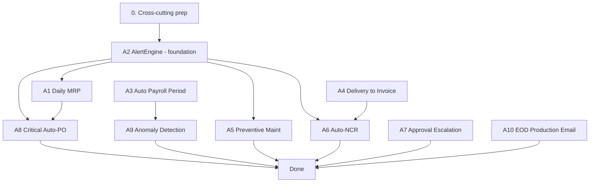

# Ogami ERP — Tasks A1–A10 Automation Execution Plan

**Scope:** All ten "A-Series" automation tasks from [`docs/NEW-TASKS.md`](docs/NEW-TASKS.md:14) — scheduled MRP, alert engine, auto payroll, delivery→invoice, preventive maintenance, QC auto-NCR, approval escalation, critical-stock auto-PO, payroll anomaly detection, and end-of-day production summary email.

**Mandatory references (already read):** [`CLAUDE.md`](CLAUDE.md:1) · [`docs/PATTERNS.md`](docs/PATTERNS.md:1) · [`docs/DESIGN-SYSTEM.md`](docs/DESIGN-SYSTEM.md:1) · [`docs/SCHEMA.md`](docs/SCHEMA.md:1).

**Migration numbering:** Last existing is [`0109_add_asset_id_to_machines_table.php`](api/database/migrations/0109_add_asset_id_to_machines_table.php:1). New migrations start at **`0110`**.

**Laravel 11 scheduling:** This project uses Laravel 11 (no `app/Console/Kernel.php`). All schedule registrations go in [`api/bootstrap/app.php`](api/bootstrap/app.php:1) via `->withSchedule(function (Schedule $schedule) { ... })`. Console commands are auto-discovered from `app/Console/Commands/`.

---

## 0. Cross-Cutting Pre-Work (do once, before A1)

These artifacts are shared by multiple tasks. Build them first.

| # | File | Purpose |
|---|---|---|
| 0.1 | `api/app/Console/Commands/.gitkeep` | Create the directory |
| 0.2 | Edit [`api/bootstrap/app.php`](api/bootstrap/app.php:1) | Add `->withSchedule(...)` block; register every scheduled command from A1, A2, A3, A5, A7, A10 in one place |
| 0.3 | `api/app/Common/Services/AlertEngineService.php` | Stub created in §A2 — referenced by A1, A5, A6, A8 to push alerts |
| 0.4 | `api/app/Common/Services/NotificationService.php` (already exists) | Verify it has `notifyRole(string $roleSlug, string $type, array $payload)` and `notifyUser(User $u, ...)`. Add if missing. |
| 0.5 | `api/app/Providers/EventServiceProvider.php` | Confirm exists (Laravel 11 uses attribute-based listener discovery — verify config). Will register two new listeners (A4, A6). |

---

## A1 — Scheduled MRP Auto-Run (daily 06:00)

**Reference:** [`docs/NEW-TASKS.md`](docs/NEW-TASKS.md:21) §A1. Existing engine: [`api/app/Modules/MRP/Services/MrpEngineService.php`](api/app/Modules/MRP/Services/MrpEngineService.php:1) (currently `runForSalesOrder()`).

### Backend

| Order | File | Notes |
|---|---|---|
| 1 | `api/database/migrations/0110_create_mrp_runs_table.php` | Columns from schema spec: `id`, `run_at` ts, `triggered_by` string(20) `scheduled\|manual`, `triggered_by_user_id` FK users nullable, `shortages_found` int default 0, `prs_created` int default 0, `prs_updated` int default 0, `duration_ms` int nullable, `status` string(20) `running\|completed\|failed`, `error_message` text nullable, `summary` json nullable, timestamps. Index `run_at`, `status`. |
| 2 | `api/app/Modules/MRP/Enums/MrpRunTrigger.php` | `Scheduled='scheduled'`, `Manual='manual'` |
| 3 | `api/app/Modules/MRP/Enums/MrpRunStatus.php` | `Running`, `Completed`, `Failed` |
| 4 | `api/app/Modules/MRP/Models/MrpRun.php` | `HasHashId`, `HasFactory`. Casts: `run_at` datetime, `triggered_by` enum, `status` enum, `summary` array. |
| 5 | Extend [`MrpEngineService`](api/app/Modules/MRP/Services/MrpEngineService.php:1): add `runForAllActiveSalesOrders(MrpRunTrigger $trigger, ?int $userId = null): MrpRun` | Wraps in `DB::transaction`. Creates `MrpRun` row first (status running). Iterates `SalesOrder::whereIn('status', ['confirmed','in_production','partially_delivered'])->get()`. For each calls existing `runForSalesOrder()`. **Deduplication rule:** before creating a new PR, check for existing PR with `status in (draft,pending,approved)` for the same `item_id`; if found and quantity covers shortage → increment a `prs_updated` counter (extend the existing PR's qty); else create new. Records `shortages_found`, `prs_created`, `prs_updated`, `duration_ms`. Sets status `completed` or `failed`+error. |
| 6 | `api/app/Modules/MRP/Services/MrpRunService.php` | `list(array $filters): LengthAwarePaginator` (paginated history), `latest(): ?MrpRun`. |
| 7 | `api/app/Modules/MRP/Resources/MrpRunResource.php` | hash_id, run_at, triggered_by, triggered_by_user, shortages_found, prs_created, prs_updated, duration_ms, status, error_message, summary. |
| 8 | `api/app/Modules/MRP/Controllers/MrpRunController.php` | `index()` paginated, `latest()` returns most recent, `store()` triggers manual run via `MrpEngineService::runForAllActiveSalesOrders(MrpRunTrigger::Manual, auth()->id())` then returns the resource (HTTP 202). |
| 9 | `api/app/Console/Commands/RunDailyMrp.php` | Signature: `mrp:run-daily`. Calls `MrpEngineService::runForAllActiveSalesOrders(Scheduled)`. After completion → `NotificationService::notifyRole('ppc_head', 'mrp_run_completed', [...summary...])`. Logs to `Log::info`. |
| 10 | Routes — append to [`api/app/Modules/MRP/routes.php`](api/app/Modules/MRP/routes.php:1) | `Route::prefix('mrp/runs')->group(fn() => ...)`: `GET /` view, `GET /latest` view, `POST /` create (permission `mrp.runs.trigger`). All with `auth:sanctum` + `feature:mrp`. |
| 11 | Permissions seed — extend [`api/database/seeders/`](api/database/seeders/) | Add `mrp.runs.view`, `mrp.runs.trigger` to roles `ppc_head`, `production_manager`, `admin`. |
| 12 | Schedule in [`bootstrap/app.php`](api/bootstrap/app.php:1) | `$schedule->command('mrp:run-daily')->dailyAt('06:00')->withoutOverlapping()->onOneServer();` |

### Frontend

| Order | File | Notes |
|---|---|---|
| 1 | `spa/src/types/mrp.ts` (extend) | Add `MrpRun` interface (id, run_at, triggered_by, triggered_by_user, shortages_found, prs_created, prs_updated, duration_ms, status, error_message). |
| 2 | `spa/src/api/mrp.ts` (extend) | `mrpRunsApi.list`, `mrpRunsApi.latest`, `mrpRunsApi.trigger`. |
| 3 | Edit [`spa/src/pages/mrp/plans/index.tsx`](spa/src/pages/mrp/plans/index.tsx:1) | Above the existing list, add a banner row: "Last MRP run: {formatDateTime(run.run_at)} · {shortages_found} shortages · {prs_created} PRs created · {prs_updated} updated". Right-align "Run MRP Now" Button (variant primary, only when `can('mrp.runs.trigger')`). Banner uses `bg-surface border-default rounded-md px-4 py-3` with mono numbers. Button → `useMutation(mrpRunsApi.trigger)`, on success: toast.success + `queryClient.invalidateQueries({ queryKey: ['mrp', 'runs'] })` + invalidate plans list. Show 5 mandatory states for the latest-run query (skeleton bar, error retry, empty "No MRP runs yet", data, stale). |

---

## A2 — Smart Alert Engine (every 15 min)

**Reference:** [`docs/NEW-TASKS.md`](docs/NEW-TASKS.md:43) §A2. Foundation for A1, A5, A6, A8 (each pushes via the same service).

### Backend

| Order | File | Notes |
|---|---|---|
| 1 | `api/database/migrations/0111_create_alerts_table.php` | id, `type` string(50), `severity` string(20) `critical\|warning\|info`, `title` string(200), `message` text, `entity_type` string(100) nullable, `entity_id` bigint nullable, `metadata` json nullable, `is_read` bool default false, `is_dismissed` bool default false, `dismissed_by` FK users nullable, `dismissed_at` ts nullable, `notified_email_at` ts nullable, timestamps. Indexes: `(is_dismissed, severity)`, `(entity_type, entity_id)`, `type`, `created_at`. |
| 2 | `api/app/Common/Enums/AlertSeverity.php` | `Critical`, `Warning`, `Info`. |
| 3 | `api/app/Common/Enums/AlertType.php` | All 12 types: `StockCritical`, `StockLow`, `NoSupplier`, `MachineBreakdown`, `MoldShotLimit`, `MoldShotCritical`, `WoOverdue`, `OeeBelowThreshold`, `ArOverdue30`, `ArOverdue60`, `ApDueSoon`, `QcFailRateHigh`. |
| 4 | `api/app/Common/Models/Alert.php` | `HasHashId`. polymorphic `entity()` morphTo. Casts severity/type as enums. |
| 5 | `api/app/Common/Services/AlertEngineService.php` | Methods: `raise(AlertType $type, AlertSeverity $sev, string $title, string $message, ?Model $entity = null, array $metadata = []): Alert` — **idempotent**: if an undismissed alert exists for same `(type, entity_type, entity_id)` within 24h, skip creation; `dismiss(Alert $a, User $u)`; `runAllChecks(): array` — returns counts; private check methods `checkInventory()`, `checkProduction()`, `checkFinance()`, `checkQuality()` matching the 12 triggers (queries from `docs/NEW-TASKS.md` lines 56–75). For OEE 75% × 3 days uses an existing OEE service or computes from `machine_downtimes`+`work_order_outputs`. |
| 6 | `api/app/Common/Notifications/CriticalAlertEmail.php` (Laravel Notification) | Email-only channel. Used for `severity=critical` alerts to subscribed roles. |
| 7 | `api/app/Common/Resources/AlertResource.php` | hash_id, type, severity, title, message, entity_type, entity (eager-loaded morph), metadata, is_read, is_dismissed, created_at, dismissed_at. |
| 8 | `api/app/Common/Requests/ListAlertsRequest.php` | filters: `severity[]`, `type[]`, `entity_type`, `is_dismissed`, search. authorize via `alerts.view`. |
| 9 | `api/app/Common/Controllers/AlertController.php` | `index` paginated (default filter `is_dismissed=false`), `dismiss(Alert $alert)` PATCH, `markRead(Alert $alert)` PATCH. |
| 10 | `api/routes/api.php` (extend) | `Route::middleware('auth:sanctum')->prefix('alerts')->group(...)`: GET `/`, PATCH `/{alert}/dismiss`, PATCH `/{alert}/read`. Permission middleware `alerts.view` / `alerts.dismiss`. |
| 11 | `api/app/Console/Commands/RunAlertEngine.php` | Signature `alerts:run`. Calls `AlertEngineService::runAllChecks()`. Logs counts. |
| 12 | Schedule in [`bootstrap/app.php`](api/bootstrap/app.php:1) | `$schedule->command('alerts:run')->everyFifteenMinutes()->withoutOverlapping(10)->onOneServer();` |
| 13 | Seed permissions | `alerts.view`, `alerts.dismiss` to roles: admin, plant_manager, production_manager, ppc_head, finance_officer, qc_head, hr_officer, maintenance_head. |

### Frontend

| Order | File | Notes |
|---|---|---|
| 1 | `spa/src/types/alerts.ts` (new) | `Alert` interface, `AlertSeverity`, `AlertType` unions. |
| 2 | `spa/src/api/alerts.ts` | `list`, `dismiss(id)`, `markRead(id)`. |
| 3 | `spa/src/hooks/useAlertsCount.ts` | TanStack Query polling every 60s for unread `critical+warning` count; subscribes via `useEcho` to channel `alerts` for live invalidation. |
| 4 | Edit `spa/src/components/layout/Topbar.tsx` (existing) | Add `<AlertBell />` between search and theme toggle: 30px icon button (Lucide `Bell`), badge with count from `useAlertsCount`; click opens dropdown popover (8 most recent unread, with severity dot color and "View all" → `/alerts`). |
| 5 | `spa/src/components/ui/AlertBell.tsx` | New component. |
| 6 | `spa/src/pages/alerts/index.tsx` (new) | Full list page (PATTERNS.md §10). Filters: severity (chip toggles success/warning/danger), type select, entity_type select, is_dismissed switch. Each row: severity dot + title + message + entity link + relative time + dismiss button (icon X). 5 mandatory states. Numbers mono. |
| 7 | Edit existing Plant Manager Dashboard panel | Wire `<AlertsPanel />` to `alerts.list({severity:[critical,warning], is_dismissed:false, per_page:5})` instead of mock data. |
| 8 | Routes in [`spa/src/App.tsx`](spa/src/App.tsx:1) | `/alerts` lazy, AuthGuard + PermissionGuard `alerts.view`. |

---

## A3 — Auto Payroll Period Creation

**Reference:** [`docs/NEW-TASKS.md`](docs/NEW-TASKS.md:88) §A3. Existing: [`PayrollPeriod`](api/app/Modules/Payroll/Models/PayrollPeriod.php:1), [`ProcessPayrollJob`](api/app/Modules/Payroll/Jobs/ProcessPayrollJob.php:1).

### Backend

| Order | File | Notes |
|---|---|---|
| 1 | `api/database/migrations/0112_add_auto_created_to_payroll_periods.php` | Add `is_auto_created` bool default false, `auto_created_at` ts nullable. |
| 2 | Extend [`PayrollPeriod`](api/app/Modules/Payroll/Models/PayrollPeriod.php:1) | Add to `$fillable` and `$casts`. |
| 3 | `api/app/Modules/Payroll/Services/AutoPayrollPeriodService.php` | `createForFirstHalfOfNextMonth()` and `createForSecondHalfOfCurrentMonth()`. Each: compute date range; **guard** — if `PayrollPeriod::where('period_start', $start)->exists()` → return null (skip). Create with `status='draft'`, `is_auto_created=true`, `created_by=null`, `auto_created_at=now()`. Dispatch `ProcessPayrollJob::dispatch($period, null)`. Wrap in `DB::transaction`. |
| 4 | `api/app/Modules/Payroll/Listeners/NotifyHrOnPayrollComputed.php` | Listens to existing `PayrollComputed` event (or extend `ProcessPayrollJob` to fire it on completion). On listen: `NotificationService::notifyRole('hr_officer', 'payroll_auto_computed', ['period_id'=>...,'period_label'=>...,'employee_count'=>...])`. |
| 5 | `api/app/Console/Commands/CreateAutoPayrollPeriod.php` | Signature `payroll:auto-create-period {--half=}`. Routes to one of the two service methods. |
| 6 | Schedule in [`bootstrap/app.php`](api/bootstrap/app.php:1) | `$schedule->command('payroll:auto-create-period --half=second')->monthlyOn(14, '23:00');` and `$schedule->command('payroll:auto-create-period --half=first')->lastDayOfMonth('23:00');` (Laravel 11 has `lastDayOfMonth`; if not, use cron `0 23 28-31 * *` with internal date check). |
| 7 | Update `PayrollPeriodResource` | Expose `is_auto_created`, `auto_created_at`. |

### Frontend

| Order | File | Notes |
|---|---|---|
| 1 | `spa/src/types/payroll.ts` (extend) | Add `is_auto_created: boolean`, `auto_created_at: string \| null`. |
| 2 | Edit [`spa/src/pages/payroll/periods/index.tsx`](spa/src/pages/payroll/periods/index.tsx:1) | In the period column show `<Chip variant="info">Auto</Chip>` when `is_auto_created`. |
| 3 | Edit [`spa/src/pages/payroll/periods/detail.tsx`](spa/src/pages/payroll/periods/detail.tsx:1) | In metadata row add line "Created: {auto ? 'Auto-scheduled' : 'Manually triggered'} · {formatDateTime(auto_created_at ?? created_at)}". |

---

## A4 — Delivery → Auto Draft Invoice

**Reference:** [`docs/NEW-TASKS.md`](docs/NEW-TASKS.md:107) §A4. Existing models: [`Delivery`](api/app/Modules/SupplyChain/Models/), `Invoice`, `SalesOrder`, `ProductPriceAgreement`.

### Backend

| Order | File | Notes |
|---|---|---|
| 1 | `api/app/Modules/SupplyChain/Events/DeliveryConfirmed.php` | Public `Delivery $delivery`. Constructed and `event()`-fired in `DeliveryService::confirm()` (verify Task 66 wired this; create event if missing). |
| 2 | `api/app/Modules/Accounting/Services/AutoInvoiceService.php` | `createDraftFromDelivery(Delivery $d): ?Invoice`. Wrap in `DB::transaction`. Steps: (a) load `$d->salesOrder` + items + customer; (b) for each delivered line, look up active `ProductPriceAgreement::where('product_id', $p->id)->where('customer_id', $c->id)->where('effective_from','<=',$d->actual_delivery_date)->where('effective_to','>=',$d->actual_delivery_date)->latest()->first()` — fall back to `product->standard_cost` with warning; (c) compute subtotal, vat=subtotal*0.12, total; (d) create `Invoice` with `status='draft'`, `delivery_id`, `sales_order_id`, `invoice_number = DocumentSequenceService::generate('invoice')`; (e) create `InvoiceItem` rows; (f) attach CoC PDF — query existing `inspections` for the SO's outgoing pass and link path. (g) Notify `finance_officer` role. **Idempotency:** if `Invoice::where('delivery_id', $d->id)->exists()` skip. |
| 3 | `api/app/Modules/Accounting/Listeners/CreateDraftInvoiceOnDeliveryConfirmed.php` | Implements `ShouldQueue`. Calls `AutoInvoiceService`. |
| 4 | Register listener in [`api/app/Providers/EventServiceProvider.php`](api/app/Providers/EventServiceProvider.php:1) | Map `DeliveryConfirmed → CreateDraftInvoiceOnDeliveryConfirmed`. |
| 5 | Confirm `DeliveryService::confirm()` fires `DeliveryConfirmed` event after status flip. Add if missing. |

### Frontend

| Order | File | Notes |
|---|---|---|
| 1 | Edit [`spa/src/pages/accounting/invoices/index.tsx`](spa/src/pages/accounting/invoices/index.tsx:1) | If invoice has linked delivery and status='draft' show `<Chip variant="info">Auto-draft</Chip>`. |
| 2 | Edit Sales Order detail page (existing) | The ChainHeader auto-advances to "Invoiced" when `salesOrder.invoice_id` populates — verify. No code change if already wired through `SO.status` transitions; if not, extend `salesOrders/detail.tsx` ChainHeader step computation to check `data.invoice` presence. |
| 3 | Notification template handler (existing notifications page) | Ensure type `auto_invoice_draft` renders with link to `/accounting/invoices/{id}`. |

---

## A5 — Preventive Maintenance Auto-Scheduling

**Reference:** [`docs/NEW-TASKS.md`](docs/NEW-TASKS.md:128) §A5. Tables: [`maintenance_schedules`](docs/SCHEMA.md:347), [`maintenance_work_orders`](docs/SCHEMA.md:351), `machines`, `molds`.

### Backend

| Order | File | Notes |
|---|---|---|
| 1 | `api/database/migrations/0113_add_running_hours_to_machines.php` | `machines`: add `running_hours_total` decimal(10,2) default 0, `running_hours_updated_at` ts nullable. |
| 2 | `api/app/Modules/Maintenance/Services/MachineHoursService.php` | `recompute()` — for each active machine, sum `work_order_outputs` durations and subtract downtime (or use a simpler proxy: `available_hours_per_day` × days since last reset minus downtimes). Updates `running_hours_total`. |
| 3 | `api/app/Modules/Maintenance/Services/PreventiveMaintenanceService.php` | `evaluateAndSchedule(): array`. Iterates `MaintenanceSchedule::where('is_active', true)->get()`. Per row: switch interval_type — `'shots'`: lookup `mold->current_shot_count`, threshold = `last_shots + interval_value*0.80`; `'days'`: `next_due_at <= now()->addDays(3)`; `'hours'`: machine running_hours since last performed ≥ `interval_value * 0.80`. If condition: `DB::transaction` create `MaintenanceWorkOrder` with `type='preventive'`, `priority` mapped (`'shots'` ≥ 95% = critical else high; `'days'` overdue = high else medium), `status='pending'`, `assigned_to=null`, `description="Auto: {schedule.description}"`. Update `schedule.next_due_at` based on interval. Idempotency: skip if open preventive WO already exists for `(maintainable, schedule_id)`. **Also raise an alert via `AlertEngineService` for shot-limit thresholds (mold_shot_limit/critical).** |
| 4 | `api/app/Console/Commands/RunPreventiveMaintenance.php` | Signature `maintenance:run-preventive`. Calls `MachineHoursService::recompute()` then `PreventiveMaintenanceService::evaluateAndSchedule()`. Notifies `maintenance_head` with summary count. |
| 5 | Schedule in [`bootstrap/app.php`](api/bootstrap/app.php:1) | `$schedule->command('maintenance:run-preventive')->dailyAt('07:00')->withoutOverlapping()->onOneServer();` |
| 6 | Extend `MaintenanceWorkOrderResource` | expose `is_auto_generated` (computed: `assigned_to_id === null && schedule_id !== null && created_by === null`) — or add real column via migration if cleaner. |

### Frontend

| Order | File | Notes |
|---|---|---|
| 1 | Edit [`spa/src/pages/maintenance/work-orders/index.tsx`](spa/src/pages/maintenance/work-orders/index.tsx:1) | Show `<Chip variant="info">Auto</Chip>` when `is_auto_generated`. Filter "Auto-generated only" toggle. |
| 2 | Edit machine detail (existing) | Add "Running hours: {running_hours_total} h" KPI tile (mono). |

---

## A6 — QC Auto-NCR on Inspection Failure

**Reference:** [`docs/NEW-TASKS.md`](docs/NEW-TASKS.md:148) §A6.

### Backend

| Order | File | Notes |
|---|---|---|
| 1 | `api/database/migrations/0114_add_is_auto_generated_to_ncr.php` | `non_conformance_reports`: `is_auto_generated` bool default false, index. |
| 2 | `api/app/Modules/Quality/Events/InspectionCompleted.php` | Public `Inspection $inspection`. Fired in `InspectionService::recordMeasurements()` after final state determined. |
| 3 | `api/app/Modules/Quality/Services/AutoNcrService.php` | `createFromFailedInspection(Inspection $i): ?NonConformanceReport`. Idempotent (skip if already linked). Builds severity per rule: any failed measurement on an `InspectionSpecItem` with `is_critical=true` ⇒ `Critical`; else if `parameter_type='visual'` only failures ⇒ `Minor`; else `Major`. Description auto-built from failed measurements. `disposition=null` (mandatory human input). For `stage='outgoing'`: also create a replacement `WorkOrder` (status `planned`, `quantity_target=$i->reject_count`, `sales_order_id` from inspection's entity, links to original SO). Notify `qc_head`. |
| 4 | `api/app/Modules/Quality/Listeners/AutoCreateNcrOnFailedInspection.php` | Implements `ShouldQueue`. Filters `if ($e->inspection->result !== InspectionResult::Fail) return;` then calls `AutoNcrService`. |
| 5 | Register listener in `EventServiceProvider`. |
| 6 | Update `NcrResource` | expose `is_auto_generated`, `replacement_wo_id`. |

### Frontend

| Order | File | Notes |
|---|---|---|
| 1 | Edit [`spa/src/pages/quality/ncrs/index.tsx`](spa/src/pages/quality/ncrs/index.tsx:1) | Show `<Chip variant="info">Auto</Chip>` next to NCR number when `is_auto_generated`. |
| 2 | Edit [`spa/src/pages/quality/ncrs/detail.tsx`](spa/src/pages/quality/ncrs/detail.tsx:1) | If auto-generated and root_cause/disposition empty, show `<Banner variant="warning">This NCR was auto-generated. Root cause and corrective action require your input.</Banner>`. Link to replacement WO when present. |

---

## A7 — Overdue Approval Escalation

**Reference:** [`docs/NEW-TASKS.md`](docs/NEW-TASKS.md:170) §A7. Existing: [`approval_records`](docs/SCHEMA.md:39).

### Backend

| Order | File | Notes |
|---|---|---|
| 1 | `api/database/migrations/0115_add_escalation_columns_to_approval_records.php` | `reminder_sent_at` ts nullable, `escalated_at` ts nullable, `escalated_to_user_id` FK users nullable. |
| 2 | `api/app/Common/Services/ApprovalEscalationService.php` | `runReminders()`: query `ApprovalRecord::where('action','pending')->where('created_at','<', now()->subHours(24))->whereNull('reminder_sent_at')->get()` → notify current approver, set `reminder_sent_at`. `runEscalations()`: same but `subHours(48)` and `whereNull('escalated_at')` — find approver's superior via the user's role hierarchy or department head; notify both. Always append to `remarks`: "Reminder sent at 24h." / "Escalated at 48h." Never auto-approve. |
| 3 | `api/app/Console/Commands/RunApprovalEscalations.php` | Signature `approvals:run-escalations`. Calls both methods. |
| 4 | Schedule in [`bootstrap/app.php`](api/bootstrap/app.php:1) | `$schedule->command('approvals:run-escalations')->everySixHours()->withoutOverlapping()->onOneServer();` |
| 5 | Extend `ApprovalRecord` model and resources | Computed `is_overdue` (created_at < now-24h && action=pending), `overdue_hours`. |

### Frontend

| Order | File | Notes |
|---|---|---|
| 1 | Edit `ApprovalTimeline` / pending approval lists wherever they exist (e.g., dashboard "My Approvals" panel) | When `is_overdue`: red Chip "Overdue" with `tooltip="Overdue by {overdue_hours}h"`. Pulse the indicator dot if `escalated_at` is set. |

---

## A8 — Critical-Stock Auto-PO

**Reference:** [`docs/NEW-TASKS.md`](docs/NEW-TASKS.md:189) §A8. Builds on Task 45 low-stock automation.

### Backend

| Order | File | Notes |
|---|---|---|
| 1 | `api/database/migrations/0116_add_is_auto_generated_to_purchase_orders.php` | `purchase_orders`: `is_auto_generated` bool default false. |
| 2 | `api/app/Modules/Purchasing/Services/AutoPurchaseOrderService.php` | `createForCriticalShortage(Item $item): ?PurchaseOrder`. Conditions: `$item->is_critical && stock < reorder_point`. Find approved supplier with `is_preferred=true` for this item; if zero or multiple → fall back to PR (existing). If exactly one: `DB::transaction` — generate PO number, status `pending_vp`, lines built from item + reorder qty (target = `reorder_point + safety_stock - stock`), `is_auto_generated=true`. Notify VP. Raise alert via `AlertEngineService` (severity critical). |
| 3 | Hook into existing low-stock automation (likely [`StockLevelObserver`](api/) or a service called from `StockMovementService`) — extend so it routes critical+single-supplier items to `AutoPurchaseOrderService` instead of PR. Non-critical path unchanged. |
| 4 | Update `PurchaseOrderResource` to expose `is_auto_generated`. |
| 5 | Update `purchase_orders` workflow to allow status `pending_vp` (compressed approval) — verify `WorkflowDefinition` for purchase_orders supports a single-step VP route when triggered by `is_auto_generated=true`. Add a new workflow row in seed: `'workflow_type'=>'purchase_order_critical_auto'`, steps=`[{role:'vp', step_order:1}]`. |

### Frontend

| Order | File | Notes |
|---|---|---|
| 1 | Edit [`spa/src/pages/purchasing/purchase-orders/index.tsx`](spa/src/pages/purchasing/purchase-orders/index.tsx:1) | `<Chip variant="info">Auto</Chip>` when `is_auto_generated`. |
| 2 | PO detail page | Show banner "Auto-generated for critical stock. Supplier may be changed before final approval." while in `pending_vp`. Allow `Purchasing` role to swap supplier (existing edit flow but limited fields). |

---

## A9 — Payroll Anomaly Detection

**Reference:** [`docs/NEW-TASKS.md`](docs/NEW-TASKS.md:208) §A9.

### Backend

| Order | File | Notes |
|---|---|---|
| 1 | `api/database/migrations/0117_create_payroll_anomaly_flags_table.php` | id, `payroll_id` FK payrolls, `payroll_period_id` FK payroll_periods (denorm for fast period queries), `employee_id` FK employees, `flag_type` string(40) `large_change\|excessive_ot\|high_deduction\|first_payroll\|zero_pay`, `details` json (previous_value, current_value, percent_change), `is_resolved` bool default false, `resolved_by` FK users nullable, `resolved_at` ts nullable, `resolution_remarks` text nullable, timestamps. Index `(payroll_period_id, is_resolved)`. |
| 2 | `api/app/Modules/Payroll/Enums/PayrollAnomalyType.php` | five cases above. |
| 3 | `api/app/Modules/Payroll/Models/PayrollAnomalyFlag.php` | HasHashId. |
| 4 | `api/app/Modules/Payroll/Services/PayrollAnomalyService.php` | `detect(PayrollPeriod $p): int`. For each `Payroll` in period: load previous period's payroll for same employee; check rules per spec (>30% net change, >80 OT hours, deductions/gross > 0.5, no previous period existed → first_payroll, net_pay = 0 → zero_pay). Insert flags (idempotent on `(payroll_id, flag_type)`). Returns flag count. |
| 5 | Hook into [`ProcessPayrollJob`](api/app/Modules/Payroll/Jobs/ProcessPayrollJob.php:1) | At end of successful run: `app(PayrollAnomalyService::class)->detect($this->period);`. |
| 6 | `api/app/Modules/Payroll/Resources/PayrollAnomalyFlagResource.php` | hash_id, employee, flag_type, details, is_resolved, resolved_by, resolved_at, resolution_remarks. |
| 7 | `api/app/Modules/Payroll/Controllers/PayrollAnomalyController.php` | `index($period)` paginated, `resolve($flag)` PATCH (sets `is_resolved=true`, `resolved_by`, `resolved_at`, `resolution_remarks` from body). |
| 8 | Routes in [`api/app/Modules/Payroll/routes.php`](api/app/Modules/Payroll/routes.php:1) | `GET /payroll/periods/{period}/anomalies`, `PATCH /payroll/anomalies/{flag}/resolve`. Permission `payroll.anomalies.review`. |
| 9 | **Block finalization** — extend `PayrollPeriodService::finalize()` | Throw `IllegalStatusTransitionException` if any unresolved flag exists for period. Custom message rendered as 422 to FE. |

### Frontend

| Order | File | Notes |
|---|---|---|
| 1 | `spa/src/types/payroll.ts` extend | Add `PayrollAnomalyFlag` interface. |
| 2 | `spa/src/api/payroll.ts` extend | `payrollAnomaliesApi.list(periodId)`, `.resolve(flagId, remarks)`. |
| 3 | Edit [`spa/src/pages/payroll/periods/detail.tsx`](spa/src/pages/payroll/periods/detail.tsx:1) | Add "Anomaly Review" tab. Tab badge shows unresolved count (red if >0). Tab body: table with columns `Employee` / `Flag` (Chip variant warning) / `Previous` / `Current` / `Δ` (mono right) / `Action`. "Mark as reviewed" button opens small modal asking for remarks (textarea, required). On finalize attempt: if 422 with code `unresolved_anomalies`, toast.error + scroll to tab. |

---

## A10 — End-of-Day Production Summary Email

**Reference:** [`docs/NEW-TASKS.md`](docs/NEW-TASKS.md:227) §A10.

### Backend

| Order | File | Notes |
|---|---|---|
| 1 | `api/app/Modules/Production/Services/ProductionSummaryService.php` | `forDate(Carbon $date): array` — collects: `wo_summary` (target/actual/variance per WO active that day), `oee` per machine (reuse existing OEE service), `breakdowns` (active rows from `machine_downtimes` WHERE end_time IS NULL OR DATE(start_time)=$date), `defects_by_type` (sum from `work_order_defects`+`defect_types` for the day), `qc_results` (counts pass/fail from `inspections` inspected_at=$date), `pending_materials` (open `material_reservations` status=reserved). `forWeek(Carbon $weekEnd): array` — totals + WoW % delta. |
| 2 | `api/app/Modules/Production/Notifications/DailyProductionSummary.php` (Notification, mailable channel) | Builds Mail with view `emails.production-summary`. Subject "Production Summary — {date}". |
| 3 | `api/app/Modules/Production/Notifications/WeeklyProductionSummary.php` | Same with weekly view. |
| 4 | `api/resources/views/emails/production-summary.blade.php` | HTML email. Inline CSS only. Mirrors dashboard look: dark text on white, monochrome canvas, monospace numbers (use `font-family: 'Courier New', monospace; font-variant-numeric: tabular-nums;`), no shadows, 0.5px–1px borders, status chips reproduced as inline-block spans with `--success-bg/--success-fg` colors literal-coded. KPI tiles row, then WO table (32px rows, 10px uppercase headers letter-spaced 0.05em), defects pareto, machine OEE list, breakdowns, footer "Generated by Ogami ERP at {time}". |
| 5 | `api/resources/views/emails/production-summary-weekly.blade.php` | Variant. |
| 6 | `api/app/Console/Commands/SendDailyProductionSummary.php` | Resolves users with role `plant_manager`, `production_manager`. `Notification::send($users, new DailyProductionSummary($summary));` |
| 7 | `api/app/Console/Commands/SendWeeklyProductionSummary.php` | Same for weekly. |
| 8 | Schedule in [`bootstrap/app.php`](api/bootstrap/app.php:1) | `$schedule->command('production:send-daily-summary')->dailyAt('18:00')->onOneServer();` and `->command('production:send-weekly-summary')->weeklyOn(Schedule::FRIDAY,'18:00')->onOneServer();` |

### Frontend

No new frontend (email is the deliverable). However, add a "Preview last summary" link on the Plant Manager Dashboard footer that opens `/api/v1/production/summary/preview` rendering the same Blade template in-app — optional polish, deferred to P-series.

---

## Mandatory checklist application (every task)

For each task above, before marking complete the implementing agent runs the [`docs/PATTERNS.md`](docs/PATTERNS.md:1716) Final Checklist verbatim. In particular for these automation tasks:

- ✅ Every new model has `HasHashId` (`MrpRun`, `Alert`, `PayrollAnomalyFlag`).
- ✅ Every API resource returns `hash_id`, never raw integer id.
- ✅ Every service mutation wrapped in `DB::transaction()`.
- ✅ Every scheduled command has `->withoutOverlapping()` and `->onOneServer()`.
- ✅ Every listener that creates database rows is **idempotent** (skip on duplicate / use `firstOrCreate`).
- ✅ Every notification has both in-app and email channels controlled by `notification_preferences`.
- ✅ Every list page (Alerts, MRP Runs, Anomalies) handles all 5 mandatory states (loading skeleton, error retry, empty, data, stale via `placeholderData`).
- ✅ Every status uses `<Chip>` with semantic variant from PATTERNS.md mapping (auto = info, overdue = danger, resolved = success, pending = warning, breakdown = danger).
- ✅ Every number, ID, and timestamp in tables uses `font-mono tabular-nums` and right-alignment for numbers.
- ✅ Routes wrapped in `AuthGuard` + `ModuleGuard` + `PermissionGuard`. New permissions seeded.
- ✅ No Bearer tokens, no localStorage auth.

---

## Migration registry (added by this plan)

| File | Module |
|---|---|
| `0110_create_mrp_runs_table.php` | MRP |
| `0111_create_alerts_table.php` | Common |
| `0112_add_auto_created_to_payroll_periods.php` | Payroll |
| `0113_add_running_hours_to_machines.php` | Production/Maintenance |
| `0114_add_is_auto_generated_to_ncr.php` | Quality |
| `0115_add_escalation_columns_to_approval_records.php` | Common |
| `0116_add_is_auto_generated_to_purchase_orders.php` | Purchasing |
| `0117_create_payroll_anomaly_flags_table.php` | Payroll |

---

## Schedule registry (single block in `bootstrap/app.php`)

```php
->withSchedule(function (Schedule $schedule) {
    $schedule->command('mrp:run-daily')->dailyAt('06:00')->withoutOverlapping()->onOneServer();
    $schedule->command('alerts:run')->everyFifteenMinutes()->withoutOverlapping(10)->onOneServer();
    $schedule->command('payroll:auto-create-period --half=second')->monthlyOn(14, '23:00')->onOneServer();
    $schedule->command('payroll:auto-create-period --half=first')->lastDayOfMonth('23:00')->onOneServer();
    $schedule->command('maintenance:run-preventive')->dailyAt('07:00')->withoutOverlapping()->onOneServer();
    $schedule->command('approvals:run-escalations')->everySixHours()->withoutOverlapping()->onOneServer();
    $schedule->command('production:send-daily-summary')->dailyAt('18:00')->onOneServer();
    $schedule->command('production:send-weekly-summary')->fridays()->at('18:00')->onOneServer();
})
```

A6 (Auto-NCR) and A4 (Auto-Invoice) and A8 (Auto-PO) are **event-driven**, not scheduled — they trigger from `InspectionCompleted`, `DeliveryConfirmed`, and stock-level threshold breach respectively.

---

## Execution order (recommended)



Recommended sequence: **Pre → A2 → A1 → A4 → A6 → A3 → A9 → A5 → A8 → A7 → A10**. A2 first because it provides the alert sink used by A1/A5/A8. A4 before A6 so the SO chain header changes are validated end-to-end. A3 before A9 since anomalies hook into the payroll job. A7 and A10 are independent and can be parallelised.

---

## Risks & open questions for implementer

1. **`DeliveryConfirmed` event** may not exist (Task 66 status unverified). Implementer must verify and create if missing — affects A4.
2. **`InspectionCompleted` event** likely doesn't exist. Must add and wire into `InspectionService::recordMeasurements()` — affects A6.
3. **OEE threshold check** in A2 requires existing OEE computation (P10 task is "OEE Report Page Full" — implies aggregation may not be production-ready). The alert can use a simplified daily OEE rollup; flag follow-up if inaccurate.
4. **Approver hierarchy** for A7 escalation depends on either department head FK or role hierarchy table. Confirm path during implementation; default fallback = notify `admin` role.
5. **Critical-stock auto-PO (A8)** assumes the low-stock observer from Task 45 exists. If the existing implementation creates PRs synchronously inside `StockMovementService`, splice the critical-path branch there.
6. **Email template (A10)** must inline all CSS — no `<link>` tags. Test render in Litmus or Mailpit before declaring done.
7. **Idempotency** is critical for every scheduled command — use `withoutOverlapping()` AND in-DB guards (skip-if-exists) so retries are safe.
8. **Permissions seeding** — every new permission must be added to the `roles_permissions` seeder; agent must update [`api/database/seeders/`](api/database/seeders/) accordingly.

---

## File inventory (estimated count)

- Migrations: **8**
- PHP backend (commands, services, models, enums, events, listeners, controllers, requests, resources, notifications, blade): **~52**
- TypeScript types/api/hooks: **~9**
- React pages/components (new + edits): **~14**

**Total ~83 files** created or modified across the ten tasks.
