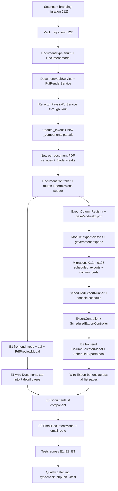

# Series E (Tasks E1–E3) — Execution Plan

PDF enhancement, CSV/Excel export enhancement, and in-system document vault for the Ogami ERP modular monolith.

References:
- [`CLAUDE.md`](../CLAUDE.md:1) — security, conventions, module layout
- [`docs/PATTERNS.md`](../docs/PATTERNS.md:1) — backend/frontend templates
- [`docs/DESIGN-SYSTEM.md`](../docs/DESIGN-SYSTEM.md:1) — visual spec
- [`docs/SCHEMA.md`](../docs/SCHEMA.md:1) — schema conventions
- [`docs/NEW-TASKS-V2.md`](../docs/NEW-TASKS-V2.md:631) — E1–E3 source spec

---

## 1. Context Discovery (already gathered)

Existing infrastructure to build on, not duplicate:

| Capability | Where it lives |
|---|---|
| `barryvdh/laravel-dompdf` | [`api/composer.json`](../api/composer.json:8) |
| `maatwebsite/excel` | [`api/composer.json`](../api/composer.json:14) |
| Per-document Blade templates | [`api/resources/views/pdf/`](../api/resources/views/pdf/) — `payslip`, `invoice`, `bill`, `purchase-order`, `purchase-request`, `coc`, `complaint-8d`, `balance-sheet`, `income-statement`, `journal-entry`, `trial-balance` |
| Shared PDF chrome | [`api/resources/views/pdf/_layout.blade.php`](../api/resources/views/pdf/_layout.blade.php:1), [`api/resources/views/pdf/_bulk.blade.php`](../api/resources/views/pdf/_bulk.blade.php:1) |
| Bulk PDF service (Task 76) | `api/app/Common/Services/BulkPdfService.php` |
| Payslip PDF service | `api/app/Modules/Payroll/Services/PayslipPdfService.php` |
| Existing CSV stream pattern | [`api/app/Modules/Admin/Controllers/AuditLogController.php`](../api/app/Modules/Admin/Controllers/AuditLogController.php:72), [`api/app/Modules/Accounting/Controllers/FinancialStatementController.php`](../api/app/Modules/Accounting/Controllers/FinancialStatementController.php:88) |
| `employee_documents` table | [`migration 0018`](../api/database/migrations/0018_create_employee_documents_table.php) — narrow, employee-only attachments |
| `shipment_documents` table | [`migration 0094`](../api/database/migrations/0094_create_shipment_documents_table.php) — narrow, shipment-only |
| Last migration number | `0121_create_profile_update_requests_table.php` -> new ones start at **`0122_`** |

There is **no general document vault** today, no Excel-format exports (only raw `php://output` CSV), and no in-browser PDF preview. PDFs stream-download but are not persisted or auditable.

---

## 2. Architectural Decisions

### 2.1 Single source of truth for PDF chrome
All E1 layout standards (letterhead, footer with `Generated by ... Page n/m`, watermark, QR slot, signature block) move into [`pdf/_layout.blade.php`](../api/resources/views/pdf/_layout.blade.php:1) and a small set of new partials in `pdf/_components/`. Existing per-document Blades extend this layout instead of redefining headers. This is the only way to keep 13+ documents consistent without per-file drift.

### 2.2 New `DocumentVaultService` is the choke point
Every Service that today calls `Pdf::loadView(...)->stream(...)` or `streamDownload(...)` must route through the vault. Direct DomPDF calls outside the vault become a code-review red flag. The vault:
1. Renders bytes via DomPDF.
2. Persists bytes to private storage (`storage/app/private/documents/...`).
3. Inserts a row in the new `documents` table.
4. Returns the `Document` model OR a streamed response (caller picks).

This gives us E3 (vault, history, preview) automatically as a side effect of E1.

### 2.3 Polymorphic vault, not per-entity tables
The new `documents` table is polymorphic (`entity_type`, `entity_id`) so every record type (invoice, PO, payslip, CoC, 8D report, payroll register, government remittance) can attach without schema churn. Existing `employee_documents` and `shipment_documents` tables stay — they are user-uploaded attachments with different lifecycle (uploaded by user vs generated by system) and ACLs.

### 2.4 Excel exports = first-class, CSV = legacy escape hatch
All new exports inherit from `Maatwebsite\Excel\Concerns\FromQuery` + `WithHeadings` + `WithMapping` + `WithStyles` + `ShouldAutoSize` + `WithEvents` (freeze pane). CSV is delivered as a sibling `?format=csv` query on the same export endpoint to satisfy "give me raw data" workflows and government remittance loaders that do not accept .xlsx.

### 2.5 Government-format exports are *not* generic
SSS R-3, PhilHealth RF-1, Pag-IBIG, BIR 1601-C, BIR 2316 each get their own dedicated export class with the exact column order, header text, and row formatting the agency requires. They are not built from the configurable column selector.

### 2.6 Configurable columns persisted server-side
Per-user, per-module column preferences live in the existing `settings` table (key namespace: `export.columns.{module}.{user_id}`). Avoids localStorage drift across devices and survives session resets.

### 2.7 In-browser preview = `?disposition=inline`
Same vault endpoint serves both preview (`Content-Disposition: inline`) and download (`attachment`) via a query flag. SPA opens preview in a sandboxed `<iframe>` modal, not a new tab, so the topbar and breadcrumbs remain.

### 2.8 Scheduled exports = jobs + recipients table, not cron strings on records
A `scheduled_exports` table stores the export config (module, columns JSON, filters JSON, frequency, recipients, owner). A single Laravel scheduled command (`exports:run-due`) ticks every 5 minutes, dispatches `RunScheduledExportJob` for each due row, attaches the produced file to an email via `Mailable`. No per-row cron expressions.

---

## 3. File Plan (in execution order)

Numbered the way [`docs/PATTERNS.md`](../docs/PATTERNS.md:494) demands: backend first (migration -> enum -> model -> service -> request -> resource -> controller -> route), then frontend (types -> api -> pages -> route).

### 3.1 Task E1 — PDF Enhancement

**Backend**

- Migration `0122_create_documents_table.php` — vault table (also covers E3). Columns:
  `id, document_type (string 50), entity_type (string 50), entity_id (bigint), file_path (string 500), file_name (string 200), file_size (unsigned int), mime_type (string 100), generated_by (FK users nullable), generated_at (timestamp), is_confidential (bool default false), checksum_sha256 (string 64 nullable), created_at, updated_at`. Indexes on `(entity_type, entity_id)`, `(document_type, generated_at)`, `generated_by`.
- Migration `0123_add_company_branding_settings.php` — seeds the `settings` table with `company.legal_name`, `company.address`, `company.tin`, `company.vat_status`, `company.phone`, `company.email`, `company.logo_path`. Read by every PDF.
- Enum `app/Common/Enums/DocumentType.php` — backed `string` enum: `payslip, invoice, purchase_order, purchase_request, bill, journal_entry, coc, complaint_8d, payroll_register, balance_sheet, income_statement, trial_balance, sss_r3, philhealth_rf1, pagibig_remittance, bir_1601c, bir_2316, ncr, work_order_traveler`.
- Model `app/Common/Models/Document.php` — `HasFactory, HasHashId, HasAuditLog`. Casts: `generated_at` -> datetime, `is_confidential` -> bool, `document_type` -> `DocumentType`. Polymorphic `entity()` MorphTo. Relationship `generatedBy(): BelongsTo` -> `User`. Scope `forEntity($type, $id)`.
- Service `app/Common/Services/DocumentVaultService.php`:
  ```
  public function store(string $bytes, DocumentType $type, Model $entity, User $user, bool $confidential = false): Document
  public function regenerate(Document $existing, string $bytes): Document     // versioning: archives the old row
  public function streamInline(Document $doc): StreamedResponse                // Content-Disposition: inline
  public function streamDownload(Document $doc): StreamedResponse              // Content-Disposition: attachment
  public function delete(Document $doc): void                                  // soft, also removes blob
  public function listForEntity(Model $entity): Collection
  ```
  Wraps `store()` in `DB::transaction()`. Storage disk: `private` (config `filesystems.disks.private` writes to `storage/app/private/`, never web-root). Filename pattern `{type}-{entity_no}-{YmdHis}-{rand6}.pdf`. SHA-256 captured for tamper detection.
- Service `app/Common/Services/PdfRenderService.php` — wraps DomPDF. Single method `render(string $view, array $data, array $opts): string` that always pre-injects `$company` (settings) and `$generated` (`['by' => User, 'at' => Carbon]`) into the view. Centralizes paper, orientation, font, and watermark options.
- Refactor existing services to use the vault:
  - `Payroll/Services/PayslipPdfService.php` — call `PdfRenderService::render('pdf.payslip', ...)` then `DocumentVaultService::store(..., DocumentType::Payslip, $payroll, $user, true)`. Confidential = true (watermark on).
  - New `app/Common/Services/Pdf/InvoicePdfService.php`, `PurchaseOrderPdfService.php`, `BillPdfService.php`, `CocPdfService.php`, `PayrollRegisterPdfService.php`, `ComplaintEightDPdfService.php`, `JournalEntryPdfService.php`, `BalanceSheetPdfService.php`, `IncomeStatementPdfService.php`, `TrialBalancePdfService.php`. Each is thin: build view-model array, call `PdfRenderService::render`, call `DocumentVaultService::store`.
- FormRequest: none (preview/download are GETs, generation is internal).
- Resource `app/Common/Resources/DocumentResource.php` — returns `id (hash_id), document_type, file_name, file_size, mime_type, generated_by {id, name}, generated_at, view_url, download_url, is_confidential`.
- Controller `app/Common/Controllers/DocumentController.php`:
  - `GET /api/v1/documents/{document}/view` -> `vault->streamInline()` (permission: depends on entity)
  - `GET /api/v1/documents/{document}/download` -> `vault->streamDownload()`
  - `GET /api/v1/{module}/{entity}/documents` -> list documents for an entity
  - `POST /api/v1/{module}/{entity}/documents/regenerate` -> regen via the appropriate per-type service
- Routes: registered inside each module's `routes.php` under existing `auth:sanctum + feature` middleware. Permission keys: `{module}.{resource}.documents.view`, `.regenerate`. Add to `RolePermissionSeeder` so HR/Finance/Production seed automatically.
- New Blade partials:
  - `pdf/_components/letterhead.blade.php` — logo + company block from `$company`.
  - `pdf/_components/signatures.blade.php` — 4-level approval block (Staff -> Dept Head -> Manager -> Officer/VP) reading from the entity's `approval_records`.
  - `pdf/_components/footer.blade.php` — `Generated by {$generated.by} on {$generated.at}` + `Page {PAGE_NUM}/{PAGE_COUNT}` (DomPDF `script` block).
  - `pdf/_components/watermark.blade.php` — `CONFIDENTIAL` diagonal 45 degrees, 20% opacity, only when `$confidential === true`.
  - `pdf/_components/qr.blade.php` — wraps `simplesoftwareio/simple-qrcode` (add to composer) for the payslip QR linking to `/self-service/payslips/{hash_id}`.
- Update [`pdf/_layout.blade.php`](../api/resources/views/pdf/_layout.blade.php:1) to include the four partials. Existing per-document Blades adjusted to extend the layout (the wrapper logic already exists for [`_bulk.blade.php`](../api/resources/views/pdf/_bulk.blade.php:1), so the change is mostly removing duplicated headers).
- Per-document Blade tweaks per [`docs/NEW-TASKS-V2.md`](../docs/NEW-TASKS-V2.md:660):
  - `payslip.blade.php` — A5 (2-up on A4 via `@page` + page-break), two-column earnings/deductions, boxed Net Pay (14pt mono), watermark on, QR partial included.
  - `invoice.blade.php` — `TAX INVOICE` heading, customer TIN, "Amount in Words" (PHP `NumberFormatter::SPELLOUT` with peso suffix in helper `App\Common\Helpers\AmountInWords::peso`), VATable / VAT / Total Due block right-aligned, CoC reference number row.
  - `purchase-order.blade.php` — vendor box, delivery box, line items table, subtotal/VAT/total, payment terms, T&C footer, 4-level signatures partial.
  - `coc.blade.php` — A4 landscape, batch info table, inspection summary table, certify clause, QC + QC Manager signatures.
  - `complaint-8d.blade.php` — multi-page D1-D8 sections, 5-Why table for D4, action tables for D5/D7, QC Manager + VP signatures.
  - New `pdf/payroll-register.blade.php` — landscape, dept subtotals (shaded `<tr class="subtotal">`), grand total, watermark on.

**Frontend**

- Types `spa/src/types/documents.ts`:
  ```ts
  export interface DocumentRecord {
    id: string;
    document_type: DocumentType;
    file_name: string;
    file_size: number;
    mime_type: string;
    generated_by: { id: string; name: string } | null;
    generated_at: string;
    view_url: string;
    download_url: string;
    is_confidential: boolean;
  }
  export type DocumentType = 'payslip' | 'invoice' | 'purchase_order' | ... ;
  ```
- API `spa/src/api/documents.ts`:
  ```ts
  documentsApi.listForEntity(module: string, entityId: string)
  documentsApi.regenerate(module: string, entityId: string, type: DocumentType)
  // view/download are <a href={view_url}> — no axios call, must include credentials via cookie
  ```
- New component `spa/src/components/documents/PdfPreviewModal.tsx` — `<Modal>` with `<iframe src={view_url}>` at 100% height. Buttons: `Download`, `Regenerate` (permission-gated), `Close`. Uses TanStack Query for list + `<CanDo>` from R3 for action gating (forward-compat).
- New component `spa/src/components/documents/PrintButton.tsx` — drop-in replacement for the current `Download PDF` buttons. Triggers `documentsApi.regenerate` if no current vault row exists, then opens preview modal.
- New tab on every detail page (Sales Order, Purchase Order, Employee, Payroll Period, Inspection, Work Order): `Documents` tab using `DocumentList` component (a small `DataTable` per [`docs/PATTERNS.md`](../docs/PATTERNS.md:830) §10 with all 5 mandatory states).
- Bulk PDF: extend the existing `BulkPdfService` (Task 76). On every list page, when rows are selected, the existing `Bulk Actions` menu gains a `Print Selected` action that calls `POST /api/v1/{module}/bulk-print` with the selected hash_ids. Backend uses `BulkPdfService` and routes the result through the vault (so the bulk PDF itself becomes a vault row).
- Route registration: not a new route — integrates into existing module routers per [`docs/PATTERNS.md`](../docs/PATTERNS.md:1656) §21. Each detail page already runs through `AuthGuard + ModuleGuard + PermissionGuard`; the Documents tab inherits the page's guard.

**Tests**

- `tests/Unit/DocumentVaultServiceTest.php` — store, retrieve, regenerate (versioning), checksum, soft delete.
- `tests/Feature/DocumentControllerTest.php` — view returns 200 + correct `Content-Disposition: inline`, download returns `attachment`, 403 without permission, 404 for unknown hash.
- `tests/Feature/Pdf/PayslipPdfTest.php` — render produces non-empty bytes, watermark present in DOM, QR partial included, vault row created.
- Snapshot tests against the rendered HTML (not the binary) for `invoice`, `purchase-order`, `coc`, `payroll-register` to catch layout regressions.

### 3.2 Task E2 — CSV / Excel Export Enhancement

**Backend**

- Migration `0124_create_scheduled_exports_table.php` — `id, owner_id (FK users), name (string 100), module (string 50), columns (json), filters (json), frequency (string 20: daily/weekly/monthly), day_of_week (tinyint nullable), day_of_month (tinyint nullable), recipients (json — array of email strings), last_run_at (timestamp nullable), next_run_at (timestamp), is_active (bool default true), created_at, updated_at`.
- Migration `0125_create_export_column_preferences_table.php` — `id, user_id (FK), module (string 50), columns (json), updated_at`. UNIQUE (user_id, module). (Could also live in `settings`; dedicated table is cleaner for joins.)
- Enums `ExportFormat` (`csv | xlsx`) and `ExportFrequency` (`daily | weekly | monthly`).
- Models `ScheduledExport`, `ExportColumnPreference`. Both `HasHashId`.
- Services:
  - `app/Common/Services/Export/ExportColumnRegistry.php` — single source of truth for "what columns are available per module". Each module registers its columns in its `ServiceProvider`:
    ```
    ExportColumnRegistry::for('hr.employees')->define([
      'employee_no'   => ['label' => 'Employee No.',          'default' => true],
      'full_name'     => ['label' => 'Name',                  'default' => true],
      'department'    => ['label' => 'Department',            'default' => true, 'resolver' => fn($e) => $e->department->name],
      'monthly_salary'=> ['label' => 'Monthly Salary (₱)',    'default' => false, 'format' => 'money'],
      ...
    ]);
    ```
  - `app/Common/Services/Export/ColumnSelectorService.php` — get/set per-user column prefs from `export_column_preferences`.
  - `app/Common/Services/Export/ScheduledExportRunner.php` — given a `ScheduledExport`, executes the same Export class the user-facing endpoint uses, attaches the file to a `ScheduledExportMail` Mailable, dispatches.
- Base export class `app/Common/Exports/BaseModuleExport.php` (abstract):
  - implements `FromQuery`, `WithHeadings`, `WithMapping`, `WithStyles`, `ShouldAutoSize`, `WithEvents`.
  - constructor takes `(string $module, array $columns, array $filters)`; uses `ExportColumnRegistry` to look up labels and resolvers; freezes top row in `WithEvents`; bolds headers in `WithStyles`; alternating row colors via `WithEvents`; sheet title = "{module} {YYYY-MM-DD}".
  - subclasses (`EmployeeMasterExport`, `PayrollRegisterExport`, `InventoryValuationExport`, `StockCardExport`, `ArAgingExport`, `ApAgingExport`, `AttendanceSummaryExport`, `DailyProductionReportExport`, `QcDefectSummaryExport`) each override `query()` to apply filters.
- **Government-format exports** (separate, not configurable):
  - `app/Modules/Payroll/Exports/Government/SssR3Export.php` — exact SSS R-3 column order.
  - `PhilHealthRf1Export.php`, `PagIbigRemittanceExport.php`, `Bir1601cExport.php`, `Bir2316Export.php` (one row per employee or one file per employee depending on agency rules).
  - These do NOT consume column prefs; they hard-code headers and order.
- Controller `app/Common/Controllers/ExportController.php`:
  - `GET  /api/v1/{module}/export?format=xlsx&columns=...&...filters` -> downloads file.
  - `GET  /api/v1/{module}/export/columns` -> returns available columns + user's saved selection.
  - `PUT  /api/v1/{module}/export/columns` -> save selection.
  - `POST /api/v1/{module}/export/preview` -> returns first 20 rows as JSON (lets the column selector modal preview before downloading).
- Controller `app/Common/Controllers/ScheduledExportController.php` — full CRUD over `ScheduledExport` with `permission:{module}.export`. Email-list validated against `users.email` to prevent leaking data outside the org by default; allow override permission `export.scheduled.external_recipients`.
- `app/Console/Commands/RunDueScheduledExports.php` — registered in `routes/console.php` as `Schedule::command('exports:run-due')->everyFiveMinutes();`.
- Refactor existing CSV streamers in [`AuditLogController.php`](../api/app/Modules/Admin/Controllers/AuditLogController.php:73) and [`FinancialStatementController.php`](../api/app/Modules/Accounting/Controllers/FinancialStatementController.php:88) to use `BaseModuleExport`. Keep the CSV `?format=csv` path identical for any external loaders.

**Frontend**

- Types `spa/src/types/exports.ts` — `ColumnDefinition`, `ScheduledExport`, `ExportFormat`, `ExportFrequency`.
- API `spa/src/api/exports.ts` — `getColumns(module)`, `saveColumns(module, cols)`, `download(module, format, cols, filters)`, `preview(...)`, plus full `scheduledExportsApi` (CRUD).
- Component `spa/src/components/exports/ColumnSelectorModal.tsx`:
  - `<Modal>` with two-column drag-list (`Available` / `Selected`) using existing UI primitives (no new dnd library; simple click-to-toggle is enough at this density).
  - "Save as default" checkbox writes to `export_column_preferences`.
  - "Schedule this export" link opens `ScheduleExportModal`.
  - Format toggle: `[CSV] [Excel]`.
  - Buttons: `Cancel`, `Download`. Loading state while preview fetches.
- Component `spa/src/components/exports/ScheduleExportModal.tsx` — frequency selector, day-of-week / day-of-month input (conditional on frequency), recipients chip-input, name field, save -> POST `/scheduled-exports`.
- Page `spa/src/pages/admin/scheduled-exports/index.tsx` — list of all scheduled exports owned by the user (or all, for admins). Standard `DataTable` with all 5 mandatory states. Toggle active, edit, delete.
- Wire-up: every existing list page's `Export` button (e.g. [`pages/hr/employees/index.tsx`](../spa/src/pages/admin/users/index.tsx) pattern from [`docs/PATTERNS.md`](../docs/PATTERNS.md:983) §10) is changed from immediate download to `setShowColumnSelector(true)`.
- Route registration: `pages/admin/scheduled-exports/index.tsx` lazy-loaded in [`spa/src/App.tsx`](../spa/src/App.tsx:1) under `<ModuleGuard module="admin">` + `<PermissionGuard permission="admin.scheduled_exports.view">`.

**Tests**

- `tests/Unit/Export/ExportColumnRegistryTest.php`.
- `tests/Unit/Export/BaseModuleExportTest.php` — given columns, headers and rows align; money formatted as Number cell; freeze/styles applied via `WithEvents` triggered.
- `tests/Feature/Export/EmployeeMasterExportTest.php` — controller route returns valid xlsx (`Content-Type: application/vnd.openxmlformats-officedocument.spreadsheetml.sheet`).
- `tests/Feature/Export/SssR3ExportTest.php` — exact column order vs SSS R-3 spec.
- `tests/Feature/Export/ScheduledExportRunnerTest.php` — fakes Mail, runs runner, asserts email sent with attachment.

### 3.3 Task E3 — In-System Document Viewer

**E3 backend is already covered by the E1 vault.** What E3 adds is **frontend UX**:

**Frontend additions**

- Component `spa/src/components/documents/DocumentList.tsx` — used inside the new `Documents` tab on every major detail page. Renders a 32px-row `DataTable` per [`docs/DESIGN-SYSTEM.md`](../docs/DESIGN-SYSTEM.md:472) §Data table with columns:
  - Document type — `<Chip variant="info">`
  - Generated by — name, link to user
  - Generated at — `font-mono tabular-nums` ISO timestamp
  - Size — `font-mono tabular-nums` (KB)
  - Actions — `View`, `Download`, `Email`, `Regenerate` (each gated via `<CanDo>`)
  - All 5 mandatory states (loading skeleton, error, empty "No documents generated yet", data, stale).
- Component `spa/src/components/documents/EmailDocumentModal.tsx` — recipient(s), optional message, send -> `POST /api/v1/documents/{document}/email`. Backend dispatches a `Mailable` with the document attached.
- Backend route `POST /api/v1/documents/{document}/email` in `DocumentController` — permission: `{module}.{resource}.documents.email`.
- Wire `DocumentList` into:
  - [`pages/crm/sales-orders/detail.tsx`](../spa/src/pages/) — Documents tab
  - [`pages/purchasing/purchase-orders/detail.tsx`](../spa/src/pages/purchasing/purchase-orders/detail.tsx:1)
  - [`pages/hr/employees/detail.tsx`] — Documents tab (separate from existing `employee_documents` upload tab)
  - [`pages/payroll/periods/detail.tsx`](../spa/src/pages/payroll/periods/detail.tsx:1)
  - [`pages/quality/inspections/detail.tsx`](../spa/src/pages/quality/inspections/detail.tsx:1)
  - [`pages/production/work-orders/detail.tsx`](../spa/src/pages/production/work-orders/detail.tsx:1)
  - [`pages/supply-chain/deliveries/detail.tsx`](../spa/src/pages/supply-chain/deliveries/detail.tsx:1)

**Tests**

- `tests/Feature/DocumentEmailTest.php` — fakes Mail, asserts attached PDF + correct recipients + permission gating.
- Vitest component test for `DocumentList` covering all 5 states.

---

## 4. Execution Sequence (strict order)



Backend before frontend, exactly per [`docs/PATTERNS.md`](../docs/PATTERNS.md:494).

---

## 5. Mandatory-Rules Compliance Map

Cross-referencing every "must verify" rule from the task brief against this plan:

| Rule | Where enforced |
|---|---|
| Every model has `HasHashId` | `Document`, `ScheduledExport`, `ExportColumnPreference` all `use HasHashId` |
| API Resource returns `hash_id`, never int id | `DocumentResource`, `ScheduledExportResource` use `$this->hash_id` |
| Financial ops in `DB::transaction()` | `DocumentVaultService::store/regenerate` wrap blob write + DB row in `DB::transaction`. Money-bearing PDFs (payslip/invoice/bill/payroll register) only **read** ledgers, no mutation -> still wrapped if vault row created |
| List page: skeleton + empty + error + data states | `DocumentList` and `ScheduledExportsList` follow [`docs/PATTERNS.md`](../docs/PATTERNS.md:1522) §19 explicitly |
| Forms: Zod, disabled while pending, server-side error map, cancel, success/error toast | `ColumnSelectorModal`, `ScheduleExportModal`, `EmailDocumentModal` all follow [`docs/PATTERNS.md`](../docs/PATTERNS.md:1364) §12 checklist |
| Routes: `AuthGuard + ModuleGuard + PermissionGuard` | New SPA routes registered in [`spa/src/App.tsx`](../spa/src/App.tsx:1) under existing guards; Documents tab inherits from parent route |
| Numbers in tables: `font-mono tabular-nums` | All four columns in `DocumentList` that show numbers (size, generated_at) use `font-mono tabular-nums` |
| Status field: `<Chip>` with semantic variant | `document_type` chip uses neutral; `is_confidential` red; scheduled-export status chip per `is_active` |
| No color on canvas/bg/text | New components use only existing tokens from [`docs/DESIGN-SYSTEM.md`](../docs/DESIGN-SYSTEM.md:14); accent only on primary `Download` and danger `Delete` buttons |
| No Bearer tokens, no localStorage auth | All new endpoints under `auth:sanctum`, SPA uses existing `client` from [`docs/PATTERNS.md`](../docs/PATTERNS.md:663) §8 |
| Geist + Geist Mono fonts | Inherited from global tokens — no font overrides |
| Table rows 32px, uppercase letter-spaced headers | `DocumentList` uses the existing `<DataTable>` primitive |

---

## 6. Risks & Mitigations

| Risk | Mitigation |
|---|---|
| DomPDF performance on large payroll registers (200+ employees) | `BaseModuleExport`'s payroll counterpart `PayrollRegisterPdfService` uses chunked iteration via `cursor()`; preview limited to 20 rows |
| Polymorphic vault makes permission checks subtle (a User is allowed to view a Payslip if it is theirs OR they have `payroll.view_all`) | `DocumentController::view` resolves entity via `entity_type` + `entity_id`, then runs that entity's existing Policy/permission gate. No bespoke vault-level ACL — reuse what each module already enforces |
| Excel exports mis-formatting Philippine peso amounts | Use `WithMapping` to return numeric (not string) values; apply Excel custom format `"₱"#,##0.00` in `WithColumnFormatting` (Maatwebsite supports this directly) |
| Government-format exports drifting from agency spec | Pin format with snapshot tests of header row + first data row; document required format inline at the top of each Export class |
| Settings-driven branding could break PDFs if seed missing | `PdfRenderService` falls back to hardcoded defaults (`Philippine Ogami Corporation`, `FCIE Dasmariñas, Cavite`) if a setting is `null` |
| `is_confidential` PDFs cached by browser preview iframe | Send `Cache-Control: private, no-store, max-age=0` from `streamInline` for confidential docs |
| QR code library adds another dependency | `simplesoftwareio/simple-qrcode` is small, MIT, no GD requirement (uses `ImageMagick` or pure SVG); falls back to plain text URL if unavailable |
| Migration 0122-0125 conflicting with parallel work | Plan reserves 0122-0125 contiguously; if the team merges another migration first, renumber on rebase per [`docs/PATTERNS.md`](../docs/PATTERNS.md:35) §1 |

---

## 7. Verification (Quality Gate per [`.roo/skills/kwatog/code-quality-gate.md`](../.roo/skills/kwatog/code-quality-gate.md))

Run before claiming any task complete:

```bash
# Backend
cd api && composer install
vendor/bin/pint --test app/Common app/Modules/Payroll
vendor/bin/phpstan analyse --level=6 app/Common app/Modules/Payroll
vendor/bin/phpunit --testsuite=Unit,Feature --filter='Document|Export|Pdf'

# Frontend
cd spa && npm ci
npm run lint -- --max-warnings=0
npm run typecheck
npm run test -- --run

# Integration sanity
php artisan migrate:fresh --seed --env=testing
php artisan exports:run-due --dry-run
```

Report each output in the completion message. Do not claim done if any step fails.

---

## 8. Out of Scope (deliberately deferred)

- Drag-and-drop column reordering in `ColumnSelectorModal` (click-to-toggle is enough for E2 acceptance).
- E-signature on PDFs (digital signing, not just printed signature blocks).
- Customer-facing portal access to vault PDFs (separate auth model — tracked under future task).
- OCR / search inside PDFs (vault stores blobs only; metadata search is enough now).
- Versioning UI (the `regenerate` flow archives old rows; surfacing a "Versions" timeline in `DocumentList` can ship after E3).

---

## 9. Deliverables Checklist (the agent that implements this should produce)

Backend:
- [ ] `0122_create_documents_table.php`
- [ ] `0123_add_company_branding_settings.php`
- [ ] `0124_create_scheduled_exports_table.php`
- [ ] `0125_create_export_column_preferences_table.php`
- [ ] `App\Common\Enums\DocumentType`, `ExportFormat`, `ExportFrequency`
- [ ] `App\Common\Models\Document`, `ScheduledExport`, `ExportColumnPreference`
- [ ] `DocumentVaultService`, `PdfRenderService`
- [ ] Per-document PDF services (Invoice/PO/Bill/CoC/PayrollRegister/Complaint8D/JE/BS/IS/TB) routing through vault
- [ ] Refactored `PayslipPdfService`
- [ ] Updated `_layout.blade.php` + 4 new `_components/*` partials
- [ ] Per-document Blade adjustments (payslip A5, invoice TAX INVOICE + amount-in-words, etc.)
- [ ] `BaseModuleExport` + 9 module export classes
- [ ] 5 government-format export classes
- [ ] `ExportColumnRegistry`, `ColumnSelectorService`, `ScheduledExportRunner`
- [ ] `DocumentController`, `ExportController`, `ScheduledExportController`
- [ ] Routes wired into each module's `routes.php`
- [ ] `RolePermissionSeeder` updated with new permission keys
- [ ] `RunDueScheduledExports` console command + scheduler entry
- [ ] All tests in §3.1, §3.2, §3.3

Frontend:
- [ ] `types/documents.ts`, `types/exports.ts`
- [ ] `api/documents.ts`, `api/exports.ts`, `api/scheduledExports.ts`
- [ ] `components/documents/`: `PdfPreviewModal`, `PrintButton`, `DocumentList`, `EmailDocumentModal`
- [ ] `components/exports/`: `ColumnSelectorModal`, `ScheduleExportModal`
- [ ] `pages/admin/scheduled-exports/index.tsx`
- [ ] Documents tab wired into 7 detail pages
- [ ] Export button wired to `ColumnSelectorModal` on every list page
- [ ] Lazy route registration + guards in [`spa/src/App.tsx`](../spa/src/App.tsx:1)
- [ ] All Vitest tests passing
- [ ] Lint + typecheck clean

Quality gate:
- [ ] `php artisan migrate:fresh --seed` runs clean
- [ ] All Pint, PHPStan, PHPUnit, ESLint, tsc, Vitest commands pass with the outputs reported in the completion message

---

This plan resolves E1 + E2 + E3 in a single coherent shape: the document vault is the keystone (E3) that E1 plugs into for persistence and E2 reuses for scheduled-export delivery. Implementation can now proceed in Code mode against this contract.
