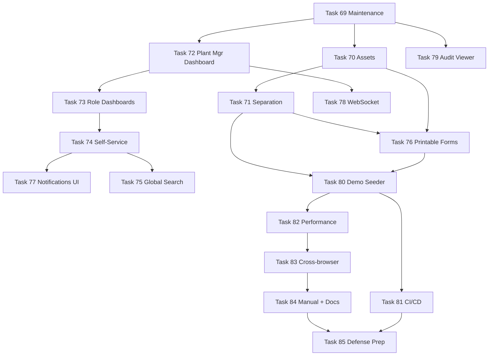

# Sprint 8 — Polish, DSS, and Defense (Tasks 69–85)

> Final sprint. 17 tasks. Closes the loop on Maintenance, Assets, and Separation; ships role-based dashboards, employee self-service, global search, real-time push, audit viewer; finishes with comprehensive demo data, CI/CD, performance tuning, browser testing, manual, and defense prep.

**References:** [`CLAUDE.md`](CLAUDE.md:1) · [`docs/PATTERNS.md`](docs/PATTERNS.md:1) · [`docs/DESIGN-SYSTEM.md`](docs/DESIGN-SYSTEM.md:1) · [`docs/SCHEMA.md`](docs/SCHEMA.md:1) · [`docs/SEEDS.md`](docs/SEEDS.md:1)

**Branch:** `feat/sprint-8-polish-dss-defense`
**Migrations expected to start at:** `0091_…` (Sprints 6–7 ended in the 0086–0090 range; verify by listing [`api/database/migrations/`](api/database/migrations:1) before writing the first one).
**Module status check:** [`api/app/Modules/Maintenance/`](api/app/Modules/Maintenance:1) directory already exists from Sprint 1 scaffolding — confirm empty before populating. No `Assets/` module yet — create it.

---

## 0. Sprint-wide ground rules (apply to EVERY task)

These are non-negotiable. Verify each before each commit. They are pulled from the PATTERNS/CLAUDE rule list and re-stated here so we don't drift on a 17-task sprint.

### Backend
- Every model: `HasHashId` + `HasAuditLog` traits, `SoftDeletes` where the entity is long-lived (assets, maintenance_schedules), encrypted casts on any sensitive field, enum casts for every status/type column.
- Every service mutation wrapped in `DB::transaction`; every list method paginates and eager-loads relationships.
- Every `FormRequest` overrides `authorize()` against a real permission slug; rules are exhaustive (no `nullable` without a reason).
- Every API Resource returns `'id' => $this->hash_id` — never the raw integer. Sensitive fields masked via the same helper used in [`EmployeeResource`](api/app/Modules/HR/Resources/EmployeeResource.php:1) (e.g., asset disposal cost is fine; nothing sensitive in this sprint other than what already exists).
- Every controller is thin and delegates to a service; HTTP status codes match the pattern (201 create, 204 delete, 200 update).
- Every route group has `auth:sanctum` + `feature:<module>` + a per-action `permission:<slug>` middleware.
- Every financially-relevant write (asset depreciation JE, final-pay JE, spare-part inventory deduction) is in `DB::transaction` and balances before commit.

### Frontend
- Every page lazy-loaded in [`spa/src/App.tsx`](spa/src/App.tsx:1).
- Every protected route nested under `<AuthGuard>` → `<ModuleGuard module="...">` → `<PermissionGuard permission="...">`.
- Every list page handles all 5 states from [`docs/PATTERNS.md`](docs/PATTERNS.md:1522): **loading** (`<SkeletonTable>`), **error** (`<EmptyState>` + retry), **empty** (contextual `<EmptyState>` with create CTA when permitted), **data** (`<DataTable>`), **stale** (`placeholderData` on `useQuery`).
- Every form: Zod schema mirrors the backend `FormRequest`, submit disabled while `isPending`, server 422 mapped via `setError`, cancel button, success toast, `queryClient.invalidateQueries` on success.
- Every status uses `<Chip>` with the variant map from [`docs/DESIGN-SYSTEM.md`](docs/DESIGN-SYSTEM.md:461). Numbers use `font-mono tabular-nums`. Tables: 32px row height, uppercase letter-spaced 10px headers.
- No new colors. Canvas stays grayscale; only chips, primary buttons, KPI deltas, alert dots, and links carry color.
- Auth stays on HTTP-only cookies — never touch `localStorage` or `sessionStorage` for credentials.

### Permission slugs introduced this sprint
Add to [`api/database/seeders/RolePermissionSeeder.php`](api/database/seeders/RolePermissionSeeder.php:1):

```
maintenance.schedules.{view,create,update,delete}
maintenance.work_orders.{view,create,assign,start,complete,cancel}
maintenance.logs.view
assets.{view,create,update,delete,dispose}
assets.depreciation.{view,run}
hr.separation.{view,initiate,clear,finalize}
hr.clearance.sign        (per-department, gated by user's department membership in service)
dashboard.plant_manager.view
dashboard.hr.view
dashboard.ppc.view
dashboard.accounting.view
self_service.view        (auto-granted to every user with an employee_id)
search.global
admin.audit_logs.view
notifications.preferences.manage
```

### Feature toggles
Add to [`settings`](docs/SCHEMA.md:48) table via `SettingsService::set` in the demo seeder migration of Sprint 8: `modules.maintenance=true`, `modules.assets=true`. Confirm `modules.search=true`, `modules.notifications=true` exist (added in earlier sprints; if not, add).

---

## TASK-BY-TASK PLAN

### Task 69 — Maintenance module

**Schema** (verify against [`docs/SCHEMA.md`](docs/SCHEMA.md:345) section "MAINTENANCE"):
- `maintenance_schedules` — polymorphic via `maintainable_type`/`maintainable_id` (machine | mold), `interval_type` (hours/days/shots), `interval_value`, `last_performed_at`, `next_due_at`, `is_active`.
- `maintenance_work_orders` — polymorphic, `type` (preventive/corrective), `priority`, `assigned_to` (FK employees), status, started/completed timestamps, `downtime_minutes`, `cost`.
- `maintenance_logs` — append-only chronological notes per WO.
- `spare_part_usage` — links WO → item (must be `item_type=spare_part`) → quantity, unit_cost, total_cost.

**Backend files**

```
api/database/migrations/
  0091_create_maintenance_schedules_table.php
  0092_create_maintenance_work_orders_table.php
  0093_create_maintenance_logs_table.php
  0094_create_spare_part_usage_table.php

api/app/Modules/Maintenance/
  Enums/MaintainableType.php           (machine, mold)
  Enums/MaintenanceScheduleInterval.php (hours, days, shots)
  Enums/MaintenanceWorkOrderType.php   (preventive, corrective)
  Enums/MaintenanceWorkOrderStatus.php (open, assigned, in_progress, completed, cancelled)
  Enums/MaintenancePriority.php        (critical, high, medium, low)

  Models/MaintenanceSchedule.php       (HasHashId, HasAuditLog, morphTo maintainable)
  Models/MaintenanceWorkOrder.php      (HasHashId, HasAuditLog, morphTo, hasMany logs/spareParts)
  Models/MaintenanceLog.php            (HasHashId)
  Models/SparePartUsage.php            (HasHashId)

  Services/MaintenanceScheduleService.php
    - list(filters)
    - create(data) → DB::transaction → compute initial next_due_at from interval
    - recomputeNextDueAt(schedule)  ← called after each completed WO
    - dueNow()  ← used by the cron job to materialize WOs

  Services/MaintenanceWorkOrderService.php
    - list, show, create (corrective via UI, preventive via cron)
    - assign(wo, employee)
    - start(wo)             → set started_at, set machine.status='maintenance'
    - complete(wo, payload) → completed_at, downtime_minutes, total cost = sum spare parts; on schedule-linked WO, call schedule.recomputeNextDueAt; if maintainable is mold, reset current_shot_count and append mold_history; restore machine.status to idle.
    - cancel(wo, reason)

  Services/SparePartUsageService.php
    - record(wo, item, qty) → DB::transaction → assert item_type=spare_part, deduct stock via existing StockMovementService (movement_type='maintenance_issue'), insert spare_part_usage row, recompute wo.cost.

  Jobs/GeneratePreventiveMaintenanceJob.php
    - Daily cron. For each active schedule whose next_due_at <= now and which has no open WO: create maintenance_work_order(type=preventive, status=open, description=schedule.description).
    - For mold-type schedules with interval_type=shots: read mold.current_shot_count vs 80% / 100% of max_shots_before_maintenance — at 80% notify Maintenance Head, at 100% auto-create WO. (Hooks the Sprint 6 mold tracking work.)

  Requests/StoreMaintenanceScheduleRequest.php  (authorize: maintenance.schedules.create)
  Requests/UpdateMaintenanceScheduleRequest.php
  Requests/StoreMaintenanceWorkOrderRequest.php (authorize: maintenance.work_orders.create)
  Requests/AssignMaintenanceWorkOrderRequest.php
  Requests/CompleteMaintenanceWorkOrderRequest.php
  Requests/RecordSparePartUsageRequest.php

  Resources/MaintenanceScheduleResource.php
  Resources/MaintenanceWorkOrderResource.php
  Resources/MaintenanceLogResource.php
  Resources/SparePartUsageResource.php

  Controllers/MaintenanceScheduleController.php
  Controllers/MaintenanceWorkOrderController.php
    - index, show, store, assign (PATCH /…/assign), start, complete, cancel
    - logs(): GET /…/logs ; addLog(): POST /…/logs
    - sparePartUsage(): POST /…/spare-parts

  routes.php   (auth:sanctum + feature:maintenance + per-action permission middleware)
```

Console kernel: register `GeneratePreventiveMaintenanceJob` to run daily at 02:00.

**Frontend files**

```
spa/src/types/maintenance.ts
spa/src/api/maintenance/schedules.ts
spa/src/api/maintenance/workOrders.ts
spa/src/api/maintenance/spareParts.ts

spa/src/pages/maintenance/schedules/
  index.tsx               list (target, interval, next due, last performed, active toggle); 5 states
  create.tsx              form: pick maintainable (machine OR mold via radio + dependent select), interval_type/value, description
  detail.tsx              shows generated WO history below

spa/src/pages/maintenance/work-orders/
  index.tsx               list with Kanban toggle (open / assigned / in_progress / completed)
  detail.tsx              ChainHeader (open → assigned → in_progress → completed), buttons (assign, start, complete, cancel) gated by status + permission, logs feed, spare parts table
  create.tsx              corrective only — pick maintainable, priority, description

spa/src/pages/maintenance/calendar.tsx
  - Re-uses calendar widget pattern from leaves/calendar.tsx (Sprint 2)
  - Plots schedules' next_due_at and existing WO scheduled_at on a month grid
  - Color by priority via Chip variants (critical=danger, high=warning, medium=info, low=neutral)
```

Sidebar: add a `MAINTENANCE` section with three items (Calendar, Work Orders, Schedules), gated by `feature:maintenance` and `maintenance.schedules.view`.

App.tsx: register all routes lazy-loaded under `<AuthGuard>` → `<ModuleGuard module="maintenance">` → `<PermissionGuard permission="maintenance.…">`.

**Verification checklist**
- [ ] Completing a mold preventive WO resets `current_shot_count` to 0 and writes a `mold_history` row (event_type='maintenance').
- [ ] Spare-part issue creates a `stock_movements` row and recomputes `weighted_avg_cost` on remaining stock (the existing service already does this).
- [ ] Pausing a machine via Sprint 6 breakdown flow creates a `machine_downtimes` row with `category='breakdown'` and a corrective `maintenance_work_orders` row linked via `maintenance_order_id` — wire these together.

---

### Task 70 — Assets module

**Schema** (from [`docs/SCHEMA.md`](docs/SCHEMA.md:361) "ASSETS"):
- `assets` — code, name, category (enum), department_id, acquisition_date/cost, useful_life_years, salvage_value, accumulated_depreciation, status, disposal fields, location.
- `asset_depreciations` — one row per asset/year/month with the period amount, accumulated-after, and a `journal_entry_id`.

Existing FK: `molds.asset_id` (already in schema). Add similar nullable `machines.asset_id` and `vehicles.asset_id` columns via Sprint 8 migrations if not present (verify first via `\d machines` / search the migrations folder; only add if missing, in a small `ALTER` migration).

**Backend files**

```
api/database/migrations/
  0095_create_assets_table.php
  0096_create_asset_depreciations_table.php
  (optional) 0097_add_asset_id_to_machines_and_vehicles_table.php   ← only if columns absent

api/app/Modules/Assets/
  Enums/AssetCategory.php         (machine, mold, vehicle, equipment, furniture, other)
  Enums/AssetStatus.php           (active, under_maintenance, disposed)

  Models/Asset.php                (HasHashId, HasAuditLog, SoftDeletes,
                                   morphMany maintenanceWorkOrders via maintainable polymorphic
                                   when category=machine|mold this is convenience only —
                                   the polymorphic relation actually points at Machine/Mold rows;
                                   here we only expose hasMany('asset_depreciations'))
  Models/AssetDepreciation.php    (HasHashId)

  Services/AssetService.php
    - list(filters), show, create, update, dispose(asset, payload)
    - dispose: DB::transaction → set status=disposed, disposed_date, disposal_amount;
      post JE: DR Cash (disposal_amount) + DR Accumulated Depreciation, CR Asset @ acquisition_cost,
      DR/CR Loss/Gain on Disposal as the balancing line.

  Services/DepreciationService.php
    - runForMonth(year, month):
        DB::transaction
        for each active asset:
          monthly = (acquisition_cost - salvage_value) / (useful_life_years * 12)
          guard: don't depreciate beyond (acquisition_cost - salvage_value)
          insert asset_depreciation row (UNIQUE asset_id+year+month — idempotent on retry)
          update asset.accumulated_depreciation
        post one consolidated JE per month:
          DR Depreciation Expense (sum)
          CR Accumulated Depreciation (sum)
        link journal_entry_id on every row.

  Jobs/RunMonthlyDepreciationJob.php
    - Scheduled in console kernel: monthly on the 1st at 03:00 for the previous calendar month.

  Services/AssetQrCodeService.php
    - generate(asset) → SVG/PNG via simplesoftwareio/simple-qrcode (already in vendor since Laravel-friendly; if not, add to composer.json).
      Encodes: app URL + /assets/{hash_id}.

  Requests/StoreAssetRequest.php, UpdateAssetRequest.php, DisposeAssetRequest.php
  Resources/AssetResource.php, AssetDepreciationResource.php
  Controllers/AssetController.php
    - index, show, store, update, destroy, dispose, qrCode (GET /assets/{id}/qr → PNG response)
  Controllers/AssetDepreciationController.php
    - index (filter by asset_id, year), runMonth (POST /asset-depreciations/run, admin only)

  routes.php
```

**Frontend files**

```
spa/src/types/assets.ts
spa/src/api/assets.ts

spa/src/pages/assets/
  index.tsx          dense table: code (mono), name, category (chip), department, acquisition_cost (mono right), book_value (mono right), status (chip)
                     filters: category, status, department
                     bulk action: print QR labels (selected rows → opens print sheet of QR codes)
  create.tsx         form: category, name, acquisition_date, cost, useful life, salvage value, location, optional link to existing machine/mold
  edit.tsx
  detail.tsx         summary cards (acquisition, accumulated dep, book value, status)
                     tabs: Overview · Depreciation Schedule (table by month) · Maintenance History (linked) · Activity
                     primary action when active: Dispose (opens modal with disposal_amount input → posts JE)
  print-labels.tsx   prints a 4×6 grid of QR codes with asset code + name; window.print()-styled stylesheet

spa/src/pages/admin/depreciation.tsx
  - Admin page to manually trigger DepreciationService::runForMonth (year/month picker + confirm)
  - Shows last successful run per month
```

Sidebar: under `OPERATIONS` (or a new `ASSETS` section) — Assets list, Depreciation runs (admin only).

**Verification checklist**
- [ ] Manually running depreciation twice for the same month is a no-op (idempotent UNIQUE).
- [ ] Disposal JE balances and correctly nets accumulated depreciation against cost.
- [ ] QR code PNG renders without authentication leak (route still permission-gated).

---

### Task 71 — Employee separation + clearance

**Schema** ([`docs/SCHEMA.md`](docs/SCHEMA.md:73) `clearances`): `employee_id`, `separation_date`, `separation_reason`, `clearance_items` (json — array of `{department, item, status: pending/cleared, signed_by, signed_at, remarks}`), `final_pay_computed`, `final_pay_amount`, `final_pay_breakdown` (json), `status`.

No new columns needed on `employees` — the existing `status` enum already has `resigned`/`terminated`/`retired` values from Sprint 2.

**Backend files**

```
api/database/migrations/
  0098_create_clearances_table.php   (verify it isn't already in Sprint 2 — it shouldn't be)

api/app/Modules/HR/
  Enums/SeparationReason.php          (resigned, terminated, retired, end_of_contract)
  Enums/ClearanceStatus.php           (pending, in_progress, completed)
  Enums/ClearanceItemStatus.php       (pending, cleared, blocked)

  Models/Clearance.php                (HasHashId, HasAuditLog, SoftDeletes; cast clearance_items+final_pay_breakdown as array)

  Services/SeparationService.php
    - initiate(employee, separation_date, reason):
        DB::transaction →
          create Clearance with default clearance_items array seeded from a config/static method:
            [Production:{tools_returned, ppe_returned},
             Warehouse:{materials_returned},
             Maintenance:{no_pending_work},
             Finance:{no_outstanding_cash_advance, no_outstanding_loan_balance},
             HR:{id_returned, 201_file_complete, exit_interview_done},
             IT:{equipment_returned, accounts_disabled}]
          set employee.status to 'on_leave' (clearance in progress) — DO NOT yet flip to resigned/terminated/retired
          fire employment_history (change_type='separation_initiated')
    - signItem(clearance, department, item_key, user, remarks):
        DB::transaction →
          authorize: user.department.code == department OR user.role is hr_officer
          mark item.status=cleared, signed_by=user.id, signed_at=now
          if all items cleared → status=completed
    - finalize(clearance):
        DB::transaction →
          require status=completed AND final_pay_computed=true
          flip employee.status to match separation_reason
          fire employment_history (change_type='separation_finalized')
          generate clearance PDF and stash to employee_documents (document_type='clearance')

  Services/FinalPayService.php
    - compute(clearance) → array breakdown:
        last_salary_pro_rated   (basic monthly × working_days_in_period / total_days_in_period; daily-rated → days × daily_rate)
        unused_convertible_leave_value  (sum of leave_balances where leave_type.is_convertible_on_separation)
        pro_rated_13th_month    (total_basic_earned_ytd / 12 × months_remaining_factor — actually: total_basic_earned_ytd / 12)
        plus other:  plus_other = pro_rated_13th_month + unused_convertible_leave_value + last_salary
        less_loan_balance       (sum of active employee_loans.balance)
        less_unreturned_property_value (sum from employee_property where status='lost', valued at item.cost or manual)
        less_advance            (any open cash_advance balance)
        net = plus_other - sum(less_*)
      persist on clearance.final_pay_breakdown, set final_pay_amount=net, final_pay_computed=true.

    - postFinalPayJournalEntry(clearance):
        DB::transaction →
          DR Salaries Expense, DR 13th Month Expense, DR SLB conversion expense
          CR Cash in Bank (net), CR Loans Receivable (loan balance offset),
          CR Property Damages Receivable (property)
          balance must equal zero before commit.

  Services/ClearancePdfService.php
    - generate(clearance) → DomPDF Blade resources/views/pdf/clearance.blade.php
      Ogami letterhead, employee block, separation summary, table of clearance items grouped by department with signatures, final-pay breakdown table, signature lines (Employee, HR Officer, Department Head, Finance, GM).
      "Generated by [user] on [date]" footer.

  Requests/InitiateSeparationRequest.php (authorize: hr.separation.initiate)
  Requests/SignClearanceItemRequest.php  (authorize: hr.clearance.sign — service double-checks dept membership)
  Requests/FinalizeClearanceRequest.php

  Resources/ClearanceResource.php

  Controllers/SeparationController.php
    - initiate: POST /employees/{employee}/separation
    - show clearance: GET /clearances/{clearance}
    - signItem: PATCH /clearances/{clearance}/items
    - computeFinalPay: POST /clearances/{clearance}/final-pay/compute
    - finalize: PATCH /clearances/{clearance}/finalize
    - downloadPdf: GET /clearances/{clearance}/pdf
```

**Frontend files**

```
spa/src/types/separation.ts
spa/src/api/separation.ts

spa/src/pages/hr/separations/
  index.tsx          list of clearances (employee, separation_date, reason, status chip, % cleared)
  create.tsx         pick employee, date, reason → starts clearance
  detail.tsx         hero: ChainHeader (Initiated → Items Cleared → Final Pay Computed → Finalized)
                     grid of department cards; each card shows its items with sign buttons that open <ConfirmDialog>;
                     sign button disabled if user not in that department and not HR
                     "Compute Final Pay" CTA when all items cleared
                     final pay breakdown table (mono numbers, right-aligned); "Finalize" CTA after computed
                     "Download Clearance PDF" once finalized
```

Add a "Initiate Separation" button on [`spa/src/pages/hr/employees/detail.tsx`](spa/src/pages/hr/employees/detail.tsx:1) (Sprint 2 page) gated by `hr.separation.initiate`.

**Verification checklist**
- [ ] Cannot finalize until every item is cleared AND final pay is computed.
- [ ] Final pay JE balances; loan balances are correctly netted; employee.status flips only on finalize.
- [ ] Department-head sign is rejected by the service when the user belongs to a different department.

---

### Task 72 — Plant Manager dashboard

Composite read-only page; no new tables.

**Backend** — extend [`api/app/Modules/Dashboard/`](api/app/Modules/Dashboard:1) (which already has finance/production endpoints from earlier sprints):

```
Services/PlantManagerDashboardService.php
  - kpiCards(period)           revenue_week, production_output_week, oee_avg, on_time_delivery_pct
  - chainStageBreakdown()      delegates to existing OrderToCash chain-stage query
  - alerts()                   union of: open NCRs, machine breakdowns, mold > 80% shots, urgent PRs
  - machineUtilization()       machines + status + today_oee + current_wo
  - defectPareto(period)       defect_types by frequency, top 8

Controllers/PlantManagerDashboardController.php
  - GET /dashboards/plant-manager  → returns all five sections in one payload (cached 30s in Redis)

routes.php  (permission:dashboard.plant_manager.view)
```

**Frontend**

```
spa/src/pages/dashboard/plant-manager.tsx
  - 4 StatCards top row
  - Two-column grid:
      left  → StageBreakdown panel (linked to chain stages from Sprint 6)
      right → Alerts panel (severity-coded list)
      below → Machine Utilization table with OeeGauge cells (existing component)
      below → Defect Pareto bar chart (Recharts; indigo bars only — no rainbow)
  - Realtime: subscribe via Echo to:
      production.dashboard       → invalidates plant-manager query
      machines.status             → invalidates machine row in-place
      production.wo.* (broadcast) → triggers refetch
  - All numbers font-mono tabular-nums; status chips per design system mapping.
  - Top-right time range selector (Today / Week / Month) controls KPIs only.
```

Default route for users with role `production_manager` redirects to `/dashboard/plant-manager`.

---

### Task 73 — Role-based dashboards

Pattern: one service per dashboard returning the same shape (kpis, panels), one page per role.

```
Services/HrDashboardService.php          headcount, on_leave_today, pending_leaves, pending_separations
Services/PpcDashboardService.php         active_wos, scheduling_load, mrp_shortages, breakdowns
Services/AccountingDashboardService.php  cash_balance, ar_outstanding, ap_outstanding, je_pending_post
Services/EmployeeDashboardService.php    my_attendance_this_month, my_leave_balance, my_pending_requests, my_latest_payslip

Controllers per dashboard with a single GET endpoint and permission middleware.

spa/src/pages/dashboard/hr.tsx
spa/src/pages/dashboard/ppc.tsx
spa/src/pages/dashboard/accounting.tsx
spa/src/pages/dashboard/employee.tsx       (used by self-service portal landing — Task 74)
```

Sidebar dashboard item resolves to the user's primary role's dashboard via a small switch in the layout. Reuse `<StatCard>`, `<Panel>`, `<DataTable>`, `<StageBreakdown>`. No new components.

---

### Task 74 — Employee self-service portal

Mobile-first layout. Reuses primitives, adds a thin layout.

```
spa/src/layouts/SelfServiceLayout.tsx
  - 48px topbar with Ogami mark + initials avatar
  - bottom navigation (5 tabs: Home, DTR, Leave, Payslip, Me) — fixed bottom, 56px tall, 24px icons
  - hides AppLayout sidebar entirely
  - viewport meta tags applied via index.html (already there)

spa/src/pages/self-service/
  index.tsx                 dashboard tiles: latest payslip net (mono), this-month attendance count, leave balance summary, pending requests
  dtr.tsx                   monthly grid of own attendance rows (date, time_in, time_out, hours)
  leave.tsx                 list of own leave requests + Create button → reuses existing /leaves/create.tsx but in a Modal
  payslips.tsx              already exists in [`spa/src/pages/self-service/payslips.tsx`](spa/src/pages/self-service/payslips.tsx:1) — verify it still works with this layout
  notification-preferences.tsx  see Task 77
  profile.tsx               read-only profile, change-password link, theme toggle
```

Backend: every self-service endpoint scopes to `auth()->user()->employee_id` server-side — frontend never sends an employee id. Add a `SelfServiceController` with the small set of endpoints needed (or reuse module endpoints with a `scope:self` middleware that injects the employee filter).

Sprint goal: the demo shows an employee logging in on a phone, requesting leave, and viewing their payslip.

---

### Task 75 — Global search

```
api/config/scout.php                     verify Meilisearch driver is set
api/app/Modules/Auth/Models/User.php     (no — not searchable)

Add Searchable trait + toSearchableArray() to:
  Employee, Product, Customer, Vendor, PurchaseOrder, SalesOrder, WorkOrder, Invoice
  toSearchableArray returns ONLY non-sensitive fields + the hash_id (NEVER raw id).

Services/SearchService.php
  search(query, limit=20) →
    parallel scout queries, group results by entity:
      [{ group: 'employees', items: [{id: hash_id, label: "OGM-2026-0042 — Juan Cruz", url: "/hr/employees/<hash>"}] }, ...]
    cap each group at 5 hits; permission-filter: drop entire group if user lacks the .view permission.

Controllers/SearchController.php
  - GET /search?q=...   (rate-limited to 30/min by user, throttle:search)

php artisan scout:import on each model in a one-shot artisan command added to console kernel as well.
```

**Frontend**

```
spa/src/components/ui/CommandPalette.tsx
  - Modal triggered by ⌘K / Ctrl+K (global keydown listener in AppLayout)
  - Top input, recents from localStorage (recent IDs only — non-sensitive),
  - Below: live search with 200ms debounce → /search
  - Grouped results, arrow-key navigation, enter routes via React Router
  - Quick actions section above search results: "Create Sales Order", "Create PR", etc., filtered by user permissions
  - Esc / outside-click closes; cmd+K toggles
```

Wire the search trigger button in [`spa/src/components/layout/Topbar.tsx`](spa/src/components/layout/Topbar.tsx:1) to open the palette.

---

### Task 76 — Printable approved forms

Single Blade partial for the approval signature block, included in every approval-bearing PDF.

```
api/resources/views/pdf/_components/approval_signatures.blade.php
  - 4-column grid (Prepared / Noted / Checked / Approved by)
  - Reads from $approvalRecords (passed in by each PDF service) — name, role, signed_at
  - Signature lines with names typed underneath; date below name

Update existing PDF services / templates to include the partial:
  - resources/views/pdf/purchase-order.blade.php
  - resources/views/pdf/bill-payment.blade.php
  - resources/views/pdf/employee-loan.blade.php           (new)
  - resources/views/pdf/cash-advance.blade.php            (new)
  - resources/views/pdf/purchase-request.blade.php
  - resources/views/pdf/clearance.blade.php               (Task 71)

Bulk print:
  Add api/app/Common/Services/BulkPdfService.php — takes a collection of model+id pairs,
  loops, generates each PDF, returns a single concatenated PDF via DomPDF append OR a zip of PDFs.
  Endpoint: POST /print/bulk { type, ids:[hash, hash, ...] }  (permission per document type)
```

Frontend: add a "Print" bulk action to PR, PO, Bill Payment, Loan, CA list pages. Selection-aware. Single download.

---

### Task 77 — Notifications UI

Backend already has `notifications` (Laravel default) and `notification_preferences` tables from Sprint 1. This task is mostly UI plus a thin API.

```
api/app/Modules/Auth/Controllers/NotificationController.php
  - GET /notifications       paginated list
  - PATCH /notifications/{id}/read
  - PATCH /notifications/read-all
  - GET /notification-preferences
  - PUT /notification-preferences  (bulk upsert from UI matrix)

spa/src/components/layout/NotificationBell.tsx    already exists — verify it pulls from /notifications and shows unread count badge; use Echo private channel `App.Models.User.{id}` to push live updates
spa/src/pages/notifications/index.tsx             dense list with filters (type, read/unread, date)
spa/src/pages/self-service/notification-preferences.tsx
  matrix: rows = notification types (from a static metadata file), columns = in_app / email
  toggle persists immediately (optimistic update + rollback on error)
```

Use the existing Toaster pattern; no `react-hot-toast` config changes needed.

---

### Task 78 — WebSocket broadcasting

Reverb already set up in Sprint 1 (`reverb` service in docker-compose). Sprint 6 added the production output channel. This task formalizes the rest.

```
Events:
  api/app/Common/Events/WorkOrderOutputUpdated.php       (already exists — verify)
  api/app/Common/Events/MachineStatusChanged.php         (already exists — verify)
  api/app/Common/Events/PayrollProgressUpdated.php       (NEW — emitted from Sprint 3 ProcessPayrollJob each 5 employees)
  api/app/Common/Events/InventoryStockChanged.php        (NEW — emitted from StockMovementService::create)
  api/app/Common/Events/MaintenanceWorkOrderCreated.php  (NEW — emitted from preventive job)

Channels (api/routes/channels.php):
  production.wo.{id}              → ChannelAuth: user can('production.work_orders.view')
  production.dashboard            → ChannelAuth: user can('dashboard.plant_manager.view') OR ('dashboard.ppc.view')
  machines.status                 → same
  payroll.period.{id}             → user can('payroll.periods.view')
  inventory.stock                 → user can('inventory.stock_levels.view')
  user.{id}                       → user.id == auth.id   (per-user notifications)

Frontend:
  spa/src/lib/echo.ts             create Laravel Echo client with Reverb config + withCredentials cookies
  Subscriptions wired in:
    - /production/dashboard          (already done in Sprint 6 — verify)
    - /production/work-orders/[id]   (already done — verify)
    - /payroll/periods/[id]          (Task 78 NEW — show progress bar fed by PayrollProgressUpdated)
    - layout NotificationBell        (NEW — user.{id} channel)
```

Smoke test: open two browsers, run a WO output recording in one, see the dashboard update in the other.

---

### Task 79 — Audit log viewer

Tables already populated by `HasAuditLog` trait. Pure read-only admin page.

```
api/app/Modules/Admin/Controllers/AuditLogController.php
  - GET /audit-logs?user_id=&model_type=&action=&from=&to=  paginated
    - eager-load user
    - return old_values/new_values JSON as-is
  - GET /audit-logs/{id}  show

permissions: admin.audit_logs.view  (System Admin only)

spa/src/api/auditLogs.ts
spa/src/pages/admin/audit-logs/
  index.tsx       dense table: timestamp, user, action chip (created=success / updated=info / deleted=danger), model_type, model_id, ip
                  filter bar; row click opens detail
  detail.tsx      side-by-side diff of old/new values; render JSON with a tiny json-diff component (or show two <pre> blocks
                  with key-by-key highlight: green added, red removed, amber changed)
```

---

### Task 80 — Comprehensive demo data seeder

```
api/database/seeders/DemoDataSeeder.php

Composition rules:
  - 50 employees: 30 monthly-salaried (production), 15 daily-rated (warehouse, drivers), 5 office monthly
  - Use realistic Filipino names from a static array — not Faker locale
  - Departments distributed: Production 25, QC 5, Warehouse 5, Maintenance 3, Logistics 4, HR 2, Finance 3, IT 1, Sales 1, ImpEx 1
  - Attendance: 2 calendar months (current + previous), Mon–Fri default + 2 weekends OT, 3 random absences per employee
  - Leaves: 20 across 8 leave types, mixed statuses (5 pending, 12 approved, 3 rejected)
  - Loans: 5 company loans + 3 cash advances, mid-amortization
  - Payroll: 4 finalized periods (last 2 months × 2 halves), with payslip PDFs pre-rendered
  - Vendors: 10 (mix import + local)
  - Purchasing: 8 POs (3 received, 2 partially received, 3 sent), 3 auto-generated PRs from low stock
  - Customers: 5 (Toyota, Nissan, Honda, Suzuki, Yamaha — already in SEEDS.md)
  - Sales orders: 6 with realistic delivery schedules over the next 30 days
  - Work orders: 8 (3 completed, 2 in_progress, 2 planned, 1 paused via breakdown)
  - Inspections: 18 (6 incoming, 6 in_process, 6 outgoing — with measurements within tolerance for most, 2 failures)
  - NCRs: 3 (one customer-source, two outgoing inspection failures)
  - Maintenance: 10 schedules, 6 work orders (mix preventive + corrective)
  - Assets: 18 (12 machines + 3 molds + 3 vehicles already seeded; this seeder just creates the asset rows and links via asset_id)
  - Quotations: 4
  - Complaints: 2 with 8D reports
  - Notifications: 60 mixed types, 25 unread

Order of inserts must respect FKs. Use --factory chains or DB::transaction wrappers.

Make idempotent by truncating only the demo-specific rows on re-run (skip system roles/permissions/COA).

Add a --fresh-demo make target in Makefile that runs migrate:fresh + RolePermissionSeeder + WorkflowSeeder + base seeders + DemoDataSeeder.
```

The seeder is the artifact panelists actually click through — invest in realism (current dates, proper status mix, balanced books).

---

### Task 81 — CI/CD (GitHub Actions)

```
.github/workflows/ci.yml
  on: [push, pull_request]
  jobs:
    backend:
      services: postgres:16, redis:7
      steps:
        - actions/checkout
        - shivammathur/setup-php@v2 (php-version 8.3, ext: pdo_pgsql,redis,gd,zip,bcmath,intl)
        - composer install --no-interaction --prefer-dist
        - cp .env.testing
        - php artisan key:generate
        - php artisan migrate --seed
        - php artisan test --parallel
    frontend:
      steps:
        - actions/setup-node@v4 (node 20)
        - npm ci
        - npm run lint
        - npm run typecheck
        - npm run test
        - npm run build         ← ensures Vite production build succeeds
    docker:
      needs: [backend, frontend]
      if: github.ref == 'refs/heads/main'
      steps:
        - docker buildx build for php and node images, push to GHCR (optional)

.github/workflows/deploy.yml   (manual workflow_dispatch)
  - SSH to VPS via webfactory/ssh-agent
  - git pull && docker compose -f docker-compose.prod.yml up -d --build
  - docker compose exec api php artisan migrate --force
```

Don't gate Sprint 8 completion on the deploy workflow — CI must pass; deploy is one button.

---

### Task 82 — Performance optimization

Concrete deliverables:

```
Caching:
  - api/app/Modules/Dashboard/Services/*DashboardService.php
    Wrap aggregate queries in Cache::remember("dashboard:<role>:<userId>", 30, fn() => …)
    Invalidate on relevant model events (e.g., WO completed → forget production cache keys).
  - api/app/Common/Services/SettingsService.php — already cached (verify TTL 600s)

Database indexes:
  Audit existing migrations and add via a single follow-up migration 0099_add_performance_indexes.php:
    attendances: index(employee_id, date)
    payrolls: index(payroll_period_id, employee_id)
    journal_entry_lines: index(account_id, journal_entry_id)
    stock_movements: index(item_id, created_at)
    audit_logs: index(model_type, model_id, created_at)
    notifications: index(notifiable_id, read_at)

Eager loading audit:
  - Run laravel-debugbar in dev across every list page; identify N+1; fix in service .with([...]) clauses.

PHP OPcache:
  - docker/php/Dockerfile.prod: ensure opcache.enable=1, opcache.validate_timestamps=0, preload script optional.

Telescope:
  - composer require laravel/telescope --dev
  - register only in local environment via App\Providers\TelescopeServiceProvider check on App::environment()
  - never deploy to prod
```

Add a `make perf-baseline` target that runs Apache Bench against /dashboards/plant-manager 100 times and prints p50/p95.

---

### Task 83 — Cross-browser + device testing

Manual test matrix; deliver a checklist in [`docs/QA-MATRIX.md`](docs/QA-MATRIX.md:1).

```
docs/QA-MATRIX.md
  | Page | Chrome | Firefox | Safari | Edge | Samsung Internet | Android phone | iPad |
  | login | ☐ | ... |
  | dashboard/plant-manager | ☐ | ... |
  | ...one row per top-level page...

Widths to verify: 1280, 1440, 1920 (desktop), 768 (tablet — sidebar should auto-collapse to rail), 390 (iPhone, self-service only).

Dark mode toggle on every page. Verify:
  - no hardcoded white/black bypassing tokens
  - all chips legible
  - charts (Recharts) re-color on theme change (use CSS variables in chart props)

Bug fixes filed as small follow-up commits referencing this checklist.
```

---

### Task 84 — PDF user manual + thesis documentation

```
docs/USER-MANUAL.md   (markdown source; also exported to PDF via pandoc or DomPDF Blade)
  Sections:
    1. Logging in & changing your password
    2. Sidebar navigation & permissions
    3. HR
       3.1 Onboarding an employee
       3.2 Importing biometric DTR CSV
       3.3 Filing a leave (employee & approver)
       3.4 Initiating separation & clearance
    4. Payroll
       4.1 Creating a period
       4.2 Computing & approving
       4.3 Generating bank file & payslips
    5. Procurement
       5.1 Creating a purchase request
       5.2 Approving & generating PO
       5.3 Recording GRN
       5.4 3-way match
       5.5 Posting bill & payment
    6. Sales & Production
       6.1 Creating a sales order
       6.2 MRP plan review
       6.3 Production schedule (Gantt)
       6.4 Recording output
       6.5 QC inspections
       6.6 Delivery
       6.7 Invoicing & collection
    7. Quality
       7.1 Inspection specs
       7.2 NCR
       7.3 8D reports
    8. Maintenance
       8.1 Schedules
       8.2 Corrective work orders
    9. Self-service (mobile)
   10. Admin
       10.1 Users, roles, permissions
       10.2 Feature toggles
       10.3 Audit logs

  Each section: 2-4 screenshots, numbered steps, callouts.

Thesis appendix bundle:
  - architecture diagrams (use plantuml or draw.io exported to PNG; keep .puml sources in docs/diagrams/)
  - ERD (auto-generate via 'php artisan schema:dump' + a dbml export, or hand-curated mermaid in docs/ERD.md)
  - this Sprint plan + previous sprint plans as appendix
```

`make manual-pdf` target: pandoc docs/USER-MANUAL.md → docs/build/manual.pdf.

---

### Task 85 — Defense preparation

Non-code task; deliver a checklist artifact and rehearsal materials.

```
plans/SPRINT-8-DEFENSE-CHECKLIST.md
  - [ ] pg_dump backup taken (date stamped) and stored in 3 locations (laptop, USB, cloud drive)
  - [ ] DemoDataSeeder run on the live VPS the day before
  - [ ] Three demo screencasts recorded (Order-to-Cash, Procure-to-Pay, Hire-to-Retire) at 1080p with cursor highlighting
       store in docs/demo-videos/ (gitignored if large; keep only links in this checklist)
  - [ ] Live demo dry-run on the projector at the school venue (or equivalent display)
  - [ ] HTTPS verified on prod (HSTS hits all Nginx security headers from CLAUDE.md security section)
  - [ ] Spare laptop tested with the same demo dataset
  - [ ] Wi-Fi failover plan: MiFi or phone hotspot
  - [ ] Q&A bank: panel-likely questions with answers (security model, why Sanctum cookies, why monolith vs microservices, IATF 16949 mapping, scalability path, why Postgres+Redis+Meilisearch)

docs/defense-presentation-outline.md
  - 12 slides, ~25 min:
    1. Title + thesis statement
    2. Problem (Ogami's pain points)
    3. Three chains
    4. IATF 16949 quality woven into chains
    5. Architecture (the 1-paragraph summary from CLAUDE.md, with diagram)
    6. Demo: Order-to-Cash
    7. Demo: Procure-to-Pay
    8. Demo: Hire-to-Retire
    9. Security model (Sanctum cookies, HashIDs, RBAC, encrypted PII)
   10. Decision support (the dashboards)
   11. Limitations & future work (the explicit NOT-BUILDING list)
   12. Q&A
```

Practice 5+ times. Time each demo. Have a "if the live demo crashes" contingency: pre-recorded video as fallback.

---

## EXECUTION ORDER & COMMIT STRATEGY

One commit per task (matching the Sprint 6 convention seen in [`plans/SPRINT-6-STATUS.md`](plans/SPRINT-6-STATUS.md:1)).



Recommended branch & commit cadence:

```
git checkout -b feat/sprint-8-polish-dss-defense

# wave 1 — net-new modules (tasks 69, 70, 71)
commit: feat(maintenance): module — task 69
commit: feat(assets): module + monthly depreciation — task 70
commit: feat(hr): separation + clearance + final pay — task 71

# wave 2 — dashboards & cross-cutting UI (tasks 72, 73, 74, 77)
commit: feat(dashboard): plant manager — task 72
commit: feat(dashboard): role-based dashboards (HR, PPC, Accounting, Employee) — task 73
commit: feat(self-service): mobile portal — task 74
commit: feat(notifications): bell + preferences UI — task 77

# wave 3 — platform features (tasks 75, 78, 79, 76)
commit: feat(search): meilisearch + command palette — task 75
commit: feat(realtime): reverb broadcasting wired across modules — task 78
commit: feat(admin): audit log viewer — task 79
commit: feat(print): approval signature blocks + bulk print — task 76

# wave 4 — data + ops (tasks 80, 81, 82, 83)
commit: feat(seed): comprehensive demo data — task 80
commit: ci: github actions for backend, frontend, deploy — task 81
commit: perf: caching, indexes, opcache, telescope-dev — task 82
commit: test: cross-browser + device QA matrix + fixes — task 83

# wave 5 — documentation & defense (tasks 84, 85)
commit: docs: user manual + thesis appendix — task 84
commit: docs: defense checklist + presentation outline — task 85
```

After Sprint 8: tag `v1.0.0-defense` and push to origin.

---

## FINAL SPRINT-8 ACCEPTANCE CHECKLIST

Run mentally before opening the sprint PR.

**Functional**
- [ ] Maintenance: schedules generate WOs on time; mold shot-trigger works at 80%/100%; spare-part issue deducts inventory.
- [ ] Assets: monthly depreciation idempotent; disposal JE balances; QR codes render and route correctly.
- [ ] Separation: cannot finalize without all clearance items signed AND final-pay computed; final-pay JE balances.
- [ ] Plant Manager dashboard renders all five sections in <300ms (cached); WebSocket updates without refresh.
- [ ] Each role lands on the right dashboard on login.
- [ ] Self-service portal usable on a 390px-wide screen; bottom nav fixed; only own data visible.
- [ ] Cmd+K opens command palette; permissioned results only.
- [ ] Notification bell counts unread; preferences toggle persists.
- [ ] Audit log viewer shows JSON diffs for create/update/delete on a sample employee edit.
- [ ] Demo seeder produces a coherent dataset on a fresh DB in under 90s.
- [ ] CI pipeline green on the sprint PR.

**Hygiene**
- [ ] No new uses of localStorage/sessionStorage for auth or permissions data.
- [ ] No raw integer `id` in any new API Resource (grep new Resource files for `=> $this->id` and only allow inside non-exposed scopes).
- [ ] No new colors outside the six-accent palette in any new component or CSS.
- [ ] Every new page has all five states (loading/error/empty/data/stale) — visually verified for at least the new list pages (maintenance schedules, work orders, assets, separations, audit logs, notifications).
- [ ] Every new route in [`spa/src/App.tsx`](spa/src/App.tsx:1) lazy-loaded and wrapped in `<AuthGuard><ModuleGuard><PermissionGuard>`.
- [ ] Every new model has `HasHashId` + `HasAuditLog`; soft-deletes where appropriate.
- [ ] Every new financial operation in `DB::transaction`; balances asserted before commit.
- [ ] Every new permission slug seeded in [`api/database/seeders/RolePermissionSeeder.php`](api/database/seeders/RolePermissionSeeder.php:1).
- [ ] Every new feature toggle present in the settings seeder.
- [ ] PHPUnit + Vitest pass; `npm run typecheck` and `npm run lint` clean.

When every box is checked: tag, deploy, rehearse, defend.
